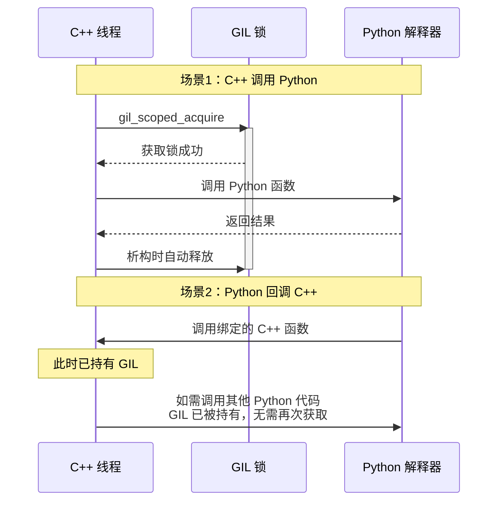

# C++ 调用 Python

本节详细说明如何从 C++ 代码调用 Python 脚本和库函数，包括 Python 解释器初始化、GIL 管理和脚本调用示例。

## 导航

本系列文档包含以下章节：

- [总览与环境搭建](./index.md)
- [C++ 调用 Python](./cpp-calling-python.md) ← 当前页
- [Python 绑定开发](./python-binding-development.md)
- [故障排除与最佳实践](./troubleshooting-and-best-practices.md)
- [Python 脚本开发实战](./python-script-development.md)

## Python 解释器初始化

!!! warning "初始化顺序至关重要"
    Python 解释器必须在任何 Python 操作之前初始化，且在整个程序生命周期中只能初始化一次。

```cpp title="DAAppCore.cpp - Python 环境初始化"
#include <pybind11/embed.h>
#include "DAPyInterpreter.h"
#include "DAPyScripts.h"

bool DAAppCore::initializePythonEnv()
{
    mIsPythonInterpreterInitialized = false;
    
    try {
        // 1. 获取解释器单例
        DA::DAPyInterpreter& python = DA::DAPyInterpreter::getInstance();
        
        // 2. 设置 Python Home 路径（可选，用于指定 Python 环境）
        QString pypath = DA::DAPyInterpreter::getPythonInterpreterPath();
        qInfo() << tr("Python interpreter path: %1").arg(pypath);
        
        QFileInfo fi(pypath);
        python.setPythonHomePath(fi.absolutePath());
        
        // 3. 初始化解释器（创建 scoped_interpreter）
        python.initializePythonInterpreter();
        
        // 4. 添加脚本搜索路径
        QString scriptPath = getPythonScriptsPath();
        DA::DAPyScripts::appendSysPath(scriptPath);
        
        // 5. 初始化脚本模块
        DA::DAPyScripts& scripts = DA::DAPyScripts::getInstance();
        if (!scripts.isInitScripts()) {
            qCritical() << tr("Scripts initialization failed");
            return false;
        }
        
    } catch (const std::exception& e) {
        qCritical() << tr("Python initialization error: %1").arg(e.what());
        return false;
    }
    
    mIsPythonInterpreterInitialized = true;
    return true;
}
```

## GIL安全：全局解释器锁管理

!!! danger "线程安全警告"
    在多线程环境下调用 Python 代码时，必须正确管理 GIL，否则会导致程序崩溃或死锁。

下图展示了 GIL 管理的两种典型场景，帮助理解 C++ 和 Python 之间的锁获取机制：



上图展示了 GIL 管理的两种场景：
- **场景1**：C++ 调用 Python 时，使用 `gil_scoped_acquire` 获取锁
- **场景2**：Python 回调 C++ 时，GIL 已被持有，无需再次获取

以下代码展示了 GIL 管理的不同实现方式：

=== "基本 GIL 管理"

    ```cpp
    #include <pybind11/pybind11.h>
    
    void callPythonFunction()
    {
        // 方式1：使用 RAII 自动管理
        pybind11::gil_scoped_acquire acquire;  // 构造时获取 GIL
        // ... 调用 Python 代码 ...
        // 析构时自动释放 GIL
    }
    ```

=== "释放 GIL 进行长时间 C++ 操作"

    ```cpp
    void pythonCallbackWithHeavyWork()
    {
        // Python 调用此函数时已持有 GIL
        
        // 1. 先释放 GIL，允许其他 Python 线程执行
        {
            pybind11::gil_scoped_release release;
            
            // 2. 执行耗时的 C++ 操作
            heavyComputation();  // 此时其他 Python 线程可以运行
            
        }  // 3. 离开作用域后重新持有 GIL（隐式）
        
        // 4. 继续操作 Python 对象
        // ...
    }
    ```

=== "自定义线程安全守卫"

    ```cpp
    /**
     * @brief Python 线程安全守卫类
     * 
     * 用于非 Python 创建的线程调用 Python 代码时
     */
    class PyThreadGuard
    {
    public:
        PyThreadGuard() : m_gil_state(PyGILState_Ensure()) {}
        ~PyThreadGuard() { PyGILState_Release(m_gil_state); }
        
        // 禁止拷贝
        PyThreadGuard(const PyThreadGuard&) = delete;
        PyThreadGuard& operator=(const PyThreadGuard&) = delete;
        
    private:
        PyGILState_STATE m_gil_state;
    };
    
    // 使用示例
    void backgroundThread()
    {
        PyThreadGuard guard;  // 确保当前线程持有 GIL
        // 安全调用 Python 代码
        pybind11::object result = somePythonFunction();
    }
    ```

## 调用 Python 脚本示例

```cpp title="DAPyScriptsIO.cpp - 调用 pandas 读取 CSV"
#include "DAPyScriptsIO.h"
#include "DAPyDataFrame.h"
#include <pybind11/pybind11.h>
#include <pybind11/stl.h>

namespace py = pybind11;

// 静态模块缓存（避免重复导入）
py::object DAPyScriptsIO::s_pandas;
py::object DAPyScriptsIO::s_read_csv;

bool DAPyScriptsIO::read(const QString& filepath, 
                         const QVariantHash& args, 
                         QString& err)
{
    // 1. 获取 GIL
    py::gil_scoped_acquire acquire;
    
    try {
        // 2. 延迟加载 pandas 模块
        if (s_pandas.is_none()) {
            s_pandas = py::module::import("pandas");
            s_read_csv = s_pandas.attr("read_csv");
        }
        
        // 3. 构建参数字典
        py::dict pyArgs;
        
        // 转换 QVariantHash 到 Python dict
        for (auto it = args.begin(); it != args.end(); ++it) {
            pyArgs[py::str(it.key().toStdString())] = 
                DA::PY::toPyObject(it.value());
        }
        
        // 设置文件路径
        pyArgs["filepath_or_buffer"] = py::str(filepath.toStdString());
        
        // 4. 调用 Python 函数
        py::object df = s_read_csv(**pyArgs);
        
        // 5. 包装为 C++ 对象
        DA::DAPyDataFrame daDf(df);
        
        // 6. 传递给数据管理器
        // ...
        
        return true;
        
    } catch (const py::error_already_set& e) {
        err = QString::fromStdString(e.what());
        return false;
    } catch (const std::exception& e) {
        err = QString::fromStdString(e.what());
        return false;
    }
}
```
