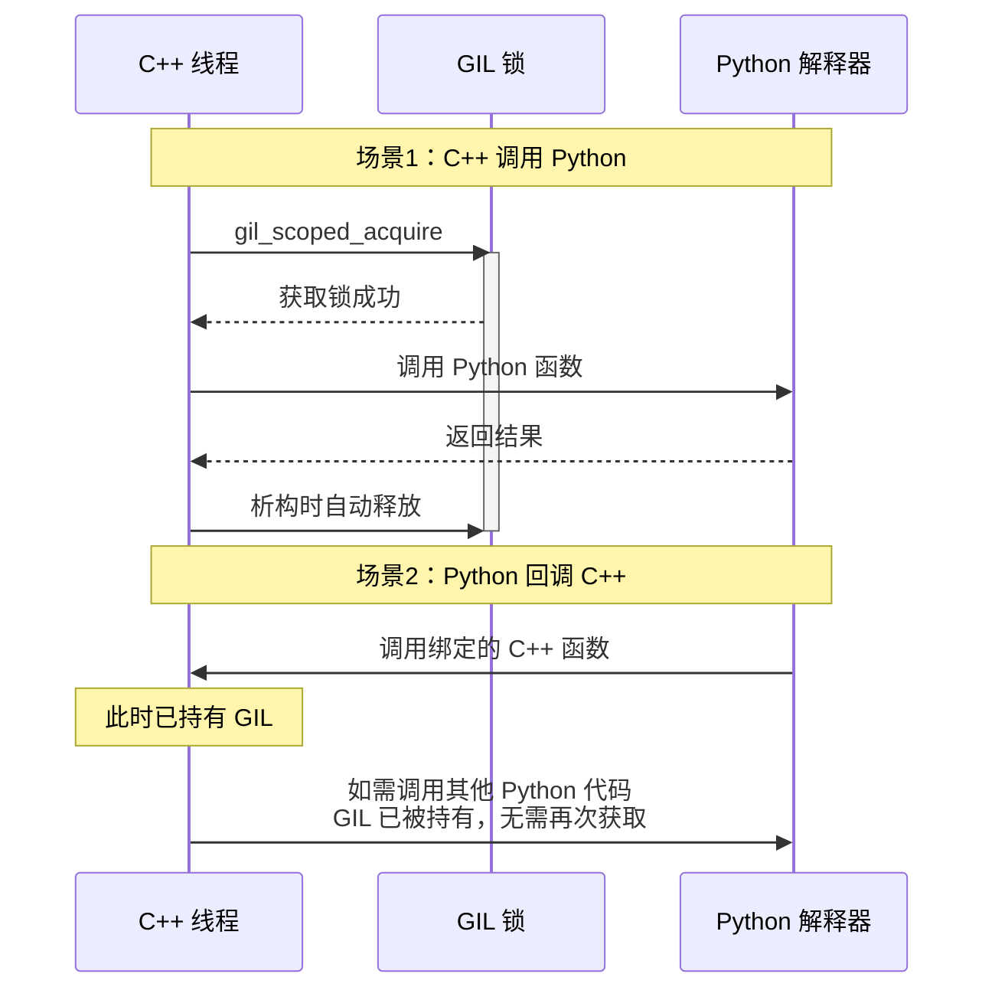

# C++ 调用 Python

本节详细说明如何从 C++ 代码调用 Python 脚本和库函数，包括 Python 解释器初始化、GIL 管理和脚本调用示例。

## 导航

本系列文档包含以下章节：

- [总览与环境搭建](./index.md)
- [C++ 调用 Python](./cpp-calling-python.md) ← 当前页
- [Python 绑定开发](./python-binding-development.md)
- [故障排除与最佳实践](./troubleshooting-and-best-practices.md)
- [Python 脚本开发实战](./python-script-development.md)

## Python 解释器初始化

!!! warning "初始化顺序至关重要"
    Python 解释器必须在任何 Python 操作之前初始化，且在整个程序生命周期中只能初始化一次。

```cpp title="main.cpp - Python 环境初始化（initializePythonInterpreter）"
#include "DAPyInterpreter.h"
#include "DAAppCore.h"
#include "DAAppConfig.h"

// src/APP/main.cpp:354-379
/**
 * @brief 根据配置初始化 Python 解释器
 *
 * 解释器路径由 DAPyInterpreter::getPythonInterpreterPath() 解析（优先 python-config.json）。
 * 初始化后追加用户配置的额外模块搜索路径到 sys.path。
 * @param cfg 早期加载的应用配置
 */
void initializePythonInterpreter(const DA::DAAppConfig& cfg)
{
    QString pythonHomePath;
    // 1. 解析解释器路径，推算 Python Home
    QString pypath = DA::DAPyInterpreter::getPythonInterpreterPath();
    if (!pypath.isEmpty()) {
        daInfo << QObject::tr("Python interpreter path is %1").arg(pypath);  // cn:Python解释器路径为%1
        QFileInfo fi(pypath);
        pythonHomePath = fi.absolutePath();
        daInfo << QObject::tr("Python home path is %1").arg(pythonHomePath);  // cn:Python主目录路径为%1
    }

    // 2. 用 QString 重载初始化解释器（内部创建 scoped_interpreter 并设置 Python Home）
    //    注意：DAPyInterpreter 的方法全部为 static，不需要获取实例
    DA::DAPyInterpreter::initializePythonInterpreter(pythonHomePath);

    // 3. 追加用户配置的额外模块搜索路径到 sys.path
    //    appendSysPath 同样是 DAPyInterpreter 的 static 方法
    QStringList extraPaths = cfg.value(DA_CONFIG_KEY_PYTHON_EXTRA_PATHS).toStringList();
    for (const QString& p : extraPaths) {
        if (!p.trimmed().isEmpty()) {
            DA::DAPyInterpreter::appendSysPath(p);
        }
    }
}
```

!!! info "DAPyInterpreter / DAPyScripts 全为静态 API"
    `DAPyInterpreter` 与 `DAPyScripts` 均未提供 `getInstance()`，所有方法都是 `static`，直接用类名调用即可：

    - `DAPyInterpreter`（`src/DAPyBindQt/DAPyInterpreter.h:27-58`）：`getPythonInterpreterPath()`、`initializePythonInterpreter(const QString& pythonHomePath)`、`appendSysPath(const QString&)`、`isPythonInitialized()`、`shutdown()` 等。
    - `DAPyScripts`（`src/DAPyScripts/DAPyScripts.h:26-34`）：`initScripts()`、`isInitScripts()`、`getIO()`、`getDataFrame()`、`getDataProcess()`、`getStatistics()`、`cleanup()`。

!!! warning "setPythonHomePath 在 Python 3.11+ 已弃用"
    `DAPyInterpreter::setPythonHomePath(const QString&)` 在 Python 3.11 及以上版本中不再生效——`Py_SetPythonHome` 自 3.11 起被弃用。源码（`src/DAPyBindQt/DAPyInterpreter.cpp:157-159`）在该版本下直接打印告警并 `Q_UNUSED(path)`。正确做法是使用带 `QString` 参数的 `initializePythonInterpreter(pythonHomePath)` 重载（`src/DAPyBindQt/DAPyInterpreter.h:39`），它在内部一并完成 Python Home 的设置。

    ```cpp
    // src/DAPyBindQt/DAPyInterpreter.cpp:152-170
    void DAPyInterpreter::setPythonHomePath(const QString& path)
    {
        if (path.isEmpty()) {
            return;
        }
    #if PY_VERSION_HEX >= 0x030B0000
        Q_UNUSED(path);
        qWarning() << "Py_SetPythonHome is deprecated in Python 3.11+, "
                      "use initializePythonInterpreter with pythonHomePath parameter instead";
    #else
        // ... 3.11 之前的旧实现（Py_SetPythonHome）...
    #endif
    }
    ```

## GIL安全：全局解释器锁管理

!!! danger "线程安全警告"
    在多线程环境下调用 Python 代码时，必须正确管理 GIL，否则会导致程序崩溃或死锁。

下图展示了 GIL 管理的两种典型场景，帮助理解 C++ 和 Python 之间的锁获取机制：


```mermaid
sequenceDiagram
    participant Cpp as C++ 线程
    participant GIL as GIL 锁
    participant Py as Python 解释器
    
    Note over Cpp,Py: 场景1：C++ 调用 Python
    Cpp->>GIL: gil_scoped_acquire
    activate GIL
    GIL-->>Cpp: 获取锁成功
    Cpp->>Py: 调用 Python 函数
    Py-->>Cpp: 返回结果
    Cpp->>GIL: 析构时自动释放
    deactivate GIL
    
    Note over Cpp,Py: 场景2：Python 回调 C++
    Py->>Cpp: 调用绑定的 C++ 函数
    Note over Cpp: 此时已持有 GIL
Cpp->>Py: 如需调用其他 Python 代码<br/>GIL 已被持有，无需再次获取
```

上图展示了 GIL 管理的两种场景：

- **场景1**：C++ 调用 Python 时，使用 `gil_scoped_acquire` 获取锁
- **场景2**：Python 回调 C++ 时，GIL 已被持有，无需再次获取

以下代码展示了 GIL 管理的不同实现方式：

=== "基本 GIL 管理"

    ```cpp
    #include <pybind11/pybind11.h>
    
    void callPythonFunction()
    {
        // 方式1：使用 RAII 自动管理
        pybind11::gil_scoped_acquire acquire;  // 构造时获取 GIL
        // ... 调用 Python 代码 ...
        // 析构时自动释放 GIL
    }
    ```

=== "释放 GIL 进行长时间 C++ 操作"

    ```cpp
    void pythonCallbackWithHeavyWork()
    {
        // Python 调用此函数时已持有 GIL
        
        // 1. 先释放 GIL，允许其他 Python 线程执行
        {
            pybind11::gil_scoped_release release;
            
            // 2. 执行耗时的 C++ 操作
            heavyComputation();  // 此时其他 Python 线程可以运行
            
        }  // 3. 离开作用域后重新持有 GIL（隐式）
        
        // 4. 继续操作 Python 对象
        // ...
    }
    ```

=== "自定义线程安全守卫"

    ```cpp
    /**
     * @brief Python 线程安全守卫类
     * 
     * 用于非 Python 创建的线程调用 Python 代码时
     */
    class PyThreadGuard
    {
    public:
        PyThreadGuard() : m_gil_state(PyGILState_Ensure()) {}
        ~PyThreadGuard() { PyGILState_Release(m_gil_state); }
        
        // 禁止拷贝
        PyThreadGuard(const PyThreadGuard&) = delete;
        PyThreadGuard& operator=(const PyThreadGuard&) = delete;
        
    private:
        PyGILState_STATE m_gil_state;
    };
    
    // 使用示例
    void backgroundThread()
    {
        PyThreadGuard guard;  // 确保当前线程持有 GIL
        // 安全调用 Python 代码
        pybind11::object result = somePythonFunction();
    }
    ```

## 调用 Python 脚本示例

`DAPyScriptsIO` 是对 Python 端 `da_io.py` 的薄封装，读取方法由 `FUNCTION_STR_DICT` 宏生成，实际调用的是 `DAWorkbench.io` 模块里的 `da_read` 函数，而非在 C++ 端直接 `import pandas`。

```cpp title="DAPyScriptsIO - read 接口与实现"
// src/DAPyScripts/DAPyScriptsIO.h:15-35
class DAPYSCRIPTS_API DAPyScriptsIO : public DAPyModule
{
public:
    DAPyScriptsIO(bool autoImport = true);
    // 读取内容,会自动根据后缀选择读取的函数
    // cn:返回 DAPyObjectWrapper（不是 bool），参数是 QVariantMap 与 QString*（不是 QVariantHash 与 QString&）
    DAPyObjectWrapper read(const QString& filepath, const QVariantMap& args, QString* err = nullptr);
    DAPyDataFrame read_csv(const QString& filepath, const QVariantMap& args, QString* err = nullptr);
    // ... read_txt / read_pkl / read_and_add_to_datamanager ...
    bool import();
};

// src/DAPyScripts/DAPyScriptsIO.cpp:117
// cn:read 不是手写实现，而是由宏展开，统一调用 DAWorkbench.io.da_read
FUNCTION_STR_DICT(DAPyObjectWrapper, read, da_read)
```

调用方使用时通过 `DAPyScripts` 的静态访问器获取实例：

```cpp title="调用 DAPyScripts::getIO().read()"
#include "DAPyScripts.h"

void loadFile(const QString& path)
{
    // getIO() 返回静态单例引用（src/DAPyScripts/DAPyScripts.h:31）
    DA::DAPyScriptsIO& io = DA::DAPyScripts::getIO();

    QString err;
    // args 为 QVariantMap；err 为 QString*；返回 DAPyObjectWrapper
    QVariantMap args;
    args["sep"] = u",";
    DA::DAPyObjectWrapper obj = io.read(path, args, &err);
    if (err.isEmpty() && !obj.isNone()) {
        // obj.object() 即底层 pybind11::object，可按需转换为 DAPyDataFrame 等
        DA::DAPyDataFrame df(obj.object());
        // ...
    }
}
```

!!! note "为什么不在 C++ 端直接 `import pandas`"
    `FUNCTION_STR_DICT` 宏统一把 `read` 映射到 `DAWorkbench.io.da_read`（与 `read_csv`→`da_read_csv`、`read_txt`→`da_read_txt` 同理）。后缀分发、编码嗅探、pandas 调用等细节都集中在 Python 端的 `da_io.py` 中完成，C++ 侧无需缓存 `pandas` 模块对象，也无需手工拼 `read_csv` 的关键字参数。
