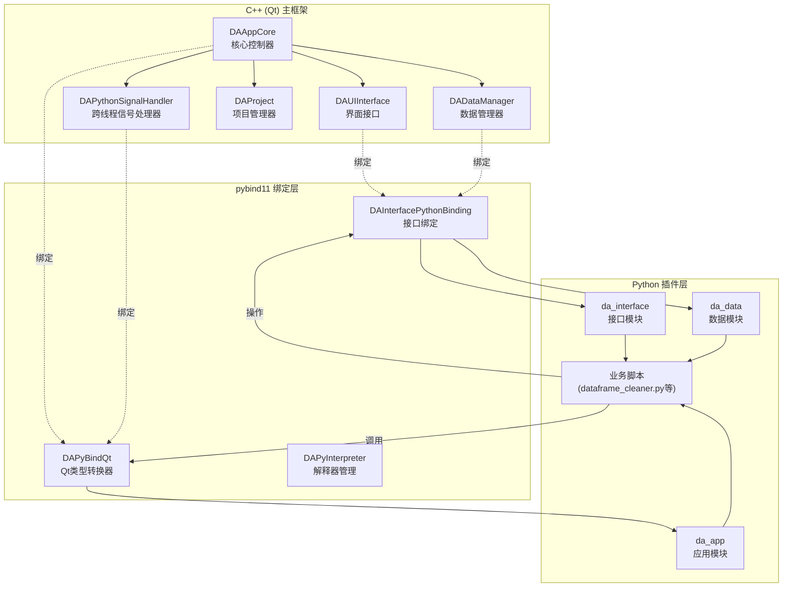

# 在Qt/C++应用中集成Python实现插件化架构

本文档详细说明如何在 **DAWorkBench** 中实现 C++ 与 Python 的双向调用，构建完整的插件化架构。通过 `pybind11` 库，我们能够实现跨语言的对象生命周期管理和线程安全的通信机制。

## 导航

本系列文档包含以下章节：

- [总览与环境搭建](./index.md) ← 当前页
- [C++ 调用 Python](./cpp-calling-python.md)
- [Python 绑定开发](./python-binding-development.md)
- [故障排除与最佳实践](./troubleshooting-and-best-practices.md)
- [Python 脚本开发实战](./python-script-development.md)

## 概述

本文档详细说明如何在 **DAWorkBench** 中实现 C++ 与 Python 的双向调用，构建完整的插件化架构。通过 `pybind11` 库，我们能够：

- 从 C++ 调用 Python 脚本和库函数
- 从 Python 脚本操作 C++ 界面组件和数据管理器
- 实现跨语言的对象生命周期管理
- 构建线程安全的跨语言通信机制

!!! info "为什么选择 Python 作为插件语言？"
    - **丰富的生态系统**：numpy、pandas、scipy 等科学计算库开箱即用
    - **低门槛**：相比 C++ 插件开发，Python 更易学习和推广
    - **快速迭代**：业务逻辑可热更新，无需重新编译主程序
    - **胶水语言特性**：天然适合作为各模块间的协调层

## 架构总览

下图展示了 C++ 与 Python 集成的完整架构，包括主框架、绑定层和 Python 插件层：



上图展示了 C++/Python 集成的三层架构：
- **C++ 主框架**：包含核心控制器、界面接口、数据管理器和跨线程信号处理器
- **pybind11 绑定层**：包含 Qt 类型转换器、解释器管理和接口绑定
- **Python 插件层**：包含 da_app、da_interface、da_data 模块和业务脚本

## CMake 配置详解

以下配置展示了 Python 集成的基础 CMake 设置，包括 Python 开发库查找和 pybind11 配置：

=== "基础配置"

    ```cmake
    # CMakeLists.txt - Python 集成基础配置

    # 查找 Python 开发库（要求 3.8+）
    find_package(Python3 3.8 COMPONENTS Interpreter Development REQUIRED)

    # 查找 pybind11
    find_package(pybind11 REQUIRED)

    # 设置 Python 模块输出目录
    set(PYTHON_MODULE_OUTPUT_DIR "${CMAKE_BINARY_DIR}/python_modules")
    ```

上述基础配置的关键点：
- 使用 `find_package` 查找 Python 3.8+ 开发库
- 使用 `find_package` 查找 pybind11 绑定库
- 设置 Python 模块输出目录用于存放编译后的绑定模块

以下配置展示了如何将 Python 解释器嵌入到主程序中：

=== "嵌入式解释器配置"

    ```cmake
    # 嵌入 Python 解释器到主程序
    target_link_libraries(DAWorkBench
        PRIVATE
            Python3::Python          # Python 库
            Python3::Module          # Python 模块支持
    )

    target_include_directories(DAWorkBench
        PRIVATE
            ${Python3_INCLUDE_DIRS}  # Python 头文件
    )

    # 定义嵌入模式宏
    target_compile_definitions(DAWorkBench
        PRIVATE
            DA_ENABLE_PYTHON=1
    )
    ```

上述嵌入式配置的关键点：
- 链接 `Python3::Python` 和 `Python3::Module` 获取 Python 库支持
- 包含 `Python3_INCLUDE_DIRS` 获取 Python 头文件
- 定义 `DA_ENABLE_PYTHON=1` 宏标记 Python 功能启用

以下配置展示了如何创建 Python 绑定模块：

=== "Python 模块绑定配置"

    ```cmake
    # 创建 Python 绑定模块
    pybind11_add_module(da_interface
        ${CMAKE_SOURCE_DIR}/src/DAInterface/DAInterfacePythonBinding.cpp
    )

    # 链接依赖库
    target_link_libraries(da_interface
        PRIVATE
            DAInterface              # 接口库
            DAPyBindQt               # Qt 绑定库
            pybind11::module         # pybind11 模块
    )

    # 设置模块输出位置
    set_target_properties(da_interface PROPERTIES
        LIBRARY_OUTPUT_DIRECTORY "${PYTHON_MODULE_OUTPUT_DIR}"
    )
    ```

上述模块绑定配置的关键点：
- 使用 `pybind11_add_module` 创建 Python 绑定模块
- 链接 `DAInterface` 和 `DAPyBindQt` 获取接口和类型转换支持
- 设置输出目录确保 Python 能正确导入模块

## 目录结构

```
data-workbench/
├── src/
│   ├── DAPyBindQt/              # Python 绑定核心模块
│   │   ├── DAPybind11QtCaster.hpp    # Qt 类型转换器
│   │   ├── DAPythonSignalHandler.h   # 跨线程通信
│   │   ├── DAPyInterpreter.h         # 解释器管理
│   │   └── pandas/                   # pandas 封装
│   │       ├── DAPyDataFrame.h
│   │       └── DAPySeries.h
│   ├── DAInterface/             # 接口模块
│   │   └── DAInterfacePythonBinding.cpp  # 接口绑定实现
│   └── APP/                     # 应用主程序
│       └── DAAppCore.cpp        # Python 环境初始化
└── plugins/
    └── DataAnalysis/            # 数据分析插件
        └── PyScripts/
            └── DADataAnalysis/  # Python 业务脚本
                ├── dataframe_cleaner.py
                ├── dataframe_io.py
                └── dataframe_operate.py
```

## 相关模块

| 模块 | 说明 |
|------|------|
| `DAPyBindQt` | Python 与 Qt 绑定的核心模块 |
| `DAPyScripts` | Python 脚本包装模块 |
| `DAData` | 数据处理模块，包含 `DAPyDataFrame` 等 |
| `DAInterface` | 接口模块，定义核心接口 |

## 参考资料

- [pybind11 官方文档](https://pybind11.readthedocs.io/)
- [Python C API 文档](https://docs.python.org/3/c-api/)
- [Qt 线程基础](https://doc.qt.io/qt-5/thread-basics.html)
