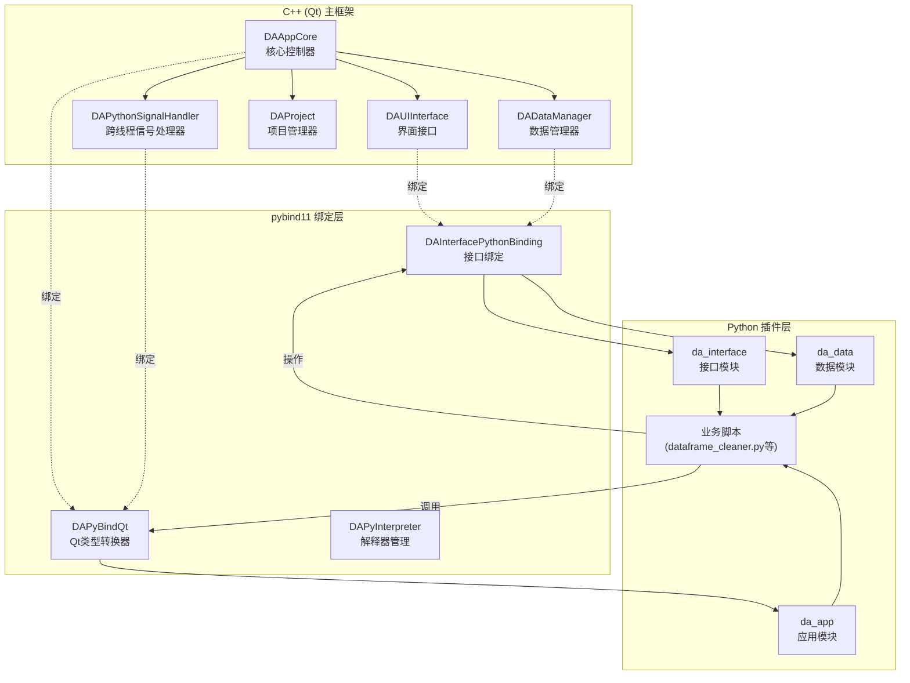

# 在Qt/C++应用中集成Python实现插件化架构

本文档详细说明如何在 **DAWorkBench** 中实现 C++ 与 Python 的双向调用，构建完整的插件化架构。通过 `pybind11` 库，我们能够实现跨语言的对象生命周期管理和线程安全的通信机制。

## 导航

本系列文档包含以下章节：

- [总览与环境搭建](./index.md) ← 当前页
- [C++ 调用 Python](./cpp-calling-python.md)
- [Python 绑定开发](./python-binding-development.md)
- [Python 多线程与异步任务](./python-multi-threading.md)
- [故障排除与最佳实践](./troubleshooting-and-best-practices.md)
- [Python 脚本开发实战](./python-script-development.md)
- [pybind11 ↔ Qt 类型转换器](./dapybind11-qt-caster.md)
- [嵌入式 Python 调试](./embedded-python-debugging.md)
- [脚本的国际化](../general/python-i18n.md)

## 概述

本文档详细说明如何在 **DAWorkBench** 中实现 C++ 与 Python 的双向调用，构建完整的插件化架构。通过 `pybind11` 库，我们能够：

- 从 C++ 调用 Python 脚本和库函数
- 从 Python 脚本操作 C++ 界面组件和数据管理器
- 实现跨语言的对象生命周期管理
- 构建线程安全的跨语言通信机制

!!! info "为什么选择 Python 作为插件语言？"
    - **丰富的生态系统**：numpy、pandas、scipy 等科学计算库开箱即用
    - **低门槛**：相比 C++ 插件开发，Python 更易学习和推广
    - **快速迭代**：业务逻辑可热更新，无需重新编译主程序
    - **胶水语言特性**：天然适合作为各模块间的协调层

## 架构总览

下图展示了 C++ 与 Python 集成的完整架构，包括主框架、绑定层和 Python 插件层：


```mermaid
flowchart TB
    subgraph CPP["C++ (Qt) 主框架"]
        Core["DAAppCore<br/>核心控制器"]
        UI["DAUIInterface<br/>界面接口"]
        DM["DADataManager<br/>数据管理器"]
        Proj["DAProject<br/>项目管理器"]
        SH["DAPythonSignalHandler<br/>跨线程信号处理器"]
    end

    subgraph Binding["pybind11 绑定层"]
        PB["DAPyBindQt<br/>Qt类型转换器"]
        PI["DAPyInterpreter<br/>解释器管理"]
        IF["DAInterfacePythonBinding<br/>接口绑定"]
    end

    subgraph Python["Python 插件层"]
        DA["da_app<br/>应用模块"]
        DI["da_interface<br/>接口模块"]
        DD["da_data<br/>数据模块"]
        Scripts["业务脚本<br/>(dataframe_cleaner.py等)"]
    end

    Core --> UI
    Core --> DM
    Core --> Proj
    Core --> SH

    Core -.->|绑定| PB
    UI -.->|绑定| IF
    DM -.->|绑定| IF
    SH -.->|绑定| PB

    PB --> DA
    IF --> DI
    IF --> DD

    DA --> Scripts
    DI --> Scripts
    DD --> Scripts

    Scripts -->|调用| PB
Scripts -->|操作| IF
```

上图展示了 C++/Python 集成的三层架构：

- **C++ 主框架**：包含核心控制器、界面接口、数据管理器和跨线程信号处理器
- **pybind11 绑定层**：包含 Qt 类型转换器、解释器管理和接口绑定
- **Python 插件层**：包含 da_app、da_interface、da_data 模块和业务脚本

## CMake 配置详解

DAWorkBench 采用 **嵌入式（embedded）** 绑定方案：绑定代码通过 `PYBIND11_EMBEDDED_MODULE` 宏以进程内模块形式注册到解释器，而非用 `pybind11_add_module` 编译成独立的 `.pyd`。因此 CMake 侧不产生单独的绑定目标，而是把绑定源文件并入对应库的源列表，再通过项目封装的导入宏链接 Python 与 pybind11。

=== "Python 与 pybind11 导入宏"

    项目在 `cmake/daworkbench_3rdparty.cmake` 中封装了两个导入宏，各库（如 `DAInterface`）通过它们完成链接：

    ```cmake
    # cmake/daworkbench_3rdparty.cmake:183-207  —— damacro_import_Python
    macro(damacro_import_Python __target_name)
        # 未固定版本号，按系统环境解析（可通过 Python3_ROOT_DIR 指定非系统 Python）
        find_package(Python3 COMPONENTS Interpreter Development REQUIRED)
        if(${Python3_FOUND})
            message(STATUS "  |-find python")
            # ... 打印 Python3_VERSION / INCLUDE_DIRS / LIBRARIES 等诊断信息
        endif()
        target_link_libraries(${__target_name} PRIVATE ${Python3_LIBRARIES})
        target_include_directories(${__target_name} PRIVATE ${Python3_INCLUDE_DIRS})
    endmacro()

    # cmake/daworkbench_3rdparty.cmake:209-238  —— damacro_import_pybind11
    macro(damacro_import_pybind11 __target_name)
        # pybind11 安装在 share/cmake 而非 lib/cmake，先按默认查找，找不到再回退到安装目录
        find_package(pybind11)
        if(pybind11_FOUND)
            message(STATUS "  |-finded tsl-ordered-map")
        else()
            if(DEFINED DA_INSTALL_LIB_SHARE_PATH)
                set(_lib_dir ${DA_INSTALL_LIB_SHARE_PATH}/pybind11)
                find_package(pybind11 PATHS ${_lib_dir})  # cn:回退到本地安装目录查找
            endif()
        endif()
        if(pybind11_FOUND)
            target_link_libraries(${__target_name} PUBLIC pybind11::headers)
        endif()
    endmacro()
    ```

    上述两个宏的关键点：

    - **不固定 Python 版本**：`find_package(Python3 COMPONENTS Interpreter Development REQUIRED)` 不带 `3.8` 版本约束，由系统环境解析；如需指向非系统 Python，可通过 `Python3_ROOT_DIR` 改变查找路径。
    - **不直接链接 `Python3::Python` / `Python3::Module`**：链接统一由 `damacro_import_Python` 完成（链接 `${Python3_LIBRARIES}`、包含 `${Python3_INCLUDE_DIRS}`）。
    - **pybind11 仅链接 `pybind11::headers`**：因为绑定走 `PYBIND11_EMBEDDED_MODULE`，不需要 `pybind11::module`，也不调用 `pybind11_add_module`。

=== "嵌入绑定源文件（以 DAInterface 为例）"

    `src/DAInterface/CMakeLists.txt` 把绑定源文件并入库源列表，再用导入宏链接依赖：

    ```cmake
    # src/DAInterface/CMakeLists.txt:47-54  —— 绑定源文件并入 DAInterface 库
    list(APPEND DA_LIB_HEADER_FILES
        DAInterfacePythonBinding.h
        DAQwtPyPlotPythonBinding.h
    )
    list(APPEND DA_LIB_SOURCE_FILES
        DAInterfacePythonBinding.cpp       # cn:内含 PYBIND11_EMBEDDED_MODULE(da_interface, m)
        DAQwtPyPlotPythonBinding.cpp       # cn:内含 PYBIND11_EMBEDDED_MODULE(da_pyplot, m)
    )

    add_library(${DA_LIB_NAME} SHARED
                ${DA_LIB_HEADER_FILES}
                ${DA_LIB_SOURCE_FILES}
                ${DA_GLOBAL_HEADER})

    # src/DAInterface/CMakeLists.txt:88-91  —— 链接 Python 与 pybind11
    damacro_import_Python(${DA_LIB_NAME})      # cn:链接 ${Python3_LIBRARIES}
    damacro_import_pybind11(${DA_LIB_NAME})    # cn:链接 pybind11::headers
    ```

    上述嵌入配置的关键点：

    - 绑定源文件以 `target_sources` / 源列表方式并入库，**不**用 `pybind11_add_module` 生成独立 `.pyd`。
    - `DAInterfacePythonBinding.cpp` 内通过 `PYBIND11_EMBEDDED_MODULE(da_interface, m)` 在进程内注册模块，Python 端 `import da_interface` 即由解释器从已注册的内置模块加载。
    - 项目中所有绑定库（DAApp、DAInterface、DAData、DAFigure、DAPyWorkFlow 等）均沿用此模式，各自在 `CMakeLists.txt` 中调用 `damacro_import_Python` + `damacro_import_pybind11`。

=== "自动部署 Python 运行时（DA_ENABLE_AUTO_INSTALL_PYTHON_ENV）"

    Windows 下若 Python 未加入系统环境变量，可开启顶层选项让 CMake 自动把所需 DLL 拷贝到 bin 目录：

    ```cmake
    # CMakeLists.txt:44-46  —— 顶层选项定义
    option(DA_ENABLE_AUTO_INSTALL_PYTHON_ENV
        "This parameter allows cmake to automatically search for the Python environment
         and copy the necessary DLLs from the Python environment to the bin directory
         without manual deployment. Recommended for Windows users ..."
        ON)

    # CMakeLists.txt:257-271  —— 选项生效逻辑
    if(DA_ENABLE_AUTO_INSTALL_PYTHON_ENV)
        # 同样不固定版本号
        find_package(Python3 COMPONENTS Interpreter Development REQUIRED)
        if(${Python3_FOUND})
            if(WIN32)
                set(DA_PYTHON_DLL_PATH
                    ${Python3_RUNTIME_LIBRARY_DIRS}/python${Python3_VERSION_MAJOR}${Python3_VERSION_MINOR}.dll)
                # 把 dll 复制到 bin 中否则无法运行
                file(COPY ${DA_PYTHON_DLL_PATH} DESTINATION ${CMAKE_BINARY_DIR}/${CMAKE_INSTALL_BINDIR})
                install(FILES ${DA_PYTHON_DLL_PATH} DESTINATION ${CMAKE_INSTALL_BINDIR})
            endif()
        endif()
    endif()
    ```

    该选项默认 `ON`，会从 `Python3_RUNTIME_LIBRARY_DIRS` 拷贝 `python3X.dll` 到构建与安装的 bin 目录，免去 Windows 下手动部署 Python DLL 的步骤。

## 目录结构

```
data-workbench/
├── src/
│   ├── DAPyBindQt/              # Python 绑定核心模块
│   │   ├── DAPybind11QtCaster.hpp    # Qt 类型转换器
│   │   ├── DAPythonSignalHandler.h   # 跨线程通信
│   │   ├── DAPyInterpreter.h         # 解释器管理
│   │   └── pandas/                   # pandas 封装
│   │       ├── DAPyDataFrame.h
│   │       └── DAPySeries.h
│   ├── DAInterface/             # 接口模块
│   │   └── DAInterfacePythonBinding.cpp  # 接口绑定实现
│   └── APP/                     # 应用主程序
│       ├── main.cpp            # Python 环境初始化（initializePythonInterpreter）
│       └── DAAppCore.cpp       # 仅持有 mIsPythonInterpreterInitialized 标志
└── plugins/
    └── DataAnalysis/            # 数据分析插件
        └── PyScripts/
            └── DADataAnalysis/  # Python 业务脚本
                ├── dataframe_cleaner.py
                ├── dataframe_io.py
                └── dataframe_operate.py
```

### 内置 Python 模块目录结构（src/PyScripts/DAWorkbench）

`src/PyScripts/DAWorkbench/` 是主程序内置的 Python 模块，已重构为子包结构：

```text
src/PyScripts/DAWorkbench/
├── __init__.py              # 模块入口，sys.modules 别名保持旧路径可用
├── DAPyBase/                # 基础工具子包
│   ├── __init__.py
│   ├── form_spec.py                # FormSpec 数据结构定义
│   ├── form_builder.py             # FormBuilder 链式构建器
│   ├── thread_status_manager.py    # 线程状态管理
│   ├── utils.py                    # 通用工具函数
│   ├── da_logger.py                # 日志工具
│   ├── io.py                       # I/O 操作
│   ├── dataframe.py                # DataFrame 操作
│   ├── data_processing.py          # 数据处理/信号处理
│   └── app_wrapper.py              # 应用包装器
├── DAStatistics/             # 统计计算子包
│   ├── __init__.py
│   ├── _utils.py                   # 统计内部工具
│   ├── boxplot_stats.py            # 箱线图统计
│   ├── categorical.py             # 分类统计
│   ├── distribution.py            # 分布拟合/检验
│   ├── kde.py                       # 核密度估计
│   ├── matrix.py                    # 相关/协方差矩阵
│   └── regression.py                # 回归分析
└── DAWorkFlowPy/              # 工作流 Python 核心
    ├── __init__.py
    ├── workflow.py            # 工作流编排
    ├── executor.py            # 执行引擎
    ├── connection.py          # 连接管理
    ├── signal_manager.py      # 信号管理器
    ├── serializer.py          # 序列化
    ├── syntax.py              # 语法校验
    ├── node_def.py            # 节点定义装饰器（@NodeDef）
    ├── node_factory.py        # 节点工厂
    ├── node_registry.py       # 节点注册表
    ├── _debug.py              # 调试工具
    └── nodes/                 # 内置节点子包
        └── __init__.py
```

!!! tip "旧路径兼容"
    `__init__.py` 通过 `sys.modules` 别名机制保持 `DAWorkbench.form_builder` 等旧导入路径可用，但推荐使用新路径 `DAWorkbench.DAPyBase.form_builder`。

### 插件 Python 包目录结构（plugins/DataAnalysis/PyScripts）

`plugins/DataAnalysis/PyScripts/` 已从单层 `DADataAnalysis` 包重构为三层架构：

```text
plugins/DataAnalysis/PyScripts/
├── DADataAnalysisCore/      # 纯 pandas 核心算法（无 Qt 依赖）
│   ├── __init__.py
│   ├── cleaning.py          # 数据清洗算法
│   ├── io.py                # 文件读写算法
│   └── operations.py        # DataFrame 操作算法
├── DADataAnalysisGui/       # GUI 交互逻辑（依赖 da_app/da_interface）
│   ├── __init__.py
│   ├── dataframe_cleaner.py # 数据清洗 UI 交互
│   ├── dataframe_io.py      # 数据导入导出 UI 交互
│   ├── utils.py             # 工具函数
│   └── i18n/                # 国际化翻译
├── DADataAnalysisNodes/     # 工作流节点插件（自动发现）
│   ├── __init__.py
│   ├── *_node.py            # 20+ 节点定义文件
│   └── setup.py             # entry_points 注册
└── DADataAnalysis/          # 兼容旧包（可选，逐步废弃）
```

## 相关模块

| 模块 | 说明 |
|------|------|
| `DAPyBindQt` | Python 与 Qt 绑定的核心模块，含 `DAPyDataFrame`（位于 `src/DAPyBindQt/pandas/DAPyDataFrame.h`）、`DAPythonSignalHandler`、`DAPyInterpreter` 等 |
| `DAPyScripts` | Python 脚本包装模块 |
| `DAData` | 数据处理模块，`DAData` 类型绑定在此 |
| `DAInterface` | 接口模块，定义核心接口并注册 `da_interface` 绑定 |

## 参考资料

- [pybind11 官方文档](https://pybind11.readthedocs.io/)
- [Python C API 文档](https://docs.python.org/3/c-api/)
- [Qt 线程基础](https://doc.qt.io/qt-5/thread-basics.html)
