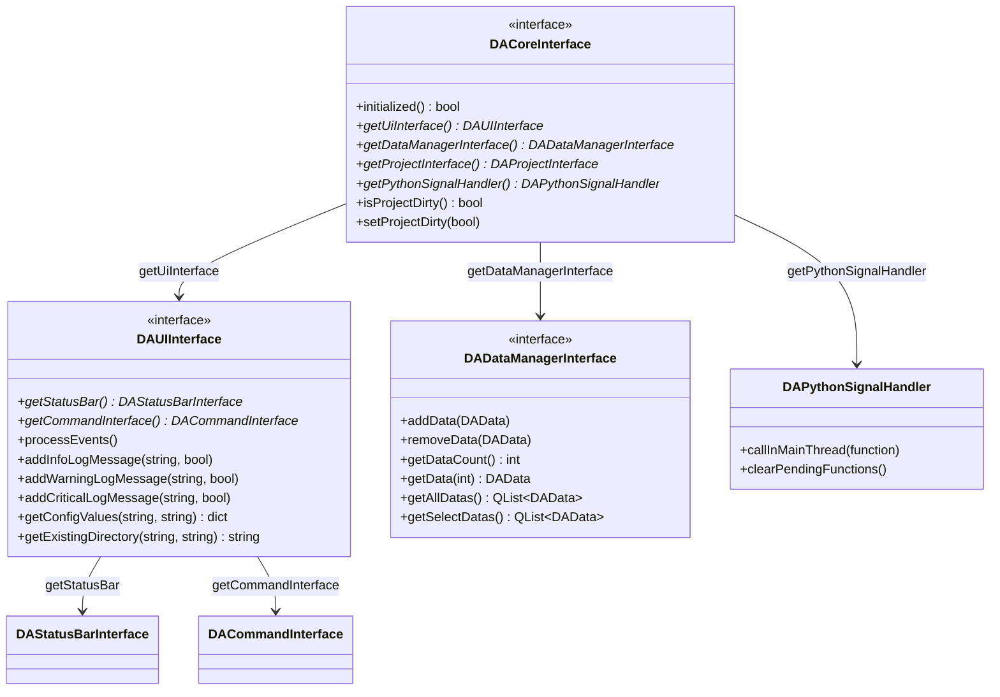
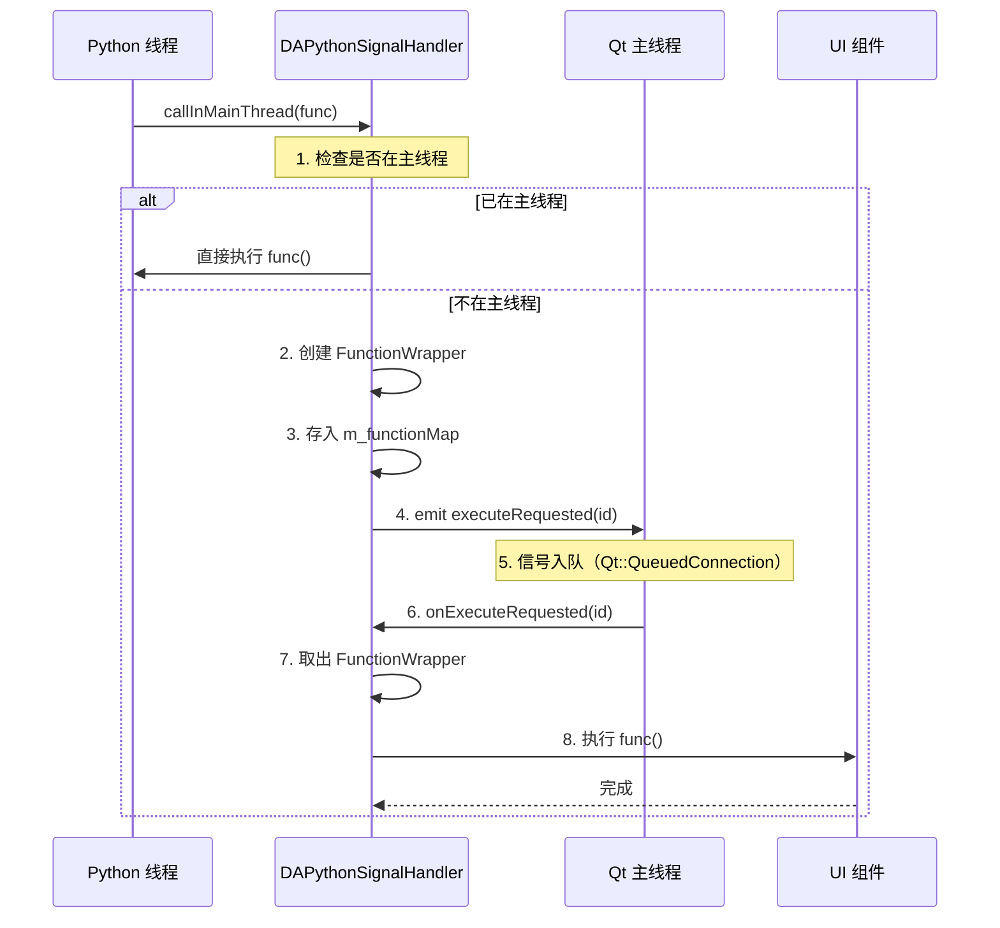
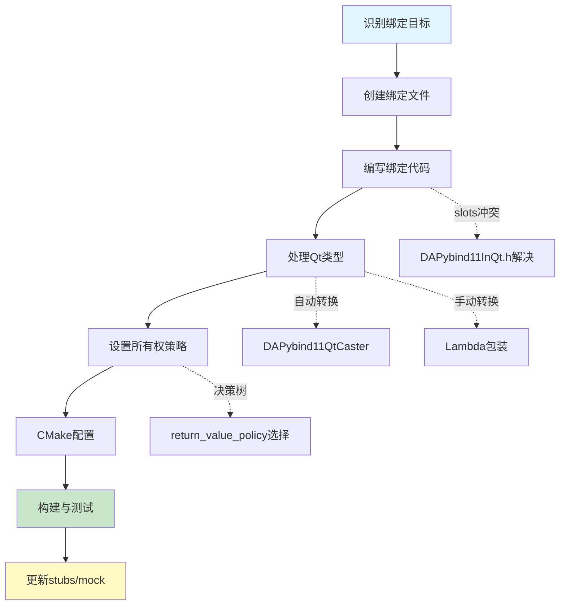
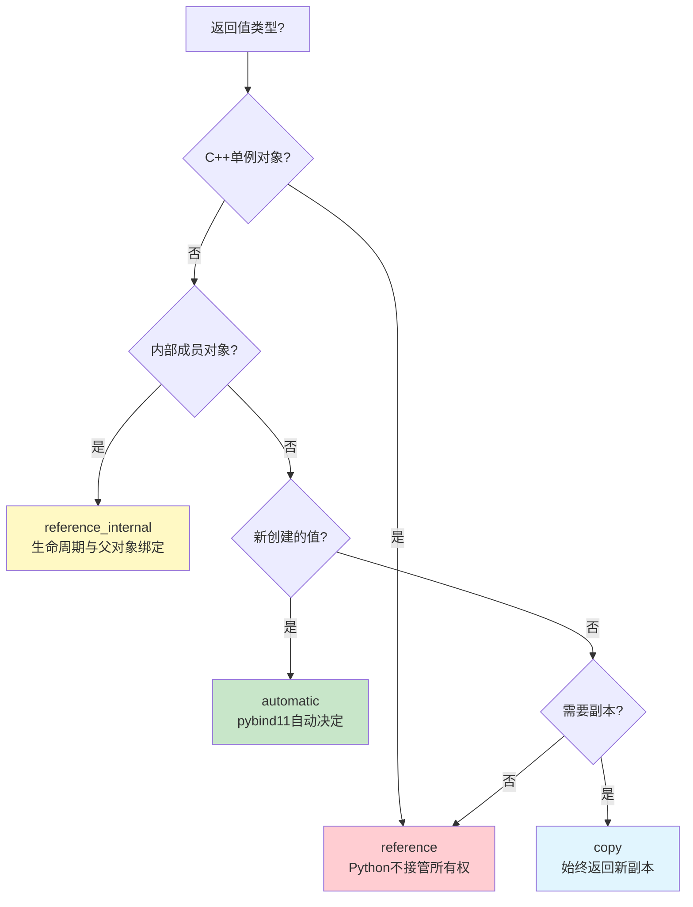

# Python 绑定开发

本节详细说明 Python 绑定开发的完整体系，包括接口绑定架构与实现、所有权策略、跨线程通信机制、Qt 类型转换器、绑定开发实操流程和模块绑定路线图。

## 导航

本系列文档包含以下章节：

- [总览与环境搭建](./index.md)
- [C++ 调用 Python](./cpp-calling-python.md)
- [Python 绑定开发](./python-binding-development.md) ← 当前页
- [故障排除与最佳实践](./troubleshooting-and-best-practices.md)
- [Python 脚本开发实战](./python-script-development.md)

## 接口绑定架构

下图展示了 Python 绑定的核心接口层次结构，包括核心接口、UI 接口、数据管理接口和信号处理器：



上图展示了接口绑定的层次结构：
- `DACoreInterface` 是核心入口，提供获取其他接口的方法
- `DAUIInterface` 提供界面操作功能，包含状态栏和命令接口
- `DADataManagerInterface` 提供数据管理功能
- `DAPythonSignalHandler` 提供[跨线程通信机制](#跨线程通信机制)功能

## 接口绑定实现

```cpp title="DAInterfacePythonBinding.cpp - 核心接口绑定"
#include <pybind11/pybind11.h>
#include <pybind11/functional.h>
#include "DACoreInterface.h"
#include "DAUIInterface.h"
#include "DADataManagerInterface.h"
#include "DAPythonSignalHandler.h"

namespace py = pybind11;

PYBIND11_EMBEDDED_MODULE(da_interface, m)
{
    // ========================================
    // 1. 绑定 DAPythonSignalHandler
    // ========================================
    py::class_<DA::DAPythonSignalHandler>(m, "DAPythonSignalHandler")
        .def("callInMainThread",
            [](DA::DAPythonSignalHandler& self, py::function pyFunc) {
                // 重要：增加引用计数，防止 Python 端提前释放
                pyFunc.inc_ref();
                self.callInMainThread([pyFunc]() {
                    try {
                        py::gil_scoped_acquire acquire;
                        pyFunc();
                        pyFunc.dec_ref();
                    } catch (...) {
                        pyFunc.dec_ref();
                        throw;
                    }
                });
            },
            py::arg("func"),
            "Schedule a Python function to be executed in Qt main thread");
    
    // ========================================
    // 2. 绑定 DADataManagerInterface
    // ========================================
    py::class_<DA::DADataManagerInterface>(m, "DADataManagerInterface")
        .def("addData", &DA::DADataManagerInterface::addData,
             py::arg("data"), "Add data immediately")
        .def("removeData", &DA::DADataManagerInterface::removeData,
             py::arg("data"))
        .def("getDataCount", &DA::DADataManagerInterface::getDataCount)
        .def("getData", &DA::DADataManagerInterface::getData,
             py::arg("index"),
             py::return_value_policy::reference_internal)
        .def("getAllDatas",
            [](DA::DADataManagerInterface& self) {
                QList<DA::DAData> datas = self.getAllDatas();
                py::list pyList;
                for (const DA::DAData& data : datas) {
                    pyList.append(data);
                }
                return pyList;
            },
            "Get all data objects as a list")
        .def("addDataframe",
            [](DA::DADataManagerInterface& self, 
               py::object df, 
               const std::string& name) {
                DA::DAData data(DA::DAPyDataFrame(df));
                data.setName(QString::fromStdString(name));
                self.addData(data);
            },
            py::arg("df"), py::arg("name"),
            "Add a pandas DataFrame to data manager");
    
    // ========================================
    // 3. 绑定 DAUIInterface
    // ========================================
    py::class_<DA::DAUIInterface>(m, "DAUIInterface")
        .def("getStatusBar", &DA::DAUIInterface::getStatusBar,
             py::return_value_policy::reference_internal)
        .def("processEvents", &DA::DAUIInterface::processEvents)
        .def("addInfoLogMessage",
            [](DA::DAUIInterface& self, 
               const std::string& msg, 
               bool showInStatusBar = true) {
                self.addInfoLogMessage(
                    QString::fromStdString(msg), showInStatusBar);
            },
            py::arg("msg"), py::arg("showInStatusBar") = true)
        .def("addWarningLogMessage",
            [](DA::DAUIInterface& self, 
               const std::string& msg, 
               bool showInStatusBar = true) {
                self.addWarningLogMessage(
                    QString::fromStdString(msg), showInStatusBar);
            },
            py::arg("msg"), py::arg("showInStatusBar") = true)
        .def("addCriticalLogMessage",
            [](DA::DAUIInterface& self, 
               const std::string& msg, 
               bool showInStatusBar = true) {
                self.addCriticalLogMessage(
                    QString::fromStdString(msg), showInStatusBar);
            },
            py::arg("msg"), py::arg("showInStatusBar") = true)
        .def("getConfigValues",
            [](DA::DAUIInterface& self, 
               const std::string& jsonConfig, 
               const std::string& cacheKey = "") {
                QString qjsonConfig = QString::fromStdString(jsonConfig);
                QString qcacheKey = QString::fromStdString(cacheKey);
                QJsonObject jsonObj = self.getConfigValues(
                    qjsonConfig, self.getMainWindow(), qcacheKey);
                return DA::PY::qjsonObjectToPyDict(jsonObj);
            },
            py::arg("jsonConfig"), py::arg("cacheKey") = "",
            "Show config dialog and return user input as dict");
    
    // ========================================
    // 4. 绑定 DACoreInterface
    // ========================================
    py::class_<DA::DACoreInterface>(m, "DACoreInterface")
        .def("getUiInterface", &DA::DACoreInterface::getUiInterface,
             py::return_value_policy::reference_internal)
        .def("getDataManagerInterface", 
             &DA::DACoreInterface::getDataManagerInterface,
             py::return_value_policy::reference_internal)
        .def("getPythonSignalHandler",
             &DA::DACoreInterface::getPythonSignalHandler,
             py::return_value_policy::reference_internal,
             "Get Python signal handler for cross-thread communication")
        .def("isProjectDirty", &DA::DACoreInterface::isProjectDirty)
        .def("setProjectDirty", &DA::DACoreInterface::setProjectDirty,
             py::arg("on"));
}
```

## 所有权策略详解

!!! tip "所有权策略选择指南"
    正确的所有权策略是避免内存泄漏和崩溃的关键。

| 策略 | 适用场景 | 说明 |
|------|----------|------|
| `reference` | 单例对象、C++ 管理生命周期的对象 | Python 不接管所有权，不调用析构函数 |
| `reference_internal` | 返回内部对象的引用 | 生命周期与父对象绑定 |
| `take_ownership` | Python 创建的对象 | Python 接管所有权，负责析构 |
| `automatic` | 默认策略 | 根据返回类型自动选择 |
| `copy` | 返回副本 | 始终返回一个新的副本 |

```cpp
// 示例：不同场景的所有权策略

// 场景1：单例对象 - 使用 reference
py::class_<DAAppCore>(m, "DAAppCore")
    .def_static("getInstance", 
                &DAAppCore::getInstance,
                py::return_value_policy::reference);  // 关键！

// 场景2：内部对象引用 - 使用 reference_internal
py::class_<DAUIInterface>(m, "DAUIInterface")
    .def("getStatusBar", 
         &DAUIInterface::getStatusBar,
         py::return_value_policy::reference_internal);  // 与 UIInterface 绑定

// 场景3：创建新对象 - 使用 take_ownership
py::class_<DataWrapper>(m, "DataWrapper")
    .def(py::init<>());  // Python 创建，Python 管理
```

所有权策略与 [GIL管理](./cpp-calling-python.md#gil安全全局解释器锁管理) 密切相关，在后台线程操作 Python 对象时需特别注意。

## Python 脚本调用示例

```python title="dataframe_cleaner.py - Python 调用 C++ 界面"
"""
DataFrame 数据清洗工具集
演示如何从 Python 脚本操作 C++ 界面组件
"""
import da_app, da_interface, da_data
import pandas as pd
from typing import Optional

def dropna() -> Optional[int]:
    """
    删除包含缺失值的行
    
    演示：
    1. 获取 C++ 数据管理器
    2. 显示配置对话框
    3. 执行操作并更新界面
    """
    # 1. 获取核心接口
    core = da_app.getCore()
    ui = core.getUiInterface()
    data_mgr = core.getDataManagerInterface()
    
    # 2. 获取当前选中的数据
    select_datas = data_mgr.getSelectDatas()
    if not select_datas:
        ui.addWarningLogMessage("请先选择要处理的数据")
        return None
    
    dadata = select_datas[0]
    
    # 3. 构建配置对话框（调用 C++ 的配置对话框组件）
    import DAWorkbench.property_config_builder as cfgBuilder
    
    builder = cfgBuilder.PropertyConfigBuilder("删除缺失值设置")
    
    builder.add_enum(
        name="how",
        display_name="删除条件",
        default_value="any",
        enum_items=["any", "all"],
        enum_descriptions=[
            "行中任意值为空时删除",
            "行中所有值为空时删除"
        ]
    )
    
    builder.add_bool(
        name="reindex",
        display_name="重置行号",
        default_value=True
    )
    
    # 4. 显示对话框并获取用户输入
    config = ui.getConfigValues(builder.to_json(), "dataframecleaner.dropna")
    if not config:
        return None  # 用户取消
    
    # 5. 执行数据操作
    how = config.get("how", "any")
    reindex = config.get("reindex", True)
    
    df = dadata.toDataFrame()
    old_len = len(df)
    
    # 使用 pandas 处理
    df = df.dropna(how=how)
    if reindex:
        df = df.reset_index(drop=True)
    
    # 6. 更新数据（触发 C++ 界面刷新）
    dadata.setPyObject(df)
    
    # 7. 显示结果消息
    removed = old_len - len(df)
    ui.addInfoLogMessage(f"已删除 {removed} 行包含缺失值的数据")
    
    return removed


def execute_in_main_thread():
    """
    演示如何从后台线程安全地调用主线程操作
    """
    core = da_app.getCore()
    handler = core.getPythonSignalHandler()
    
    def update_ui():
        """此函数将在 Qt 主线程中执行"""
        ui = core.getUiInterface()
        ui.addInfoLogMessage("来自后台线程的消息")
    
    # 投递到主线程执行
    handler.callInMainThread(update_ui)
```

## 跨线程通信机制

### 问题背景

!!! warning "Qt 线程限制"
    Qt 的 UI 操作必须在主线程执行。Python 脚本可能在后台线程运行，直接操作 UI 会导致崩溃。

### DAPythonSignalHandler 类

下图展示了 `DAPythonSignalHandler` 如何实现线程安全的 UI 操作，从 Python 后台线程到 Qt 主线程的完整流程：



上图展示了线程安全 UI 操作的完整流程：
1. Python 线程调用 `callInMainThread(func)` 请求执行
2. 信号处理器检查当前是否在主线程
3. 若已在主线程，直接执行函数
4. 若不在主线程，包装函数并发射信号
5. Qt 主线程接收信号并执行回调函数
6. UI 操作在主线程中安全完成

### 实现代码

```cpp title="DAPythonSignalHandler.h"
#ifndef DAPYTHONSIGNALHANDLER_H
#define DAPYTHONSIGNALHANDLER_H

#include <QObject>
#include <QMap>
#include <functional>
#include <memory>
#include <mutex>

namespace DA
{
/**
 * @brief Python 线程到 Qt 主线程的通信处理器
 * 
 * 允许 Python 线程通过信号槽机制安全地调用 Qt 主线程中的函数
 */
class DAPythonSignalHandler : public QObject
{
    Q_OBJECT

public:
    explicit DAPythonSignalHandler(QObject* parent = nullptr);
    virtual ~DAPythonSignalHandler();
    
    // 禁止拷贝
    DAPythonSignalHandler(const DAPythonSignalHandler&) = delete;
    DAPythonSignalHandler& operator=(const DAPythonSignalHandler&) = delete;

    /**
     * @brief 从 Python 线程调用，请求在主线程执行函数
     * @param func 要在主线程执行的函数
     * 
     * 此函数是线程安全的，可以从任何线程调用
     */
    void callInMainThread(std::function<void()> func);

    /**
     * @brief 清理所有待执行的函数
     */
    void clearPendingFunctions();

Q_SIGNALS:
    /**
     * @brief 内部信号，用于触发主线程执行
     */
    void executeRequested(int funcWrapperId);

private Q_SLOTS:
    void onExecuteRequested(int funcWrapperId);

private:
    // 函数包装器
    class FunctionWrapper
    {
    public:
        explicit FunctionWrapper(std::function<void()> func) : m_func(func) {}
        void execute() { if (m_func) m_func(); }
    private:
        std::function<void()> m_func;
    };
    
    using FunctionWrapperPtr = std::shared_ptr<FunctionWrapper>;
    
    QMap<int, FunctionWrapperPtr> m_functionMap;  // 函数映射
    std::mutex m_mutex;                           // 线程安全保护
    int m_nextFuncId{0};                          // 下一个 ID
    bool m_destroying{false};                     // 销毁标志
};

}  // namespace DA
#endif
```

```cpp title="DAPythonSignalHandler.cpp"
#include "DAPythonSignalHandler.h"
#include <QThread>
#include <QCoreApplication>

namespace DA
{

DAPythonSignalHandler::DAPythonSignalHandler(QObject* parent)
    : QObject(parent), m_destroying(false)
{
    // 使用 Qt::QueuedConnection 确保跨线程调用
    connect(this, &DAPythonSignalHandler::executeRequested,
            this, &DAPythonSignalHandler::onExecuteRequested,
            Qt::QueuedConnection);
}

DAPythonSignalHandler::~DAPythonSignalHandler()
{
    m_destroying = true;
    clearPendingFunctions();
}

void DAPythonSignalHandler::callInMainThread(std::function<void()> func)
{
    if (!func || m_destroying) {
        return;
    }
    
    QCoreApplication* app = QCoreApplication::instance();
    if (!app) {
        return;
    }
    
    // 检查是否已在主线程
    if (QThread::currentThread() == app->thread()) {
        func();  // 直接执行
        return;
    }
    
    // 创建函数包装器并存入映射
    int funcId;
    {
        std::lock_guard<std::mutex> lock(m_mutex);
        funcId = ++m_nextFuncId;
        m_functionMap[funcId] = std::make_shared<FunctionWrapper>(std::move(func));
    }
    
    // 发射信号，触发主线程执行
    Q_EMIT executeRequested(funcId);
}

void DAPythonSignalHandler::onExecuteRequested(int funcWrapperId)
{
    if (m_destroying) {
        return;
    }
    
    FunctionWrapperPtr wrapper;
    
    {
        std::lock_guard<std::mutex> lock(m_mutex);
        auto it = m_functionMap.find(funcWrapperId);
        if (it == m_functionMap.end()) {
            return;
        }
        wrapper = it.value();
        m_functionMap.erase(it);
    }
    
    try {
        wrapper->execute();
    } catch (const std::exception& e) {
        qCritical() << "Exception in main thread function:" << e.what();
    }
}

void DAPythonSignalHandler::clearPendingFunctions()
{
    std::lock_guard<std::mutex> lock(m_mutex);
    m_functionMap.clear();
}

}  // namespace DA
```

## Qt 类型转换器

> **完整文档**：Qt 与 pybind11 类型转换的详细说明已独立为 [DAPybind11QtCaster.hpp 使用指南](../dapybind11-qt-caster.md)，包含每个类型的转换详解、numpy 支持、`DA::PY` 辅助函数、`safe_pyobject` 安全包装器等完整内容。本节仅列出类型映射摘要。

### 支持的类型映射

| Qt 类型 | Python 类型 | 说明 |
|---------|-------------|------|
| `QString` | `str` | UTF-8 编码自动转换 |
| `QByteArray` | `bytes` / `bytearray` | 支持二进制数据 |
| `QDate` | `datetime.date` | 日期类型 |
| `QTime` | `datetime.time` | 时间类型 |
| `QDateTime` | `datetime.datetime` | 支持 pandas.Timestamp、numpy.datetime64 |
| `QList<T>` | `list` | 泛型支持 |
| `QSet<T>` | `set` | 集合类型 |
| `QHash<K,V>` | `dict` | 哈希映射 |
| `QMap<K,V>` | `dict` | 有序映射 |
| `QVariant` | `Any` | 通用类型，支持 numpy |

### QString 转换器实现

```cpp title="DAPybind11QtCaster.hpp - QString 转换器"
namespace pybind11
{
namespace detail
{

template<>
struct type_caster<QString>
{
    PYBIND11_TYPE_CASTER(QString, _("str"));

    // Python -> QString
    bool load(handle src, bool convert)
    {
        if (!src) return false;

        // 处理 Unicode 字符串
        if (PyUnicode_Check(src.ptr())) {
            Py_ssize_t size;
            const char* data = PyUnicode_AsUTF8AndSize(src.ptr(), &size);
            if (data) {
                value = QString::fromUtf8(data, size);
                return true;
            }
        }
        // 处理 bytes 对象
        else if (convert && PyBytes_Check(src.ptr())) {
            char* data;
            Py_ssize_t size;
            if (PyBytes_AsStringAndSize(src.ptr(), &data, &size) != -1) {
                value = QString::fromUtf8(data, size);
                return true;
            }
        }
        return false;
    }

    // QString -> Python
    static handle cast(const QString& src, 
                       return_value_policy /* policy */, 
                       handle /* parent */)
    {
        QByteArray utf8 = src.toUtf8();
        return PyUnicode_FromStringAndSize(utf8.constData(), utf8.size());
    }
};

}  // namespace detail
}  // namespace pybind11
```

### QVariant 转换与 numpy 支持

```cpp title="DAPybind11QtCaster.hpp - QVariant 转换器（简化版）"
template<>
struct type_caster<QVariant>
{
    PYBIND11_TYPE_CASTER(QVariant, _("Any"));

    bool load(handle src, bool convert)
    {
        if (!src || src.is_none()) {
            value = QVariant();
            return true;
        }
        
        // 检查是否是 numpy 对象
        if (is_numpy_array(src)) {
            return handle_numpy_object(src);
        }
        
        // 整数
        if (PyLong_Check(src.ptr())) {
            value = src.cast<long long>();
            return true;
        }
        
        // 浮点数
        if (PyFloat_Check(src.ptr())) {
            value = src.cast<double>();
            return true;
        }
        
        // 字符串
        if (PyUnicode_Check(src.ptr())) {
            value = src.cast<QString>();
            return true;
        }
        
        // 列表
        if (PyList_Check(src.ptr())) {
            value = src.cast<QVariantList>();
            return true;
        }
        
        // 字典
        if (PyDict_Check(src.ptr())) {
            value = src.cast<QVariantMap>();
            return true;
        }
        
        // ... 其他类型处理
        
        return false;
    }

    static handle cast(const QVariant& src, 
                       return_value_policy policy, 
                       handle parent)
    {
        if (!src.isValid() || src.isNull()) {
            Py_RETURN_NONE;
        }
        
        switch (src.userType()) {
        case QMetaType::Int:
            return py::cast(src.toInt()).release();
        case QMetaType::Double:
            return py::cast(src.toDouble()).release();
        case QMetaType::QString:
            return py::cast(src.toString()).release();
        case QMetaType::QVariantList:
            return py::cast(src.toList()).release();
        case QMetaType::QVariantMap:
            return py::cast(src.toMap()).release();
        // ... 其他类型
        default:
            return py::cast(src.toString()).release();
        }
    }
};
```

## 绑定开发实操流程

本部分详细说明从零开始开发一个 pybind11 绑定模块的完整流程，涵盖从识别绑定目标到构建验证的全过程。

### 绑定开发总览

下图展示了绑定开发的完整流程，每个步骤环环相扣：



上图展示了绑定开发的关键步骤和分支路径：

- **主线流程**（A→H）：从识别目标到最终验证的完整链路
- **slots 冲突分支**（C1）：Qt 的 `slots` 宏与 Python 头文件冲突，需特殊处理
- **Qt 类型处理分支**（D1/D2）：自动转换与手动 Lambda 包装两条路径
- **所有权策略分支**（E1）：根据对象生命周期选择正确的 `return_value_policy`

### 绑定步骤一：识别绑定目标

在开发新绑定模块之前，需要明确哪些类和函数需要暴露给 Python。识别原则如下：

!!! tip "绑定目标识别原则"
    1. **优先绑定接口层**：暴露 `XXXInterface` 而非内部实现类，保持与 C++ 架构一致的抽象层次
    2. **只绑定 public API**：PIMPL 类只绑定其公共接口，不暴露 `PrivateData` 内部成员
    3. **避免绑定非 QObject 的 Qt 子类**：`QwtPlotItem` 等非 QObject 类不能使用 `Q_OBJECT` 宏，绑定需特别注意
    4. **评估使用频率**：Python 脚本高频调用的类优先绑定，低频使用的可通过已有接口间接访问

**识别流程示例**：假设需要为 `DAFigure` 模块创建绑定，识别步骤如下：

1. 查看该模块对外提供的接口类（如 `DAFigureInterface`）
2. 确认 Python 脚本需要直接操作的功能（如创建图表、设置坐标轴属性）
3. 检查是否存在 `QwtPlotItem` 子类——这类类不能使用信号槽，绑定时只能暴露方法
4. 列出需要 `QString` 参数的方法——这些需要 Lambda 包装转换

### 绑定步骤二：创建绑定文件

绑定文件的命名和位置遵循以下约定：

| 约定 | 说明 | 示例 |
|------|------|------|
| 文件命名 | `XXXPythonBinding.h` / `XXXPythonBinding.cpp` | `DADataPythonBinding.h/.cpp` |
| 文件位置 | 与被绑定模块同目录 | `src/DAData/DADataPythonBinding.cpp` |
| 模块名 | `PYBIND11_EMBEDDED_MODULE` 中的名称应简短明确 | `da_app`, `da_data`, `da_interface` |

!!! warning "文件命名一致性"
    头文件和源文件必须同名，且 `.h` 中声明初始化函数，`.cpp` 中实现绑定逻辑。模块名（如 `da_data`）需与 Python 端 `import da_data` 一致。

**头文件模板**：

```cpp title="XXXPythonBinding.h - 头文件模板"
#ifndef XXXPYTHONBINDING_H
#define XXXPYTHONBINDING_H

#include "DAPyBindQtGlobal.h"

namespace DA
{

/**
 * @brief 初始化 XXX 模块的 Python 绑定
 * 
 * 此函数在 DAAppCore 初始化 Python 环境时调用，
 * 确保 embedded module 在解释器启动时自动注册
 */
void initXXXPythonBinding();

}  // namespace DA

#endif  // XXXPYTHONBINDING_H
```

**源文件模板**（基于 `DAAppPythonBinding.cpp` 的最小骨架）：

```cpp title="XXXPythonBinding.cpp - 最简绑定骨架"
#include "XXXPythonBinding.h"
#include "DAPybind11InQt.h"  // 必须！解决 slots 宏冲突

namespace DA
{

// 如有需要，在此定义辅助函数（如 std::string 版本的重包装）

}  // namespace DA

PYBIND11_EMBEDDED_MODULE(da_xxx, m)
{
    // 1. 绑定核心类
    pybind11::class_<DA::DAClassName>(m, "DAClassName")
        .def(pybind11::init<>())
        .def("methodName", &DA::DAClassName::methodName,
             pybind11::arg("param"), "Brief description");
    
    // 2. 绑定枚举（如有）
    pybind11::enum_<DA::EnumType>(m, "EnumType")
        .value("Value1", DA::EnumType::Value1)
        .export_values();
    
    // 3. 绑定单例或全局函数（如有）
    m.def("getXXX", &DA::getXXXPtr,
          "Return the XXX singleton",
          pybind11::return_value_policy::reference);
}
```

!!! danger "slots 宏冲突 —— 必须使用 DAPybind11InQt.h"
    Qt 的 `slots` 关键字与 Python 头文件中的 `slots` 宏存在**严重冲突**。如果直接在绑定文件中 `#include <pybind11/pybind11.h>`，编译时会因为 `slots` 被 Qt 预定义为空而导致 Python 头文件解析错误。
    
    **必须**使用 `DAPybind11InQt.h` 替代直接引入 pybind11 头文件。此头文件的处理方式如下：
    
    ```cpp title="DAPybind11InQt.h - slots 冲突解决方案（源码）"
    #undef slots                       // 1. 先取消 Qt 的 slots 宏定义
    #ifndef PY_SSIZE_T_CLEAN
    #define PY_SSIZE_T_CLEAN           // 2. Python 要求的定义
    #endif
    #include "pybind11/pybind11.h"     // 3. 安全引入 pybind11
    #include "pybind11/numpy.h"
    #include "pybind11/cast.h"
    #include "pybind11/embed.h"
    #include "pybind11/stl.h"
    #include "pybind11/chrono.h"
    #include "pybind11/operators.h"
    #define slots Q_SLOTS              // 4. 恢复为 Qt 正确的宏定义
    ```
    
    **所有绑定 `.cpp` 文件**的第一行 include 应为 `#include "DAPybind11InQt.h"`，**不要**直接 `#include <pybind11/...>`。

### 绑定步骤三：编写绑定代码

#### QString → std::string Lambda 包装模式

C++ 方法通常接受 `QString` 参数，但 pybind11 的 `DAPybind11QtCaster` 自动转换仅在直接类型匹配时生效。对于需要 `QString` 参数的方法，如果 caster 已注册则可自动转换，但很多场景下为了保持接口简洁，会使用 Lambda 将 `std::string` 转为 `QString`：

=== "直接绑定（caster 自动转换）"

    当 `DAPybind11QtCaster.hpp` 已注册 `QString` 的 `type_caster` 时，Python `str` 可自动转换为 `QString`：
    
    ```cpp
    // 如果 QString caster 已生效，可直接绑定
    pybind11::class_<DA::DAClass>(m, "DAClass")
        .def("setName", &DA::DAClass::setName,
             pybind11::arg("name"));
    // Python: obj.setName("hello") → QString("hello") 自动转换
    ```

=== "Lambda 包装（显式转换）"

    为确保兼容性和明确性，实际项目中大量使用 Lambda 包装模式：
    
    ```cpp title="Lambda 包装 std::string→QString"
    pybind11::class_<DA::DAUIInterface>(m, "DAUIInterface")
        .def("addInfoLogMessage",
             [](DA::DAUIInterface& self, const std::string& msg, bool showInStatusBar) {
                 self.addInfoLogMessage(
                     QString::fromStdString(msg), showInStatusBar);
             },
             pybind11::arg("msg"),
             pybind11::arg("showInStatusBar") = true)
    ```
    
    Lambda 包装的优势：
    - 参数类型明确为 `std::string`，Python 端传入 `str` 无歧义
    - 可添加默认参数值（如 `showInStatusBar = true`）
    - 可组合多个转换步骤

!!! info "何时使用 Lambda 包装？"
    - 方法参数为 `QString` 且需要设置默认值 → **Lambda 包装**
    - 方法返回值为 `QString` → **Lambda 包装**（返回 `std::string`）
    - 方法参数为 `QJsonObject` → **Lambda 包装**（使用 `DAPyJsonCast` 辅助）
    - 参数为简单 `int`/`double`/`bool` → **直接绑定**

#### QList<绑定类型> 手动转换模式

当 `QList<T>` 中的 `T` 是已绑定的类型时，`DAPybind11QtCaster` 的自动转换会将 `QList<DAData>` 转为 Python `list`，但列表元素类型可能不正确。为确保列表中的每个元素以正确的绑定类型返回，需手动遍历转换：

```cpp title="QList<DAData> 手动转换（源自 DAInterfacePythonBinding.cpp）"
.def("getAllDatas",
    [](DA::DADataManagerInterface& self) {
        QList<DA::DAData> datas = self.getAllDatas();
        pybind11::list pyList;
        for (const DA::DAData& data : datas) {
            pyList.append(data);  // 每个 DAData 以绑定类型加入
        }
        return pyList;
    },
    "Get all data objects as a list")
```

**对比：自动转换 vs 手动转换**

| 方式 | 代码 | 适用场景 |
|------|------|----------|
| 自动转换（caster） | `.def("getXxx", &Class::getXxx)` | `QList<int>`、`QList<QString>` 等基本类型 |
| 手动转换（Lambda） | Lambda 遍历 append | `QList<DAData>` 等绑定类型，需确保元素类型正确 |

!!! tip "QList<int> 也建议手动转换"
    虽然 `QList<int>` 有自动 caster，但在 `DAInterfacePythonBinding.cpp` 中 `getOperateDataSeries()` 仍使用了手动转换，以保持风格统一并避免隐式依赖：
    
    ```cpp
    .def("getOperateDataSeries",
        [](DA::DADataManagerInterface& self) {
            QList<int> colindex = self.getOperateDataSeries();
            pybind11::list list;
            for (int v : colindex) {
                list.append(v);
            }
            return list;
        })
    ```

#### return_value_policy 决策树

选择正确的 `return_value_policy` 是避免内存泄漏和崩溃的关键。下图展示了策略选择的决策流程：



**各策略的实际使用示例**（源自项目绑定代码）：

```cpp title="return_value_policy 使用示例"
// 1. 单例对象 — reference（最常见！）
m.def("getCore", &DA::getAppCorePtr,
      "Return the application core interface (singleton)",
      pybind11::return_value_policy::reference);
// ^^^ 务必指定 reference，否则 pybind11 会尝试析构单例！

// 2. 内部成员 — reference_internal
pybind11::class_<DA::DACoreInterface>(m, "DACoreInterface")
    .def("getUiInterface", &DA::DACoreInterface::getUiInterface,
         pybind11::return_value_policy::reference_internal)
    .def("getDataManagerInterface", 
         &DA::DACoreInterface::getDataManagerInterface,
         pybind11::return_value_policy::reference_internal);
// ^^^ 返回的 UI/DataManager 接口与 CoreInterface 生命周期绑定

// 3. 新值 — automatic（默认，无需显式指定）
pybind11::class_<DA::DAData>(m, "DAData")
    .def(pybind11::init<>());  // Python 创建，Python 管理
```

!!! danger "单例务必指定 reference"
    `PYBIND11_EMBEDDED_MODULE(da_app, m)` 中 `getCore()` 如果不指定 `return_value_policy::reference`，pybind11 默认使用 `automatic`，会在 Python 端对象析构时尝试 `delete` C++ 单例，导致程序崩溃。

#### 枚举导出模式

枚举导出使用 `pybind11::enum_` 绑定，并调用 `.export_values()` 使枚举值在模块级别可见：

```cpp title="枚举导出示例（源自 DADataPythonBinding.cpp）"
// 导出 da_data.DataChangeType (enum)
pybind11::enum_<DA::DADataManager::ChangeType>(m, "DataChangeType")
    .value("Name", DA::DADataManager::ChangeName)
    .value("Describe", DA::DADataManager::ChangeDescribe)
    .value("Value", DA::DADataManager::ChangeValue)
    .value("ColumnName", DA::DADataManager::ChangeDataframeColumnName)
    .export_values();

// Python 端使用方式：
// import da_data
// da_data.DataChangeType.Name      # 直接访问枚举值
// da_data.DataChangeType.Value     # 不需要通过类实例
```

!!! tip "枚举命名规范"
    - pybind11 模块名中的枚举类型名应与 C++ 枚举名一致
    - `.value()` 的第一个参数是 Python 端可见的名称，建议与 C++ 枚举值名一致（去掉前缀）
    - **务必调用 `.export_values()`**，否则枚举值只能在 `da_data.DataChangeType.Name` 方式访问，不能在模块级别直接访问

#### 重载函数的处理

C++ 类中常有同名重载函数（如 `addData` 与 `addData_`），绑定时需使用 `static_cast` 消歧：

```cpp title="重载函数消歧示例（源自 DADataPythonBinding.cpp）"
pybind11::class_<DA::DADataManager>(m, "DADataManager")
    .def("addData",
         static_cast<void(DA::DADataManager::*)(DA::DAData&)>(
             &DA::DADataManager::addData),
         "Add a DAData object to manager")
    .def("addData_",
         static_cast<void(DA::DADataManager::*)(DA::DAData&)>(
             &DA::DADataManager::addData_),
         "Add data with undo/redo support");
```

!!! warning "重载消歧的两个要点"
    1. 使用 `static_cast<返回类型(类名::*)(参数类型)>(&函数名)` 精确指定重载版本
    2. 不同重载建议使用不同 Python 方法名（如 `addData` vs `addData_`），避免 Python 端混淆

### 绑定步骤四：处理 Qt 类型

Qt 类型与 Python 类型之间的转换是绑定的核心难点。`DAPybind11QtCaster.hpp` 提供了[Qt类型转换器](#qt-类型转换器)的自动转换支持，但并非所有场景都能覆盖。

#### 自动转换类型表

以下 Qt 类型已通过 `type_caster` 特化实现自动双向转换：

| Qt 类型 | Python 类型 | caster 实现位置 | 说明 |
|---------|-------------|-----------------|------|
| `QString` | `str` | `DAPybind11QtCaster.hpp` | UTF-8 编码自动转换 |
| `QByteArray` | `bytes` | `DAPybind11QtCaster.hpp` | 支持二进制数据 |
| `QDate` | `datetime.date` | `DAPybind11QtCaster.hpp` | 日期类型 |
| `QTime` | `datetime.time` | `DAPybind11QtCaster.hpp` | 时间类型 |
| `QDateTime` | `datetime.datetime` | `DAPybind11QtCaster.hpp` | 支持 pandas.Timestamp、numpy.datetime64 |
| `QList<T>` | `list` | `DAPybind11QtCaster.hpp` | 泛型支持（T 需有 caster） |
| `QVector<T>` | `list` | `DAPybind11QtCaster.hpp` | Qt5 专用 |
| `QSet<T>` | `set` | `DAPybind11QtCaster.hpp` | 集合类型 |
| `QHash<K,V>` | `dict` | `DAPybind11QtCaster.hpp` | 哈希映射 |
| `QMap<K,V>` | `dict` | `DAPybind11QtCaster.hpp` | 有序映射 |
| `QVariant` | `Any` | `DAPybind11QtCaster.hpp` | 通用类型，支持 numpy 数组/标量 |

#### 需要 Lambda 包装的场景

以下场景即使有 caster 也需要 Lambda 包装：

| 场景 | 原因 | 示例 |
|------|------|------|
| `QString` 参数 + 默认值 | caster 不支持参数默认值 | `addInfoLogMessage(msg, showInStatusBar=true)` |
| `QJsonObject` 返回值 | caster 未覆盖 `QJsonObject` → `dict` | `getConfigValues()` 使用 `DAPyJsonCast` |
| `QList<绑定类型>` 返回值 | 需确保元素为正确绑定类型 | `getAllDatas()` 手动遍历 |
| `QRegularExpression` 参数 | caster 未覆盖 | `findDatasReg()` Lambda 构造 |
| 函数重载消歧 | caster 无法区分重载版本 | `static_cast` + Lambda |

!!! info "DAPyJsonCast 辅助工具"
    对于 `QJsonObject` ↔ Python `dict` 的转换，项目提供了 `DAPyJsonCast.h` 中的辅助函数：
    
    ```cpp
    // QJsonObject → Python dict
    return DA::PY::qjsonObjectToPyDict(jsonObj);
    ```
    
    此函数处理了 `QJsonObject` 中各种值类型（字符串、数字、数组、嵌套对象）到 Python 对象的完整转换。

### 绑定步骤五：CMake 配置

Python 绑定代码必须通过 `DA_ENABLE_PYTHON` 条件编译控制，确保在不启用 Python 时项目仍可正常编译：

```cmake title="CMakeLists.txt - Python 绑定条件编译配置"
# 在模块的 CMakeLists.txt 中
if(DA_ENABLE_PYTHON)
    # 添加绑定源文件
    target_sources(${PROJECT_NAME} PRIVATE
        DADataPythonBinding.h
        DADataPythonBinding.cpp
    )
    
    # 链接 pybind11
    target_link_libraries(${PROJECT_NAME} PRIVATE
        pybind11::embed
        DAPyBindQt  # Qt 类型 caster 模块
    )
    
    # 确保绑定头文件可被其他模块引用
    target_include_directories(${PROJECT_NAME} PUBLIC
        ${CMAKE_CURRENT_SOURCE_DIR}
    )
endif()
```

!!! warning "条件编译的重要性"
    - `DA_ENABLE_PYTHON` 由主 `CMakeLists.txt` 根据是否找到 Python 决定
    - 绑定文件中所有 `#include "DAPybind11InQt.h"` 等依赖应包裹在 `#ifdef DA_ENABLE_PYTHON` 中
    - 头文件中的 `initXXXPythonBinding()` 声明也应在 `DA_ENABLE_PYTHON` 条件下
    - **不启用 Python 时**，绑定代码完全不参与编译，不影响无 Python 环境的用户

### 绑定步骤六：构建与测试

绑定代码完成后，需要验证其正确性：

**构建验证步骤**：

1. **编译检查**：确认 `DA_ENABLE_PYTHON=ON` 时绑定文件编译无错误
2. **无 Python 编译检查**：确认 `DA_ENABLE_PYTHON=OFF` 时项目仍可正常编译
3. **运行测试**：在 Python 解释器中验证绑定模块

```python title="Python 端验证绑定"
# 在 DAWorkBench 内嵌 Python 中执行
import da_app
import da_data

# 1. 验证单例获取
core = da_app.getCore()
assert core is not None, "getCore() should return non-None singleton"

# 2. 验证接口链路
ui = core.getUiInterface()
data_mgr = core.getDataManagerInterface()
assert ui is not None
assert data_mgr is not None

# 3. 集成测试 - 完整调用链路
dadata = da_data.DAData()
dadata.setName("test_data")
assert dadata.getName() == "test_data"

# 4. 验证枚举
assert da_data.DataChangeType.Name is not None
assert da_data.DataChangeType.Value is not None

# 5. 验证 QString 转换
ui.addInfoLogMessage("测试消息")  # std::string → QString 自动转换
```

!!! tip "逐步验证策略"
    - 先验证最简绑定（如 `da_app` 的 `getCore()`）能否正常返回
    - 再验证 Lambda 包装的 QString 转换是否生效
    - 最后验证 QList 手动转换和 return_value_policy 是否正确
    - **每添加一个绑定类就测试一次**，不要积攒到最后

### 常见陷阱清单

!!! failure "陷阱1：忘记 GIL 管理"

    **症状**：在后台线程调用 Python 代码时程序崩溃（段错误）
    
    **原因**：非 Python 线程调用 Python API 时未获取 GIL
    
    ```cpp
    // ❌ 错误：后台线程直接调用 Python
    void backgroundThread() {
        py::object result = py::module::import("pandas");  // 崩溃！
    }
    
    // ✅ 正确：获取 GIL 后再调用
    void backgroundThread() {
        pybind11::gil_scoped_acquire acquire;
        py::object result = py::module::import("pandas");  // OK
    }
    ```

!!! failure "陷阱2：错误的所有权策略"

    **症状**：程序退出时崩溃，或 Python 对象被意外释放
    
    **原因**：未对单例和内部引用指定 `return_value_policy::reference` 或 `reference_internal`
    
    ```cpp
    // ❌ 错误：单例默认策略可能导致 Python 尝试 delete
    m.def("getCore", &DA::getAppCorePtr);
    
    // ✅ 正确：显式指定 reference
    m.def("getCore", &DA::getAppCorePtr,
          pybind11::return_value_policy::reference);
    ```

!!! failure "陷阱3：PIMPL 类只绑定 public 接口"

    **症状**：编译错误或运行时访问非法内存
    
    **原因**：尝试绑定 PIMPL 类的 `PrivateData` 成员
    
    ```cpp
    // ❌ 错误：绑定私有实现
    py::class_<DA::DAPyModuleNumpy>(m, "DAPyModuleNumpy")
        .def_readwrite("m_ptr", &DA::DAPyModuleNumpy::m_ptr);  // 私有成员！
    
    // ✅ 正确：只绑定公共方法
    py::class_<DA::DAPyModuleNumpy>(m, "DAPyModuleNumpy")
        .def("isInstanceNumber", &DA::DAPyModuleNumpy::isInstanceNumber);
    ```

!!! failure "陷阱4：QwtPlotItem 子类不能使用 Q_OBJECT"

    **症状**：编译报错 `meta-object compiler cannot process this class`
    
    **原因**：`QwtPlotItem` 不继承 `QObject`，其子类不能使用 `Q_OBJECT` 宏和信号槽
    
    ```cpp
    // ❌ 错误：QwtPlotItem 子类加 Q_OBJECT
    class DAChartItem : public QwtPlotItem {
        Q_OBJECT  // 编译错误！QwtPlotItem 不是 QObject
    };
    
    // ✅ 正确：QwtPlotItem 子类不加 Q_OBJECT，绑定只暴露方法
    class DAChartItem : public QwtPlotItem {
        // 不加 Q_OBJECT，不能使用信号槽
    };
    
    // 绑定时只能绑定普通方法
    py::class_<DAChartItem>(m, "DAChartItem")
        .def("setItemAttribute", &DAChartItem::setItemAttribute);
    ```

!!! failure "陷阱5：忘记 #include DAPybind11InQt.h"

    **症状**：编译报错 `slots` 相关的语法错误
    
    **原因**：直接 `#include <pybind11/pybind11.h>` 导致 Qt `slots` 宏冲突
    
    ```cpp
    // ❌ 错误：直接引入 pybind11 头文件
    #include <pybind11/pybind11.h>  // slots 宏冲突！
    
    // ✅ 正确：使用 DAPybind11InQt.h
    #include "DAPybind11InQt.h"  // 安全引入，已处理 slots 冲突
    ```

更多常见问题与解决方案请参阅 [故障排除与最佳实践](./troubleshooting-and-best-practices.md)。

## 模块绑定路线图

### 已完成模块

| 模块 | 绑定文件 | Python 模块名 | 主要导出类 | 说明 |
|------|----------|---------------|-----------|------|
| APP | `src/APP/PythonBinding/DAAppPythonBinding.cpp` | `da_app` | 全局函数 | 最简绑定，仅暴露 `getCore()` 单例和日志函数 |
| Interface | `src/DAInterface/DAInterfacePythonBinding.cpp` | `da_interface` | `DAPythonSignalHandler`, `DADataManagerInterface`, `DAStatusBarInterface`, `DACommandInterface`, `DAUIInterface`, `DACoreInterface` | 最复杂绑定，大量 Lambda 包装处理 Qt 类型和跨线程回调 |
| Data | `src/DAData/DADataPythonBinding.cpp` | `da_data` | `DAData`, `DataChangeType`, `DADataManager` | 数据类型绑定，包含枚举导出和重载消歧 |

### 规划中模块

| 模块 | 当前状态 | 建议下一步 | 优先级理由 |
|------|----------|-----------|-----------|
| DAFigure | 未绑定 | 创建 `DAFigurePythonBinding.cpp`，绑定 `DAFigureInterface` | Python 脚本高频需要创建/编辑图表，是数据分析的核心输出 |
| DAProject | 未绑定 | 创建 `DAProjectPythonBinding.cpp`，绑定 `DAProjectInterface` | 项目保存/加载是工作流持久化的基础，脚本需要操作项目状态 |
| DAGui | 未绑定 | 创建 `DAGuiPythonBinding.cpp`，绑定关键 GUI 接口 | GUI 组件多数可通过 `da_interface` 的 `DAUIInterface` 间接访问，优先级较低 |
| DAGraphicsView | 未绑定 | 创建 `DAGraphicsViewPythonBinding.cpp`，绑定工作流节点接口 | 工作流操作复杂，需先完成 Figure 和 Project 绑定后再考虑 |

### 绑定优先级排序逻辑

优先级排序遵循以下原则：

1. **Figure > Project**：图表是数据分析的核心输出，Python 脚本最常用的功能是创建和编辑图表
2. **Project > Workflow**：项目持久化是工作流执行的前提，保存/加载项目比操作工作流节点更基础
3. **Workflow > Gui**：工作流节点的 Python 操作需求较少，多数 GUI 功能已通过 `DAUIInterface` 间接暴露

!!! info "路线图说明"
    上述路线图为当前规划，实际优先级可能根据功能需求和用户反馈调整。建议在开始新模块绑定前，先在 `da_interface` 中检查是否已有相关接口可以间接满足需求。