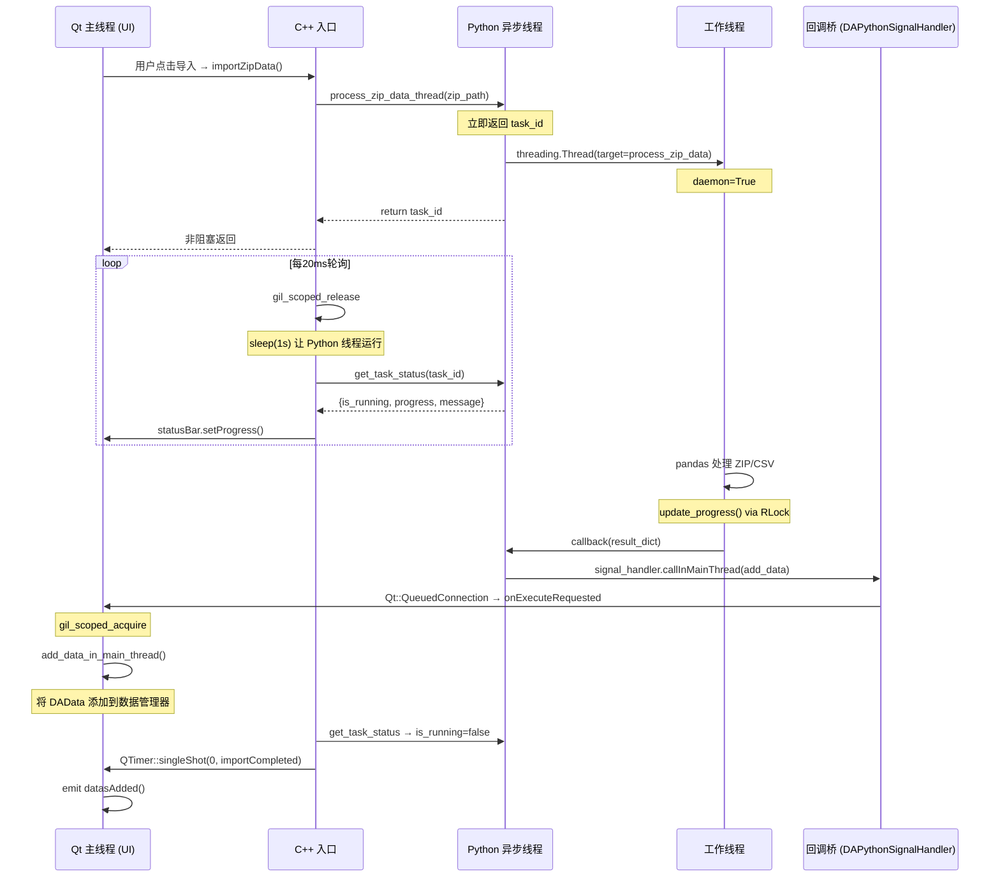
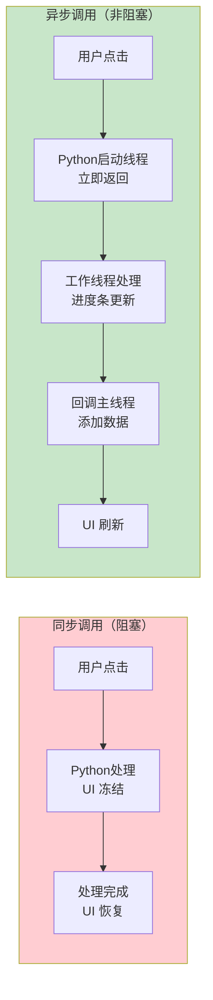

# Python 多线程与异步任务

在 DAWorkBench 中，当 Python 脚本需要执行长时间运算（如读取 ZIP 文件、处理大型 CSV、调用 pandas 做聚合计算）时，直接在 Qt 主线程调用会导致界面冻结。本文详细说明如何通过 **5 层异步模式**在后台线程中运行 Python 代码，在不阻塞 UI 的前提下完成数据导入、进度报告和安全回调。

!!! info "适用范围"
    本文描述的 5 层异步模式是 **插件级实现模式**，当前仅在 `GreeDataWorkBench` 插件中确认使用。框架层提供了 `DAPythonSignalHandler` 和 `thread_status_manager` 等基础工具，具体编排方式由各插件自行决定。

## 导航

本系列文档包含以下章节：

- [总览与环境搭建](./index.md)
- [C++ 调用 Python](./cpp-calling-python.md)
- [Python 绑定开发](./python-binding-development.md)
- [故障排除与最佳实践](./troubleshooting-and-best-practices.md)
- [Python 脚本开发实战](./python-script-development.md)
- [Python 多线程与异步任务](./python-multi-threading.md) ← 当前页

## 背景与问题

### 为什么需要异步执行？

默认情况下，pybind11 嵌入的 Python 解释器运行在 Qt 主线程。当 Python 函数执行耗时操作时，整个 Qt 事件循环被阻塞，表现为：

- 界面无响应（鼠标点击、拖拽、菜单均无效）
- 进度条无法刷新
- 用户无法取消操作
- 操作系统可能弹出"程序未响应"提示

### 三个核心挑战

| 挑战 | 说明 | 涉及的技术点 |
|------|------|-------------|
| **GIL 竞争** | Python 全局解释器锁 (GIL) 确保同一时刻只有一个线程执行 Python 字节码。C++ 主线程和 Python 工作线程之间必须正确管理 GIL | `gil_scoped_release`, `gil_scoped_acquire` |
| **Qt 线程安全** | Qt UI 操作（创建 widget、更新界面、发射信号）只能在主线程执行。后台线程不能直接操作 UI | `Qt::QueuedConnection`, `DAPythonSignalHandler` |
| **进度报告** | 工作线程需要将处理进度反馈给 UI，但无法直接调用主线程的 UI 方法 | 轮询 + 状态管理器 |

## 核心架构概览

### 5 层异步模式

整个异步流程由 5 个层协作完成，从 C++ 入口到工作线程再到回调回主线程，形成一个完整的闭环：

| 层 | 位置 | 文件 | 机制 | 关键点 |
|----|------|------|------|--------|
| 1 | C++ 入口 | `src/GreeDataWorkBench.cpp:266` | 调用 Python，立即返回 task_id | `QTimer` 启动轮询 |
| 2 | Python 线程创建 | `data_analysis.py:16` | `threading.Thread(daemon=True)` | 非 QThread，普通 Python 线程 |
| 3 | 工作线程 | `zip_csv_file_handle.py:924` | pandas 处理 + `ProcessingStatus` | `threading.RLock` 保护状态 |
| 4 | C++ 轮询 | `GreeDataWorkBench.cpp:316` | `gil_scoped_release` + `QTimer(20ms)` | GIL 管理是关键 |
| 5 | 回调桥 | `DAPythonSignalHandler.cpp` + `DAInterfacePythonBinding.cpp` | `Qt::QueuedConnection` + `gil_scoped_acquire` | 跨线程安全回调 |

### 完整时序图



## 第 1 层 — C++ 入口：非阻塞调用

### 职责

C++ 层负责调用 Python 入口函数，立即获得 task_id，然后启动定时器轮询。**绝不阻塞**。

### 源代码

`src/GreeDataWorkBench.cpp` 第 266–314 行：

```cpp title="GreeDataWorkBench.cpp:266-314 - 非阻塞入口"
void GreeDataWorkBench::importZipData()
{
    // ... 保存确认和文件对话框 ...
    QString zipPath = QFileDialog::getOpenFileName(
        m_mainWindow,
        QString(u8"请选择 ZIP 文件"),
        QString(),
        QString(u8"ZIP 文件 (*.zip)")
    );
    if (zipPath.isEmpty()) {
        return;
    }
    try {
        // 1. 获取 Python 函数引用
        auto process_zip_data_thread =
            m_pyDataAnalysisModule->attr("process_zip_data_thread");
        if (process_zip_data_thread.is_none()) {
            qCritical() << QString(u8"处理脚本异常：process_zip_data_thread");
            return;
        }
        // 2. 调用 Python 函数并立即获得 task_id
        auto arg    = DA::PY::toPyObject(zipPath);
        auto taskid = process_zip_data_thread(arg);
        if (taskid.is_none()) {
            return;
        }
        m_importZipTaskID = taskid.cast<std::string>();

        // 3. 显示进度条并启动轮询
        DA::DAStatusBarInterface* statusBar = m_ui->getStatusBar();
        statusBar->showProgressBar();
        statusBar->setProgressText(QString(u8"正在解析压缩包里的机组数据..."));
        checkZipDataImportStatus();  // 首次调用启动 QTimer 链
    } catch (const std::exception& e) {
        // 异常处理：隐藏进度条
        DA::DAStatusBarInterface* statusBar = m_ui->getStatusBar();
        statusBar->hideProgressBar();
        statusBar->setBusy(false);
        qCritical() << e.what();
    }
}
```

### 关键点

- **`attr("process_zip_data_thread")`** 获取 Python 侧的函数句柄，非阻塞
- **立即返回**：Python 函数只在内部启动线程，然后返回 task_id，整个过程在毫秒级完成
- **启动轮询**：调用 `checkZipDataImportStatus()` 开启 QTimer 链
- **异常保护**：任何 Python 异常都被 `try/catch` 捕获，进度条被正确隐藏

## 第 2 层 — Python 线程创建

### 职责

Python 入口函数创建并启动工作线程，然后立即返回 task_id。线程创建本身是一个快速操作，不阻塞。

### 源代码

`src/PyScripts/GreeDataWorkBench/data_analysis.py` 第 16–83 行：

```python title="data_analysis.py:16-83 - Python 线程创建"
import threading
import DAWorkbench.thread_status_manager as tsm
import GreeDataWorkBench.zip_csv_file_handle as zip_csv_file_handle

def process_zip_data_thread(zip_path: str,
                            completion_callback=None) -> str:
    """
    主入口函数：启动后台线程处理ZIP文件
    
    Args:
        zip_path: ZIP文件路径
    
    Returns:
        str: 任务id，空字符串表示启动失败
    """
    try:
        # 创建线程安全的回调函数
        def internal_callback(result_dict):
            try:
                if result_dict is not None:
                    signal_handler = da_app.getCore().getPythonSignalHandler()
                    if signal_handler:
                        def add_data_in_main_thread():
                            try:
                                datamanager = da_app.getCore().getDataManagerInterface()
                                for name, df in result_dict.items():
                                    data = da_data.DAData(df)
                                    data.setName(name)
                                    data.setDescribe(name)
                                    datamanager.addData(data)
                                    logger.debug(f"成功添加数据: {name}")
                            except Exception as e:
                                logger.debug(f"添加数据到Qt界面失败: {str(e)}")
                        
                        signal_handler.callInMainThread(
                            add_data_in_main_thread)
                if completion_callback:
                    completion_callback(success)
            except Exception as e:
                logger.debug(f"内部回调执行失败: {str(e)}")

        # 显示进度条
        status_bar = da_app.getCore().getUiInterface().getStatusBar()
        status_bar.showProgressBar()
        status_bar.setProgressText('正在解析压缩包里的机组数据...')

        # 创建任务状态并获取 task_id
        taskid, status = tsm.create_task_with_status(
            "process zip dat thread")
        
        # 创建并启动后台线程
        thread = threading.Thread(
            target=zip_csv_file_handle.process_zip_data,
            args=(zip_path, internal_callback, status),
            daemon=True
        )
        thread.start()
        logger.debug(f"已启动后台线程处理文件: {zip_path}")
        return taskid
    except Exception as e:
        logger.debug(f"启动处理线程失败: {str(e)}")
        return None
```

### 关键点

- **`threading.Thread(daemon=True)`**：使用 Python 标准库的线程，而非 QThread。`daemon=True` 确保主程序退出时线程自动终止
- **为什么不是 QThread？** 因为 QThread 是 Qt 线程模型的抽象，与 Python GIL 配合不如原生 Python 线程灵活。Python 线程在 GIL 下天然适用于 I/O 密集型任务和简单的 CPU 任务
- **`tsm.create_task_with_status()`**：创建 ProcessingStatus 实例并生成唯一的 UUID task_id
- **立即返回**：`thread.start()` 之后马上 `return taskid`，不等待线程执行

## 第 3 层 — 工作线程执行与进度报告

### 职责

实际的数据处理逻辑运行在 `threading.Thread` 创建的工作线程中。这一层负责：

- 解压 ZIP 文件
- 读取和解析 CSV
- 对齐时间列
- 查找故障事件
- 进行数据预处理
- **实时报告进度**

### 源代码

`src/PyScripts/GreeDataWorkBench/zip_csv_file_handle.py` 第 924–1079 行：

```python title="zip_csv_file_handle.py:924-1079 - 工作线程处理函数"
def process_zip_data(
    zip_path: str,
    callback: Callable[[Optional[Dict[str, pd.DataFrame]]], None],
    status: tsm.ProcessingStatus,
) -> None:
    """后台线程中实际处理ZIP文件的函数"""
    result_dict = OrderedDict()
    time_col = "记录时间"
    try:
        status.start()
        status.update_custom_data("zip_path", zip_path)
        status.update_progress(0, "开始处理ZIP文件")
        
        with zipfile.ZipFile(zip_path, "r") as zip_ref:
            file_list = zip_ref.namelist()
            
            # 阶段1: 扫描ZIP文件 (进度 5%)
            status.update_progress(5, "扫描ZIP文件内容")
            csv_files = [f for f in file_list if f.lower().endswith(".csv")]
            if not csv_files:
                raise ValueError("ZIP文件中没有找到CSV文件")
            
            # ... 提取工程ID ...
            
            # 阶段2: 批量处理CSV文件 (进度 5-50%)
            for i, file_name in enumerate(csv_files, 1):
                overall_progress = (i / total_csv_count) * 45 + 5
                status.update_progress(
                    overall_progress,
                    f"处理文件 {i}/{total_csv_count} : {file_name}"
                )
                read_csv_file(zip_ref, file_name, ...)
            
            # 阶段3: 时间对齐 (进度 60%)
            status.update_progress(60, "正在对齐时间列...")
            result_dict = align_all_time_columns(result_dict, ...)
            
            # 阶段4: 查找故障 (进度 70%)
            status.update_progress(70, "查找故障...")
            df_fault = find_fault_infos(result_dict, ...)
            result_dict[f"{project_id}_fault"] = df_fault
            
            # 阶段5: 数据预处理 (进度 80%)
            status.update_progress(80, "正在计算扩展参数...")
            df_statistic = preprocess_extern_data(indoor_dfs, ...)
            result_dict[f"{project_id}_statistic"] = df_statistic
            
            # 阶段6: 通知完成 (进度 98%)
            status.update_progress(98, "写入数据")
            callback(result_dict)          # 触发主线程回调
            status.finish(True, str_summary)
            
    except Exception as e:
        error_msg = f"处理过程中发生错误: {str(e)}"
        logger.error(error_msg)
        callback(None)                     # 失败也要通知
        status.finish(False, error_summary)
```

### ProcessingStatus 状态管理

`ProcessingStatus` 类（位于 `src/PyScripts/DAWorkbench/thread_status_manager.py` 第 8–174 行）使用 `threading.RLock` 保护所有状态字段，确保更新操作的线程安全：

```python title="thread_status_manager.py:8-31 - ProcessingStatus 核心结构"
class ProcessingStatus:
    """通用的线程任务状态管理器"""
    
    def __init__(self, task_id: str):
        self._task_id = task_id
        self._lock = threading.RLock()     # 可重入锁，支持嵌套调用
        self._is_processing = False
        self._is_paused = False
        self._is_canceled = False
        self._is_success = False
        self._start_time = None
        self._end_time = None
        self._progress = 0.0
        self._current_stage = ""
        self._message = ""
        self._custom_data = {}
```

### 关键点

- **`threading.RLock`**：可重入锁，允许同一个线程在持有锁的情况下再次获取，避免死锁。这在复杂的进度更新逻辑中很重要
- **`update_progress()`**：通过锁保护的原子操作更新进度，确保 C++ 轮询读取时不会读到中间状态
- **`update_custom_data()`**：存储任务特定的元数据（如 ZIP 路径、工程 ID、结果文件列表），C++ 端在任务完成后读取
- **异常安全**：`try/except` 确保无论处理成功还是失败，都会调用 `callback()` 和 `status.finish()`，避免任务永远处于"运行中"状态

## 第 4 层 — C++ 非阻塞轮询与 GIL 管理

### 职责

C++ 主线程通过 `QTimer` 定期检查 Python 工作线程的状态，同时精细管理 GIL，避免主线程和 Python 线程互相阻塞。

### 源代码

`src/GreeDataWorkBench.cpp` 第 316–414 行：

```cpp title="GreeDataWorkBench.cpp:316-414 - GIL感知轮询"
void GreeDataWorkBench::checkZipDataImportStatus()
{
    try {
        {
            DA::DAWaitCursorScoped cursorScoped;
            // 释放GIL，让Python工作线程有机会运行
            pybind11::gil_scoped_release release;

            // 短暂休眠，让Python线程有机会获得GIL
            QThread::sleep(1);
        }
        // 此时GIL已重新获取，可以安全调用Python
        auto get_task_status =
            m_threadStatusMgrModule->attr("get_task_status");
        if (get_task_status.is_none()) {
            qCritical() << QString(u8"处理脚本异常：get_task_status");
            return;
        }
        pybind11::dict status =
            get_task_status(m_importZipTaskID);

        bool is_running = status["is_running"].cast<bool>();

        if (is_running) {
            // 更新进度条
            double progress = status["progress"].cast<double>();
            std::string message = status["message"].cast<std::string>();
            double elapsed_seconds = status["elapsed_seconds"].cast<double>();

            statusBar->setProgress(progress);
            statusBar->setProgressText(progress_text);
            
            // 继续轮询：20ms后再次检查
            QTimer::singleShot(20, this,
                &GreeDataWorkBench::checkZipDataImportStatus);
        } else {
            // 任务完成，处理结果...
            bool is_success = status["is_success"].cast<bool>();
            if (is_success) {
                statusBar->showMessage(QString(u8"导入数据完成!"));
                // 最终处理在下一个事件循环执行
                QTimer::singleShot(0, this,
                    &GreeDataWorkBench::importCompleted);
            } else {
                statusBar->showMessage(errMsg);
            }
            statusBar->hideProgressBar();
            statusBar->setBusy(false);
            QApplication::processEvents();
        }
    } catch (const std::exception& e) {
        qCritical().noquote()
            << QString(u8"数据导入失败:") << e.what();
        statusBar->hideProgressBar();
        statusBar->setBusy(false);
        statusBar->showMessage(QString(u8"导入数据失败!"));
    }
}
```

### QTimer 调度链

轮询通过 QTimer 的"链式调度"实现，而非循环：

```
checkZipDataImportStatus()
  ├── is_running=true  → QTimer::singleShot(20ms, checkZipDataImportStatus)
  ├── is_running=false → QTimer::singleShot(0, importCompleted)
  └── 异常             → 隐藏进度条，停止轮询
```

这种方式的优点是：每次轮询完成后，Qt 事件循环有机会处理其他事件（如用户点击、重绘），界面保持响应。

### GIL 管理详解

轮询中的 GIL 操作是整篇文章最关键的技术点，遵循"释放 → 让出 → 重新获取 → 调用"的模式：

```cpp
// 步骤1: 释放 GIL
{
    pybind11::gil_scoped_release release;
    QThread::sleep(1);  // 让出 1 秒，Python 线程可运行
}
// 此时 release 析构，GIL 被重新获取

// 步骤2: 在持有 GIL 的情况下调用 Python
pybind11::dict status = get_task_status(m_importZipTaskID);
```

!!! warning "为什么需要 sleep(1)？"
    `QThread::sleep(1)` 让出 CPU 时间片，确保 Python 工作线程有足够的时间获得 GIL 并更新进度。没有 `sleep()`，C++ 轮询可能频繁占用 GIL，导致工作线程无法执行。

!!! info "与基本 GIL 管理的区别"
    关于 GIL 管理的基本概念和通用模式，参见 [C++ 调用 Python - GIL 管理详解](./cpp-calling-python.md#gil安全全局解释器锁管理)。本文只介绍多线程场景下的特殊用法。

## 第 5 层 — 回调桥：安全返回主线程

### 职责

工作线程处理完成后，需要将结果插入 Qt 的数据管理器（`DADataManagerInterface`），这必须在主线程中执行。回调桥通过 `DAPythonSignalHandler` 的 `Qt::QueuedConnection` 机制实现跨线程函数调用。

### 完整调用链

```
Python 工作线程
  → callback(result_dict)
    → signal_handler.callInMainThread(add_data_in_main_thread)
      → Q_EMIT executeRequested(funcId)                    [Qt::QueuedConnection]
        → onExecuteRequested(funcId)                        [运行在主线程]
          → gil_scoped_acquire                              [获取GIL]
            → pyFunc()                                       [执行Python回调]
              → datamanager.addData(data)                    [安全操作Qt对象]
```

### 3 个核心组件

#### (1) Python 侧调用

`data_analysis.py` 第 29–61 行：

```python title="data_analysis.py - Python 侧回调"
def internal_callback(result_dict):
    try:
        if result_dict is not None:
            signal_handler = da_app.getCore().getPythonSignalHandler()
            if signal_handler:
                def add_data_in_main_thread():
                    datamanager = da_app.getCore().getDataManagerInterface()
                    for name, df in result_dict.items():
                        data = da_data.DAData(df)
                        data.setName(name)
                        data.setDescribe(name)
                        datamanager.addData(data)
                
                # 关键调用：投递到主线程
                signal_handler.callInMainThread(add_data_in_main_thread)
    except Exception as e:
        logger.debug(f"内部回调执行失败: {str(e)}")
```

#### (2) C++ 绑定层

`data-workbench/src/DAInterface/DAInterfacePythonBinding.cpp` 第 15–42 行：

```cpp title="DAInterfacePythonBinding.cpp - callInMainThread 绑定"
PYBIND11_EMBEDDED_MODULE(da_interface, m)
{
    pybind11::class_<DA::DAPythonSignalHandler>(m, "DAPythonSignalHandler")
        .def(pybind11::init<>())
        .def(
            "callInMainThread",
            [](DA::DAPythonSignalHandler& self, pybind11::function pyFunc) {
                self.callInMainThread([pyFunc]() {
                    try {
                        pybind11::gil_scoped_acquire acquire;
                        pyFunc();
                    } catch (const pybind11::error_already_set& e) {
                        qCritical() << "Python error:" << e.what();
                    }
                });
            },
            pybind11::arg("func"),
            "Schedule a Python function to be executed in the Qt main thread"
        );
}
```

!!! tip "GIL 获取的时机"
    绑定层在 **主线程的槽函数执行时** 才获取 GIL。这意味着：
    - `callInMainThread()` 本身在工作线程调用，不涉及 GIL
    - GIL 的获取发生在主线程槽函数 `onExecuteRequested` 中
    - 这样可以确保主线程持有 GIL 时，Python 工作线程不会干扰

#### (3) 信号处理器

`data-workbench/src/DAPyBindQt/DAPythonSignalHandler.cpp` 第 24–107 行：

```cpp title="DAPythonSignalHandler.cpp - 信号槽桥接"
void DAPythonSignalHandler::callInMainThread(std::function<void()> func)
{
    if (!func) return;
    if (m_destroying) return;

    // 已在主线程？直接执行
    QCoreApplication* app = QCoreApplication::instance();
    if (QThread::currentThread() == app->thread()) {
        func();
        return;
    }

    // 包装函数并分配唯一ID
    int funcId;
    {
        std::lock_guard<std::mutex> lock(m_mutex);
        funcId = ++m_nextFuncId;
        m_functionMap[funcId] = std::make_shared<FunctionWrapper>(std::move(func));
    }

    // 发射 QueuedConnection 信号
    Q_EMIT executeRequested(funcId);
}

void DAPythonSignalHandler::onExecuteRequested(int funcWrapperId)
{
    if (m_destroying) return;
    
    FunctionWrapperPtr wrapper;
    {
        std::lock_guard<std::mutex> lock(m_mutex);
        auto it = m_functionMap.find(funcWrapperId);
        if (it == m_functionMap.end()) return;
        wrapper = it.value();
        m_functionMap.erase(it);
    }
    
    wrapper->execute();  // 在主线程执行
}
```

### 关键设计决策

- **`Qt::QueuedConnection`**：信号槽连接时指定 `Qt::QueuedConnection`，确保 `executeRequested` 信号在接收者所在线程（主线程）的队列中执行
- **`std::mutex` 保护映射表**：`m_functionMap` 可能被工作线程（写入）和主线程（读取）同时访问，用互斥锁保护
- **`std::shared_ptr<FunctionWrapper>`**：函数包装器使用智能指针管理，避免函数对象在跨线程传递过程中被提前销毁
- **GIL 获取在 Lambda 内**：`gil_scoped_acquire` 只在回调函数执行的瞬间获取 GIL，执行完毕立即释放，最小化对 Python 工作线程的影响
- **`pybind11::function` 引用计数**：Lambda 捕获 `pyFunc` 时自动增加引用计数，确保在跨线程传递过程中 Python 函数对象不被释放（参见 [跨线程操作模式](./python-script-development.md#跨线程操作模式)）

## 实战案例：GreeDataWorkBench ZIP 导入全流程

### 流程总览

将前面的 5 层模式串联成一个完整的实战案例。以用户点击"导入 ZIP 数据"按钮开始，到数据表格在界面中显示结束：

### 步骤详解

| 步骤 | 层 | 操作 | 耗时 |
|------|----|------|------|
| 1 | UI | 用户点击导入按钮 | 瞬间 |
| 2 | UI | `importZipData()` 弹出文件选择对话框 | 用户操作 |
| 3 | C++ | `process_zip_data_thread(zipPath)` 调用 Python | ~10ms |
| 4 | Python | `create_task_with_status()` 创建 ProcessingStatus | ~1ms |
| 5 | Python | `threading.Thread()` 启动工作线程 | ~1ms |
| 6 | Python | 返回 task_id 给 C++ | ~1ms |
| 7 | C++ | `QTimer::singleShot` 启动轮询 | ~1ms |
| 8 | 工作线程 | 解压 ZIP，读取 CSV 文件 | 5–60s |
| 9 | 工作线程 | 对齐时间列 | 2–30s |
| 10 | 工作线程 | 查找故障事件 | 1–5s |
| 11 | 工作线程 | 数据预处理（计算扩展参数） | 1–10s |
| 12 | 工作线程 | `callback(result_dict)` → `callInMainThread(add_data)` | ~10ms |
| 13 | 主线程 | `onExecuteRequested` → `gil_scoped_acquire` → `datamanager.addData()` | ~50ms |
| 14 | C++ | 轮询检测到 `is_running=false` | 20ms |
| 15 | C++ | `QTimer::singleShot(0, importCompleted)` | 下一个事件循环 |
| 16 | C++ | `analysisDatas()` + `emit datasAdded()` | ~100ms |
| 17 | UI | 数据表格和图表显示 | 瞬间 |

### 同步与异步对比



### 核心代码路径

以下是从 C++ 入口到工作线程再到回调的完整代码路径：

```
C++ 侧 (GreeDataWorkBench.cpp)            Python 侧 (data_analysis.py)
┌──────────────────────────────┐           ┌────────────────────────────┐
│ importZipData()              │           │ process_zip_data_thread() │
│  ├─ attr("process_zip...")───┼──────────→│  ├─ create_task_with_status│
│  ├─ taskid = process...(arg) │←──────────┤  ├─ Thread(target=...)     │
│  ├─ store m_importZipTaskID  │   返回    │  └─ return taskid         │
│  └─ checkZipDataImportStatus│   task_id │                            │
│                              │           │ ┌────────────────────────┐│
│ checkZipDataImportStatus()  │           │ │ process_zip_data()    ││
│  ├─ gil_scoped_release      │           │ │  ├─ status.update...   ││
│  ├─ QThread::sleep(1)       │  轮询     │ │  ├─ pandas处理         ││
│  ├─ get_task_status(id)─────┼──────────→│ │  ├─ callback(result)   ││
│  ├─ statusBar.setProgress() │←──────────┤ │  └─ status.finish()    ││
│  └─ QTimer::singleShot(20)  │  状态dict │ └────────────────────────┘│
│                              │           │                            │
│ importCompleted()           │           │ internal_callback(result) │
│  ├─ analysisDatas()         │           │  ├─ callInMainThread()───→│
│  └─ emit datasAdded()       │           │  │  [Qt::QueuedConnection] │
└──────────────────────────────┘           │  │                        │
                                           │  ▼                        │
                                           │ onExecuteRequested        │
                                           │  ├─ gil_scoped_acquire    │
                                           │  └─ add_data_in_main_...  │
                                           │     ├─ datamanager.add()  │
                                           │     └─ DAData加入管理器   │
                                           └────────────────────────────┘
```

!!! tip "时序说明"
    - 步骤 8–11（工作线程处理）是主要的耗时部分，UI 在此期间保持响应
    - 步骤 12–13（回调插入数据）可能在轮询检测到完成之前已经执行
    - 步骤 16 使用 `QTimer::singleShot(0, ...)` 延迟执行，确保所有回调数据已插入

## 工具类使用指南

### DAWorkbench.thread_status_manager

模块路径：`data-workbench/src/PyScripts/DAWorkbench/thread_status_manager.py`

提供 `ProcessingStatus` 和 `StatusManager` 两个核心类，以及一组便捷函数接口。

#### ProcessingStatus 核心方法

| 方法 | 参数 | 说明 |
|------|------|------|
| `start(task_name)` | str | 初始化任务状态，设置开始时间 |
| `update_progress(progress, message)` | float(0–100), str | 更新进度和消息（线程安全） |
| `update_custom_data(key, value)` | str, Any | 存储自定义数据 |
| `get_status()` | 无 | 返回完整状态字典 |
| `finish(success, message)` | bool, str | 标记任务完成 |
| `cancel(message)` | str | 标记任务取消 |
| `pause()` / `resume()` | 无 | 暂停/恢复任务 |
| `is_active()` | 无 | 任务是否活跃 |
| `is_finished()` | 无 | 任务是否已完成 |

#### 便捷函数

```python title="thread_status_manager 便捷函数示例"
import DAWorkbench.thread_status_manager as tsm

# 创建任务（获取 task_id 和 status 对象）
task_id, status = tsm.create_task_with_status("my_task")

# 在工作线程中更新
status.update_progress(50, "处理中...")
status.update_custom_data("result_file", "/path/to/result.csv")
status.finish(True, "处理完成")

# 在轮询中查询状态
info = tsm.get_task_status(task_id)
print(info["is_running"], info["progress"], info["message"])

# 取消任务
tsm.cancel_task(task_id)

# 清理
tsm.cleanup_old_tasks(older_than_seconds=3600)
```

#### 状态字典结构

```python
{
    "task_id": "uuid-string",
    "task_name": "my_task",
    "is_running": True,
    "is_paused": False,
    "is_canceled": False,
    "is_success": False,
    "current_stage": "处理文件 5/10",
    "progress": 50.0,
    "elapsed_seconds": 12.34,
    "message": "处理中...",
    "custom_data": {
        "zip_path": "/data/sample.zip",
        "project_id": 12345,
        "total_csv_files": 10
    }
}
```

### DAWorkbench.app_wrapper

模块路径：`data-workbench/src/PyScripts/DAWorkbench/app_wrapper.py`

提供装饰器和函数两种形式，简化跨线程调用的代码编写。

```python title="app_wrapper.py - 完整源码"
# -*- coding: utf-8 -*-
import da_app, da_interface

def run_in_main_thread(func):
    """装饰器：确保被装饰的函数在Qt主线程中执行"""
    def wrapper(*args, **kwargs):
        signal_handler = da_app.getCore().getPythonSignalHandler()
        if signal_handler:
            signal_handler.callInMainThread(
                lambda: func(*args, **kwargs))
        else:
            func(*args, **kwargs)   # 降级处理
    return wrapper


def call_in_main_thread(func, *args, **kwargs):
    """立即调度函数到主线程执行"""
    signal_handler = da_app.getCore().getPythonSignalHandler()
    if signal_handler:
        signal_handler.callInMainThread(
            lambda: func(*args, **kwargs))
    else:
        func(*args, **kwargs)
```

#### 使用示例

```python title="装饰器模式"
from DAWorkbench.app_wrapper import run_in_main_thread

@run_in_main_thread
def update_ui_progress(value):
    # 安全地在主线程更新UI
    status_bar = da_app.getCore().getUiInterface().getStatusBar()
    status_bar.setProgress(value)
```

```python title="函数调用模式"
from DAWorkbench.app_wrapper import call_in_main_thread

def background_worker():
    # 在后台线程中
    result = do_heavy_computation()
    
    # 安全地返回主线程更新UI
    call_in_main_thread(
        lambda: update_ui(result)
    )
```

!!! info "相关链接"
    - [callInMainThread 详细用法](./python-script-development.md#跨线程操作模式)
    - [GIL 管理详解](./cpp-calling-python.md#gil安全全局解释器锁管理)

## 开发检查清单

实现类似异步模式的插件开发者可参考以下检查清单：

- [ ] Python 线程使用 `daemon=True`，确保程序退出时自动终止
- [ ] 使用 `StatusManager` 生成 task_id，而非手动管理
- [ ] C++ 轮询使用 `gil_scoped_release` + `QTimer`，而非忙等循环
- [ ] 回调通过 `callInMainThread` 安全返回主线程
- [ ] 工作线程异常必须调用 `status.finish(False, ...)` 和 `callback(None)`
- [ ] 并发调用需保护 task_id（互斥锁或队列），当前模式的 task_id 存储为类成员变量，适用于串行导入场景
- [ ] 轮询中合理使用 `QThread::sleep()` 让出 GIL
- [ ] 主线程槽函数中获取 GIL（`gil_scoped_acquire`），而非在调用 `callInMainThread` 时
- [ ] 使用 `QTimer::singleShot(0, ...)` 确保所有回调完成后再执行最终处理
- [ ] 异常路径正确隐藏进度条、设置状态栏

## 注意事项

!!! warning "插件级实现模式"
    本文描述的 5 层异步模式是 **插件级实现模式**，非框架级通用模式。这意味着：
    - 该模式目前仅在 `GreeDataWorkBench` 插件中确认使用
    - DAWorkBench 框架提供了 `DAPythonSignalHandler` 和 `thread_status_manager` 等基础设施
    - 各插件可以根据自身需求调整其中任何一层
    - 如需自定义异步模式，请参考本文说明进行调整

!!! tip "何时使用此模式"
    以下场景适合使用本文的异步模式：
    - Python 处理时间超过 100ms（否则线程启动开销反而更大）
    - 需要向用户展示处理进度
    - 处理过程中需要用户界面保持交互能力
    - 处理完成后需要将结果插入 Qt 数据管理器

!!! warning "GIL 是单线程瓶颈"
    即使在后台线程运行，Python 的 GIL 仍然是一个全局瓶颈。CPU 密集型的 pandas 操作在单线程下执行，Python 线程主要受益于：
    - **I/O 等待**：读取 ZIP 文件时释放 GIL，允许主线程运行
    - **进度更新**：短暂获取 GIL 更新状态，然后释放
    - **UI 不冻结**：主线程不被 Python 阻塞，Qt 事件循环正常运转

    对于真正需要并行计算的场景，考虑使用 `multiprocessing` 或 numpy 的向量化操作。

!!! info "参考文档"
    - [C++ 调用 Python 之 GIL 管理](./cpp-calling-python.md#gil安全全局解释器锁管理)
    - [跨线程操作模式](./python-script-development.md#跨线程操作模式)
    - [Python 脚本开发实战](./python-script-development.md)
