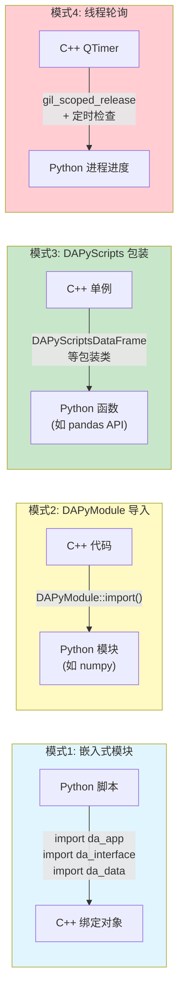
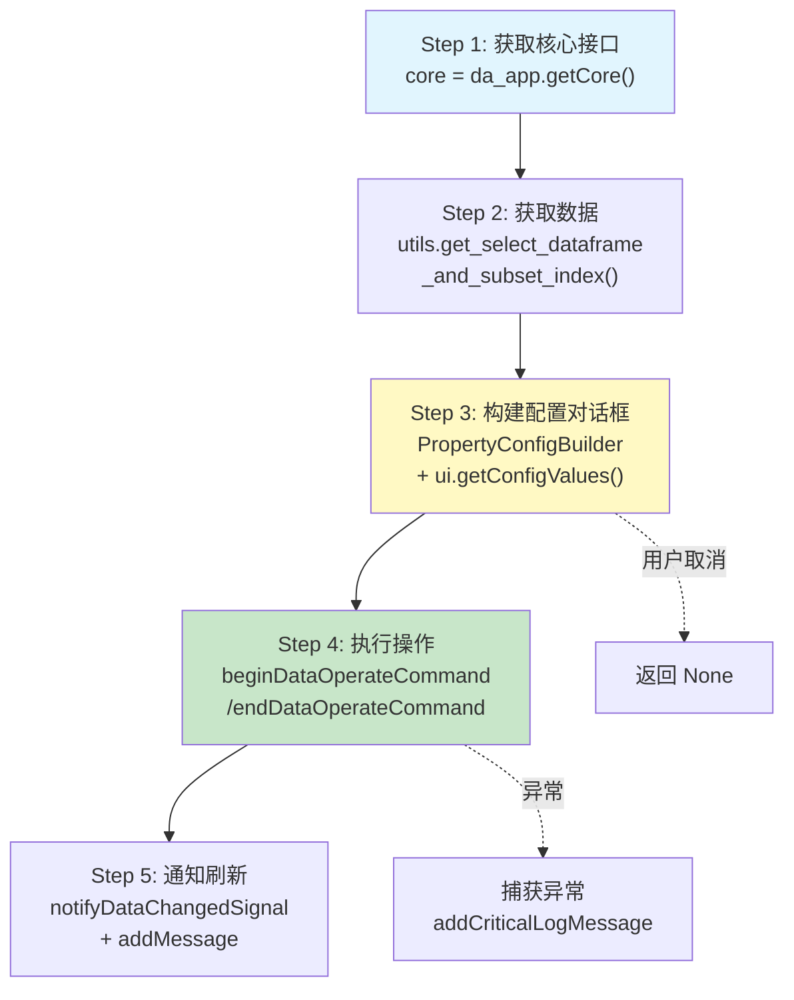

# Python 脚本开发实战

## 导航

本系列文档包含以下章节：

- [总览与环境搭建](./index.md)
- [C++ 调用 Python](./cpp-calling-python.md)
- [Python 绑定开发](./python-binding-development.md)
- [故障排除与最佳实践](./troubleshooting-and-best-practices.md)
- [Python 脚本开发实战](./python-script-development.md) ← 当前页

本节详细说明如何在 DAWorkBench 中编写 Python 脚本，通过已绑定的 C++ 接口实现数据分析、界面交互和跨线程操作。

## 四种交互模式总览

DAWorkBench 中 C++ 与 Python 的交互存在四种模式，每种模式有不同的适用场景：



四种模式的详细说明：

| 模式 | 方向 | 机制 | 典型示例 | 适用场景 |
|------|------|------|----------|----------|
| 嵌入式模块 | Python → C++ | `PYBIND11_EMBEDDED_MODULE` | `da_app`, `da_interface`, `da_data` | Python 脚本主动操作 C++ 对象（详见 [接口绑定架构](./python-binding-development.md#接口绑定架构)） |
| DAPyModule 导入 | C++ → Python | `DAPyModule::import("模块名")` | `DAPyModuleNumpy` | C++ 需调用 Python 库函数 |
| DAPyScripts 包装 | C++ → Python | C++ 单例包装 Python 函数 | `DAPyScriptsDataFrame`, `DAPyScriptsIO` | C++ 高频调用 Python 固定 API |
| 线程轮询 | C++ ↔ Python | `gil_scoped_release` + QTimer | 长时间运算进度报告 | Python 后台任务进度反馈 |

## 标准脚本编写流程

DAWorkBench 中 Python 脚本的标准开发流程遵循五步模式，以 `dataframe_cleaner.py` 为参考：



### Step 1：获取核心接口

所有脚本操作的起点是获取 `DACoreInterface` 单例，再通过它获取所需的子接口：

```python title="Step 1: 获取核心接口"
import da_app, da_interface, da_data

# 获取核心接口单例
core = da_app.getCore()

# 通过核心接口获取子接口
ui = core.getUiInterface()                # 界面操作接口
data_mgr = core.getDataManagerInterface()  # 数据管理接口
handler = core.getPythonSignalHandler()    # 跨线程信号处理器
```

### Step 2：获取数据

脚本通常需要获取用户当前选中的数据对象。标准模式是获取选中数据列表并提取第一个：

```python title="Step 2: 获取选中的数据"
# 获取用户选中的数据列表
select_datas = data_mgr.getSelectDatas()
if not select_datas:
    ui.addWarningLogMessage("请先选择要处理的数据")
    return None

# 取第一个选中的数据
dadata = select_datas[0]

# 检查数据类型
if not dadata.isDataFrame():
    ui.addWarningLogMessage("请选择 DataFrame 类型的数据")
    return None

# 获取 pandas DataFrame 对象
df = dadata.toDataFrame()
```

!!! tip "数据获取辅助函数"
    项目提供了 `DAWorkbench.utils` 模块中的辅助函数，可一步完成"获取选中 DataFrame + 子集索引"：
    
    ```python
    from DAWorkbench import utils
    df, subset_index = utils.get_select_dataframe_and_subset_index()
    ```
    
    此函数封装了上述获取数据 + 类型检查 + 提取子集索引的完整流程。

### Step 3：构建参数设置对话框

使用 `PropertyConfigBuilder` 构建参数配置界面，然后通过 `ui.getConfigValues()` 在 C++ 端弹出对话框：

```python title="Step 3: 构建配置对话框（源自 dataframe_cleaner.py）"
import DAWorkbench.property_config_builder as cfgBuilder

builder = cfgBuilder.PropertyConfigBuilder("删除缺失值设置")

# 添加枚举选项
builder.add_enum(
    name="how",
    display_name="删除条件",
    default_value="any",
    enum_items=["any", "all"],
    enum_descriptions=[
        "行中任意值为空时删除",
        "行中所有值为空时删除"
    ]
)

# 添加布尔选项
builder.add_bool(
    name="reindex",
    display_name="重置行号",
    default_value=True
)

# 显示对话框并获取用户输入
config = ui.getConfigValues(builder.to_json(), "dataframecleaner.dropna")
if not config:
    return None  # 用户取消了对话框
```

!!! info "PropertyConfigBuilder 详细文档"
    `PropertyConfigBuilder` 支持的属性类型包括：`string`, `int`, `double`, `bool`, `enum`, `color`, `font`, `file`, `folder`, `stringlist`，还支持 `begin_group()`/`end_group()` 分组以及 `from_function_signature()` 自动生成配置。
    
    完整源码参见：`src/PyScripts/DAWorkbench/property_config_builder.py`

### Step 4：执行操作并封装撤销/重做

数据修改操作应使用 `beginDataOperateCommand`/`endDataOperateCommand` 包装，以支持撤销/重做：

```python title="Step 4: 执行操作（撤销/重做包装）"
command = ui.getCommandInterface()

# 开始数据操作命令（记录修改前的状态）
command.beginDataOperateCommand(dadata, "删除缺失值", True, True)

# 执行 pandas 操作
how = config.get("how", "any")
reindex = config.get("reindex", True)
df = dadata.toDataFrame()
old_len = len(df)

df = df.dropna(how=how)
if reindex:
    df = df.reset_index(drop=True)

# 更新数据对象
dadata.setPyObject(df)

# 结束数据操作命令（记录修改后的状态）
command.endDataOperateCommand(dadata)
```

!!! warning "beginDataOperateCommand 参数说明"
    - `data`：操作的 `DAData` 对象
    - `text`：撤销/重做列表中显示的操作描述（`std::string`）
    - `isObjectPersist`：是否保留对象引用（默认 `True`）
    - `isSkipFirstRedo`：是否跳过首次重做（默认 `True`，因为操作已执行）
    
    **务必**在操作完成后调用 `endDataOperateCommand`，否则撤销栈会处于不一致状态。

### Step 5：通知界面刷新与日志

操作完成后，需要通知 C++ 界面刷新数据显示，并记录操作日志：

```python title="Step 5: 通知刷新与日志"
# 通知数据变化（触发 C++ 界面刷新）
data_mgr.notifyDataChangedSignal(dadata, da_data.DataChangeType.Value)

# 记录操作日志
removed = old_len - len(df)
ui.addInfoLogMessage(f"已删除 {removed} 行包含缺失值的数据")

# 标记项目为已修改
core.setProjectDirty(True)
```

!!! tip "notifyDataChangedSignal 的枚举参数"
    `notifyDataChangedSignal` 的第二个参数为 `DataChangeType` 枚举，决定界面刷新的范围：
    
    | 枚举值 | 说明 | 刷新范围 |
    |--------|------|----------|
    | `da_data.DataChangeType.Name` | 数据名称变更 | 刷新数据列表标题 |
    | `da_data.DataChangeType.Describe` | 数据描述变更 | 刷新数据描述信息 |
    | `da_data.DataChangeType.Value` | 数据值变更 | 刷新数据表格和图表 |
    | `da_data.DataChangeType.ColumnName` | 列名变更 | 刷新列标题 |

## getConfigValues JSON 对话框模式

`getConfigValues` 是 Python 脚本与 C++ 界面交互的核心桥梁。它的工作原理是：

1. Python 端通过 `PropertyConfigBuilder` 生成 JSON 配置描述
2. 将 JSON 字符串传给 C++ 的 `getConfigValues()` 方法
3. C++ 端解析 JSON，弹出 `DACommonPropertySettingDialog` 对话框
4. 用户在对话框中设置参数后点击确认
5. C++ 将用户设置转为 `QJsonObject` 并通过 `DAPyJsonCast` 转为 Python `dict` 返回

```python title="getConfigValues 完整使用示例"
import da_app
import DAWorkbench.property_config_builder as cfgBuilder

core = da_app.getCore()
ui = core.getUiInterface()

# 1. 构建配置
builder = cfgBuilder.PropertyConfigBuilder("数据处理参数")

builder.add_int(name="threshold", display_name="阈值",
                default_value=100, min_value=0, max_value=1000)

builder.add_double(name="ratio", display_name="比例",
                   default_value=0.5, min_value=0.0, max_value=1.0, step=0.01)

builder.add_enum(name="method", display_name="方法",
                 default_value="linear",
                 enum_items=["linear", "polynomial", "spline"],
                 enum_descriptions=["线性插值", "多项式插值", "样条插值"])

builder.add_bool(name="preview", display_name="预览结果", default_value=False)

# 2. 生成 JSON 并弹出对话框
json_config = builder.to_json()
config = ui.getConfigValues(json_config, "my_module.my_function")

# 3. 用户取消则返回空 dict
if not config:
    print("用户取消了操作")
    return None

# 4. 使用返回的参数
threshold = config.get("threshold", 100)     # int
ratio = config.get("ratio", 0.5)             # float
method = config.get("method", "linear")       # str
preview = config.get("preview", False)        # bool

print(f"阈值: {threshold}, 比例: {ratio}, 方法: {method}")
```

!!! warning "getConfigValues 的 cacheKey 参数"
    `cacheKey` 参数用于记住用户上次设置的参数，下次打开对话框时自动恢复。建议使用 `"模块名.函数名"` 格式作为 cacheKey，如 `"dataframecleaner.dropna"`。
    
    如果 cacheKey 为空字符串，对话框每次都使用默认值。

## 撤销/重做操作模式

`DACommandInterface` 提供的撤销/重做机制是数据操作的标准包装方式：

```python title="撤销/重做标准使用模式"
import da_app, da_data

core = da_app.getCore()
ui = core.getUiInterface()
command = ui.getCommandInterface()
data_mgr = core.getDataManagerInterface()

# 获取数据
select_datas = data_mgr.getSelectDatas()
dadata = select_datas[0]

# ① 开始命令 — 记录当前状态作为"撤销点"
command.beginDataOperateCommand(dadata, "数据标准化操作", True, True)

try:
    # ② 执行数据修改
    df = dadata.toDataFrame()
    df = (df - df.mean()) / df.std()  # Z-score 标准化
    dadata.setPyObject(df)
    
    # ③ 结束命令 — 记录新状态作为"重做点"
    command.endDataOperateCommand(dadata)
    
    # ④ 通知界面刷新
    data_mgr.notifyDataChangedSignal(dadata, da_data.DataChangeType.Value)
    ui.addInfoLogMessage("数据标准化完成")
    
except Exception as e:
    # ⑤ 异常时也需要结束命令（避免撤销栈不一致）
    command.endDataOperateCommand(dadata)
    ui.addCriticalLogMessage(f"操作失败: {str(e)}")
```

!!! info "撤销/重做的工作原理"
    `beginDataOperateCommand` 在调用时会序列化当前数据状态作为撤销点，`endDataOperateCommand` 会序列化修改后的状态作为重做点。用户执行撤销（Ctrl+Z）时恢复到 begin 时的状态，执行重做（Ctrl+Y）时恢复到 end 时的状态。

## 跨线程操作模式

当 Python 脚本在后台线程运行时，需要通过 [DAPythonSignalHandler](./python-binding-development.md#dapythonsignalhandler-类) 的 `callInMainThread` 安全地操作 UI：

```python title="DAPythonSignalHandler.callInMainThread 使用示例"
import da_app

core = da_app.getCore()
handler = core.getPythonSignalHandler()
ui = core.getUiInterface()

def background_task():
    """在后台线程中执行耗时计算"""
    import pandas as pd
    import numpy as np
    
    # 耗时计算（不需要 UI）
    df = pd.DataFrame(np.random.randn(1000000, 10))
    result = df.describe()
    
    # 需要更新 UI 时，通过 callInMainThread 投递到主线程
    def update_ui():
        ui.addInfoLogMessage("后台计算完成")
        # 在主线程中安全地操作 UI
    
    handler.callInMainThread(update_ui)
    
    return result

# 在后台线程中调用
background_task()
```

!!! warning "callInMainThread 的 GIL 管理"
    `callInMainThread` 在 C++ 绑定中已正确处理了 GIL 管理：
    
    ```cpp title="DAInterfacePythonBinding.cpp - callInMainThread 绑定实现"
    .def("callInMainThread",
        [](DA::DAPythonSignalHandler& self, pybind11::function pyFunc) {
            self.callInMainThread([pyFunc]() {
                try {
                    pybind11::gil_scoped_acquire acquire;  // 在主线程执行时获取 GIL
                    pyFunc();
                } catch (const pybind11::error_already_set& e) {
                    qCritical() << "Python error in main thread callback:" << e.what();
                }
            });
        })
    ```
    
    绑定层已在回调执行前自动获取 GIL，Python 脚本无需额外处理 GIL。但需注意回调函数 `pyFunc` 的引用计数已被绑定层正确管理（通过 Lambda 捕获）。

## Thread Status Manager 使用指南

对于长时间运行的 Python 任务，`DAWorkbench` 提供了进度报告机制：

```python title="进度报告简要示例"
import da_app

core = da_app.getCore()
ui = core.getUiInterface()
status_bar = ui.getStatusBar()

# 显示进度条
status_bar.showProgressBar()
status_bar.setProgressText("正在处理数据...")

# 在循环中更新进度
for i, item in enumerate(data_list):
    # 处理每个数据项
    process_item(item)
    
    # 更新进度
    progress = int((i + 1) / len(data_list) * 100)
    status_bar.setProgress(progress)
    ui.processEvents()  # 让 UI 有机会刷新

# 完成后隐藏进度条
status_bar.hideProgressBar()
```

!!! info "Thread Status Manager"
    更复杂的后台任务进度报告可通过 `DAWorkbench.thread_status_manager` 模块实现，支持线程状态查询、进度回调等功能。
    
    完整源码参见：`src/PyScripts/DAWorkbench/` 目录下的线程状态管理相关文件。

## 实战建议

!!! tip "Python 脚本开发最佳实践"

    1. **先用 Mock 测试逻辑**
    
        在没有 C++ 界面时，使用 Mock 对象验证脚本逻辑：
        
        ```python title="Mock 测试示例"
        # test_dataframe_cleaner.py
        from unittest.mock import MagicMock
        
        # Mock C++ 绑定对象
        mock_core = MagicMock()
        mock_ui = MagicMock()
        mock_data_mgr = MagicMock()
        
        mock_core.getUiInterface.return_value = mock_ui
        mock_core.getDataManagerInterface.return_value = mock_data_mgr
        
        # Mock 数据对象
        mock_data = MagicMock()
        mock_data.isDataFrame.return_value = True
        import pandas as pd
        test_df = pd.DataFrame({"A": [1, None, 3], "B": [4, 5, None]})
        mock_data.toDataFrame.return_value = test_df
        
        mock_data_mgr.getSelectDatas.return_value = [mock_data]
        
        # 测试逻辑
        # ... 使用 mock 对象执行脚本逻辑 ...
        
        # 验证调用
        mock_data.setPyObject.assert_called_once()
        mock_ui.addInfoLogMessage.assert_called_once()
        ```
    
    2. **使用 assert 在 Mock 中验证关键行为**
    
        ```python
        # 验证数据确实被更新
        assert mock_data.setPyObject.called
        
        # 验证日志消息包含关键信息
        call_args = mock_ui.addInfoLogMessage.call_args
        assert "删除" in call_args[0][0]
        ```
    
    3. **始终检查用户取消**
    
        ```python
        config = ui.getConfigValues(builder.to_json(), cache_key)
        if not config:
            return None  # 用户取消是正常流程，不是异常
        ```
    
    4. **异常处理要完整**
    
        ```python
        try:
            # 数据操作
            command.beginDataOperateCommand(dadata, "操作描述", True, True)
            # ... 处理逻辑 ...
            command.endDataOperateCommand(dadata)
        except Exception as e:
            command.endDataOperateCommand(dadata)  # 异常时也要结束命令
            ui.addCriticalLogMessage(f"操作失败: {str(e)}")
            return None
        ```
    
    5. **跨线程操作务必使用 callInMainThread**
    
        ```python
        # 后台线程中操作 UI 的唯一正确方式
        handler.callInMainThread(lambda: ui.addInfoLogMessage("消息"))
        
        # 绝对不要在后台线程直接操作 UI！
        # ui.addInfoLogMessage("消息")  ← 崩溃风险
        ```
