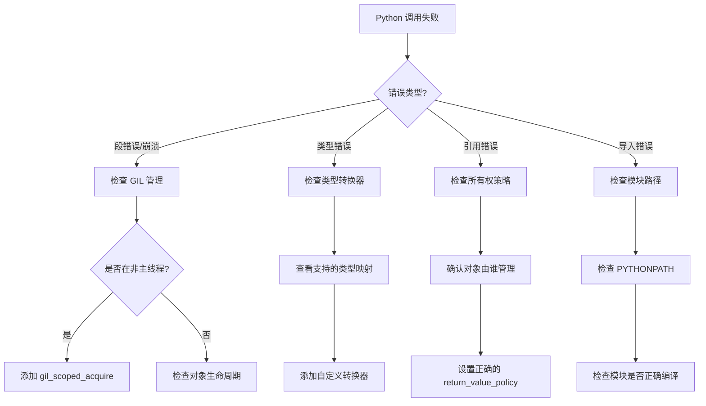

# 常见问题与故障排除与最佳实践

本节汇总 Python 集成开发中常见的问题诊断方法、错误码说明、约束清单，以及最佳实践原则和开发清单。

## 导航

本系列文档包含以下章节：

- [总览与环境搭建](./index.md)
- [C++ 调用 Python](./cpp-calling-python.md)
- [Python 绑定开发](./python-binding-development.md)
- [故障排除与最佳实践](./troubleshooting-and-best-practices.md) ← 当前页
- [Python 脚本开发实战](./python-script-development.md)

## 问题诊断流程

下图展示了 Python 调用失败时的诊断流程，帮助快速定位问题类型和解决方案：



上图展示了问题诊断的流程：
- 段错误 → 检查 [GIL 管理](./cpp-calling-python.md#gil安全全局解释器锁管理)，确保在调用 Python 前获取锁
- 类型错误 → 检查 [Qt 类型转换器](./python-binding-development.md#qt-类型转换器)，查看支持的类型映射
- 引用错误 → 检查所有权策略，设置正确的 `return_value_policy`
- 导入错误 → 检查模块路径和编译状态

## 错误码及解决方法

!!! failure "错误1：段错误 (Segmentation Fault)"

    **原因**：在非 Python 线程调用 Python 代码时未获取 GIL
    
    ```cpp
    // 错误示例
    void backgroundThread() {
        py::object result = py::module::import("pandas");  // 崩溃！
    }
    
    // 正确做法
    void backgroundThread() {
        py::gil_scoped_acquire acquire;
        py::object result = py::module::import("pandas");  // OK
    }
    ```

!!! failure "错误2：对象被提前释放"

    **原因**：Python 回调函数在执行前被垃圾回收
    
    ```cpp
    // 错误示例
    .def("callInMainThread", [](Handler& self, py::function func) {
        self.call(func);  // func 可能在执行前被释放
    })
    
    // 正确做法
    .def("callInMainThread", [](Handler& self, py::function func) {
        func.inc_ref();  // 增加引用计数
        self.call([func]() {
            py::gil_scoped_acquire gil;
            func();
            func.dec_ref();
        });
    })
    ```

!!! failure "错误3：单例对象被 Python 删除"

    **原因**：未指定正确的所有权策略
    
    ```cpp
    // 错误示例
    py::class_<DAAppCore>(m, "DAAppCore")
        .def_static("getInstance", &DAAppCore::getInstance);
        // 默认策略可能导致 Python 尝试删除单例
    
    // 正确做法
    py::class_<DAAppCore>(m, "DAAppCore")
        .def_static("getInstance", &DAAppCore::getInstance,
                    py::return_value_policy::reference);
    ```

## 约束清单

### 调试技巧

=== "启用 Python 调试输出"

    ```cpp
    // 在初始化时启用详细输出
    void initializePythonEnv() {
        // 设置 Python 环境变量
        qputenv("PYTHONUNBUFFERED", "1");
        qputenv("PYTHONDONTWRITEBYTECODE", "1");
        
        // ...
    }
    ```

=== "捕获 Python 异常堆栈"

    ```cpp
    std::string getPythonTraceback()
    {
        PyObject* type = nullptr;
        PyObject* value = nullptr;
        PyObject* traceback = nullptr;
        
        PyErr_Fetch(&type, &value, &traceback);
        
        if (!value) return "No exception";
        
        PyObject* tb_module = PyImport_ImportModule("traceback");
        PyObject* format_tb = PyObject_GetAttrString(tb_module, "format_exception");
        
        PyObject* args = PyTuple_Pack(3, type, value, traceback);
        PyObject* result = PyObject_CallObject(format_tb, args);
        
        std::string output;
        if (PyList_Check(result)) {
            for (Py_ssize_t i = 0; i < PyList_Size(result); ++i) {
                PyObject* line = PyList_GetItem(result, i);
                output += PyUnicode_AsUTF8(line);
            }
        }
        
        Py_XDECREF(type);
        Py_XDECREF(value);
        Py_XDECREF(traceback);
        
        return output;
    }
    ```

=== "使用 Python 调试器"

    ```python
    # 在 Python 脚本中启用调试
    import pdb
    
    def problematic_function():
        pdb.set_trace()  # 设置断点
        # ... 代码 ...
    ```

## 最佳实践总结

### 设计原则

1. **明确所有权边界**
    - C++ 管理的对象使用 `reference` 策略
    - Python 创建的对象使用 `take_ownership`
    - 内部引用使用 `reference_internal`

2. **线程安全第一**
    - 所有跨语言调用都要考虑 [GIL 管理](./cpp-calling-python.md#gil安全全局解释器锁管理)
    - UI 操作必须在主线程执行
    - 使用 `DAPythonSignalHandler` 进行跨线程通信

3. **统一异常处理**
    - 建立跨语言的异常传递机制
    - 捕获并转换 Python 异常为 C++ 异常
    - 提供详细的错误堆栈信息

4. **性能优化**
    - 缓存常用的 Python 模块引用
    - 避免频繁的类型转换
    - 使用 `gil_scoped_release` 释放长时间 C++ 操作的 GIL

### 清单

!!! tip "代码审查检查清单"
    - [ ] 所有 Python 调用都有 GIL 管理
    - [ ] 所有权策略正确设置
    - [ ] Python 回调函数引用计数正确
    - [ ] 异常处理完善
    - [ ] 无内存泄漏（使用 valgrind/ASan 检查）
    - [ ] 多线程场景测试通过
    - [ ] Python 模块路径正确配置
