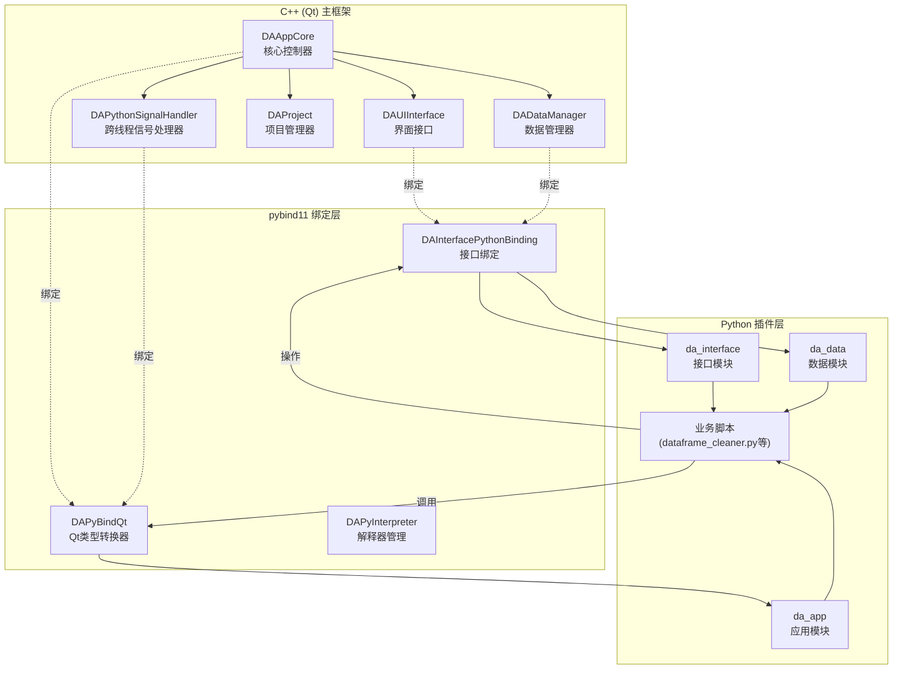
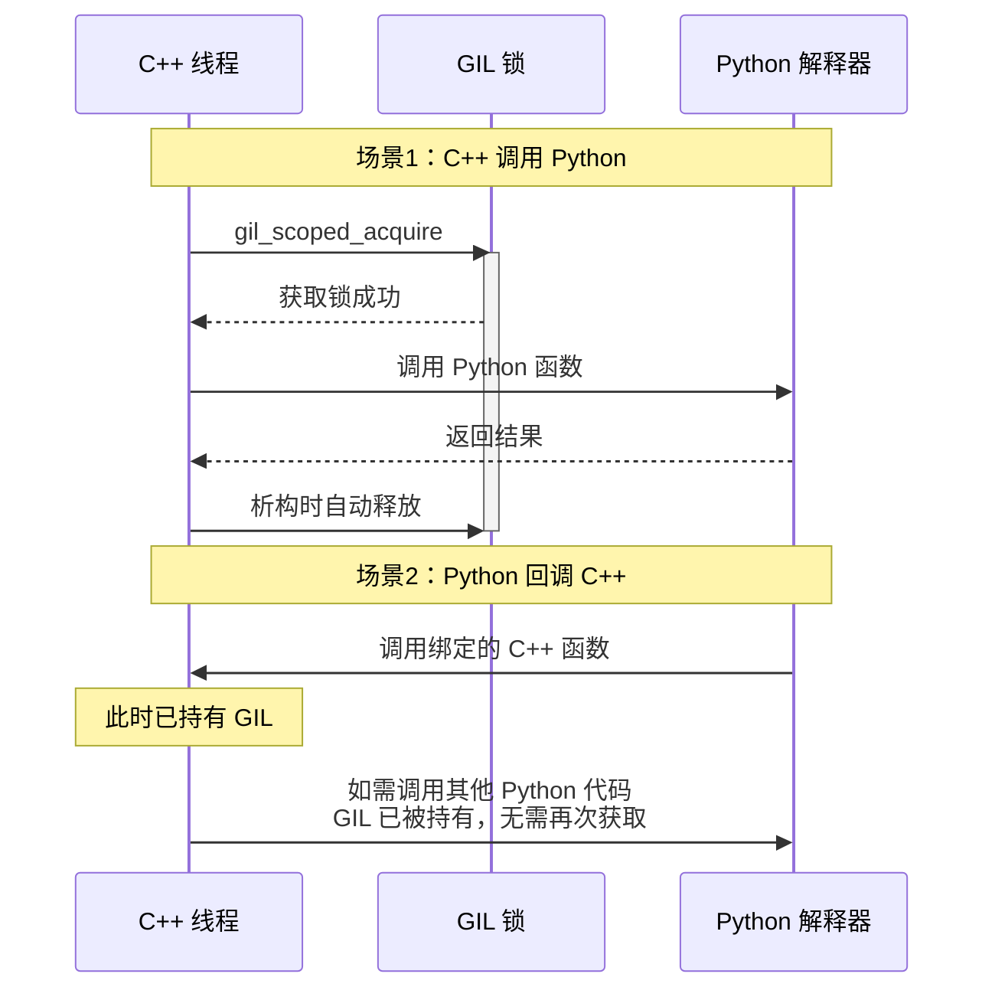
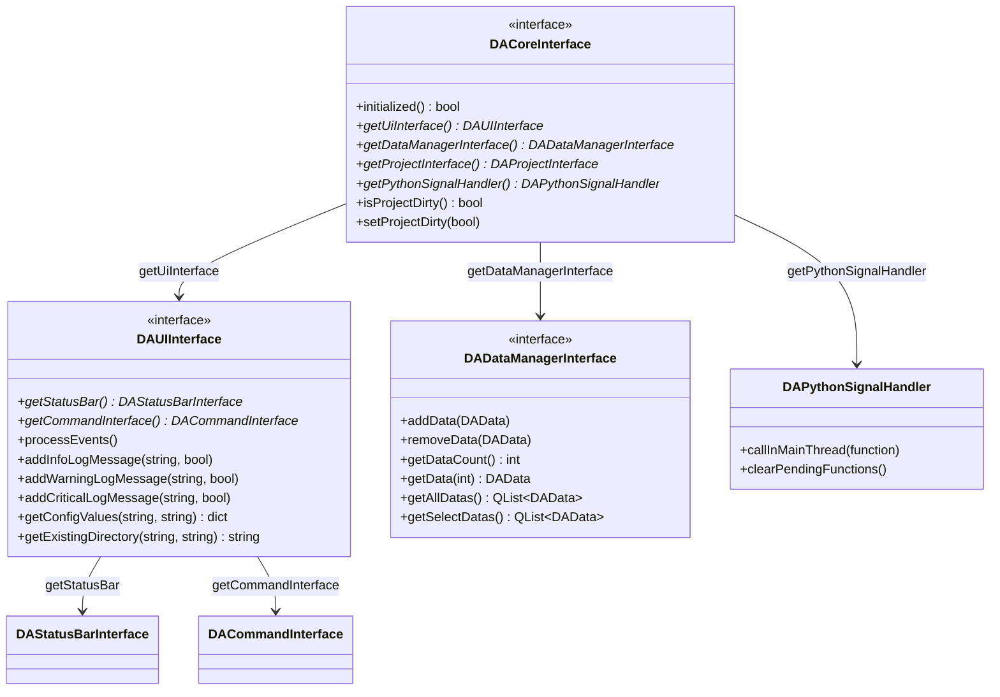
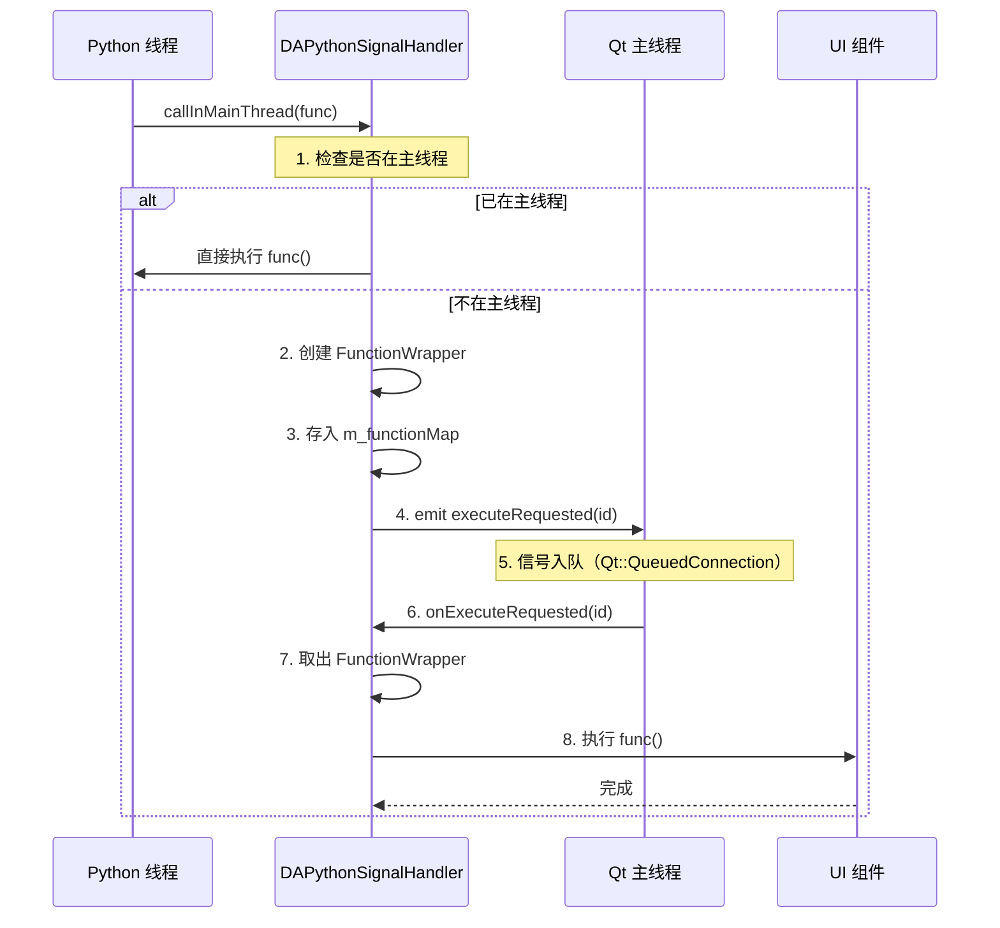
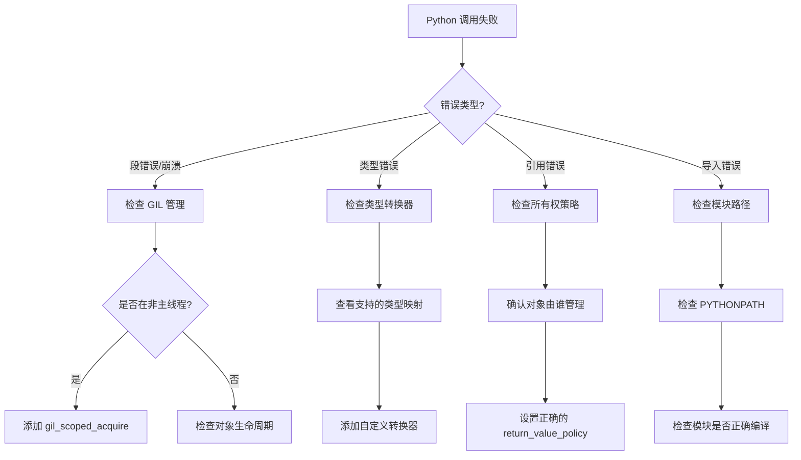

# 在Qt/C++应用中集成Python实现插件化架构

## 概述

本文档详细说明如何在 **DAWorkBench** 中实现 C++ 与 Python 的双向调用，构建完整的插件化架构。通过 `pybind11` 库，我们能够：

- 从 C++ 调用 Python 脚本和库函数
- 从 Python 脚本操作 C++ 界面组件和数据管理器
- 实现跨语言的对象生命周期管理
- 构建线程安全的跨语言通信机制

!!! info "为什么选择 Python 作为插件语言？"
    - **丰富的生态系统**：numpy、pandas、scipy 等科学计算库开箱即用
    - **低门槛**：相比 C++ 插件开发，Python 更易学习和推广
    - **快速迭代**：业务逻辑可热更新，无需重新编译主程序
    - **胶水语言特性**：天然适合作为各模块间的协调层

## 架构总览



---

## 第一部分：环境搭建与项目配置

### 1.1 CMake 配置详解

=== "基础配置"

    ```cmake
    # CMakeLists.txt - Python 集成基础配置
    
    # 查找 Python 开发库（要求 3.8+）
    find_package(Python3 3.8 COMPONENTS Interpreter Development REQUIRED)
    
    # 查找 pybind11
    find_package(pybind11 REQUIRED)
    
    # 设置 Python 模块输出目录
    set(PYTHON_MODULE_OUTPUT_DIR "${CMAKE_BINARY_DIR}/python_modules")
    ```

=== "嵌入式解释器配置"

    ```cmake
    # 嵌入 Python 解释器到主程序
    target_link_libraries(DAWorkBench 
        PRIVATE 
            Python3::Python          # Python 库
            Python3::Module          # Python 模块支持
    )
    
    target_include_directories(DAWorkBench 
        PRIVATE 
            ${Python3_INCLUDE_DIRS}  # Python 头文件
    )
    
    # 定义嵌入模式宏
    target_compile_definitions(DAWorkBench 
        PRIVATE 
            DA_ENABLE_PYTHON=1
    )
    ```

=== "Python 模块绑定配置"

    ```cmake
    # 创建 Python 绑定模块
    pybind11_add_module(da_interface
        ${CMAKE_SOURCE_DIR}/src/DAInterface/DAInterfacePythonBinding.cpp
    )
    
    # 链接依赖库
    target_link_libraries(da_interface
        PRIVATE
            DAInterface              # 接口库
            DAPyBindQt               # Qt 绑定库
            pybind11::module         # pybind11 模块
    )
    
    # 设置模块输出位置
    set_target_properties(da_interface PROPERTIES
        LIBRARY_OUTPUT_DIRECTORY "${PYTHON_MODULE_OUTPUT_DIR}"
    )
    ```

### 1.2 目录结构

```
data-workbench/
├── src/
│   ├── DAPyBindQt/              # Python 绑定核心模块
│   │   ├── DAPybind11QtCaster.hpp    # Qt 类型转换器
│   │   ├── DAPythonSignalHandler.h   # 跨线程通信
│   │   ├── DAPyInterpreter.h         # 解释器管理
│   │   └── pandas/                   # pandas 封装
│   │       ├── DAPyDataFrame.h
│   │       └── DAPySeries.h
│   ├── DAInterface/             # 接口模块
│   │   └── DAInterfacePythonBinding.cpp  # 接口绑定实现
│   └── APP/                     # 应用主程序
│       └── DAAppCore.cpp        # Python 环境初始化
└── plugins/
    └── DataAnalysis/            # 数据分析插件
        └── PyScripts/
            └── DADataAnalysis/  # Python 业务脚本
                ├── dataframe_cleaner.py
                ├── dataframe_io.py
                └── dataframe_operate.py
```

---

## 第二部分：C++ 调用 Python

### 2.1 Python 解释器初始化

!!! warning "初始化顺序至关重要"
    Python 解释器必须在任何 Python 操作之前初始化，且在整个程序生命周期中只能初始化一次。

```cpp title="DAAppCore.cpp - Python 环境初始化"
#include <pybind11/embed.h>
#include "DAPyInterpreter.h"
#include "DAPyScripts.h"

bool DAAppCore::initializePythonEnv()
{
    mIsPythonInterpreterInitialized = false;
    
    try {
        // 1. 获取解释器单例
        DA::DAPyInterpreter& python = DA::DAPyInterpreter::getInstance();
        
        // 2. 设置 Python Home 路径（可选，用于指定 Python 环境）
        QString pypath = DA::DAPyInterpreter::getPythonInterpreterPath();
        qInfo() << tr("Python interpreter path: %1").arg(pypath);
        
        QFileInfo fi(pypath);
        python.setPythonHomePath(fi.absolutePath());
        
        // 3. 初始化解释器（创建 scoped_interpreter）
        python.initializePythonInterpreter();
        
        // 4. 添加脚本搜索路径
        QString scriptPath = getPythonScriptsPath();
        DA::DAPyScripts::appendSysPath(scriptPath);
        
        // 5. 初始化脚本模块
        DA::DAPyScripts& scripts = DA::DAPyScripts::getInstance();
        if (!scripts.isInitScripts()) {
            qCritical() << tr("Scripts initialization failed");
            return false;
        }
        
    } catch (const std::exception& e) {
        qCritical() << tr("Python initialization error: %1").arg(e.what());
        return false;
    }
    
    mIsPythonInterpreterInitialized = true;
    return true;
}
```

### 2.2 GIL（全局解释器锁）管理

!!! danger "线程安全警告"
    在多线程环境下调用 Python 代码时，必须正确管理 GIL，否则会导致程序崩溃或死锁。



=== "基本 GIL 管理"

    ```cpp
    #include <pybind11/pybind11.h>
    
    void callPythonFunction()
    {
        // 方式1：使用 RAII 自动管理
        pybind11::gil_scoped_acquire acquire;  // 构造时获取 GIL
        // ... 调用 Python 代码 ...
        // 析构时自动释放 GIL
    }
    ```

=== "释放 GIL 进行长时间 C++ 操作"

    ```cpp
    void pythonCallbackWithHeavyWork()
    {
        // Python 调用此函数时已持有 GIL
        
        // 1. 先释放 GIL，允许其他 Python 线程执行
        {
            pybind11::gil_scoped_release release;
            
            // 2. 执行耗时的 C++ 操作
            heavyComputation();  // 此时其他 Python 线程可以运行
            
        }  // 3. 离开作用域后重新持有 GIL（隐式）
        
        // 4. 继续操作 Python 对象
        // ...
    }
    ```

=== "自定义线程安全守卫"

    ```cpp
    /**
     * @brief Python 线程安全守卫类
     * 
     * 用于非 Python 创建的线程调用 Python 代码时
     */
    class PyThreadGuard
    {
    public:
        PyThreadGuard() : m_gil_state(PyGILState_Ensure()) {}
        ~PyThreadGuard() { PyGILState_Release(m_gil_state); }
        
        // 禁止拷贝
        PyThreadGuard(const PyThreadGuard&) = delete;
        PyThreadGuard& operator=(const PyThreadGuard&) = delete;
        
    private:
        PyGILState_STATE m_gil_state;
    };
    
    // 使用示例
    void backgroundThread()
    {
        PyThreadGuard guard;  // 确保当前线程持有 GIL
        // 安全调用 Python 代码
        pybind11::object result = somePythonFunction();
    }
    ```

### 2.3 调用 Python 函数示例

```cpp title="DAPyScriptsIO.cpp - 调用 pandas 读取 CSV"
#include "DAPyScriptsIO.h"
#include "DAPyDataFrame.h"
#include <pybind11/pybind11.h>
#include <pybind11/stl.h>

namespace py = pybind11;

// 静态模块缓存（避免重复导入）
py::object DAPyScriptsIO::s_pandas;
py::object DAPyScriptsIO::s_read_csv;

bool DAPyScriptsIO::read(const QString& filepath, 
                         const QVariantHash& args, 
                         QString& err)
{
    // 1. 获取 GIL
    py::gil_scoped_acquire acquire;
    
    try {
        // 2. 延迟加载 pandas 模块
        if (s_pandas.is_none()) {
            s_pandas = py::module::import("pandas");
            s_read_csv = s_pandas.attr("read_csv");
        }
        
        // 3. 构建参数字典
        py::dict pyArgs;
        
        // 转换 QVariantHash 到 Python dict
        for (auto it = args.begin(); it != args.end(); ++it) {
            pyArgs[py::str(it.key().toStdString())] = 
                DA::PY::toPyObject(it.value());
        }
        
        // 设置文件路径
        pyArgs["filepath_or_buffer"] = py::str(filepath.toStdString());
        
        // 4. 调用 Python 函数
        py::object df = s_read_csv(**pyArgs);
        
        // 5. 包装为 C++ 对象
        DA::DAPyDataFrame daDf(df);
        
        // 6. 传递给数据管理器
        // ...
        
        return true;
        
    } catch (const py::error_already_set& e) {
        err = QString::fromStdString(e.what());
        return false;
    } catch (const std::exception& e) {
        err = QString::fromStdString(e.what());
        return false;
    }
}
```

---

## 第三部分：Python 调用 C++

### 3.1 接口绑定架构



### 3.2 接口绑定实现

```cpp title="DAInterfacePythonBinding.cpp - 核心接口绑定"
#include <pybind11/pybind11.h>
#include <pybind11/functional.h>
#include "DACoreInterface.h"
#include "DAUIInterface.h"
#include "DADataManagerInterface.h"
#include "DAPythonSignalHandler.h"

namespace py = pybind11;

PYBIND11_EMBEDDED_MODULE(da_interface, m)
{
    // ========================================
    // 1. 绑定 DAPythonSignalHandler
    // ========================================
    py::class_<DA::DAPythonSignalHandler>(m, "DAPythonSignalHandler")
        .def("callInMainThread",
            [](DA::DAPythonSignalHandler& self, py::function pyFunc) {
                // 重要：增加引用计数，防止 Python 端提前释放
                pyFunc.inc_ref();
                self.callInMainThread([pyFunc]() {
                    try {
                        py::gil_scoped_acquire acquire;
                        pyFunc();
                        pyFunc.dec_ref();
                    } catch (...) {
                        pyFunc.dec_ref();
                        throw;
                    }
                });
            },
            py::arg("func"),
            "Schedule a Python function to be executed in Qt main thread");
    
    // ========================================
    // 2. 绑定 DADataManagerInterface
    // ========================================
    py::class_<DA::DADataManagerInterface>(m, "DADataManagerInterface")
        .def("addData", &DA::DADataManagerInterface::addData,
             py::arg("data"), "Add data immediately")
        .def("removeData", &DA::DADataManagerInterface::removeData,
             py::arg("data"))
        .def("getDataCount", &DA::DADataManagerInterface::getDataCount)
        .def("getData", &DA::DADataManagerInterface::getData,
             py::arg("index"),
             py::return_value_policy::reference_internal)
        .def("getAllDatas",
            [](DA::DADataManagerInterface& self) {
                QList<DA::DAData> datas = self.getAllDatas();
                py::list pyList;
                for (const DA::DAData& data : datas) {
                    pyList.append(data);
                }
                return pyList;
            },
            "Get all data objects as a list")
        .def("addDataframe",
            [](DA::DADataManagerInterface& self, 
               py::object df, 
               const std::string& name) {
                DA::DAData data(DA::DAPyDataFrame(df));
                data.setName(QString::fromStdString(name));
                self.addData(data);
            },
            py::arg("df"), py::arg("name"),
            "Add a pandas DataFrame to data manager");
    
    // ========================================
    // 3. 绑定 DAUIInterface
    // ========================================
    py::class_<DA::DAUIInterface>(m, "DAUIInterface")
        .def("getStatusBar", &DA::DAUIInterface::getStatusBar,
             py::return_value_policy::reference_internal)
        .def("processEvents", &DA::DAUIInterface::processEvents)
        .def("addInfoLogMessage",
            [](DA::DAUIInterface& self, 
               const std::string& msg, 
               bool showInStatusBar = true) {
                self.addInfoLogMessage(
                    QString::fromStdString(msg), showInStatusBar);
            },
            py::arg("msg"), py::arg("showInStatusBar") = true)
        .def("addWarningLogMessage",
            [](DA::DAUIInterface& self, 
               const std::string& msg, 
               bool showInStatusBar = true) {
                self.addWarningLogMessage(
                    QString::fromStdString(msg), showInStatusBar);
            },
            py::arg("msg"), py::arg("showInStatusBar") = true)
        .def("addCriticalLogMessage",
            [](DA::DAUIInterface& self, 
               const std::string& msg, 
               bool showInStatusBar = true) {
                self.addCriticalLogMessage(
                    QString::fromStdString(msg), showInStatusBar);
            },
            py::arg("msg"), py::arg("showInStatusBar") = true)
        .def("getConfigValues",
            [](DA::DAUIInterface& self, 
               const std::string& jsonConfig, 
               const std::string& cacheKey = "") {
                QString qjsonConfig = QString::fromStdString(jsonConfig);
                QString qcacheKey = QString::fromStdString(cacheKey);
                QJsonObject jsonObj = self.getConfigValues(
                    qjsonConfig, self.getMainWindow(), qcacheKey);
                return DA::PY::qjsonObjectToPyDict(jsonObj);
            },
            py::arg("jsonConfig"), py::arg("cacheKey") = "",
            "Show config dialog and return user input as dict");
    
    // ========================================
    // 4. 绑定 DACoreInterface
    // ========================================
    py::class_<DA::DACoreInterface>(m, "DACoreInterface")
        .def("getUiInterface", &DA::DACoreInterface::getUiInterface,
             py::return_value_policy::reference_internal)
        .def("getDataManagerInterface", 
             &DA::DACoreInterface::getDataManagerInterface,
             py::return_value_policy::reference_internal)
        .def("getPythonSignalHandler",
             &DA::DACoreInterface::getPythonSignalHandler,
             py::return_value_policy::reference_internal,
             "Get Python signal handler for cross-thread communication")
        .def("isProjectDirty", &DA::DACoreInterface::isProjectDirty)
        .def("setProjectDirty", &DA::DACoreInterface::setProjectDirty,
             py::arg("on"));
}
```

### 3.3 所有权策略详解

!!! tip "所有权策略选择指南"
    正确的所有权策略是避免内存泄漏和崩溃的关键。

| 策略 | 适用场景 | 说明 |
|------|----------|------|
| `reference` | 单例对象、C++ 管理生命周期的对象 | Python 不接管所有权，不调用析构函数 |
| `reference_internal` | 返回内部对象的引用 | 生命周期与父对象绑定 |
| `take_ownership` | Python 创建的对象 | Python 接管所有权，负责析构 |
| `automatic` | 默认策略 | 根据返回类型自动选择 |
| `copy` | 返回副本 | 始终返回一个新的副本 |

```cpp
// 示例：不同场景的所有权策略

// 场景1：单例对象 - 使用 reference
py::class_<DAAppCore>(m, "DAAppCore")
    .def_static("getInstance", 
                &DAAppCore::getInstance,
                py::return_value_policy::reference);  // 关键！

// 场景2：内部对象引用 - 使用 reference_internal
py::class_<DAUIInterface>(m, "DAUIInterface")
    .def("getStatusBar", 
         &DAUIInterface::getStatusBar,
         py::return_value_policy::reference_internal);  // 与 UIInterface 绑定

// 场景3：创建新对象 - 使用 take_ownership
py::class_<DataWrapper>(m, "DataWrapper")
    .def(py::init<>());  // Python 创建，Python 管理
```

### 3.4 Python 脚本调用示例

```python title="dataframe_cleaner.py - Python 调用 C++ 界面"
"""
DataFrame 数据清洗工具集
演示如何从 Python 脚本操作 C++ 界面组件
"""
import da_app, da_interface, da_data
import pandas as pd
from typing import Optional

def dropna() -> Optional[int]:
    """
    删除包含缺失值的行
    
    演示：
    1. 获取 C++ 数据管理器
    2. 显示配置对话框
    3. 执行操作并更新界面
    """
    # 1. 获取核心接口
    core = da_app.getCore()
    ui = core.getUiInterface()
    data_mgr = core.getDataManagerInterface()
    
    # 2. 获取当前选中的数据
    select_datas = data_mgr.getSelectDatas()
    if not select_datas:
        ui.addWarningLogMessage("请先选择要处理的数据")
        return None
    
    dadata = select_datas[0]
    
    # 3. 构建配置对话框（调用 C++ 的配置对话框组件）
    import DAWorkbench.property_config_builder as cfgBuilder
    
    builder = cfgBuilder.PropertyConfigBuilder("删除缺失值设置")
    
    builder.add_enum(
        name="how",
        display_name="删除条件",
        default_value="any",
        enum_items=["any", "all"],
        enum_descriptions=[
            "行中任意值为空时删除",
            "行中所有值为空时删除"
        ]
    )
    
    builder.add_bool(
        name="reindex",
        display_name="重置行号",
        default_value=True
    )
    
    # 4. 显示对话框并获取用户输入
    config = ui.getConfigValues(builder.to_json(), "dataframecleaner.dropna")
    if not config:
        return None  # 用户取消
    
    # 5. 执行数据操作
    how = config.get("how", "any")
    reindex = config.get("reindex", True)
    
    df = dadata.toDataFrame()
    old_len = len(df)
    
    # 使用 pandas 处理
    df = df.dropna(how=how)
    if reindex:
        df = df.reset_index(drop=True)
    
    # 6. 更新数据（触发 C++ 界面刷新）
    dadata.setPyObject(df)
    
    # 7. 显示结果消息
    removed = old_len - len(df)
    ui.addInfoLogMessage(f"已删除 {removed} 行包含缺失值的数据")
    
    return removed


def execute_in_main_thread():
    """
    演示如何从后台线程安全地调用主线程操作
    """
    core = da_app.getCore()
    handler = core.getPythonSignalHandler()
    
    def update_ui():
        """此函数将在 Qt 主线程中执行"""
        ui = core.getUiInterface()
        ui.addInfoLogMessage("来自后台线程的消息")
    
    # 投递到主线程执行
    handler.callInMainThread(update_ui)
```

---

## 第四部分：跨线程通信机制

### 4.1 问题背景

!!! warning "Qt 线程限制"
    Qt 的 UI 操作必须在主线程执行。Python 脚本可能在后台线程运行，直接操作 UI 会导致崩溃。

### 4.2 DAPythonSignalHandler 设计



### 4.3 实现代码

```cpp title="DAPythonSignalHandler.h"
#ifndef DAPYTHONSIGNALHANDLER_H
#define DAPYTHONSIGNALHANDLER_H

#include <QObject>
#include <QMap>
#include <functional>
#include <memory>
#include <mutex>

namespace DA
{
/**
 * @brief Python 线程到 Qt 主线程的通信处理器
 * 
 * 允许 Python 线程通过信号槽机制安全地调用 Qt 主线程中的函数
 */
class DAPythonSignalHandler : public QObject
{
    Q_OBJECT

public:
    explicit DAPythonSignalHandler(QObject* parent = nullptr);
    virtual ~DAPythonSignalHandler();
    
    // 禁止拷贝
    DAPythonSignalHandler(const DAPythonSignalHandler&) = delete;
    DAPythonSignalHandler& operator=(const DAPythonSignalHandler&) = delete;

    /**
     * @brief 从 Python 线程调用，请求在主线程执行函数
     * @param func 要在主线程执行的函数
     * 
     * 此函数是线程安全的，可以从任何线程调用
     */
    void callInMainThread(std::function<void()> func);

    /**
     * @brief 清理所有待执行的函数
     */
    void clearPendingFunctions();

Q_SIGNALS:
    /**
     * @brief 内部信号，用于触发主线程执行
     */
    void executeRequested(int funcWrapperId);

private Q_SLOTS:
    void onExecuteRequested(int funcWrapperId);

private:
    // 函数包装器
    class FunctionWrapper
    {
    public:
        explicit FunctionWrapper(std::function<void()> func) : m_func(func) {}
        void execute() { if (m_func) m_func(); }
    private:
        std::function<void()> m_func;
    };
    
    using FunctionWrapperPtr = std::shared_ptr<FunctionWrapper>;
    
    QMap<int, FunctionWrapperPtr> m_functionMap;  // 函数映射
    std::mutex m_mutex;                           // 线程安全保护
    int m_nextFuncId{0};                          // 下一个 ID
    bool m_destroying{false};                     // 销毁标志
};

}  // namespace DA
#endif
```

```cpp title="DAPythonSignalHandler.cpp"
#include "DAPythonSignalHandler.h"
#include <QThread>
#include <QCoreApplication>

namespace DA
{

DAPythonSignalHandler::DAPythonSignalHandler(QObject* parent)
    : QObject(parent), m_destroying(false)
{
    // 使用 Qt::QueuedConnection 确保跨线程调用
    connect(this, &DAPythonSignalHandler::executeRequested,
            this, &DAPythonSignalHandler::onExecuteRequested,
            Qt::QueuedConnection);
}

DAPythonSignalHandler::~DAPythonSignalHandler()
{
    m_destroying = true;
    clearPendingFunctions();
}

void DAPythonSignalHandler::callInMainThread(std::function<void()> func)
{
    if (!func || m_destroying) {
        return;
    }
    
    QCoreApplication* app = QCoreApplication::instance();
    if (!app) {
        return;
    }
    
    // 检查是否已在主线程
    if (QThread::currentThread() == app->thread()) {
        func();  // 直接执行
        return;
    }
    
    // 创建函数包装器并存入映射
    int funcId;
    {
        std::lock_guard<std::mutex> lock(m_mutex);
        funcId = ++m_nextFuncId;
        m_functionMap[funcId] = std::make_shared<FunctionWrapper>(std::move(func));
    }
    
    // 发射信号，触发主线程执行
    Q_EMIT executeRequested(funcId);
}

void DAPythonSignalHandler::onExecuteRequested(int funcWrapperId)
{
    if (m_destroying) {
        return;
    }
    
    FunctionWrapperPtr wrapper;
    
    {
        std::lock_guard<std::mutex> lock(m_mutex);
        auto it = m_functionMap.find(funcWrapperId);
        if (it == m_functionMap.end()) {
            return;
        }
        wrapper = it.value();
        m_functionMap.erase(it);
    }
    
    try {
        wrapper->execute();
    } catch (const std::exception& e) {
        qCritical() << "Exception in main thread function:" << e.what();
    }
}

void DAPythonSignalHandler::clearPendingFunctions()
{
    std::lock_guard<std::mutex> lock(m_mutex);
    m_functionMap.clear();
}

}  // namespace DA
```

---

## 第五部分：Qt 类型转换器

### 5.1 支持的类型映射

| Qt 类型 | Python 类型 | 说明 |
|---------|-------------|------|
| `QString` | `str` | UTF-8 编码自动转换 |
| `QByteArray` | `bytes` / `bytearray` | 支持二进制数据 |
| `QDate` | `datetime.date` | 日期类型 |
| `QTime` | `datetime.time` | 时间类型 |
| `QDateTime` | `datetime.datetime` | 支持 pandas.Timestamp |
| `QList<T>` | `list` | 泛型支持 |
| `QSet<T>` | `set` | 集合类型 |
| `QHash<K,V>` | `dict` | 哈希映射 |
| `QMap<K,V>` | `dict` | 有序映射 |
| `QVariant` | `Any` | 通用类型，支持 numpy |

### 5.2 QString 转换器实现

```cpp title="DAPybind11QtCaster.hpp - QString 转换器"
namespace pybind11
{
namespace detail
{

template<>
struct type_caster<QString>
{
    PYBIND11_TYPE_CASTER(QString, _("str"));

    // Python -> QString
    bool load(handle src, bool convert)
    {
        if (!src) return false;

        // 处理 Unicode 字符串
        if (PyUnicode_Check(src.ptr())) {
            Py_ssize_t size;
            const char* data = PyUnicode_AsUTF8AndSize(src.ptr(), &size);
            if (data) {
                value = QString::fromUtf8(data, size);
                return true;
            }
        }
        // 处理 bytes 对象
        else if (convert && PyBytes_Check(src.ptr())) {
            char* data;
            Py_ssize_t size;
            if (PyBytes_AsStringAndSize(src.ptr(), &data, &size) != -1) {
                value = QString::fromUtf8(data, size);
                return true;
            }
        }
        return false;
    }

    // QString -> Python
    static handle cast(const QString& src, 
                       return_value_policy /* policy */, 
                       handle /* parent */)
    {
        QByteArray utf8 = src.toUtf8();
        return PyUnicode_FromStringAndSize(utf8.constData(), utf8.size());
    }
};

}  // namespace detail
}  // namespace pybind11
```

### 5.3 QVariant 转换器（支持 numpy）

```cpp title="DAPybind11QtCaster.hpp - QVariant 转换器（简化版）"
template<>
struct type_caster<QVariant>
{
    PYBIND11_TYPE_CASTER(QVariant, _("Any"));

    bool load(handle src, bool convert)
    {
        if (!src || src.is_none()) {
            value = QVariant();
            return true;
        }
        
        // 检查是否是 numpy 对象
        if (is_numpy_array(src)) {
            return handle_numpy_object(src);
        }
        
        // 整数
        if (PyLong_Check(src.ptr())) {
            value = src.cast<long long>();
            return true;
        }
        
        // 浮点数
        if (PyFloat_Check(src.ptr())) {
            value = src.cast<double>();
            return true;
        }
        
        // 字符串
        if (PyUnicode_Check(src.ptr())) {
            value = src.cast<QString>();
            return true;
        }
        
        // 列表
        if (PyList_Check(src.ptr())) {
            value = src.cast<QVariantList>();
            return true;
        }
        
        // 字典
        if (PyDict_Check(src.ptr())) {
            value = src.cast<QVariantMap>();
            return true;
        }
        
        // ... 其他类型处理
        
        return false;
    }

    static handle cast(const QVariant& src, 
                       return_value_policy policy, 
                       handle parent)
    {
        if (!src.isValid() || src.isNull()) {
            Py_RETURN_NONE;
        }
        
        switch (src.userType()) {
        case QMetaType::Int:
            return py::cast(src.toInt()).release();
        case QMetaType::Double:
            return py::cast(src.toDouble()).release();
        case QMetaType::QString:
            return py::cast(src.toString()).release();
        case QMetaType::QVariantList:
            return py::cast(src.toList()).release();
        case QMetaType::QVariantMap:
            return py::cast(src.toMap()).release();
        // ... 其他类型
        default:
            return py::cast(src.toString()).release();
        }
    }
};
```

---

## 第六部分：常见问题与故障排除

### 6.1 问题诊断流程



### 6.2 常见错误及解决方案

!!! failure "错误1：段错误 (Segmentation Fault)"

    **原因**：在非 Python 线程调用 Python 代码时未获取 GIL
    
    ```cpp
    // 错误示例
    void backgroundThread() {
        py::object result = py::module::import("pandas");  // 崩溃！
    }
    
    // 正确做法
    void backgroundThread() {
        py::gil_scoped_acquire acquire;
        py::object result = py::module::import("pandas");  // OK
    }
    ```

!!! failure "错误2：对象被提前释放"

    **原因**：Python 回调函数在执行前被垃圾回收
    
    ```cpp
    // 错误示例
    .def("callInMainThread", [](Handler& self, py::function func) {
        self.call(func);  // func 可能在执行前被释放
    })
    
    // 正确做法
    .def("callInMainThread", [](Handler& self, py::function func) {
        func.inc_ref();  // 增加引用计数
        self.call([func]() {
            py::gil_scoped_acquire gil;
            func();
            func.dec_ref();
        });
    })
    ```

!!! failure "错误3：单例对象被 Python 删除"

    **原因**：未指定正确的所有权策略
    
    ```cpp
    // 错误示例
    py::class_<DAAppCore>(m, "DAAppCore")
        .def_static("getInstance", &DAAppCore::getInstance);
        // 默认策略可能导致 Python 尝试删除单例
    
    // 正确做法
    py::class_<DAAppCore>(m, "DAAppCore")
        .def_static("getInstance", &DAAppCore::getInstance,
                    py::return_value_policy::reference);
    ```

### 6.3 调试技巧

=== "启用 Python 调试输出"

    ```cpp
    // 在初始化时启用详细输出
    void initializePythonEnv() {
        // 设置 Python 环境变量
        qputenv("PYTHONUNBUFFERED", "1");
        qputenv("PYTHONDONTWRITEBYTECODE", "1");
        
        // ...
    }
    ```

=== "捕获 Python 异常堆栈"

    ```cpp
    std::string getPythonTraceback()
    {
        PyObject* type = nullptr;
        PyObject* value = nullptr;
        PyObject* traceback = nullptr;
        
        PyErr_Fetch(&type, &value, &traceback);
        
        if (!value) return "No exception";
        
        PyObject* tb_module = PyImport_ImportModule("traceback");
        PyObject* format_tb = PyObject_GetAttrString(tb_module, "format_exception");
        
        PyObject* args = PyTuple_Pack(3, type, value, traceback);
        PyObject* result = PyObject_CallObject(format_tb, args);
        
        std::string output;
        if (PyList_Check(result)) {
            for (Py_ssize_t i = 0; i < PyList_Size(result); ++i) {
                PyObject* line = PyList_GetItem(result, i);
                output += PyUnicode_AsUTF8(line);
            }
        }
        
        Py_XDECREF(type);
        Py_XDECREF(value);
        Py_XDECREF(traceback);
        
        return output;
    }
    ```

=== "使用 Python 调试器"

    ```python
    # 在 Python 脚本中启用调试
    import pdb
    
    def problematic_function():
        pdb.set_trace()  # 设置断点
        # ... 代码 ...
    ```

---

## 第七部分：最佳实践总结

### 7.1 设计原则

1. **明确所有权边界**
    - C++ 管理的对象使用 `reference` 策略
    - Python 创建的对象使用 `take_ownership`
    - 内部引用使用 `reference_internal`

2. **线程安全第一**
    - 所有跨语言调用都要考虑 GIL
    - UI 操作必须在主线程执行
    - 使用 `DAPythonSignalHandler` 进行跨线程通信

3. **统一异常处理**
    - 建立跨语言的异常传递机制
    - 捕获并转换 Python 异常为 C++ 异常
    - 提供详细的错误堆栈信息

4. **性能优化**
    - 缓存常用的 Python 模块引用
    - 避免频繁的类型转换
    - 使用 `gil_scoped_release` 释放长时间 C++ 操作的 GIL

### 7.2 检查清单

!!! tip "代码审查检查清单"
    - [ ] 所有 Python 调用都有 GIL 管理
    - [ ] 所有权策略正确设置
    - [ ] Python 回调函数引用计数正确
    - [ ] 异常处理完善
    - [ ] 无内存泄漏（使用 valgrind/ASan 检查）
    - [ ] 多线程场景测试通过
    - [ ] Python 模块路径正确配置

---

## 相关模块

| 模块 | 说明 |
|------|------|
| `DAPyBindQt` | Python 与 Qt 绑定的核心模块 |
| `DAPyScripts` | Python 脚本包装模块 |
| `DAData` | 数据处理模块，包含 `DAPyDataFrame` 等 |
| `DAInterface` | 接口模块，定义核心接口 |

## 参考资料

- [pybind11 官方文档](https://pybind11.readthedocs.io/)
- [Python C API 文档](https://docs.python.org/3/c-api/)
- [Qt 线程基础](https://doc.qt.io/qt-5/thread-basics.html)
