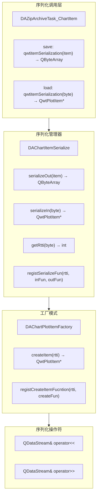

# Qwt库序列化实现指南

Qwt 库序列化实现指南提供 QwtPlotItem 图表项的完整序列化方案，采用工厂模式和注册机制实现类型扩展。

## 1. 概述

### 1.1 Qwt序列化的挑战

Qwt（Qt Widgets for Technical Applications）是一个用于绘制二维图表的 Qt 扩展库。在 Data Workbench 项目中，我们需要将 Qwt 的图表项（QwtPlotItem）序列化到项目文件中，这面临以下挑战：

1. **类型多样性**：Qwt 提供了多种图表项类型（曲线、网格、标记、柱状图等）
2. **无内置序列化**：Qwt 类本身不提供序列化支持
3. **指针管理**：图表项包含大量指针成员（如 QwtSymbol*）
4. **版本兼容**：需要支持不同版本 Qwt 的数据格式

### 1.2 整体设计思路

Data Workbench 采用以下架构实现 Qwt 序列化，通过分层设计将调用、管理、工厂、操作分离。下图展示了各层的职责关系：



上图展示了四层架构设计：
- **序列化调用层**：通过 `DAZipArchiveTask_ChartItem` 触发序列化操作
- **序列化管理器**：`DAChartItemSerialize` 提供序列化入口和类型注册
- **工厂模式**：`DAChartPlotItemFactory` 根据 RTTI 创建对应类型的对象
- **序列化操作符**：`operator<<` 和 `operator>>` 实现具体的数据读写

### 1.3 核心设计原则

1. **ADL（参数依赖查找）**：序列化操作符定义在全局命名空间，利用 ADL 自动查找
2. **工厂模式**：通过 RTTI 值创建对应类型的对象
3. **注册机制**：支持运行时注册新的序列化类型
4. **版本控制**：每个序列化数据包含版本号，支持向后兼容

## 2. 核心组件

### 2.1 DAChartItemSerialize - 序列化管理器

[DAChartSerialize.h](./../../../src/DAFigure/DAChartSerialize.h) 定义了 QwtPlotItem 的序列化管理器。以下代码展示了核心接口定义：

```cpp title="DAChartItemSerialize 类定义"
class DAFIGURE_API DAChartItemSerialize
{
public:
    // 文件头结构
    class Header
    {
    public:
        std::uint32_t magic;       // 魔数，用于验证
        int version;               // 版本号，用于兼容性
        int rtti;                  // QwtPlotItem 的 RTTI 值
        unsigned char byte[20];    // 预留字节，凑齐32字节

        bool isValid() const;
    };

    // 序列化函数类型
    using FpSerializeOut = std::function<QByteArray(const QwtPlotItem*)>;
    using FpSerializeIn  = std::function<QwtPlotItem*(const QByteArray&)>;

    // 核心接口
    QByteArray serializeOut(const QwtPlotItem* item) const;
    QwtPlotItem* serializeIn(const QByteArray& byte) const noexcept;
    int getRtti(const QByteArray& byte) const noexcept;

    // 注册接口
    static void registSerializeFun(int rtti, FpSerializeIn fpIn, FpSerializeOut fpOut);
    static bool isSupportSerialize(int rtti);

    // 模板化序列化方法
    template<typename T, int RTTI>
    static QwtPlotItem* serializeIn_T(const QByteArray& byte);

    template<typename T>
    static QByteArray serializeOut_T(const QwtPlotItem* item);
};
```

**核心方法实现**：

```cpp title="序列化输出实现"
QByteArray DAChartItemSerialize::serializeOut(const QwtPlotItem* item) const
{
    int rtti = item->rtti();
    FpSerializeOut fp = getSerializeOutFun(rtti);
    if (!fp) {
        qDebug() << QString("序列化时遇到未注册的RTTI值(%1)").arg(rtti);
        return QByteArray();
    }
    return fp(item);
}
```

```cpp title="序列化输入实现"
QwtPlotItem* DAChartItemSerialize::serializeIn(const QByteArray& byte) const noexcept
{
    int rtti = getRtti(byte);
    if (rtti < 0) {
        return nullptr;
    }
    FpSerializeIn fp = getSerializeInFun(rtti);
    if (!fp) {
        qDebug() << QString("反序列化时遇到未注册的RTTI值(%1)").arg(rtti);
        return nullptr;
    }
    return fp(byte);
}
```

```cpp title="从二进制数据获取 RTTI"
int DAChartItemSerialize::getRtti(const QByteArray& byte) const noexcept
{
    QBuffer buffer;
    buffer.setData(byte);
    buffer.open(QIODevice::ReadOnly);

    QDataStream st(&buffer);
    DAChartItemSerialize::Header h;
    st.setVersion(gc_datastream_version);
    st >> h;

    return h.isValid() ? h.rtti : -1;
}
```

### 2.2 DAChartPlotItemFactory - 工厂模式

[DAChartPlotItemFactory.h](./../../../src/DAFigure/DAChartPlotItemFactory.h) 实现了 QwtPlotItem 的工厂模式。

```cpp title="DAChartPlotItemFactory 类定义"
class DAChartPlotItemFactory
{
public:
    using FpItemCreate = std::function<QwtPlotItem*()>;

    // 创建图表项
    static QwtPlotItem* createItem(int rtti);

    // 注册工厂函数
    static void registCreateItemFucntion(int rtti, FpItemCreate fp);

    // 检查是否支持
    static bool isHaveCreateItemFucntion(int rtti);
};
```

**工厂函数注册示例**：

```cpp title="工厂函数注册"
// DAChartPlotItemFactory.cpp

static QHash<int, DAChartPlotItemFactory::FpItemCreate> initDAChartPlotItemFactory()
{
    QHash<int, DAChartPlotItemFactory::FpItemCreate> res;
    res[QwtPlotItem::Rtti_PlotCurve]         = []() -> QwtPlotItem* { return new QwtPlotCurve(); };
    res[QwtPlotItem::Rtti_PlotGrid]          = []() -> QwtPlotItem* { return new QwtPlotGrid(); };
    res[QwtPlotItem::Rtti_PlotScale]         = []() -> QwtPlotItem* { return new QwtPlotScaleItem(); };
    res[QwtPlotItem::Rtti_PlotLegend]        = []() -> QwtPlotItem* { return new QwtPlotLegendItem(); };
    res[QwtPlotItem::Rtti_PlotMarker]        = []() -> QwtPlotItem* { return new QwtPlotMarker(); };
    res[QwtPlotItem::Rtti_PlotSpectroCurve]  = []() -> QwtPlotItem* { return new QwtPlotSpectroCurve(); };
    res[QwtPlotItem::Rtti_PlotIntervalCurve] = []() -> QwtPlotItem* { return new QwtPlotIntervalCurve(); };
    res[QwtPlotItem::Rtti_PlotHistogram]     = []() -> QwtPlotItem* { return new QwtPlotHistogram(); };
    res[QwtPlotItem::Rtti_PlotSpectrogram]   = []() -> QwtPlotItem* { return new QwtPlotSpectrogram(); };
    res[QwtPlotItem::Rtti_PlotBarChart]      = []() -> QwtPlotItem* { return new QwtPlotBarChart(); };
    res[QwtPlotItem::Rtti_PlotShape]         = []() -> QwtPlotItem* { return new QwtPlotShapeItem(); };
    res[QwtPlotItem::Rtti_PlotArrowMarker]   = []() -> QwtPlotItem* { return new QwtPlotArrowMarker(); };
    return res;
}
```

### 2.3 DAChartItemsManager - 图表项管理器

[DAChartItemsManager.h](./../../../src/DAGui/DAChartItemsManager.h) 用于管理图表项与唯一标识符的映射关系。

```cpp title="DAChartItemsManager 类定义"
class DAGUI_API DAChartItemsManager
{
public:
    DAChartItemsManager();

    // 记录图表项，返回唯一 key
    QString recordItem(QwtPlotItem* item);
    void recordItem(QwtPlotItem* item, const QString& key);

    // 查询
    QString itemToKey(QwtPlotItem* item) const;
    QwtPlotItem* keyToItem(const QString& key) const;

    // 获取所有
    QList<QString> keys() const;
    QList<QwtPlotItem*> items() const;

private:
    QHash<QwtPlotItem*, QString> mItemToKey;
    QHash<QString, QwtPlotItem*> mKeyToItem;
    int mKeyID {0};
};
```

**使用场景**：

- **保存时**：收集所有图表项，建立 key 映射，XML 中只存储 key
- **加载时**：先加载图表项二进制数据到管理器，XML 通过 key 引用

## 3. 序列化协议

### 3.1 文件头格式

每个序列化的 QwtPlotItem 都以固定的 Header 开头：

```cpp title="Header 结构"
class Header
{
public:
    std::uint32_t magic;       // 魔数：0xAAB23498
    int version;               // 版本：当前为 1
    int rtti;                  // QwtPlotItem 的 RTTI 值
    unsigned char byte[20];    // 预留字节
};
```

**内存布局**：

| 偏移量 | 大小 | 字段 |
|--------|------|------|
| 0 | 4 | magic (魔数) |
| 4 | 4 | version (版本) |
| 8 | 4 | rtti (类型标识) |
| 12 | 20 | reserved (预留) |
| **总计** | **32 字节** | |

### 3.2 魔数与版本控制

```cpp title="魔数与版本定义"
namespace DA
{
    // 版本号
    const int gc_dachart_version = 1;

    // 魔数定义
    const std::uint32_t gc_dachart_magic_mark  = 0x5A6B4CF1;  // 通用魔数
    const std::uint32_t gc_dachart_magic_mark2 = 0xAA123456;  // 数据块标记
    const std::uint32_t gc_dachart_magic_mark3 = 0x12345678;  // 数据块标记
    const std::uint32_t gc_dachart_magic_mark4 = 0xAAB23498;  // Header 魔数

    // QDataStream 版本
    const QDataStream::Version gc_datastream_version = QDataStream::Qt_5_12;
}
```

**验证流程**：

```cpp title="Header 验证"
bool DAChartItemSerialize::Header::isValid() const
{
    return DA::gc_dachart_magic_mark4 == magic;
}
```

### 3.3 数据流版本管理

使用固定的 QDataStream 版本确保跨版本兼容：

```cpp title="数据流版本设置"
// 序列化时设置版本
QDataStream st(&byte, QIODevice::WriteOnly);
st.setVersion(gc_datastream_version);  // Qt_5_12

// 反序列化时设置相同版本
QDataStream st(byte);
st.setVersion(gc_datastream_version);
```

### 3.4 数据块标记

在关键数据块前后添加魔数标记，提高健壮性：

```cpp title="数据块标记使用"
// 写入样本数据时添加标记
out << DA::gc_dachart_magic_mark2 << sample << DA::gc_dachart_magic_mark3;

// 读取时验证
std::uint32_t tmp0, tmp1;
in >> tmp0;
if (DA::gc_dachart_magic_mark2 != tmp0) {
    throw DA::DABadSerializeExpection();
}
in >> sample >> tmp1;
if (DA::gc_dachart_magic_mark3 != tmp1) {
    throw DA::DABadSerializeExpection();
}
```

## 4. 内置PlotItem序列化

### 4.1 已支持的PlotItem类型

| RTTI 值 | 类型 | 说明 |
|---------|------|------|
| 5 | QwtPlotCurve | 曲线图 |
| 6 | QwtPlotGrid | 网格 |
| 7 | QwtPlotScaleItem | 刻度项 |
| 8 | QwtPlotLegendItem | 图例项 |
| 9 | QwtPlotMarker | 标记 |
| 10 | QwtPlotSpectroCurve | 光谱曲线 |
| 11 | QwtPlotIntervalCurve | 区间曲线 |
| 12 | QwtPlotHistogram | 直方图 |
| 13 | QwtPlotSpectrogram | 光谱图 |
| 14 | QwtPlotGraphicItem | 图形项 |
| 15 | QwtPlotTradingCurve | 交易曲线 |
| 16 | QwtPlotBarChart | 柱状图 |
| 17 | QwtPlotMultiBarChart | 多柱状图 |
| 18 | QwtPlotShapeItem | 形状项 |
| 19 | QwtPlotTextLabel | 文本标签 |
| 20 | QwtPlotZoneItem | 区域项 |
| 21 | QwtPlotVectorField | 向量场 |
| 自定义 | QwtPlotArrowMarker | 箭头标记 |

### 4.2 序列化函数注册机制

```cpp title="序列化函数注册宏"
// DAChartSerialize.cpp

// 宏定义简化注册
#define INITCHARTITEMSERIALIZE_MAKE_IN_OUT_PAIR(RttiValue, ClassName) \
    std::make_pair(&DAChartItemSerialize::serializeIn_T<ClassName, RttiValue>, \
                   &DAChartItemSerialize::serializeOut_T<ClassName>)

#define DECLARE_INITCHARTITEMSERIALIZE_FUN(RttiValue, ClassName) \
    template QwtPlotItem* DAChartItemSerialize::serializeIn_T<ClassName, RttiValue>(const QByteArray&); \
    template QByteArray DAChartItemSerialize::serializeOut_T<ClassName>(const QwtPlotItem*);

// 显式实例化
DECLARE_INITCHARTITEMSERIALIZE_FUN(QwtPlotItem::Rtti_PlotCurve, QwtPlotCurve)
DECLARE_INITCHARTITEMSERIALIZE_FUN(QwtPlotItem::Rtti_PlotGrid, QwtPlotGrid)
DECLARE_INITCHARTITEMSERIALIZE_FUN(QwtPlotItem::Rtti_PlotMarker, QwtPlotMarker)
// ... 更多类型

// 初始化注册表
QHash<int, std::pair<DAChartItemSerialize::FpSerializeIn, DAChartItemSerialize::FpSerializeOut>> 
initChartItemSerialize()
{
    QHash<int, std::pair<DAChartItemSerialize::FpSerializeIn, DAChartItemSerialize::FpSerializeOut>> res;
    res[QwtPlotItem::Rtti_PlotCurve] = INITCHARTITEMSERIALIZE_MAKE_IN_OUT_PAIR(QwtPlotItem::Rtti_PlotCurve, QwtPlotCurve);
    res[QwtPlotItem::Rtti_PlotGrid]  = INITCHARTITEMSERIALIZE_MAKE_IN_OUT_PAIR(QwtPlotItem::Rtti_PlotGrid, QwtPlotGrid);
    // ... 更多类型
    return res;
}
```

### 4.3 典型实现示例分析

#### 4.3.1 QwtPlotCurve 序列化

```cpp title="QwtPlotCurve 序列化输出"
QDataStream& operator<<(QDataStream& out, const QwtPlotCurve* item)
{
    // 1. 写入版本和魔数
    out << DA::gc_dachart_version << DA::gc_dachart_magic_mark;
    
    // 2. 写入基类数据
    out << static_cast<const QwtPlotItem*>(item);
    
    // 3. 写入曲线特有属性
    out << item->baseline() 
        << item->brush() 
        << item->pen() 
        << static_cast<int>(item->style())
        << item->testPaintAttribute(QwtPlotCurve::ClipPolygons)
        << item->testPaintAttribute(QwtPlotCurve::FilterPoints)
        << item->testPaintAttribute(QwtPlotCurve::MinimizeMemory)
        << item->testPaintAttribute(QwtPlotCurve::ImageBuffer)
        << item->testLegendAttribute(QwtPlotCurve::LegendNoAttribute)
        << item->testLegendAttribute(QwtPlotCurve::LegendShowLine)
        << item->testLegendAttribute(QwtPlotCurve::LegendShowSymbol)
        << item->testLegendAttribute(QwtPlotCurve::LegendShowBrush)
        << item->testCurveAttribute(QwtPlotCurve::Inverted)
        << item->testCurveAttribute(QwtPlotCurve::Fitted)
        << static_cast<int>(item->orientation());
    
    // 4. 写入样本数据（带标记）
    QVector<QPointF> sample;
    DA::DAChartUtil::getXYDatas(sample, item);
    out << DA::gc_dachart_magic_mark2 << sample << DA::gc_dachart_magic_mark3;
    
    // 5. 写入符号
    const QwtSymbol* symbol = item->symbol();
    bool isHaveSymbol = (symbol != nullptr);
    out << isHaveSymbol;
    if (isHaveSymbol) {
        out << symbol;
    }
    
    return out;
}
```

```cpp title="QwtPlotCurve 序列化输入"
QDataStream& operator>>(QDataStream& in, QwtPlotCurve* item)
{
    // 1. 验证版本和魔数
    int version;
    std::uint32_t magic;
    in >> version >> magic;
    if (DA::gc_dachart_magic_mark != magic) {
        throw DA::DABadSerializeExpection();
        return in;
    }
    
    // 2. 读取基类数据
    in >> static_cast<QwtPlotItem*>(item);
    
    // 3. 读取曲线特有属性
    double baseline;
    QBrush brush;
    QPen pen;
    int style;
    bool isClipPolygons, isFilterPoints, isMinimizeMemory, isImageBuffer;
    bool isLegendNoAttribute, isLegendShowLine, isLegendShowSymbol, isLegendShowBrush;
    bool isInverted, isFitted;
    int orientation;
    
    in >> baseline >> brush >> pen >> style
       >> isClipPolygons >> isFilterPoints >> isMinimizeMemory >> isImageBuffer
       >> isLegendNoAttribute >> isLegendShowLine >> isLegendShowSymbol >> isLegendShowBrush
       >> isInverted >> isFitted >> orientation;
    
    item->setBaseline(baseline);
    item->setBrush(brush);
    item->setPen(pen);
    item->setStyle(static_cast<QwtPlotCurve::CurveStyle>(style));
    item->setPaintAttribute(QwtPlotCurve::ClipPolygons, isClipPolygons);
    item->setPaintAttribute(QwtPlotCurve::FilterPoints, isFilterPoints);
    item->setPaintAttribute(QwtPlotCurve::MinimizeMemory, isMinimizeMemory);
    item->setPaintAttribute(QwtPlotCurve::ImageBuffer, isImageBuffer);
    item->setLegendAttribute(QwtPlotCurve::LegendNoAttribute, isLegendNoAttribute);
    item->setLegendAttribute(QwtPlotCurve::LegendShowLine, isLegendShowLine);
    item->setLegendAttribute(QwtPlotCurve::LegendShowSymbol, isLegendShowSymbol);
    item->setLegendAttribute(QwtPlotCurve::LegendShowBrush, isLegendShowBrush);
    item->setCurveAttribute(QwtPlotCurve::Inverted, isInverted);
    item->setCurveAttribute(QwtPlotCurve::Fitted, isFitted);
    item->setOrientation(static_cast<Qt::Orientation>(orientation));
    
    // 4. 读取样本数据（验证标记）
    std::uint32_t tmp0, tmp1;
    QVector<QPointF> sample;
    in >> tmp0;
    if (DA::gc_dachart_magic_mark2 != tmp0) {
        throw DA::DABadSerializeExpection();
    }
    in >> sample >> tmp1;
    if (DA::gc_dachart_magic_mark3 != tmp1) {
        throw DA::DABadSerializeExpection();
    }
    item->setSamples(sample);
    
    // 5. 读取符号
    bool isHaveSymbol;
    in >> isHaveSymbol;
    if (isHaveSymbol) {
        QwtSymbol* symbol = new QwtSymbol();
        in >> symbol;
        item->setSymbol(symbol);
    }
    
    return in;
}
```

#### 4.3.2 QwtPlotGrid 序列化

```cpp title="QwtPlotGrid 序列化"
QDataStream& operator<<(QDataStream& out, const QwtPlotGrid* item)
{
    out << DA::gc_dachart_version << DA::gc_dachart_magic_mark;
    out << static_cast<const QwtPlotItem*>(item);
    out << item->majorPen() 
        << item->minorPen() 
        << item->xEnabled() 
        << item->yEnabled() 
        << item->xMinEnabled()
        << item->yMinEnabled();
    return out;
}

QDataStream& operator>>(QDataStream& in, QwtPlotGrid* item)
{
    int version;
    std::uint32_t magic;
    in >> version >> magic;
    if (DA::gc_dachart_magic_mark != magic) {
        throw DA::DABadSerializeExpection();
        return in;
    }
    
    in >> static_cast<QwtPlotItem*>(item);
    QPen majorPen, minorPen;
    bool xEnabled, yEnabled, xMinEnabled, yMinEnabled;
    in >> majorPen >> minorPen >> xEnabled >> yEnabled >> xMinEnabled >> yMinEnabled;
    
    item->setMajorPen(majorPen);
    item->setMinorPen(minorPen);
    item->enableX(xEnabled);
    item->enableY(yEnabled);
    item->enableXMin(xMinEnabled);
    item->enableYMin(yMinEnabled);
    return in;
}
```

### 4.4 辅助类型序列化

除了 QwtPlotItem，还需要序列化多种辅助类型：

```cpp title="辅助类型序列化声明"
// QwtText - 文本
DAFIGURE_API QDataStream& operator<<(QDataStream& out, const QwtText& t);
DAFIGURE_API QDataStream& operator>>(QDataStream& in, QwtText& t);

// QwtSymbol - 符号
DAFIGURE_API QDataStream& operator<<(QDataStream& out, const QwtSymbol* t);
DAFIGURE_API QDataStream& operator>>(QDataStream& in, QwtSymbol* t);

// QwtIntervalSymbol - 区间符号
DAFIGURE_API QDataStream& operator<<(QDataStream& out, const QwtIntervalSymbol* t);
DAFIGURE_API QDataStream& operator>>(QDataStream& in, QwtIntervalSymbol* t);

// QwtColumnSymbol - 列符号
DAFIGURE_API QDataStream& operator<<(QDataStream& out, const QwtColumnSymbol* t);
DAFIGURE_API QDataStream& operator>>(QDataStream& in, QwtColumnSymbol* t);

// QwtScaleWidget - 刻度控件
DAFIGURE_API QDataStream& operator<<(QDataStream& out, const QwtScaleWidget* w);
DAFIGURE_API QDataStream& operator>>(QDataStream& in, QwtScaleWidget* w);

// QwtScaleDraw - 刻度绘制
DAFIGURE_API QDataStream& operator<<(QDataStream& out, const QwtScaleDraw* w);
DAFIGURE_API QDataStream& operator>>(QDataStream& in, QwtScaleDraw* w);

// QwtPlotCanvas - 画布
DAFIGURE_API QDataStream& operator<<(QDataStream& out, const QwtPlotCanvas* c);
DAFIGURE_API QDataStream& operator>>(QDataStream& in, QwtPlotCanvas* c);

// QwtPlot - 图表
DAFIGURE_API QDataStream& operator<<(QDataStream& out, const QwtPlot* chart);
DAFIGURE_API QDataStream& operator>>(QDataStream& in, QwtPlot* chart);

// QwtColorMap 系列 - 颜色映射
DAFIGURE_API QDataStream& operator<<(QDataStream& out, const QwtColorMap* c);
DAFIGURE_API QDataStream& operator>>(QDataStream& in, QwtColorMap* c);
DAFIGURE_API QDataStream& operator<<(QDataStream& out, const QwtLinearColorMap* c);
DAFIGURE_API QDataStream& operator>>(QDataStream& in, QwtLinearColorMap* c);

// QwtInterval - 区间
DAFIGURE_API QDataStream& operator<<(QDataStream& out, const QwtInterval& item);
DAFIGURE_API QDataStream& operator>>(QDataStream& in, QwtInterval& item);

// QwtIntervalSample - 区间样本
DAFIGURE_API QDataStream& operator<<(QDataStream& out, const QwtIntervalSample& item);
DAFIGURE_API QDataStream& operator>>(QDataStream& in, QwtIntervalSample& item);
```

## 5. 自定义PlotItem集成指南

### 5.1 实现序列化操作符

**步骤 1：定义 RTTI 值**

```cpp title="定义自定义 RTTI"
// MyCustomPlotItem.h
class MyCustomPlotItem : public QwtPlotItem
{
public:
    // 定义自定义 RTTI 值（建议使用 10000 以上的值避免冲突）
    enum { Rtti_MyCustomPlotItem = 10001 };

    virtual int rtti() const override
    {
        return Rtti_MyCustomPlotItem;
    }

    // 自定义属性
    QColor getCustomColor() const { return mCustomColor; }
    void setCustomColor(const QColor& c) { mCustomColor = c; }

    double getCustomValue() const { return mCustomValue; }
    void setCustomValue(double v) { mCustomValue = v; }

private:
    QColor mCustomColor;
    double mCustomValue {0.0};
};
```

**步骤 2：实现序列化操作符**

```cpp title="序列化操作符声明"
// MyCustomPlotItemSerialize.h
#include <QDataStream>

class MyCustomPlotItem;

// 声明序列化操作符
QDataStream& operator<<(QDataStream& out, const MyCustomPlotItem* item);
QDataStream& operator>>(QDataStream& in, MyCustomPlotItem* item);
```

```cpp title="序列化操作符实现"
// MyCustomPlotItemSerialize.cpp
#include "MyCustomPlotItemSerialize.h"
#include "MyCustomPlotItem.h"
#include "DAChartSerialize.h"

QDataStream& operator<<(QDataStream& out, const MyCustomPlotItem* item)
{
    // 1. 写入版本和魔数
    out << DA::gc_dachart_version << DA::gc_dachart_magic_mark;
    
    // 2. 写入基类数据
    out << static_cast<const QwtPlotItem*>(item);
    
    // 3. 写入自定义属性
    out << item->getCustomColor() 
        << item->getCustomValue();
    
    return out;
}

QDataStream& operator>>(QDataStream& in, MyCustomPlotItem* item)
{
    // 1. 验证版本和魔数
    int version;
    std::uint32_t magic;
    in >> version >> magic;
    if (DA::gc_dachart_magic_mark != magic) {
        throw DA::DABadSerializeExpection();
        return in;
    }
    
    // 2. 读取基类数据
    in >> static_cast<QwtPlotItem*>(item);
    
    // 3. 读取自定义属性
    QColor customColor;
    double customValue;
    in >> customColor >> customValue;
    
    item->setCustomColor(customColor);
    item->setCustomValue(customValue);
    
    return in;
}
```

### 5.2 注册工厂函数

```cpp title="注册工厂函数"
// 在插件或程序初始化时调用
void registerMyCustomPlotItem()
{
    // 注册工厂函数
    DA::DAChartPlotItemFactory::registCreateItemFucntion(
        MyCustomPlotItem::Rtti_MyCustomPlotItem,
        []() -> QwtPlotItem* { return new MyCustomPlotItem(); }
    );
}
```

### 5.3 注册序列化函数

**方法一：使用模板方法（推荐）**

```cpp title="模板方法注册"
#include "DAChartSerialize.h"
#include "MyCustomPlotItem.h"

// 显式实例化模板
template QwtPlotItem* DA::DAChartItemSerialize::serializeIn_T<MyCustomPlotItem, MyCustomPlotItem::Rtti_MyCustomPlotItem>(const QByteArray&);
template QByteArray DA::DAChartItemSerialize::serializeOut_T<MyCustomPlotItem>(const QwtPlotItem*);

// 注册
void registerMyCustomPlotItemSerialize()
{
    DA::DAChartItemSerialize::registSerializeFun(
        MyCustomPlotItem::Rtti_MyCustomPlotItem,
        &DA::DAChartItemSerialize::serializeIn_T<MyCustomPlotItem, MyCustomPlotItem::Rtti_MyCustomPlotItem>,
        &DA::DAChartItemSerialize::serializeOut_T<MyCustomPlotItem>
    );
}
```

**方法二：自定义序列化函数**

```cpp title="自定义序列化函数"
QByteArray myCustomSerializeOut(const QwtPlotItem* item)
{
    const MyCustomPlotItem* myItem = dynamic_cast<const MyCustomPlotItem*>(item);
    if (!myItem) {
        return QByteArray();
    }
    
    QByteArray byte;
    QDataStream st(&byte, QIODevice::WriteOnly);
    st.setVersion(DA::gc_datastream_version);
    
    // 写入 Header
    DA::DAChartItemSerialize::Header h;
    h.rtti = item->rtti();
    st << h;
    
    // 写入数据
    st << myItem->getCustomColor() 
       << myItem->getCustomValue();
    
    return byte;
}

QwtPlotItem* myCustomSerializeIn(const QByteArray& byte)
{
    QDataStream st(byte);
    st.setVersion(DA::gc_datastream_version);
    
    DA::DAChartItemSerialize::Header h;
    st >> h;
    if (!h.isValid() || h.rtti != MyCustomPlotItem::Rtti_MyCustomPlotItem) {
        return nullptr;
    }
    
    MyCustomPlotItem* item = new MyCustomPlotItem();
    QColor color;
    double value;
    st >> color >> value;
    item->setCustomColor(color);
    item->setCustomValue(value);
    
    return item;
}

// 注册
void registerMyCustomPlotItemSerialize()
{
    DA::DAChartItemSerialize::registSerializeFun(
        MyCustomPlotItem::Rtti_MyCustomPlotItem,
        myCustomSerializeIn,
        myCustomSerializeOut
    );
}
```

### 5.4 完整示例

以下是一个完整的自定义 PlotItem 序列化集成示例：

```cpp title="MyPlotItem.h"
#ifndef MYPLOTITEM_H
#define MYPLOTITEM_H

#include <qwt_plot_item.h>
#include <QColor>
#include <QVector>
#include <QPointF>

class MyPlotItem : public QwtPlotItem
{
public:
    enum { Rtti_MyPlotItem = 10001 };

    MyPlotItem();
    virtual ~MyPlotItem();

    virtual int rtti() const override { return Rtti_MyPlotItem; }
    virtual void draw(QPainter* painter, 
                      const QwtScaleMap& xMap, 
                      const QwtScaleMap& yMap,
                      const QRectF& canvasRect) const override;

    // 属性访问器
    QColor getColor() const { return mColor; }
    void setColor(const QColor& c) { mColor = c; }

    QVector<QPointF> getData() const { return mData; }
    void setData(const QVector<QPointF>& data) { mData = data; }

private:
    QColor mColor;
    QVector<QPointF> mData;
};

#endif // MYPLOTITEM_H
```

```cpp title="MyPlotItem.cpp"
#include "MyPlotItem.h"
#include <QPainter>

MyPlotItem::MyPlotItem() : QwtPlotItem()
{
}

MyPlotItem::~MyPlotItem()
{
}

void MyPlotItem::draw(QPainter* painter, 
                      const QwtScaleMap& xMap, 
                      const QwtScaleMap& yMap,
                      const QRectF& canvasRect) const
{
    // 绘制实现...
}
```

```cpp title="MyPlotItemSerialize.cpp"
#include "MyPlotItem.h"
#include "DAChartSerialize.h"

QDataStream& operator<<(QDataStream& out, const MyPlotItem* item)
{
    out << DA::gc_dachart_version << DA::gc_dachart_magic_mark;
    out << static_cast<const QwtPlotItem*>(item);
    out << item->getColor();
    
    // 数据带标记
    out << DA::gc_dachart_magic_mark2 
        << item->getData() 
        << DA::gc_dachart_magic_mark3;
    
    return out;
}

QDataStream& operator>>(QDataStream& in, MyPlotItem* item)
{
    int version;
    std::uint32_t magic;
    in >> version >> magic;
    if (DA::gc_dachart_magic_mark != magic) {
        throw DA::DABadSerializeExpection();
        return in;
    }

    in >> static_cast<QwtPlotItem*>(item);

    QColor color;
    in >> color;
    item->setColor(color);

    // 验证数据标记
    std::uint32_t tmp0, tmp1;
    QVector<QPointF> data;
    in >> tmp0;
    if (DA::gc_dachart_magic_mark2 != tmp0) {
        throw DA::DABadSerializeExpection();
    }
    in >> data >> tmp1;
    if (DA::gc_dachart_magic_mark3 != tmp1) {
        throw DA::DABadSerializeExpection();
    }
    item->setData(data);

    return in;
}
```

```cpp title="插件初始化"
#include "DAChartPlotItemFactory.h"

// 显式实例化模板
template QwtPlotItem* DA::DAChartItemSerialize::serializeIn_T<MyPlotItem, MyPlotItem::Rtti_MyPlotItem>(const QByteArray&);
template QByteArray DA::DAChartItemSerialize::serializeOut_T<MyPlotItem>(const QwtPlotItem*);

void initializeMyPlugin()
{
    // 1. 注册工厂函数
    DA::DAChartPlotItemFactory::registCreateItemFucntion(
        MyPlotItem::Rtti_MyPlotItem,
        []() -> QwtPlotItem* { return new MyPlotItem(); }
    );

    // 2. 注册序列化函数
    DA::DAChartItemSerialize::registSerializeFun(
        MyPlotItem::Rtti_MyPlotItem,
        &DA::DAChartItemSerialize::serializeIn_T<MyPlotItem, MyPlotItem::Rtti_MyPlotItem>,
        &DA::DAChartItemSerialize::serializeOut_T<MyPlotItem>
    );
}
```

## 6. 枚举转换支持

### 6.1 DAGuiEnumStringUtils 机制

[DAGuiEnumStringUtils.h](./../../../src/DAGui/DAGuiEnumStringUtils.h) 提供了枚举与字符串之间的转换功能，用于 XML 配置文件的读写。

```cpp title="枚举转换使用"
// 使用宏声明枚举转换
DA_ENUM_STRING_DECLARE_EXPORT(DAGUI_API, QwtPlotItem::RttiValues)

// 使用方法
QString str = enumToString(QwtPlotItem::Rtti_PlotCurve);  // 返回 "Rtti_PlotCurve"
QwtPlotItem::RttiValues rtti = stringToEnum(str, QwtPlotItem::Rtti_PlotItem);
```

### 6.2 添加新枚举支持

如果自定义 PlotItem 需要在 XML 中使用 RTTI 值，需要添加枚举转换支持：

```cpp title="添加枚举转换支持"
// 在 DAGuiEnumStringUtils.h 中添加
DA_ENUM_STRING_DECLARE_EXPORT(DAGUI_API, MyCustomPlotItem::MyCustomEnum)

// 在 DAGuiEnumStringUtils.cpp 中添加实现
DA_ENUM_STRING_IMPLEMENT(MyCustomPlotItem::MyCustomEnum)
{
    { MyCustomPlotItem::Value1, "Value1" },
    { MyCustomPlotItem::Value2, "Value2" },
    // ...
}
```

## 7. 常见问题与解决方案

### 7.1 序列化后数据丢失

!!! warning "问题"
    反序列化后某些属性为默认值。

!!! tip "解决方案"
    1. 检查是否正确调用了基类的序列化操作符
    2. 确保所有属性都被写入和读取
    3. 验证魔数标记是否正确

```cpp title="正确做法"
// 正确做法：先序列化基类
out << static_cast<const QwtPlotItem*>(item);  // 基类
out << item->getCustomProperty();               // 派生类属性
```

### 7.2 版本兼容性问题

!!! warning "问题"
    旧版本文件无法在新版本中加载。

!!! tip "解决方案"
    使用版本号进行条件处理：

```cpp title="版本兼容处理"
QDataStream& operator>>(QDataStream& in, MyPlotItem* item)
{
    int version;
    std::uint32_t magic;
    in >> version >> magic;
    
    // 基类数据
    in >> static_cast<QwtPlotItem*>(item);
    
    // 根据版本读取不同内容
    if (version >= 2) {
        // 读取版本2新增的属性
        QColor newProperty;
        in >> newProperty;
        item->setNewProperty(newProperty);
    }
    
    // 版本1的属性
    double oldProperty;
    in >> oldProperty;
    item->setOldProperty(oldProperty);
    
    return in;
}
```

### 7.3 内存泄漏问题

!!! warning "问题"
    反序列化时创建的对象没有被正确释放。

!!! tip "解决方案"
    1. 序列化框架会接管对象的所有权
    2. 如果手动创建对象，确保正确管理生命周期

```cpp title="内存管理"
// 正确：让框架管理
QwtPlotItem* item = DAChartItemSerialize::serializeIn(byte);
// 使用 item...
// 框架会在适当时候释放

// 错误：手动创建后未释放
QwtPlotItem* item = new MyPlotItem();
in >> item;  // 如果后续不使用，会泄漏
```

### 7.4 RTTI 冲突问题

!!! warning "问题"
    自定义 RTTI 值与现有值冲突。

!!! tip "解决方案"
    1. 使用 10000 以上的值作为自定义 RTTI
    2. 在项目中统一管理 RTTI 分配

```cpp title="RTTI 分配建议"
// RTTI 分配建议范围
// 1-99:    Qwt 内置类型
// 100-999: DA 项目扩展类型
// 1000+:   插件自定义类型
```

## 8. 相关文件索引

| 文件 | 说明 |
|------|------|
| [DAChartSerialize.h](./../../../src/DAFigure/DAChartSerialize.h) | 序列化管理器头文件 |
| [DAChartSerialize.cpp](./../../../src/DAFigure/DAChartSerialize.cpp) | 序列化管理器实现 |
| [DAChartPlotItemFactory.h](./../../../src/DAFigure/DAChartPlotItemFactory.h) | 工厂模式头文件 |
| [DAChartPlotItemFactory.cpp](./../../../src/DAFigure/DAChartPlotItemFactory.cpp) | 工厂模式实现 |
| [DAChartItemsManager.h](./../../../src/DAGui/DAChartItemsManager.h) | 图表项管理器 |
| [DAGuiEnumStringUtils.h](./../../../src/DAGui/DAGuiEnumStringUtils.h) | 枚举字符串转换 |
| [DAZipArchiveTask_ChartItem.h](./../../../src/DAGui/DAZipArchiveTask_ChartItem.h) | 图表项归档任务 |
| [DAZipArchiveTask_ChartItem.cpp](./../../../src/DAGui/DAZipArchiveTask_ChartItem.cpp) | 图表项归档任务实现 |
