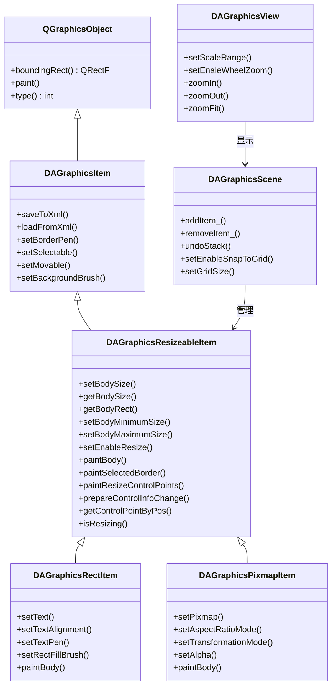
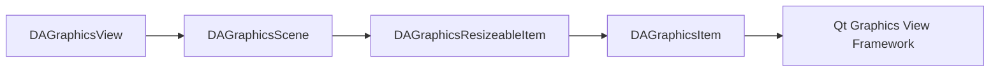
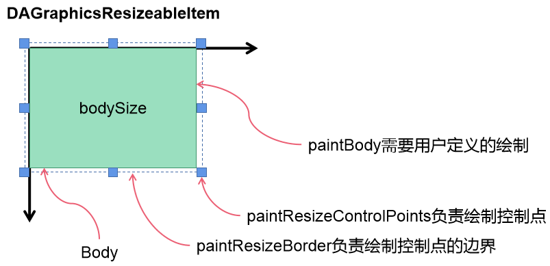
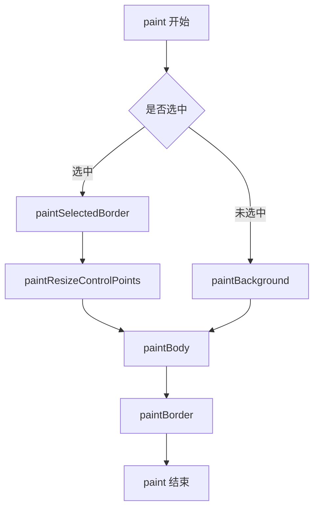
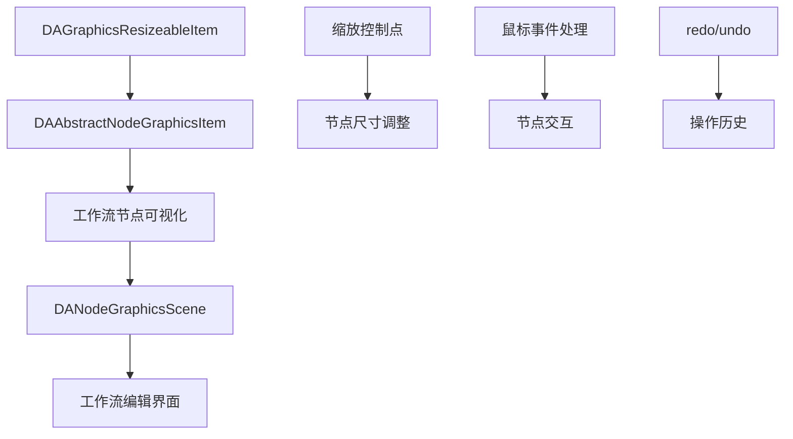

# 可缩放图元模块

可缩放图元编辑模块（DAGraphicsView）基于 Qt 的 Graphics View 框架，提供类似 Microsoft Visio 的图元缩放编辑功能，是工作流可视化编辑的核心基础模块。

## 主要功能特性

**特性**

- ✅ **8控制点缩放**：提供8个可视控制点，用户可通过拖拽控制点调整图元尺寸
- ✅ **鼠标事件集成**：自动处理鼠标悬停、点击、拖拽事件，实现流畅的缩放交互
- ✅ **尺寸限制**：支持设置最小/最大尺寸，防止图元过小或过大
- ✅ **网格对齐**：支持网格对齐功能，便于精确定位
- ✅ **redo/undo 支持**：图元缩放操作支持撤销重做
- ✅ **XML 序列化**：支持图元状态保存和加载

## 模块架构

### 核心类关系图



### 模块依赖



## 核心类详解

### DAGraphicsResizeableItem

`DAGraphicsResizeableItem` 是可缩放图元模块的核心类，继承自 `DAGraphicsItem`，提供了完整的图元缩放控制功能。

#### 关键设计理念

与标准 `QGraphicsItem::paint` 接口不同，`DAGraphicsResizeableItem` 提供了 `paintBody` 虚函数作为绘制接口：

| 接口 | 说明 |
|------|------|
| `paint` | 完整绘制流程，包含控制点、边框、内容体 |
| `paintBody` | 仅绘制内容体，用户只需重写此方法 |

这种设计将控制点绘制、边框绘制等公共逻辑封装在基类中，用户只需关注核心内容绘制。

#### 控制点类型

图元提供8个控制点和4条控制线，用于精确调整尺寸：

```cpp
enum ControlType {
    NotUnderAnyControlType = 0,  // 不在控制点上
    ControlPointTopLeft,         // 左上控制点
    ControlPointTopMid,          // 顶部中间控制点
    ControlPointTopRight,        // 右上控制点
    ControlPointRightMid,        // 右边中间控制点
    ControlPointBottomRight,     // 右下控制点
    ControlPointBottomMid,       // 底部中间控制点
    ControlPointBottomLeft,      // 左下控制点
    ControlPointLeftMid,         // 左面中间控制点
    ControlLineLeft,             // 左边控制线
    ControlLineTop,              // 顶部控制线
    ControlLineRight,            // 右边控制线
    ControlLineBottom            // 底部控制线
};
```



#### 绘制流程

`DAGraphicsResizeableItem::paint` 的完整绘制流程如下：



## 使用方法

### 创建可缩放图元

继承 `DAGraphicsResizeableItem` 创建自定义可缩放图元：

```cpp
// 自定义可缩放图元类
class MyCustomItem : public DA::DAGraphicsResizeableItem
{
    Q_OBJECT
public:
    MyCustomItem(QGraphicsItem* parent = nullptr) 
        : DA::DAGraphicsResizeableItem(parent)
    {
        // 设置初始尺寸
        setBodySize(QSizeF(100, 80));
        // 设置最小尺寸限制
        setBodyMinimumSize(QSizeF(50, 40));
        // 允许缩放
        setEnableResize(true);
    }
    
    // 重写 paintBody 方法绘制自定义内容
    void paintBody(QPainter* painter,
                   const QStyleOptionGraphicsItem* option,
                   QWidget* widget,
                   const QRectF& bodyRect) override
    {
        // 绘制自定义内容，bodyRect 是绘图区域
        painter->setBrush(QColor(100, 150, 200));
        painter->drawRect(bodyRect);
        
        // 绘制文本
        painter->drawText(bodyRect, Qt::AlignCenter, "自定义图元");
    }
};
```

### 使用预定义图元

使用模块提供的预定义图元：

```cpp
// 创建场景
DA::DAGraphicsScene* scene = new DA::DAGraphicsScene(this);

// 创建矩形图元（支持redo/undo）
DA::DAGraphicsRectItem* rectItem = scene->createRect_(QPointF(100, 100));
rectItem->setBodySize(QSizeF(150, 100));
rectItem->setText("矩形图元");
rectItem->setTextAlignment(Qt::AlignCenter);

// 创建图片图元
DA::DAGraphicsPixmapItem* pixmapItem = new DA::DAGraphicsPixmapItem();
pixmapItem->setPixmap(QPixmap(":/images/logo.png"));
pixmapItem->setBodySize(QSizeF(200, 150));
pixmapItem->setAspectRatioMode(Qt::KeepAspectRatio);  // 保持宽高比
scene->addItem_(pixmapItem);

// 效果：场景中添加了一个矩形图元和图片图元，可通过控制点缩放
```

### 处理尺寸变化

监听图元尺寸变化信号：

```cpp
// 连接场景的尺寸变化信号
connect(scene, &DA::DAGraphicsScene::itemBodySizeChanged,
        this, [](DA::DAGraphicsResizeableItem* item, 
                 const QSizeF& oldSize, const QSizeF& newSize) {
    qDebug() << "图元尺寸从" << oldSize << "变为" << newSize;
});

// 连接单个图元的尺寸变化信号
connect(rectItem, &DA::DAGraphicsResizeableItem::itemBodySizeChanged,
        this, [](const QSizeF& oldSize, const QSizeF& newSize) {
    qDebug() << "尺寸变化：" << oldSize << "->" << newSize;
});
```

### 配置缩放限制

设置图元尺寸的上下限：

```cpp
// 设置最小尺寸（防止图元过小）
item->setBodyMinimumSize(QSizeF(30, 30));

// 设置最大尺寸（防止图元过大）
item->setBodyMaximumSize(QSizeF(500, 400));

// 禁用缩放功能
item->setEnableResize(false);

// 设置控制点大小
item->setControlerSize(QSizeF(8, 8));
```

### 网格对齐

启用网格对齐便于精确定位：

```cpp
// 启用网格对齐
scene->setEnableSnapToGrid(true);

// 设置网格大小
scene->setGridSize(QSize(10, 10));

// 显示网格线
scene->showGridLine(true);

// 设置网格线样式
scene->setGridLinePen(QPen(QColor(200, 200, 200), 1, Qt::DotLine));
```

## 与工作流模块的关系

可缩放图元模块是工作流可视化编辑的基础：



工作流模块中的 `DAAbstractNodeGraphicsItem` 继承 `DAGraphicsResizeableItem`，通过可缩放图元的能力实现工作流节点的可视化编辑。

!!! tip "继承关系"
    自定义工作流节点图元时，继承 `DAAbstractNodeGraphicsItem` 即可获得完整的缩放编辑能力。

## API 参考

### DAGraphicsResizeableItem 核心方法

| 方法 | 参数 | 返回值 | 说明 |
|------|------|--------|------|
| `setBodySize` | QSizeF | void | 设置图元内容尺寸 |
| `getBodySize` | 无 | QSizeF | 获取图元内容尺寸 |
| `getBodyRect` | 无 | QRectF | 获取内容区域矩形 |
| `setBodyMinimumSize` | QSizeF | void | 设置最小尺寸限制 |
| `setBodyMaximumSize` | QSizeF | void | 设置最大尺寸限制 |
| `setEnableResize` | bool | void | 设置是否允许缩放 |
| `isResizable` | 无 | bool | 判断是否可缩放 |
| `setControlerSize` | QSizeF | void | 设置控制点大小 |
| `prepareControlInfoChange` | 无 | void | 尺寸变化后刷新控制点信息 |
| `getControlPointByPos` | QPointF | ControlType | 检测点在哪个控制点上 |

### DAGraphicsResizeableItem 需重写方法

| 方法 | 参数 | 返回值 | 说明 |
|------|------|--------|------|
| `paintBody` | painter, option, widget, bodyRect | void | 绘制图元内容体（必须实现） |
| `getBodyShape` | 无 | QPainterPath | 获取内容体的形状路径 |
| `setBodySize` | QSizeF | void | 重载可控制特殊尺寸逻辑（如保持宽高比） |

### DAGraphicsResizeableItem 信号

| 信号 | 参数 | 触发时机 |
|------|------|----------|
| `itemBodySizeChanged` | QSizeF, QSizeF | 内容尺寸变化时 |

### DAGraphicsScene 相关方法

| 方法 | 参数 | 返回值 | 说明 |
|------|------|--------|------|
| `addItem_` | QGraphicsItem* | QUndoCommand* | 添加图元（支持redo/undo） |
| `removeItem_` | QGraphicsItem* | QUndoCommand* | 移除图元（支持redo/undo） |
| `createRect_` | QPointF | DAGraphicsRectItem* | 创建矩形图元 |
| `createText_` | QString | DAGraphicsTextItem* | 创建文本图元 |
| `setEnableSnapToGrid` | bool | void | 启用网格对齐 |
| `setGridSize` | QSize | void | 设置网格尺寸 |

## 注意事项

!!! warning "PIMPL 模式"
    `DAGraphicsResizeableItem` 使用 PIMPL 模式实现，相关宏定义见 `DAGlobals.h`：
    - `DA_DECLARE_PRIVATE` - 声明私有数据指针
    - `DA_D` - 获取私有数据指针

!!! warning "prepareControlInfoChange 调用"
    在尺寸变化后（如 `prepareGeometryChange` 之后）必须调用 `prepareControlInfoChange()` 刷新控制点信息，否则控制点位置可能不正确。

!!! tip "paintBody 绘制范围"
    `paintBody` 的 `bodyRect` 参数限定绘制区域，请勿在此区域外绘制，否则可能导致显示异常。

!!! note "Qt版本兼容性"
    Qt5 和 Qt6 的 Graphics View 框架接口基本一致，无需特殊兼容处理。

!!! info "样式配置"
    全局样式通过 `daGlobalGraphicsResizeableItemPalette` 单例管理：
    - `resizeControlPointBorderColor` - 控制点边框颜色
    - `resizeBorderColor` - 选中边框颜色
    - `resizeControlPointBrush` - 控制点填充颜色

## 参考资料

- [工作流模块](workflow.md)
- [Qt Graphics View Framework](https://doc.qt.io/qt-6/graphicsview.html)
- 源码目录：`src/DAGraphicsView`