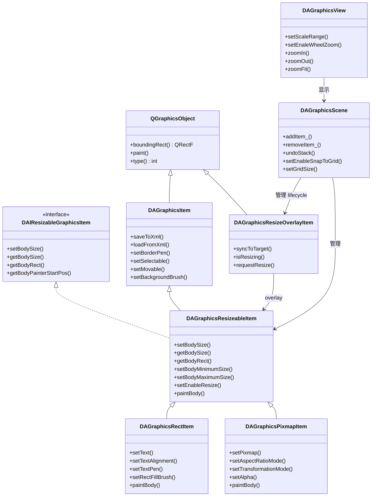
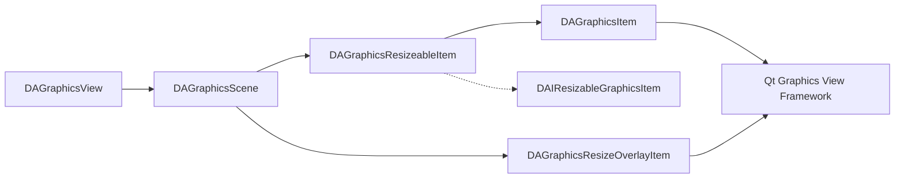
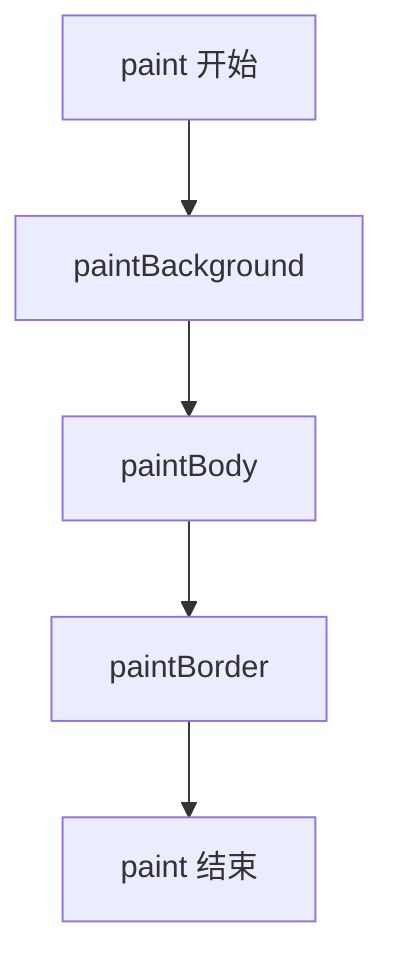
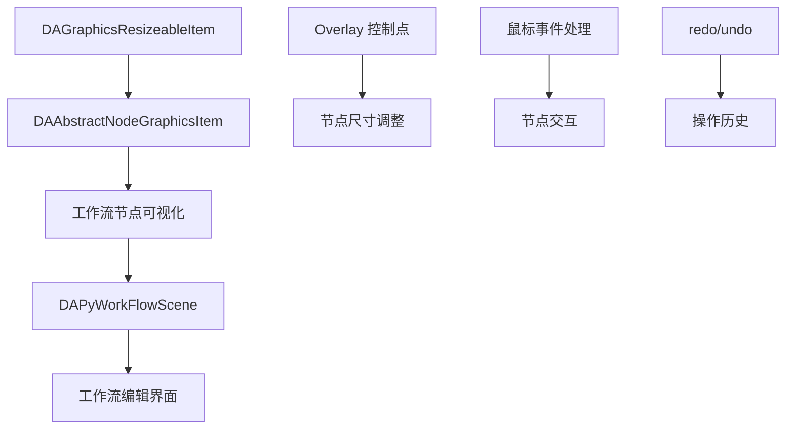

# 可缩放图元模块

可缩放图元编辑模块（DAGraphicsView）基于 Qt 的 Graphics View 框架，提供类似 Microsoft Visio 的图元缩放编辑功能，是工作流可视化编辑的核心基础模块。

## 主要功能特性

**特性**

- ✅ **8控制点缩放**：提供8个可视控制点，用户可通过拖拽控制点调整图元尺寸
- ✅ **Overlay 模式**：控制点绘制和鼠标交互由独立的 `DAGraphicsResizeOverlayItem` 管理，不再耦合在图元基类中
- ✅ **鼠标事件集成**：自动处理鼠标悬停、点击、拖拽事件，实现流畅的缩放交互
- ✅ **尺寸限制**：支持设置最小/最大尺寸，防止图元过小或过大
- ✅ **网格对齐**：支持网格对齐功能，便于精确定位
- ✅ **redo/undo 支持**：图元缩放操作支持撤销重做
- ✅ **XML 序列化**：支持图元状态保存和加载

## 模块架构

### 核心类关系图

绘图模块的核心类通过继承关系组织，`DAGraphicsResizeableItem` 提供 body 尺寸管理，`DAGraphicsResizeOverlayItem` 作为独立 Overlay 负责控制点绘制和缩放交互。下图展示了类的继承和依赖关系：


```mermaid
classDiagram
    class QGraphicsObject {
        +boundingRect() QRectF
        +paint()
        +type() int
    }

    class DAIResizableGraphicsItem {
        <<interface>>
        +setBodySize()
        +getBodySize()
        +getBodyRect()
        +getBodyPainterStartPos()
    }

    class DAGraphicsItem {
        +saveToXml()
        +loadFromXml()
        +setBorderPen()
        +setSelectable()
        +setMovable()
        +setBackgroundBrush()
    }

    class DAGraphicsResizeableItem {
        +setBodySize()
        +getBodySize()
        +getBodyRect()
        +setBodyMinimumSize()
        +setBodyMaximumSize()
        +setEnableResize()
        +paintBody()
    }

    class DAGraphicsResizeOverlayItem {
        +syncToTarget()
        +isResizing()
        +requestResize()
    }

    class DAGraphicsRectItem {
        +setText()
        +setTextAlignment()
        +setTextPen()
        +setRectFillBrush()
        +paintBody()
    }

    class DAGraphicsPixmapItem {
        +setPixmap()
        +setAspectRatioMode()
        +setTransformationMode()
        +setAlpha()
        +paintBody()
    }

    class DAGraphicsScene {
        +addItem_()
        +removeItem_()
        +undoStack()
        +setEnableSnapToGrid()
        +setGridSize()
    }

    class DAGraphicsView {
        +setScaleRange()
        +setEnaleWheelZoom()
        +zoomIn()
        +zoomOut()
        +zoomFit()
    }

    QGraphicsObject <|-- DAGraphicsItem
    DAIResizableGraphicsItem <|.. DAGraphicsResizeableItem
    DAGraphicsItem <|-- DAGraphicsResizeableItem
    DAGraphicsResizeableItem <|-- DAGraphicsRectItem
    DAGraphicsResizeableItem <|-- DAGraphicsPixmapItem
    QGraphicsObject <|-- DAGraphicsResizeOverlayItem
    DAGraphicsResizeOverlayItem --> DAGraphicsResizeableItem : overlay
    DAGraphicsScene --> DAGraphicsResizeOverlayItem : 管理 lifecycle
    DAGraphicsScene --> DAGraphicsResizeableItem : 管理
    DAGraphicsView --> DAGraphicsScene : 显示
```

上图展示了可缩放图元模块的类继承关系：

- `DAIResizableGraphicsItem` 是纯虚接口，定义可缩放图元的契约
- `DAGraphicsItem` 是所有图元的基类，提供 XML 序列化、边框、可选、可移动等基础功能
- `DAGraphicsResizeableItem` 继承 `DAGraphicsItem` 并实现 `DAIResizableGraphicsItem`，提供 body 尺寸管理
- `DAGraphicsResizeOverlayItem` 是独立的 Overlay 类（继承 `QGraphicsObject`），负责控制点绘制和鼠标缩放交互，由 `DAGraphicsScene` 管理生命周期
- `DAGraphicsRectItem` 和 `DAGraphicsPixmapItem` 是具体的图元实现
- `DAGraphicsScene` 和 `DAGraphicsView` 提供场景管理和视图显示

### Overlay 模式架构

控制点绘制和缩放交互已从 `DAGraphicsResizeableItem` 移至独立的 `DAGraphicsResizeOverlayItem`，解决了以下问题：

| 问题 | 解决方案 |
|------|----------|
| 控制点被上层 item 遮挡 | Overlay 以最高 z-value 独立绘制，不受 item 层级影响 |
| 旋转下缩放数学错误 | Overlay 继承 target 的 pos/rotation，局部坐标系与 target 对齐，缩放计算自动正确 |
| 强制继承 | 缩放逻辑解耦，任何实现 `DAIResizableGraphicsItem` 的 item 均可获得缩放能力 |

### 模块依赖

可缩放图元模块的依赖关系如下，从视图到场景再到具体图元层层递进：


```mermaid
flowchart LR
    A[DAGraphicsView] --> B[DAGraphicsScene]
    B --> C[DAGraphicsResizeableItem]
    B --> O[DAGraphicsResizeOverlayItem]
    C --> D[DAGraphicsItem]
    C -.-> I[DAIResizableGraphicsItem]
    D --> E[Qt Graphics View Framework]
    O --> E
```

上图展示了模块的依赖层次：视图依赖场景，场景管理图元和 Overlay，图元继承基类并实现接口，最终依赖 Qt Graphics View 框架。

## 核心类详解

### DAIResizableGraphicsItem

纯虚接口，定义可缩放图元的契约。`DAGraphicsResizeableItem` 实现此接口，`DAGraphicsResizeOverlayItem` 通过此接口操作 target。

| 接口方法 | 说明 |
|----------|------|
| `setBodySize` | 设置内容尺寸 |
| `getBodySize` | 获取内容尺寸 |
| `getBodyRect` | 获取内容区域矩形 |
| `getBodyPainterStartPos` | 获取绘制起始位置 |
| `graphicsItem` | 获取 QGraphicsItem 指针 |

### DAGraphicsResizeableItem

`DAGraphicsResizeableItem` 是可缩放图元模块的核心类，继承自 `DAGraphicsItem`，实现 `DAIResizableGraphicsItem` 接口，提供 body 尺寸管理功能。控制点绘制和缩放交互已移至 `DAGraphicsResizeOverlayItem`。

#### 关键设计理念

与标准 `QGraphicsItem::paint` 接口不同，`DAGraphicsResizeableItem` 提供了 `paintBody` 虚函数作为绘制接口：

| 接口 | 说明 |
|------|------|
| `paint` | 完整绘制流程，包含边框、内容体 |
| `paintBody` | 仅绘制内容体，用户只需重写此方法 |

!!! note "控制点绘制已移至 Overlay"
    控制点绘制 (`paintResizeControlPoints`)、选中边框绘制 (`paintSelectedBorder`)、控制点检测 (`getControlPointByPos`)、缩放状态查询 (`isResizing`) 等方法已从 `DAGraphicsResizeableItem` 移除，由 `DAGraphicsResizeOverlayItem` 接管。

#### 绘制流程

`DAGraphicsResizeableItem::paint` 的绘制流程如下。控制点绘制由独立的 `DAGraphicsResizeOverlayItem` 负责，不再在此流程中：


```mermaid
flowchart TD
    A[paint 开始] --> B[paintBackground]
    B --> C[paintBody]
    C --> D[paintBorder]
    D --> E[paint 结束]
```

上图展示了绘制流程：

- 先绘制背景，再绘制内容体，最后绘制边框
- 选中边框和控制点由 `DAGraphicsResizeOverlayItem` 独立绘制，与图元 `paint` 流程分离

### DAGraphicsResizeOverlayItem

独立的 Overlay 类，继承 `QGraphicsObject`，负责控制点绘制和鼠标缩放交互。

| 方法 | 说明 |
|------|------|
| `syncToTarget` | 同步 Overlay 的 pos/rotation/transformOriginPoint 到 target |
| `isResizing` | 判断当前是否正在缩放 |
| `hitTest` | 检测指定位置在哪个控制点上 |
| `computeResize` | 计算缩放结果（支持旋转感知） |

Overlay 通过信号 `requestResize(target, oldPos, oldSize, newPos, newSize)` 通知 `DAGraphicsScene` 创建 undo command。Scene 在 `selectionChanged` 时创建/销毁 Overlay。

## 使用方法

### 创建可缩放图元

继承 `DAGraphicsResizeableItem` 创建自定义可缩放图元：

```cpp
// 自定义可缩放图元类
class MyCustomItem : public DA::DAGraphicsResizeableItem
{
    Q_OBJECT
public:
    MyCustomItem(QGraphicsItem* parent = nullptr) 
        : DA::DAGraphicsResizeableItem(parent)
    {
        // 设置初始尺寸
        setBodySize(QSizeF(100, 80));
        // 设置最小尺寸限制
        setBodyMinimumSize(QSizeF(50, 40));
        // 允许缩放
        setEnableResize(true);
    }
    
    // 重写 paintBody 方法绘制自定义内容
    void paintBody(QPainter* painter,
                   const QStyleOptionGraphicsItem* option,
                   QWidget* widget,
                   const QRectF& bodyRect) override
    {
        // 绘制自定义内容，bodyRect 是绘图区域
        painter->setBrush(QColor(100, 150, 200));
        painter->drawRect(bodyRect);
        
        // 绘制文本
        painter->drawText(bodyRect, Qt::AlignCenter, "自定义图元");
    }
};
```

### 使用预定义图元

使用模块提供的预定义图元：

```cpp
// 创建场景
DA::DAGraphicsScene* scene = new DA::DAGraphicsScene(this);

// 创建矩形图元（支持redo/undo）
DA::DAGraphicsRectItem* rectItem = scene->createRect_(QPointF(100, 100));
rectItem->setBodySize(QSizeF(150, 100));
rectItem->setText("矩形图元");
rectItem->setTextAlignment(Qt::AlignCenter);

// 创建图片图元
DA::DAGraphicsPixmapItem* pixmapItem = new DA::DAGraphicsPixmapItem();
pixmapItem->setPixmap(QPixmap(":/images/logo.png"));
pixmapItem->setBodySize(QSizeF(200, 150));
pixmapItem->setAspectRatioMode(Qt::KeepAspectRatio);  // 保持宽高比
scene->addItem_(pixmapItem);

// 效果：场景中添加了一个矩形图元和图片图元，可通过控制点缩放
```

### 处理尺寸变化

监听场景级图元尺寸变化信号（item 级信号已移除，使用场景信号）：

```cpp
// 连接场景的尺寸变化信号
connect(scene, &DA::DAGraphicsScene::itemBodySizeChanged,
        this, [](DA::DAGraphicsResizeableItem* item, 
                 const QSizeF& oldSize, const QSizeF& newSize) {
    qDebug() << "图元尺寸从" << oldSize << "变为" << newSize;
});
```

!!! warning "item 级 itemBodySizeChanged 信号已移除"
    `DAGraphicsResizeableItem` 上的 `itemBodySizeChanged` 信号已在重构中移除。请改用 `DAGraphicsScene::itemBodySizeChanged` 场景级信号。

### 配置缩放限制

设置图元尺寸的上下限：

```cpp
// 设置最小尺寸（防止图元过小）
item->setBodyMinimumSize(QSizeF(30, 30));

// 设置最大尺寸（防止图元过大）
item->setBodyMaximumSize(QSizeF(500, 400));

// 禁用缩放功能
item->setEnableResize(false);
```

### 网格对齐

启用网格对齐便于精确定位：

```cpp
// 启用网格对齐
scene->setEnableSnapToGrid(true);

// 设置网格大小
scene->setGridSize(QSize(10, 10));

// 显示网格线
scene->showGridLine(true);

// 设置网格线样式
scene->setGridLinePen(QPen(QColor(200, 200, 200), 1, Qt::DotLine));
```

## 与工作流模块的关系

可缩放图元模块是工作流可视化编辑的基础，工作流节点图元继承可缩放图元获得完整的编辑能力。下图展示了两个模块的关系：


```mermaid
flowchart TD
    A[DAGraphicsResizeableItem] --> B[DAAbstractNodeGraphicsItem]
    B --> C[工作流节点可视化]
    C --> D[DAPyWorkFlowScene]
    D --> E[工作流编辑界面]
    
    F[Overlay 控制点] --> G[节点尺寸调整]
    H[鼠标事件处理] --> I[节点交互]
    J[redo/undo] --> K[操作历史]
```

上图展示了可缩放图元模块如何支撑工作流可视化编辑：

- `DAAbstractNodeGraphicsItem` 继承 `DAGraphicsResizeableItem`，获得缩放能力
- `DAGraphicsResizeOverlayItem` 提供控制点和交互，支持节点尺寸调整
- redo/undo 支持操作历史，实现完整的编辑体验

工作流模块中的 `DAAbstractNodeGraphicsItem` 继承 `DAGraphicsResizeableItem`，通过可缩放图元的能力实现工作流节点的可视化编辑。

!!! tip "继承关系"
    自定义工作流节点图元时，继承 `DAAbstractNodeGraphicsItem` 即可获得完整的缩放编辑能力。

## API 参考

### DAIResizableGraphicsItem 接口方法

| 方法 | 参数 | 返回值 | 说明 |
|------|------|--------|------|
| `setBodySize` | QSizeF | void | 设置图元内容尺寸 |
| `getBodySize` | 无 | QSizeF | 获取图元内容尺寸 |
| `getBodyRect` | 无 | QRectF | 获取内容区域矩形 |
| `getBodyPainterStartPos` | 无 | QPointF | 获取绘制起始位置 |
| `graphicsItem` | 无 | QGraphicsItem* | 获取 QGraphicsItem 指针 |

### DAGraphicsResizeableItem 核心方法

| 方法 | 参数 | 返回值 | 说明 |
|------|------|--------|------|
| `setBodySize` | QSizeF | void | 设置图元内容尺寸 |
| `getBodySize` | 无 | QSizeF | 获取图元内容尺寸 |
| `getBodyRect` | 无 | QRectF | 获取内容区域矩形 |
| `setBodyMinimumSize` | QSizeF | void | 设置最小尺寸限制 |
| `setBodyMaximumSize` | QSizeF | void | 设置最大尺寸限制 |
| `setEnableResize` | bool | void | 设置是否允许缩放 |
| `isResizable` | 无 | bool | 判断是否可缩放 |

### DAGraphicsResizeableItem 需重写方法

| 方法 | 参数 | 返回值 | 说明 |
|------|------|--------|------|
| `paintBody` | painter, option, widget, bodyRect | void | 绘制图元内容体（必须实现） |
| `getBodyShape` | 无 | QPainterPath | 获取内容体的形状路径 |
| `setBodySize` | QSizeF | void | 重载可控制特殊尺寸逻辑（如保持宽高比） |

### DAGraphicsResizeOverlayItem 方法

| 方法 | 参数 | 返回值 | 说明 |
|------|------|--------|------|
| `syncToTarget` | 无 | void | 同步 Overlay 变换到 target |
| `isResizing` | 无 | bool | 判断是否正在缩放 |
| `hitTest` | QPointF | ControlType | 检测点在哪个控制点上 |
| `computeResize` | QPointF, QSizeF, QSizeF | void | 计算缩放结果（支持旋转） |

### DAGraphicsScene 相关方法

| 方法 | 参数 | 返回值 | 说明 |
|------|------|--------|------|
| `addItem_` | QGraphicsItem* | QUndoCommand* | 添加图元（支持redo/undo） |
| `removeItem_` | QGraphicsItem* | QUndoCommand* | 移除图元（支持redo/undo） |
| `createRect_` | QPointF | DAGraphicsRectItem* | 创建矩形图元 |
| `createText_` | QString | DAGraphicsTextItem* | 创建文本图元 |
| `setEnableSnapToGrid` | bool | void | 启用网格对齐 |
| `setGridSize` | QSize | void | 设置网格尺寸 |

### DAGraphicsScene 信号

| 信号 | 参数 | 触发时机 |
|------|------|----------|
| `itemBodySizeChanged` | DAGraphicsResizeableItem*, QSizeF, QSizeF | 图元尺寸变化时 |
| `itemRotationChanged` | DAGraphicsResizeableItem*, qreal | 图元旋转变化时 |

## 已废弃 API

以下 API 已在 Overlay 重构中废弃，请使用替代方案：

| 已废弃 API | 替代方案 | 状态 |
|------------|----------|------|
| `DAGraphicsResizeableItem::isResizing()` | `DAGraphicsResizeOverlayItem::isResizing()` | 已移除 |
| `DAGraphicsResizeableItem::getControlPointByPos()` | `DAGraphicsResizeOverlayItem::hitTest()` | 已移除 |
| `DAGraphicsResizeableItem::prepareControlInfoChange()` | 无需调用，Overlay 自动同步 | 已移除 |
| `DAGraphicsResizeableItem::paintSelectedBorder()` | 由 `DAGraphicsResizeOverlayItem` 绘制 | 已移除 |
| `DAGraphicsResizeableItem::paintResizeControlPoints()` | 由 `DAGraphicsResizeOverlayItem` 绘制 | 已移除 |
| `DAGraphicsResizeableItem::ControlType` 枚举 | `DAGraphicsResizeOverlayItem::ControlType` 枚举 | 已移除 |
| `DAGraphicsResizeableItem::NotUnderAnyControlType` | `DAGraphicsResizeOverlayItem::NotUnderAnyControlType` | 已移除 |
| `DAGraphicsResizeableItem::controlPointRect` | 由 `DAGraphicsResizeOverlayItem` 管理 | 已移除 |
| `DAGraphicsResizeableItem::itemBodySizeChanged` 信号（item 级） | `DAGraphicsScene::itemBodySizeChanged` 信号（场景级） | 已移除 |
| `daGlobalGraphicsResizeableItemPalette` 全局单例 | 已移除，样式直接在 Overlay 中管理 | 已移除 |
| `DAGraphicsResizeableItemPalette` 类 | 已移除 | 已移除 |
| `DAGraphicsResizeableItem::getBodyControlRect()` | 使用 `getBodyRect()` | 保留为 deprecated 包装 |
| `DAGraphicsResizeableItem::setControlerSize()` | 控制点尺寸由 Overlay 管理 | 保留为 deprecated 包装 |

## 注意事项

!!! warning "PIMPL 模式"
    `DAGraphicsResizeableItem` 使用 PIMPL 模式实现，相关宏定义见 `DAGlobals.h`：
    - `DA_DECLARE_PRIVATE` - 声明私有数据指针
    - `DA_D` - 获取私有数据指针

!!! tip "paintBody 绘制范围"
    `paintBody` 的 `bodyRect` 参数限定绘制区域，请勿在此区域外绘制，否则可能导致显示异常。

!!! note "Qt版本兼容性"
    Qt5 和 Qt6 的 Graphics View 框架接口基本一致，无需特殊兼容处理。

## 参考资料

- [工作流模块](workflow.md)
- [Qt Graphics View Framework](https://doc.qt.io/qt-6/graphicsview.html)
- 源码目录：`src/DAGraphicsView`
