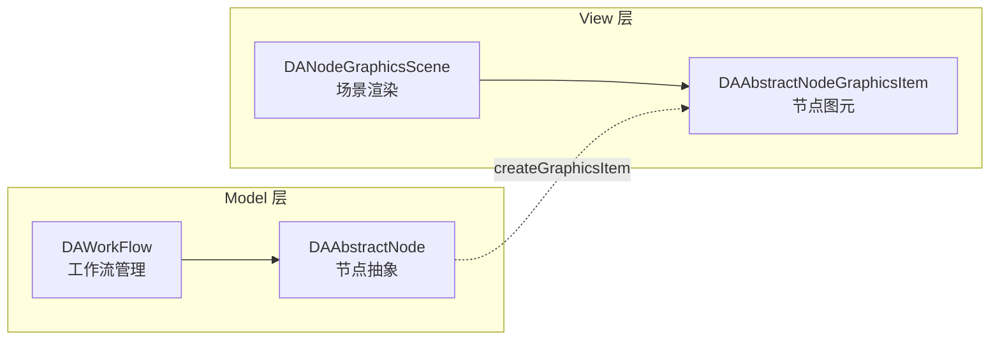

# 节点操作

节点操作文档说明如何在插件中操作工作流节点，包括节点创建、显示、连接以及 redo/undo 支持。

## 主要功能特性

**特性**

- ✅ **分层架构设计**：Model 层（`DAWorkFlow`/`DAAbstractNode`）与 View 层（`DANodeGraphicsScene`/`DAAbstractNodeGraphicsItem`）分离
- ✅ **redo/undo 支持**：通过带 `_` 后缀的方法支持回退功能
- ✅ **命令宏机制**：`beginMacro`/`endMacro` 支持多命令打包为单一回退操作
- ✅ **工厂创建模式**：推荐使用插件工厂创建节点，自动完成初始化

## 基本概念

### 架构层次

工作流的对象是节点（`DAAbstractNode`），但节点是抽象的，要在画布上呈现，则通过节点图元（`DAAbstractNodeGraphicsItem`）来呈现。下图展示了 Model 层和 View 层的分离架构：



上图展示了工作流的分层架构：
- **Model 层**：`DAWorkFlow` 管理节点的图结构和逻辑，`DAAbstractNode` 定义节点的抽象接口
- **View 层**：`DANodeGraphicsScene` 渲染节点图元的场景，`DAAbstractNodeGraphicsItem` 提供节点的可视化表示
- **桥接关系**：节点通过 `createGraphicsItem` 方法创建对应的图元

- `DAWorkFlow`：管理节点的工作流，维护节点图结构（Model 层）
- `DANodeGraphicsScene`：渲染节点的场景，管理节点图元的显示工作（View 层）

## 获取场景

所有插件都会有 `core()` 接口，通过接口链可获取当前场景。以下代码展示了获取场景的完整调用：

```cpp
// 通过接口链获取当前工作流场景
DAWorkFlowGraphicsScene* sc = core()->getUiInterface()->getDockingArea()->getCurrentScene();
```

执行上述代码后，`sc` 指向当前活动的图形场景，可用于添加节点、创建连接等操作。

### 接口调用链

获取场景需要通过一系列接口调用，从插件核心接口到 Dock 区域再到当前场景。下图展示了完整的调用链：


上图展示了接口调用链：插件通过 `core()` 获取核心接口，进而获取 UI 接口，再获取 Dock 区域接口，最终获得当前工作流场景。

## 节点的创建和显示

### 节点创建

节点可以直接 `new` 出来或者通过插件工厂的 `create` 方法创建。以下代码展示了两种创建方式：

```cpp
// 方式1：直接创建，适合简单场景
std::shared_ptr<MyNode> node = std::make_shared<MyNode>();

// 方式2：工厂创建（推荐），会调用 initializNode 记录创建工厂
std::shared_ptr<MyNode> node = std::static_pointer_cast<MyNode>(
    create(DA::DANodeMetaData(QString("My.Node"), QString(u8"My Group"))));
```

执行上述代码后，创建了一个 `MyNode` 节点实例。工厂创建方式会自动初始化节点的工厂引用。

!!! tip "推荐工厂创建"
    使用插件工厂的 `create` 方法会调用 `initializNode`，让节点记录创建它的工厂，便于后续序列化和管理。

### 添加节点到工作流

创建节点后，需要把节点添加到工作流中才能参与数据流处理。以下代码展示了添加节点的流程：

```cpp
// 获取工作流管理器
DAWorkFlow* wf = sc->getWorkflow();

// 添加节点到工作流，节点开始参与工作流逻辑
wf->addNode(node);
```

执行上述代码后，节点被添加到工作流的节点列表中，但此时节点尚未在场景中显示。

### 图元创建与添加

节点创建后不会在场景中显示，需要创建图元并添加到场景。以下代码展示了图元的创建和添加流程：

```cpp
// 创建图元，节点通过 createGraphicsItem 生成对应的可视化图元
DAAbstractNodeGraphicsItem* item = node->createGraphicsItem();

// 设置图元位置（场景坐标）
item->setPos(QPointF(100, 100));

// 添加到场景（带 redo/undo，支持撤销）
sc->addNodeItem_(item);
```

执行上述代码后，场景中出现节点图元，位于坐标 (100, 100)，可通过控制点进行缩放编辑。

!!! warning "方法命名规则"
    - `addItem` / `addNodeItem`：不支持 redo/undo
    - `addItem_` / `addNodeItem_`：支持 redo/undo

    需要回退功能时，应使用带 `_` 后缀的方法。

### addNodeItem 与 addItem 区别

| 方法 | 功能 |
|------|------|
| `addItem` | 只添加图元到场景 |
| `addNodeItem` | 同时添加图元和节点到工作流 |
| `addItem_` | 只添加图元（支持 redo/undo） |
| `addNodeItem_` | 同时添加图元和节点（支持 redo/undo） |

## 创建连接

### 图元连接方法

节点连接应通过图元进行，这会同时建立逻辑层和视图层的连接。以下代码展示了两种连接方式：

```cpp
// 通过端口名称连接，适合已知端口名称的场景
DAAbstractNodeLinkGraphicsItem* linkItem = fromItem->linkToByName("out", toItem, "in");

// 通过端口对象连接，适合需要精确控制端口对象的场景
DAAbstractNodeLinkGraphicsItem* linkItem = fromItem->linkTo(fromPort, toPort);
```

执行上述代码后，两个节点之间建立数据连接，连接线图元显示在场景中。

### 添加连接线到场景

创建连接后，需要添加到场景并刷新位置。以下代码展示了连接线的添加和刷新流程：

```cpp
// 添加连接线到场景（带 redo/undo）
sc->addItem_(linkItem);

// 刷新连接线位置，确保连接线正确显示在两个节点之间
fromItem->updateLinkItems();
toItem->updateLinkItems();
```

执行上述代码后，连接线被添加到场景并正确定位在两个节点的端口之间。

!!! tip "注意"
    连接线不会立即刷新，需要调用 `updateLinkItems` 函数刷新连接线的位置，否则连接线可能显示在错误的位置。

## 命令打包

有些情况一个过程涉及多个命令，对用户应该执行一次回退操作。使用 `beginMacro`/`endMacro` 将多个命令打包为一个宏命令。以下代码展示了命令打包的用法：

```cpp
DAWorkFlowGraphicsScene* sc = core()->getUiInterface()->getDockingArea()->getCurrentScene();

// 开始宏命令，后续所有操作记录到一个宏中
sc->undoStack()->beginMacro("create workflow");

// 创建多个节点、连接节点等操作
// 这些操作会被打包，undo 时一次性撤销所有操作

// 结束宏命令
sc->undoStack()->endMacro();
```

执行上述代码后，宏中的所有操作被记录为一个整体。用户点击撤销按钮时，整个宏中的所有操作被一次性撤销。

## 完整示例

以下示例演示把当前选中的一条连接线打断，中间插入 5 个节点：

```cpp
void MyNodePlugin::createWorkflow()
{
    DA::DAWorkFlowGraphicsScene* sc = core()->getUiInterface()->getDockingArea()->getCurrentScene();
    if (!sc) {
        return;
    }
    
    // 找到当前选中的 item
    const QList<QGraphicsItem*> selItems = sc->selectedItems();
    MyLinkGraphicsItem* mylinkItem = nullptr;
    
    for (auto item : selItems) {
        if (MyLinkGraphicsItem* p = dynamic_cast<MyLinkGraphicsItem*>(item)) {
            if (mylinkItem) {
                QMessageBox::warning(getMainWindow(), 
                    QString(u8"警告"), 
                    QString(u8"请选中一条连接线，不支持多个连接线"));
                return;
            }
            mylinkItem = p;
        }
    }
    
    if (!mylinkItem) {
        QMessageBox::warning(getMainWindow(), 
            QString(u8"警告"), 
            QString(u8"请选中一条连接线"));
        return;
    }
    
    // 找到原来直线连接的前后两个节点
    auto fromNode = std::dynamic_pointer_cast<MyNode>(mylinkItem->fromNode());
    auto toNode   = std::dynamic_pointer_cast<MyNode>(mylinkItem->toNode());
    auto fromItem = dynamic_cast<MyNodeGraphicsItem*>(mylinkItem->fromNodeItem());
    auto toItem   = dynamic_cast<MyNodeGraphicsItem*>(mylinkItem->toNodeItem());
    
    if (!fromNode || !toNode || !fromItem || !toItem) {
        qCritical() << QString(u8"异常");
        return;
    }
    
    // 记录需要刷新的节点 item
    QList<DA::DAAbstractNodeGraphicsItem*> needUpdateLinkItems;
    needUpdateLinkItems << fromItem;
    
    sc->undoStack()->beginMacro("break link line");
    
    // 删除原连接线
    sc->removeItem_(mylinkItem);
    
    MyNodeGraphicsItem* lastAddItem = nullptr;
    
    for (int i = 0; i < 5; ++i) {
        QPointF pos = calculatePosition(i);  // 计算位置
        
        // 创建节点
        std::shared_ptr<MyNode> newNode = std::static_pointer_cast<MyNode>(
            create(DA::DANodeMetaData(QString("My.Node"), QString(u8"My Group"))));
        
        if (!newNode) {
            qCritical() << QString(u8"无法创建节点");
            sc->undoStack()->endMacro();
            sc->undoStack()->redo();  // 恢复之前删除的连接线
            return;
        }
        
        // 创建图元并添加
        auto newNodeItem = static_cast<MyNodeGraphicsItem*>(newNode->createGraphicsItem());
        sc->addNodeItem_(newNodeItem);
        newNodeItem->setPos(pos);
        needUpdateLinkItems << newNodeItem;
        
        // 进行连线
        if (i == 0) {
            auto linkItem = fromItem->linkToByName("out", newNodeItem, "in");
            sc->addItem_(linkItem);
        }
        
        if (lastAddItem) {
            auto linkItem = lastAddItem->linkToByName("out", newNodeItem, "in");
            sc->addItem_(linkItem);
        }
        
        lastAddItem = newNodeItem;
    }
    
    // 最后连接到 toItem
    if (lastAddItem) {
        auto linkItem = lastAddItem->linkToByName("out", toItem, "in");
        sc->addItem_(linkItem);
    }
    
    needUpdateLinkItems << toItem;
    
    // 刷新所有连接线
    for (DA::DAAbstractNodeGraphicsItem* willUpdateItem : needUpdateLinkItems) {
        willUpdateItem->updateLinkItems();
    }
    
    sc->undoStack()->endMacro();
}
```

## 注意事项

!!! warning "redo/undo 方法选择"
    需要支持回退功能时，必须使用带 `_` 后缀的方法。普通方法不会记录到撤销栈。

!!! tip "连接线刷新"
    创建连接后，必须调用 `updateLinkItems` 刷新连接线位置，否则连接线可能显示异常。

!!! note "宏命令使用"
    多个操作需要作为一个整体回退时，使用 `beginMacro`/`endMacro` 包裹。

## 参考资料

- [工作流系统概述](../workflow.md)
- [插件开发指南](./plugin-project-create.md)
- [节点工厂详解](./plugin-module.md)