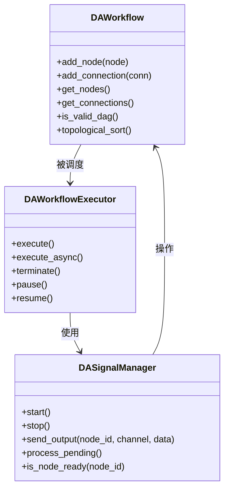
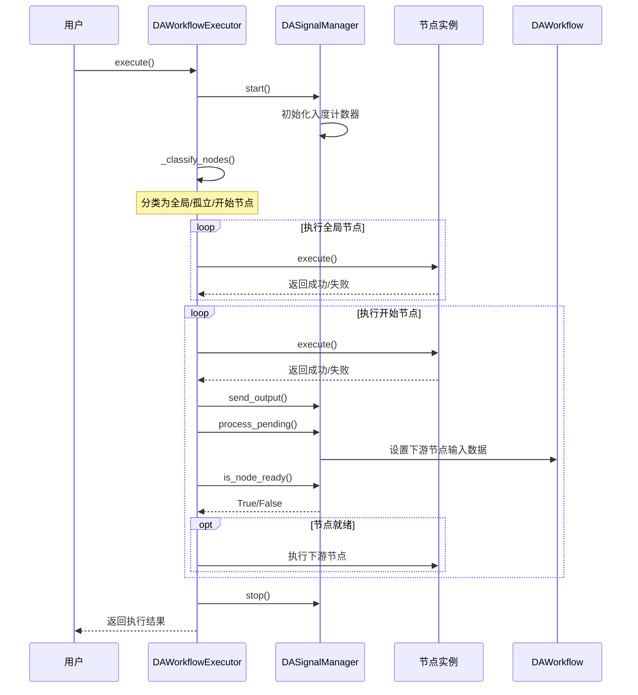
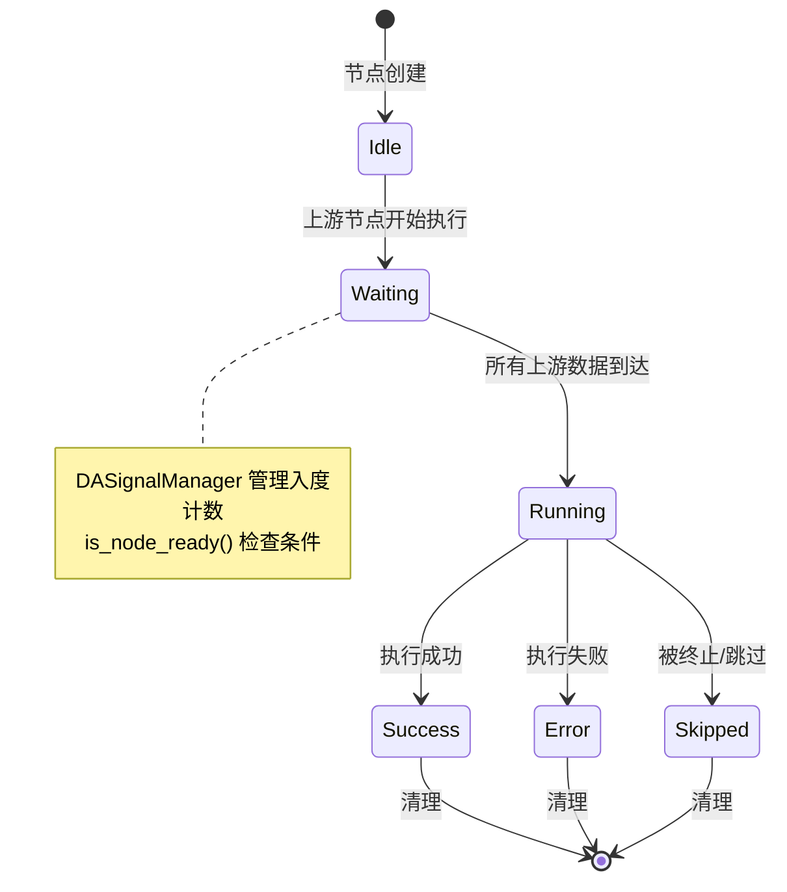

# 工作流生命周期

本文档详细描述 DAPyWorkFlow 工作流的完整生命周期，从节点发现、创建、连接到执行的各个阶段，帮助开发者理解工作流引擎的内部机制。

## 导航

本系列文档包含以下章节：

- [DAPyWorkFlow 模块概述](./workflow-overview.md)
- [插件与节点发现机制](./workflow-plugin-discovery.md)
- [Python 节点开发指南](./workflow-python-node-dev.md)
- [工作流生命周期](./workflow-lifecycle.md) ← 当前页
- [C++ 集成指南](./workflow-cpp-integration.md)
- [场景操作指南](./workflow-scene-operation.md)

## 概述

DAPyWorkFlow 的生命周期设计与旧的 DAWorkFlow 模块有本质区别。旧模块采用纯 C++ 实现，节点通过继承 `DAAbstractNode` 定义，使用回调方法（如 `nodeAddedToWorkflow`、`nodeStartRemove` 等）处理生命周期事件。新模块采用 Python-first 架构，节点在 Python 中定义，C++ 仅负责可视化渲染和执行调度。

新旧模块的核心差异：

| 特性 | 旧 DAWorkFlow | 新 DAPyWorkFlow |
|------|---------------|-----------------|
| 节点定义 | C++ 继承 `DAAbstractNode` | Python `@NodeDef` 装饰器 |
| 生命周期管理 | 回调方法驱动 | 状态机 + 信号驱动 |
| 数据传递 | `DANodeLinkPoint` 连接点 | `DAConnection` + `DASignalManager` |
| 执行引擎 | C++ 拓扑排序 | Python `DAWorkflowExecutor` |

!!! note "架构转变"
    DAPyWorkFlow 不再使用回调方法管理生命周期。节点状态通过 `DAPyNodeState` 枚举管理，数据传递通过 `DASignalManager` 的信号机制完成，执行流程由 `DAWorkflowExecutor` 的拓扑排序算法控制。

## 基本概念

### 生命周期阶段

工作流生命周期包含五个主要阶段：

```
发现(Discovery) → 创建(Creation) → 连接(Connection) → 执行(Execution) → 完成(Completion)
```

| 阶段 | 描述 | 核心类 |
|------|------|--------|
| **发现** | 扫描目录和 entry_points 查找节点类 | `DANodeRegistry` |
| **创建** | 实例化节点并添加到工作流 | `DAPyNodeFactory`, `DAWorkflow` |
| **连接** | 建立节点间的数据流向关系 | `DAConnection` |
| **执行** | 按拓扑排序执行节点 | `DAWorkflowExecutor`, `DASignalManager` |
| **完成** | 清理资源，通知状态变更 | `DAPyWorkFlowLifecycle` |

### 核心类关系

工作流生命周期涉及三个核心类的协作：



- **DAWorkflow**：DAG 模型容器，管理节点实例和连接关系
- **DAWorkflowExecutor**：执行引擎，基于拓扑排序控制节点执行顺序
- **DASignalManager**：信号管理器，负责节点间的数据传播和入度计数

## 节点发现生命周期

节点发现是工作流的起点，负责从文件系统和已安装包中查找可用的节点类型。

### DANodeRegistry 发现流程

```python
from DAWorkbench.DAWorkFlowPy import DANodeRegistry

registry = DANodeRegistry()

# 双模式发现：目录扫描 + entry_points
descriptors = registry.discover(
    scan_paths=["/path/to/plugins"],
    use_entry_points=True
)
```

发现流程包含两个并行模式：

1. **目录扫描模式**：遍历指定路径的 `.py` 文件，动态导入模块，检查类是否带有 `_node_descriptor` 属性
2. **入口点模式**：通过 `importlib.metadata.entry_points(group='data_workbench.plugin')` 查找已安装的插件包

### DANodeDescriptor 元数据

发现的节点以 `DANodeDescriptor` 描述符形式存储：

| 字段 | 类型 | 说明 |
|------|------|------|
| `qualified_name` | str | 唯一标识（模块名.类名） |
| `name` | str | 显示名称 |
| `category` | str | 分类/分组 |
| `inputs` | list | 输入端口定义列表 |
| `outputs` | list | 输出端口定义列表 |
| `parameters` | list | 参数定义列表 |

### C++ 侧节点工厂

C++ 层的 `DAPyNodeFactory` 调用 Python 侧的 `DANodeRegistry` 完成节点发现：

```cpp
DA::DAPyNodeFactory factory;
factory.discoverNodes(scanPaths, useEntryPoints);

// 获取发现的节点元数据
QList<DA::DAPyNodeMetaData> metaList = factory.getNodeMetadataList();
```

`DAPyNodeMetaData` 是 C++ 侧对 `DANodeDescriptor` 的映射，包含节点名称、原型标识、分组、图标路径等信息。

## 节点创建生命周期

节点创建涉及从描述符到实例的转换，以及在工作流中的注册。

### 创建流程

```
DANodeDescriptor → Python 类实例化 → DAPyNodeProxy → DAPyNodeGraphicsItem
```

### Python 侧实例化

```python
from DAWorkbench.DAWorkFlowPy import DAWorkflow

workflow = DAWorkflow()

# 通过描述符创建节点实例（假设 descriptor 包含 _node_class 引用）
node_instance = descriptor._node_class()
node_id = workflow.add_node(node_instance)
```

`DAWorkflow.add_node()` 方法：

1. 检查节点是否有 `qualified_name` 属性
2. 自动生成 `node_id`（格式：`qualified_name_序号`）
3. 将节点实例存入内部字典 `_nodes`
4. 返回分配的 `node_id`

### C++ 侧代理创建

C++ 层通过 `DAPyNodeFactory.createNodeProxy()` 创建节点代理：

```cpp
// 通过限定名创建节点代理
DA::DAPyNodeProxy* proxy = factory.createNodeProxy("module.DataFilter");

// 设置节点状态
proxy->setNodeState(DA::DAPyNodeState::Idle);
```

`DAPyNodeProxy` 是 Python 节点的 C++ 代理，不继承 QObject，通过 `pybind11::object` 持有 Python 节点引用。

### 场景图元创建

`DAPyWorkFlowScene` 负责创建可视化图元：

```cpp
// 创建 Python 节点图元
DAPyNodeGraphicsItem* item = scene->createPyNode(descriptorJson, position);
```

`createPyNode()` 方法：

1. 调用 `DAPyNodeFactory` 创建 `DAPyNodeProxy`
2. 创建 `DAPyNodeGraphicsItem` 图元
3. 将代理与图元关联
4. 发射 `pyNodeItemCreated` 信号

## 节点连接生命周期

节点连接定义数据流向，构成工作流的 DAG 结构。

### DAConnection 连接模型

`DAConnection` 描述从源节点输出端口到目标节点输入端口的连接：

```python
from DAWorkbench.DAWorkFlowPy import DAConnection

conn = DAConnection(
    source_node_id="module.DataFilter_1",
    source_output_channel="filtered",
    target_node_id="module.DataPlot_1",
    target_input_channel="data"
)

workflow.add_connection(conn)
```

连接属性：

| 属性 | 类型 | 说明 |
|------|------|------|
| `source_node_id` | str | 源节点 ID |
| `source_output_channel` | str | 源节点输出端口名 |
| `target_node_id` | str | 目标节点 ID |
| `target_input_channel` | str | 目标节点输入端口名 |
| `connection_id` | str | 连接唯一 ID（UUID） |

### 连接验证

`DAWorkflow.add_connection()` 执行以下验证：

1. 源节点和目标节点必须存在于工作流中
2. 同一对端口不能重复连接
3. 不允许自连接（源节点 != 目标节点）

### 可视化连接

C++ 层的 `DAPyLinkGraphicsItem` 提供连接线的可视化：

```cpp
// 创建连接线
DAPyLinkGraphicsItem* link = scene->addPyNodeLink(
    fromItem, "filtered",
    toItem, "data"
);
```

`DAPyLinkGraphicsItem` 特性：

- 支持三种连线样式：贝塞尔曲线、直线、肘形连接
- 提供数据流动画效果
- 在 `willCompleteLink()` 中验证数据类型兼容性

## 工作流执行生命周期

执行生命周期是工作流的核心阶段，涉及拓扑排序、节点分类、信号传播等复杂机制。

### 执行器状态枚举

`DAExecutorState`（Python）和 `ExecState`（C++）定义执行器状态：

```python
class DAExecutorState(Enum):
    Idle = "idle"       # 空闲，未开始执行
    Running = "running" # 运行中
    Paused = "paused"   # 已暂停
    Error = "error"     # 执行出错
    Finished = "finished"  # 执行完成
```

```cpp
enum ExecState {
    StateIdle = 0,      // 空闲
    StateRunning = 1,   // 运行中
    StatePaused = 2,    // 已暂停
    StateError = 3,     // 执行出错
    StateFinished = 4   // 执行完成
};
```

### 节点分类算法

执行前，`DAWorkflowExecutor` 对节点进行分类：

```python
def _classify_nodes(self) -> tuple:
    """分类节点为全局节点、孤立节点、开始节点"""
    global_nodes = []    # is_global = True
    isolated_nodes = []  # 入度=0 且 出度=0 且非全局
    begin_nodes = []     # 入度=0 且 出度>0

    # 计算入度和出度
    for conn in connections:
        out_degree[conn.source_node_id] += 1
        in_degree[conn.target_node_id] += 1

    # 分类...
```

节点分类规则：

| 类型 | 条件 | 执行行为 |
|------|------|----------|
| **全局节点** | `is_global = True` | 执行但不传递数据 |
| **孤立节点** | 入度=0 且 出度=0 且非全局 | 执行并传递数据 |
| **开始节点** | 入度=0 且 出度>0 | 执行并传递数据到下游 |

### 拓扑排序执行

DAWorkflowExecutor 使用 Kahn 算法进行拓扑排序执行：

```python
def _run_workflow(self) -> bool:
    # 1. 分类节点
    global_nodes, isolated_nodes, begin_nodes = self._classify_nodes()

    # 2. 执行全局节点（不传递数据）
    for node_id in global_nodes:
        self._execute_node(node_id, transmit=False)

    # 3. 执行孤立节点（传递数据）
    for node_id in isolated_nodes:
        self._execute_node(node_id, transmit=True)

    # 4. 执行开始节点（传递数据到下游）
    for node_id in begin_nodes:
        self._execute_node(node_id, transmit=True)
```

### 信号传播机制

`DASignalManager` 实现事件驱动的数据传播：

```python
# 节点执行完成后，发送输出数据
self._signal_manager.send_output(node_id, output_key, output_data)

# 处理待传递的信号
self._signal_manager.process_pending()

# 检查下游节点是否满足执行条件
if self._signal_manager.is_node_ready(target_node_id):
    self._execute_node(target_node_id, transmit=True)
```

信号传播流程：

1. `send_output()`：将节点输出数据加入信号队列
2. `process_pending()`：从队列取出信号，传递到下游节点输入端口
3. `is_node_ready()`：检查节点是否收到所有上游数据（入度计数 == 总入度）
4. 满足条件的节点触发执行

### 执行序列图



### C++ 执行调度

`DAPyWorkFlowLifecycle` 在独立 QThread 中运行：

```cpp
auto lifecycle = new DA::DAPyWorkFlowLifecycle();
lifecycle->setWorkflow(pyWorkflowObj);

QThread* thread = new QThread();
lifecycle->moveToThread(thread);

connect(thread, &QThread::started, lifecycle, &DAPyWorkFlowLifecycle::startExecute);
connect(lifecycle, &DAPyWorkFlowLifecycle::finished, this, &MyClass::onWorkflowFinished);

thread->start();
```

Qt 信号通知：

| 信号 | 参数 | 说明 |
|------|------|------|
| `nodeExecuteFinished` | `shared_ptr<DAPyNodeProxy>, bool` | 节点执行完成 |
| `finished` | `bool` | 工作流执行完成 |
| `execStateChanged` | `ExecState, ExecState` | 执行状态变更 |
| `progressChanged` | `int, int` | 进度变更（当前/总数） |

## 节点状态生命周期

节点状态通过 `DAPyNodeState` 枚举管理：

```cpp
enum DAPyNodeState {
    Idle = 0,    // 空闲状态
    Waiting,     // 等待依赖完成
    Running,     // 运行中
    Success,     // 执行成功
    Error,       // 执行失败
    Skipped      // 被跳过
};
```

### 状态转换图



### 状态转换说明

| 转换 | 触发条件 | 处理逻辑 |
|------|----------|----------|
| Idle → Waiting | 工作流开始执行 | 非开始节点进入等待状态 |
| Waiting → Running | `is_node_ready()` 返回 True | 入度计数满足，开始执行 |
| Running → Success | `execute()` 返回 True | 输出数据传播到下游 |
| Running → Error | `execute()` 返回 False 或抛出异常 | 记录错误，停止当前分支 |
| Running → Skipped | 用户请求终止 | 跳过后续执行 |

### 状态同步

Python 侧状态变更通过 `DAPythonSignalHandler::callInMainThread` 传递到 C++ 侧：

```python
# Python 节点中推送状态
def _push_state(self, state):
    import DAWorkbench
    DAWorkbench.da_interface.call_in_main_thread(
        "node_state_change",
        self.node_id,
        state,
    )
```

C++ 侧 `DAPyWorkFlowScene` 接收通知并更新 UI：

```cpp
void DAPyWorkFlowScene::onPyNodeStateNotification(
    const QString& nodeId,
    DAPyNodeState state
) {
    if (auto* item = findNodeItemById(nodeId)) {
        item->setNodeState(state);
    }
}
```

## GIL 与线程安全

DAPyWorkFlow 涉及 Python GIL（全局解释器锁）的精细管理。

### DAPyGILGuard RAII 模式

```cpp
// 获取 GIL
{
    DA::DAPyGILGuard gil;
    // 在 GIL 保护下调用 Python API
    pybind11::object result = pyNode.attr("execute")();
} // 析构时自动释放 GIL
```

`DAPyGILGuard` 特性：

- 构造时获取 GIL（`gil_scoped_acquire`）
- 析构时释放 GIL
- 禁止拷贝，支持移动

### DAPyGILRelease 临时释放

```cpp
{
    DA::DAPyGILGuard gil;
    // Python 操作...

    {
        DA::DAPyGILRelease release;  // 临时释放 GIL
        emit someQtSignal();          // 安全发射 Qt 信号
    } // 重新获取 GIL

    // 继续 Python 操作...
}
```

### GIL 安全规则

!!! warning "关键规则"
    1. **error_already_set 必须在 GIL 作用域内消费**：异常析构时尝试获取 GIL 会导致死锁
    2. **禁止在持有 GIL 时调用 QThread::wait()**：阻塞等待会导致死锁
    3. **禁止在静态初始化阶段调用 Python API**：GIL 尚未就绪

### 主线程回调

Python 侧通过 `DAPythonSignalHandler::callInMainThread` 将回调投递到 Qt 主线程：

```cpp
// C++ 侧注册回调
void DAPythonSignalHandler::callInMainThread(
    std::function<void()> callback
) {
    // 使用 Qt::QueuedConnection 投递到主线程
    QMetaObject::invokeMethod(this, [callback]() {
        callback();
    }, Qt::QueuedConnection);
}
```

此机制确保 Python 后台线程可以安全地更新 UI。

## 注意事项

### 工作流设计约束

1. **DAG 约束**：工作流必须是无环有向图。`DAWorkflow.is_valid_dag()` 可验证有效性
2. **节点 ID 唯一性**：`node_id` 在工作流内必须唯一，由 `DAWorkflow.add_node()` 自动保证
3. **连接端口匹配**：连接的输出端口和输入端口数据类型应当兼容（由 `DAPyLinkGraphicsItem` 验证）

### 执行控制

1. **终止请求**：`terminate()` 不会中断正在执行的节点，而是等待其完成后停止后续节点
2. **暂停/恢复**：`pause()` 在当前节点完成后暂停，`resume()` 恢复执行
3. **异步执行**：`execute_async()` 在后台线程执行，通过 `wait_completion()` 等待完成

### 内存管理

1. **DAPyNodeProxy 生命周期**：由 `shared_ptr` 管理，确保 Python 对象引用安全
2. **信号队列清理**：`DASignalManager.stop()` 清空待处理信号队列
3. **GIL 异常安全**：使用 RAII 守卫确保 GIL 正确释放，避免死锁

### 调试建议

1. **启用日志**：Python 侧使用 `logging.getLogger("DAWorkFlowPy")` 记录执行日志
2. **状态监控**：连接 `DAPyWorkFlowLifecycle::progressChanged` 信号跟踪执行进度
3. **错误处理**：检查 `DAWorkflowExecutor.error_messages` 获取详细错误信息

## 参考资料

### 核心源码文件

| 模块 | 文件 | 说明 |
|------|------|------|
| Python | `src/PyScripts/DAWorkbench/DAWorkFlowPy/workflow.py` | `DAWorkflow` DAG 模型 |
| Python | `src/PyScripts/DAWorkbench/DAWorkFlowPy/executor.py` | `DAWorkflowExecutor` 执行引擎 |
| Python | `src/PyScripts/DAWorkbench/DAWorkFlowPy/signal_manager.py` | `DASignalManager` 信号管理 |
| Python | `src/PyScripts/DAWorkbench/DAWorkFlowPy/connection.py` | `DAConnection` 连接模型 |
| Python | `src/PyScripts/DAWorkbench/DAWorkFlowPy/node_registry.py` | `DANodeRegistry` 节点发现 |
| C++ | `src/DAPyWorkFlow/DAPyWorkFlowLifecycle.h` | C++ 生命周期控制器 |
| C++ | `src/DAPyWorkFlow/DAPyNodeState.h` | 节点状态枚举 |
| C++ | `src/DAPyWorkFlow/DAPyNodeProxy.h` | 节点代理类 |
| C++ | `src/DAPyWorkFlow/DAPyGILGuard.h` | GIL 管理工具 |
| C++ | `src/DAPyWorkFlow/DAPyWorkFlowScene.h` | 场景管理类 |

### 相关文档

- [DAPyWorkFlow 模块概述](./workflow-overview.md) — 架构概览和快速上手
- [Python 节点开发指南](./workflow-python-node-dev.md) — 节点定义和开发细节
- [C++ 集成指南](./workflow-cpp-integration.md) — C++ 层集成和 pybind11 桥接
- [场景操作指南](./workflow-scene-operation.md) — 可视化场景操作方法
