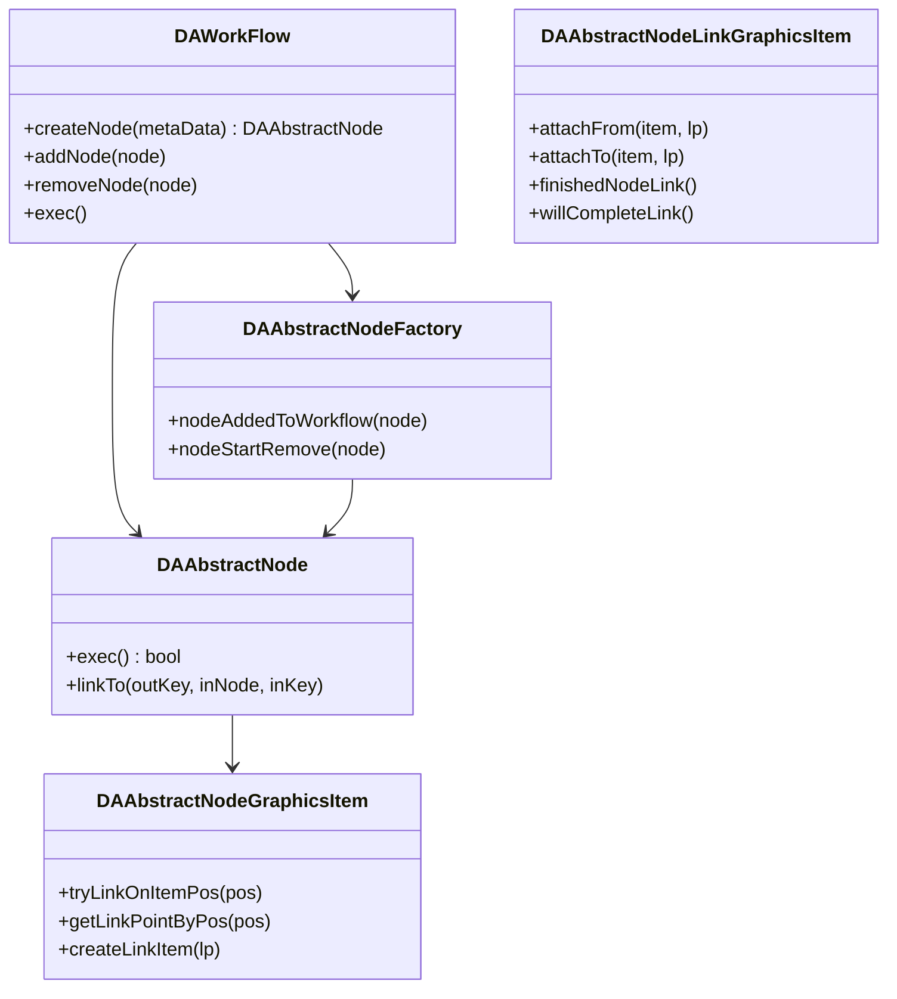
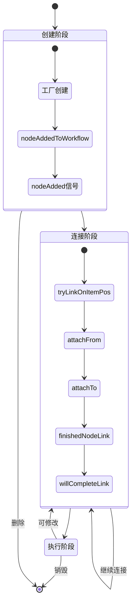
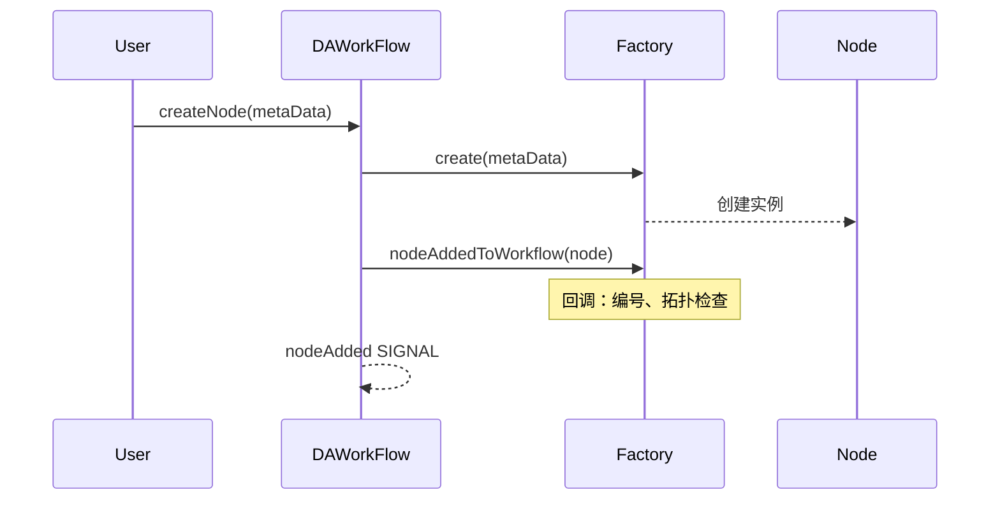
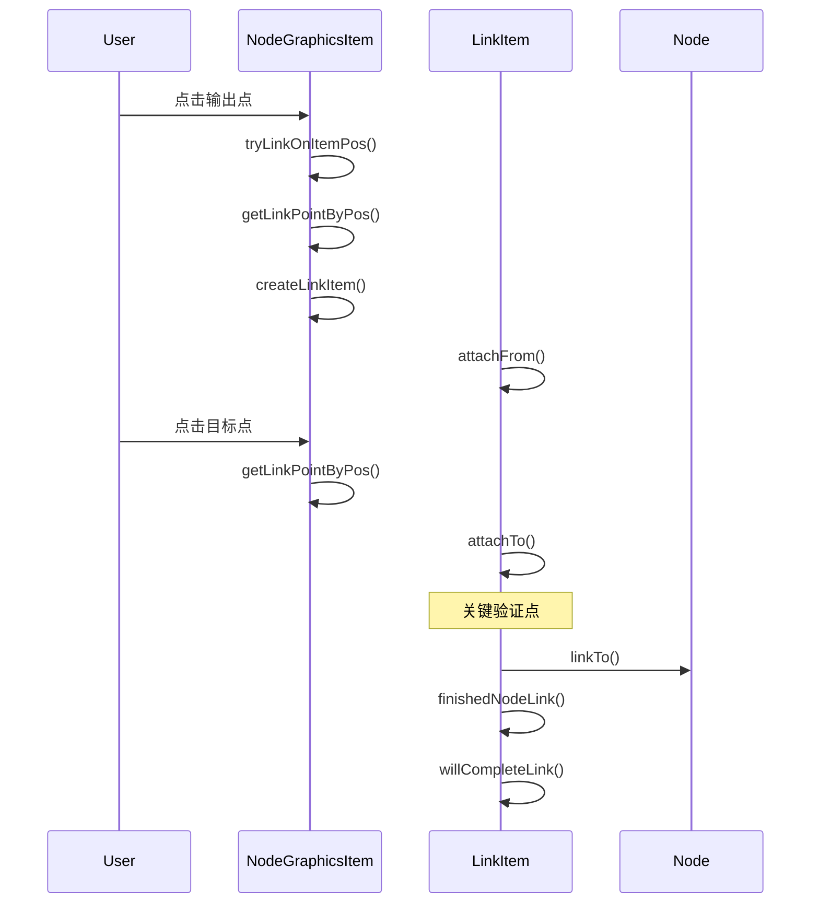

# 工作流生命周期

工作流生命周期描述了节点从创建到销毁、从连接到执行过程中涉及的回调机制。通过生命周期回调，开发者可在关键节点注入自定义逻辑，实现节点编号、拓扑检查、动态连接点生成等功能。

## 主要功能特性

**特性**

- ✅ **节点创建回调**：节点添加和移除时触发回调，支持全局属性设置
- ✅ **节点连接回调**：连接过程多次回调，支持动态连接点生成和验证
- ✅ **节点执行回调**：执行过程回调，支持状态追踪和进度通知
- ✅ **生命周期状态管理**：场景自动管理状态，提供查询接口

## 基本概念

工作流节点生命周期包含四个阶段：创建、连接、执行、移除。

| 阶段 | 触发时机 | 核心操作 |
|------|----------|----------|
| 创建 | 拖入节点 | 节点实例化、属性初始化 |
| 连接 | 拖拽连线 | 验证、数据通道建立 |
| 执行 | 运行工作流 | 数据处理、结果生成 |
| 移除 | 删除节点 | 资源清理、连接解除 |

### 核心类关系



## 生命周期概览



## 节点创建生命周期

节点创建涉及工厂回调和工作流信号，允许在添加前后执行自定义逻辑。

### 创建时序图



### 创建回调

| 类 | 函数/信号 | 说明 |
|-----|-----------|------|
| DAAbstractNodeFactory | `nodeAddedToWorkflow` | 节点即将加入工作流，可设置编号、属性 |
| DAWorkFlow | `nodeAdded` | 添加完成信号，通知界面 |

### 自动编号示例

```cpp
class MyNodeFactory : public DA::DAAbstractNodeFactory
{
public:
    void nodeAddedToWorkflow(DA::DAAbstractNode::SharedPointer node) override
    {
        node->setProperty("nodeIndex", m_counter++);
    }
private:
    int m_counter = 0;
};
```

## 节点移除生命周期

节点移除在删除前触发回调，提供资源清理机会。

### 移除回调

| 类 | 函数/信号 | 说明 |
|-----|-----------|------|
| DAAbstractNodeFactory | `nodeStartRemove` | 即将移除，可清理资源 |
| DAAbstractNode | `detachAll` | 解除所有连接 |
| DAWorkFlow | `nodeRemoved` | 移除完成信号 |

### 资源清理示例

```cpp
void MyNodeFactory::nodeStartRemove(DA::DAAbstractNode::SharedPointer node)
{
    cleanupNodeResources(node->getID());
    m_topology.removeNode(node->getID());
}
```

## 节点连接生命周期

连接是最复杂的交互过程，涉及多个回调，支持动态连接点生成和验证。

### 连接时序图



### 连接回调详解

**开始连接**

| 函数 | 说明 |
|------|------|
| `tryLinkOnItemPos` | 判断是否动态生成连接点 |
| `getLinkPointByPos` | 获取点击位置的连接点 |
| `createLinkItem` | 创建连接线图元 |
| `attachFrom` | 建立起始连接 |

**结束连接**

| 函数 | 说明 |
|------|------|
| `attachTo` | 建立目标连接，关键验证点 |
| `linkTo` | 逻辑层建立连接 |
| `finishedNodeLink` | 逻辑层完成回调 |
| `willCompleteLink` | 视图层完成回调 |

### 动态连接点示例

```cpp
void DynamicNodeItem::tryLinkOnItemPos(const QPointF& pos,
                                        DAAbstractNodeLinkGraphicsItem* link,
                                        DANodeLinkPoint::Way way)
{
    if (way == DANodeLinkPoint::Output && isInDynamicZone(pos)) {
        DANodeLinkPoint lp;
        lp.name = generateUniqueName();
        lp.way = DANodeLinkPoint::Output;
        addLinkPoint(lp);
    }
    DAAbstractNodeGraphicsItem::tryLinkOnItemPos(pos, link, way);
}
```

### 连接验证示例

```cpp
bool TypedNode::linkTo(const QString& outKey,
                        DAAbstractNode::SharedPointer inNode,
                        const QString& inKey)
{
    if (!isTypeCompatible(getOutputType(outKey), 
                          inNode->getInputType(inKey))) {
        return false;
    }
    return DAAbstractNode::linkTo(outKey, inNode, inKey);
}
```

## 节点执行生命周期

执行在工作流运行时触发，按依赖顺序依次执行各节点。

### 执行回调

| 回调/信号 | 触发时机 | 说明 |
|-----------|----------|------|
| `startExecute` | 开始执行 | 通知界面显示状态 |
| `exec()` | 节点执行 | 核心数据处理逻辑 |
| `nodeExecuteFinished` | 单节点完成 | 更新节点状态 |
| `finished` | 工作流完成 | 所有节点完成或失败 |

## 回调函数总结

| 类别 | 函数 | 类 | 用途 |
|------|------|-----|------|
| 创建 | `nodeAddedToWorkflow` | Factory | 属性设置、编号 |
| 移除 | `nodeStartRemove` | Factory | 资源清理 |
| 连接准备 | `tryLinkOnItemPos` | GraphicsItem | 动态连接点 |
| 连接准备 | `getLinkPointByPos` | GraphicsItem | 获取连接点 |
| 连接创建 | `createLinkItem` | GraphicsItem | 创建连接线 |
| 连接建立 | `attachFrom/attachTo` | LinkGraphicsItem | 建立连接 |
| 连接完成 | `finishedNodeLink` | LinkGraphicsItem | 逻辑层完成 |
| 连接完成 | `willCompleteLink` | LinkGraphicsItem | 视图层完成 |
| 执行 | `exec` | Node | 数据处理 |

## 注意事项

!!! warning "finishedNodeLink 与 willCompleteLink 的区别"
    `finishedNodeLink` 是逻辑层完成，`willCompleteLink` 是视图层完成。两者不一致会导致状态不同步。

!!! warning "线程安全"
    执行回调在工作流线程中调用，不要进行界面操作，使用信号通知主线程。

!!! tip "动态连接点"
    重写 `tryLinkOnItemPos` 时，先创建连接点再调用父类方法。

!!! note "文件加载"
    加载过程中可用 `disableFactoryCallBack()` 禁用回调，完成后触发 `workflowReady` 信号。

## 参考资料

- [工作流模块](workflow.md)
- [插件开发指南](plugin-project-create.md)
- 源码：`src/DAWorkFlow`