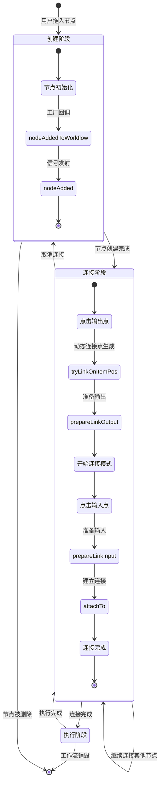
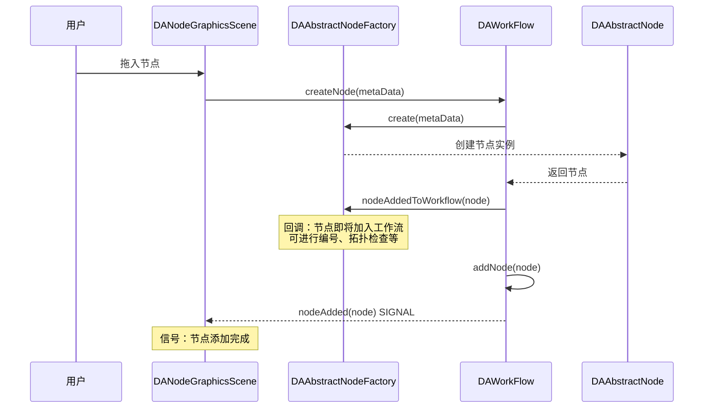
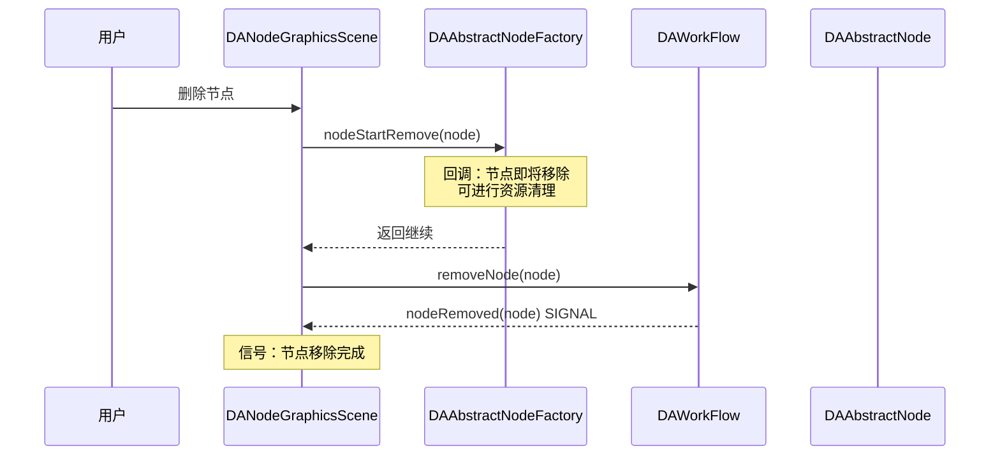
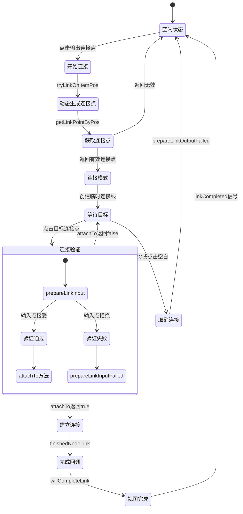
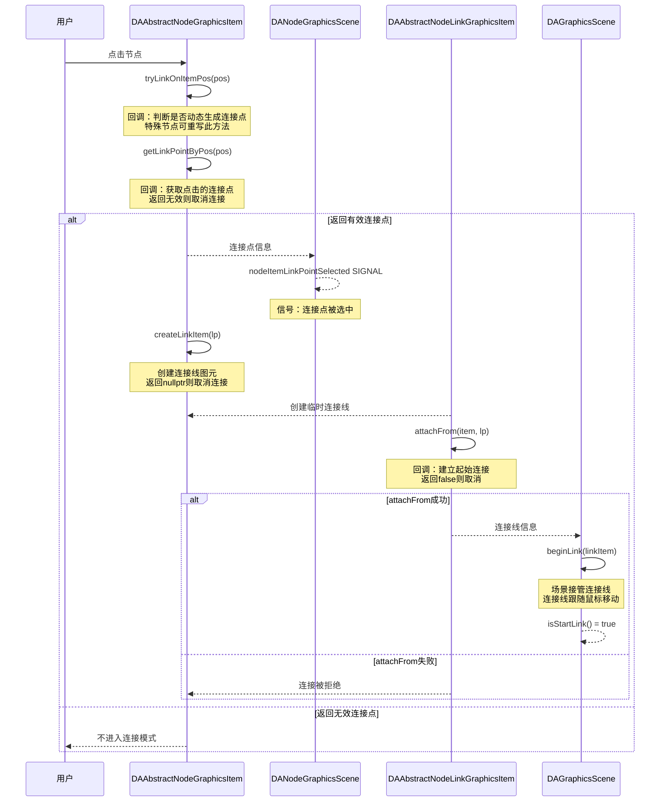
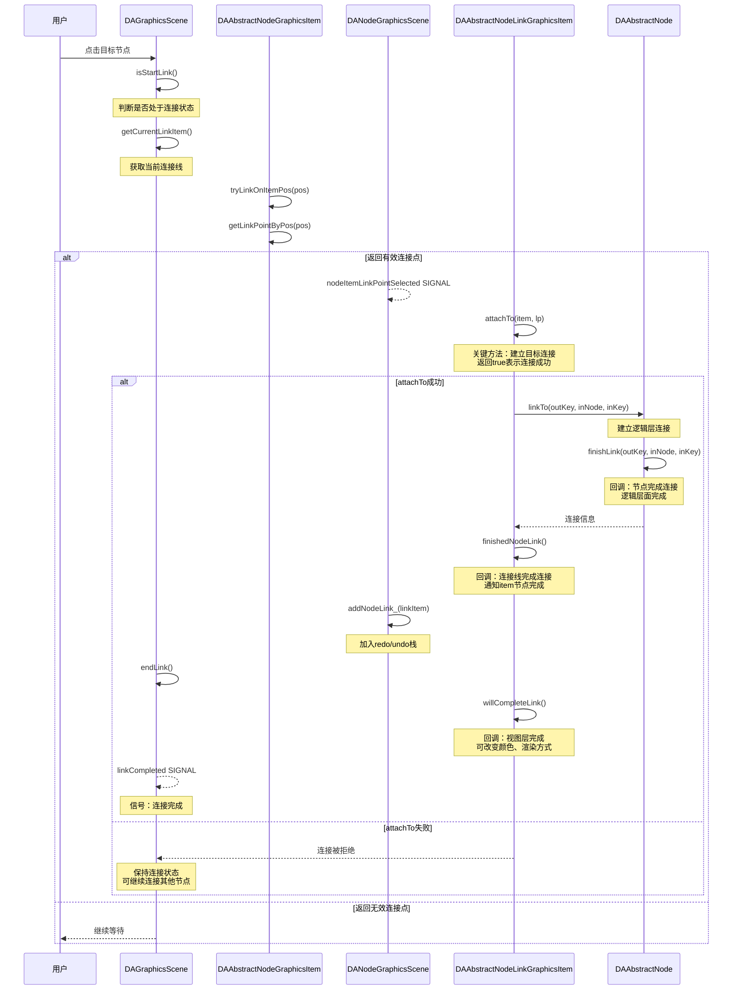
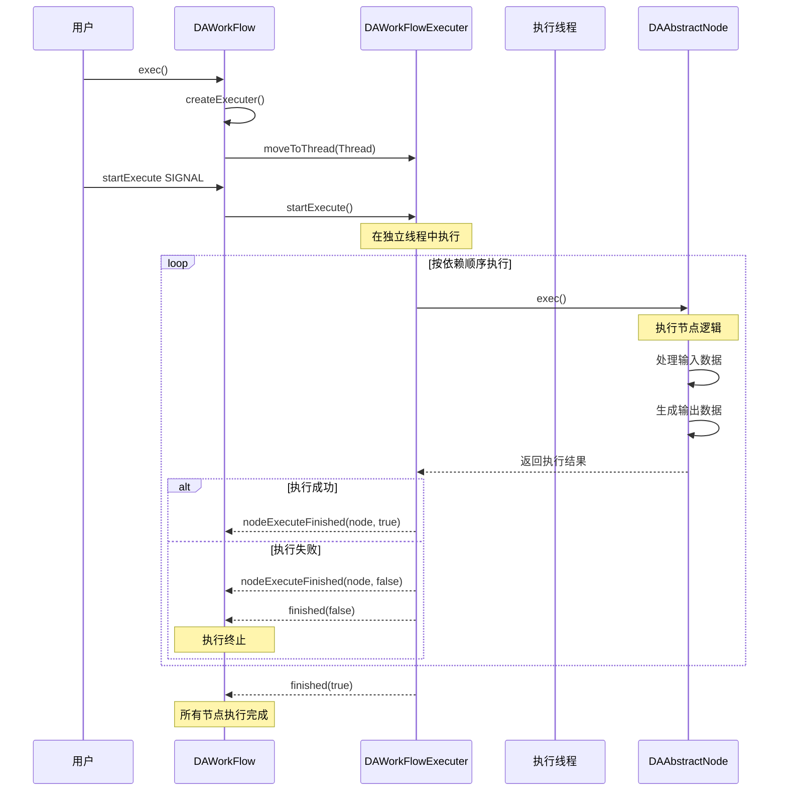

# 工作流生命周期

工作流生命周期描述了节点从创建到销毁、从连接到执行过程中涉及的回调机制。通过生命周期回调，开发者可以在关键节点注入自定义逻辑，实现节点编号、拓扑检查、动态连接点生成等功能。

## 主要功能特性

**特性**

- ✅ **节点创建回调**：在节点添加和移除时触发回调，支持全局属性设置
- ✅ **节点连接回调**：连接过程中多次回调，支持动态连接点生成
- ✅ **连接验证回调**：连接前后触发验证回调，支持连接合法性检查
- ✅ **生命周期状态管理**：场景自动管理连接状态，提供状态查询接口

## 生命周期概览

工作流节点生命周期包含三个主要阶段：创建、连接、执行。下图展示了各阶段的状态流转：



## 节点创建生命周期

节点创建过程涉及工厂回调和工作流信号，允许在节点添加前后执行自定义逻辑。

### 创建过程时序图



### 创建过程回调说明

| 顺序 | 类 | 函数/信号 | 类型 | 说明 |
|------|-----|-----------|------|------|
| 1 | DAAbstractNodeFactory | `nodeAddedToWorkflow` | 回调 | 节点即将加入工作流，可在此设置全局属性 |
| 2 | DAWorkFlow | `nodeAdded` | 信号 | 添加节点完成，通知界面更新 |

### 移除过程时序图



### 移除过程回调说明

| 顺序 | 类 | 函数/信号 | 类型 | 说明 |
|------|-----|-----------|------|------|
| 1 | DAAbstractNodeFactory | `nodeStartRemove` | 回调 | 节点即将移除，可进行资源清理 |
| 2 | DAWorkFlow | `nodeRemoved` | 信号 | 移除节点完成，通知界面更新 |

### 工厂回调使用示例

通过工厂回调可以实现全局属性的设置，例如自动编号：

```cpp
class MyNodeFactory : public DA::DAAbstractNodeFactory
{
public:
    // 节点添加回调
    void nodeAddedToWorkflow(DA::DAAbstractNode::SharedPointer node) override
    {
        // 自动为节点编号
        node->setProperty("nodeIndex", m_nodeCounter++);
        
        // 执行拓扑检查
        if (!validateTopology(node)) {
            qWarning() << "节点拓扑验证失败";
        }
    }
    
    // 节点移除回调
    void nodeStartRemove(DA::DAAbstractNode::SharedPointer node) override
    {
        // 清理节点相关资源
        cleanupNodeResources(node);
        
        // 更新拓扑记录
        m_topology.removeNode(node->getID());
    }

private:
    int m_nodeCounter = 0;
};

// 效果：每个新节点都会自动获得唯一编号，移除时自动清理资源
```

## 节点连接生命周期

节点连接是工作流中最复杂的交互过程，涉及多个回调函数，支持动态连接点生成和连接验证。

### 连接生命周期状态图



### 开始连接过程时序图



### 结束连接过程时序图



### 连接回调函数详解

#### 开始连接回调

| 顺序 | 类 | 函数 | 说明 |
|------|-----|------|------|
| 1 | DAAbstractNodeGraphicsItem | `tryLinkOnItemPos` | 动态生成连接点回调，特殊节点可重写 |
| 2 | DAAbstractNodeGraphicsItem | `getLinkPointByPos` | 获取点击位置的连接点 |
| 3 | DAAbstractNodeGraphicsItem | `createLinkItem` | 创建连接线图元，返回nullptr取消连接 |
| 4 | DAAbstractNodeLinkGraphicsItem | `attachFrom` | 建立起始连接，返回false取消连接 |

#### 结束连接回调

| 顺序 | 类 | 函数 | 说明 |
|------|-----|------|------|
| 1 | DAAbstractNodeLinkGraphicsItem | `attachTo` | 建立目标连接，关键判断点 |
| 2 | DAAbstractNode | `linkTo` | 逻辑层建立连接 |
| 3 | DAAbstractNode | `finishLink` | 逻辑层完成连接回调 |
| 4 | DAAbstractNodeLinkGraphicsItem | `finishedNodeLink` | 连接线完成连接回调 |
| 5 | DAAbstractNodeLinkGraphicsItem | `willCompleteLink` | 视图层完成连接回调 |

### 动态连接点生成示例

某些特殊节点需要根据上下文动态生成连接点：

```cpp
class DynamicNodeGraphicsItem : public DA::DAAbstractNodeGraphicsItem
{
public:
    // 动态生成连接点
    bool tryLinkOnItemPos(const QPointF& pos, DA::DANodeLinkPoint& lp) override
    {
        // 判断是否在动态区域
        if (isInDynamicZone(pos)) {
            // 根据位置生成新的连接点
            DA::DANodeLinkPoint newLp;
            newLp.name     = generateLinkPointName();
            newLp.way      = DA::DANodeLinkPoint::Output;
            newLp.position = pos;
            
            // 添加到节点
            addLinkPoint(newLp);
            lp = newLp;
            return true;
        }
        return false;
    }
    
    // 创建自定义连接线
    DA::DAAbstractNodeLinkGraphicsItem* createLinkItem(const DA::DANodeLinkPoint& lp) override
    {
        // 创建特定样式的连接线
        auto* linkItem = new MyCustomLinkItem();
        linkItem->setLinkLineStyle(DA::DAAbstractNodeLinkGraphicsItem::LinkLineBezier);
        return linkItem;
    }
};

// 效果：节点可根据点击位置动态创建连接点
```

### 连接验证示例

在连接完成前进行验证：

```cpp
class MyNode : public DA::DAAbstractNode
{
public:
    // 连接完成回调
    bool finishLink(const QString& outKey, DA::DAAbstractNode* inNode, const QString& inKey) override
    {
        // 验证连接是否合法
        if (!validateConnection(outKey, inNode, inKey)) {
            qWarning() << "连接验证失败：数据类型不匹配";
            return false;
        }
        
        // 记录连接信息
        m_connectionRecords.append({ outKey, inNode->getID(), inKey });
        
        return true;
    }
    
private:
    bool validateConnection(const QString& outKey, DA::DAAbstractNode* inNode, const QString& inKey)
    {
        // 获取输出数据类型
        DataType outType = getOutputDataType(outKey);
        
        // 获取输入期望类型
        DataType expectedType = inNode->getInputExpectedType(inKey);
        
        // 类型匹配检查
        return isTypeCompatible(outType, expectedType);
    }
};

// 效果：连接时自动验证数据类型兼容性
```

## 节点执行生命周期

节点执行生命周期描述了工作流执行过程中节点的状态变化。

### 执行过程时序图



### 执行回调说明

| 回调/信号 | 触发时机 | 说明 |
|-----------|----------|------|
| `DAAbstractNode::prepare` | 节点执行前 | 准备执行环境，可进行资源初始化 |
| `DAAbstractNode::exec` | 节点执行时 | 执行核心逻辑，必须实现 |
| `DAWorkFlow::nodeExecuteFinished` | 单个节点完成 | 通知界面更新节点状态 |
| `DAWorkFlow::finished` | 工作流完成 | 所有节点执行完成或失败 |

## 回调函数总结

### 回调函数分类

| 类别 | 回调函数 | 用途 |
|------|----------|------|
| 节点创建 | `nodeAddedToWorkflow` | 全局属性设置、编号 |
| 节点创建 | `nodeStartRemove` | 资源清理、拓扑更新 |
| 连接准备 | `tryLinkOnItemPos` | 动态生成连接点 |
| 连接准备 | `getLinkPointByPos` | 获取连接点信息 |
| 连接创建 | `createLinkItem` | 创建自定义连接线 |
| 连接建立 | `attachFrom`/`attachTo` | 连接验证、建立连接 |
| 连接完成 | `finishLink` | 逻辑层连接完成 |
| 连接完成 | `finishedNodeLink` | 通知连接线节点完成 |
| 连接完成 | `willCompleteLink` | 视图层连接完成 |

### 回调执行顺序

```mermaid
flowchart LR
    subgraph 创建阶段
        A[nodeAddedToWorkflow] --> B[nodeAdded SIGNAL]
    end
    
    subgraph 连接阶段
        C[tryLinkOnItemPos] --> D[getLinkPointByPos]
        D --> E[createLinkItem]
        E --> F[attachFrom]
        F --> G[attachTo]
        G --> H[finishLink]
        H --> I[finishedNodeLink]
        I --> J[willCompleteLink]
        J --> K[linkCompleted SIGNAL]
    end
    
    subgraph 移除阶段
        L[nodeStartRemove] --> M[nodeRemoved SIGNAL]
    end
    
    B --> C
    K --> L
```



## 注意事项

!!! warning "finishedNodeLink 与 willCompleteLink 的区别"
    - `finishedNodeLink`：逻辑层面完成，代表节点间数据通道建立
    - `willCompleteLink`：视图层面完成，可以改变连接线样式
    - 如果 `finishedNodeLink` 触发但 `willCompleteLink` 返回 false，将导致逻辑和视图不一致

!!! warning "线程安全"
    节点执行回调在工作流执行线程中调用，不要在回调中进行界面操作，使用信号通知主线程更新。

!!! tip "动态连接点"
    需要动态生成连接点的节点应重写 `tryLinkOnItemPos` 方法，在点击位置创建连接点后再调用父类方法。

!!! info "redo/undo 支持"
    通过 `DANodeGraphicsScene::addNodeLink_` 添加的连接线支持撤销重做操作，函数名带 `_` 后缀表示支持命令模式。

## 参考资料

- [工作流模块](workflow.md)
- [插件开发指南](plugin-project-create.md)
- 源码目录：`src/DAWorkFlow`、`src/DAGraphicsView`