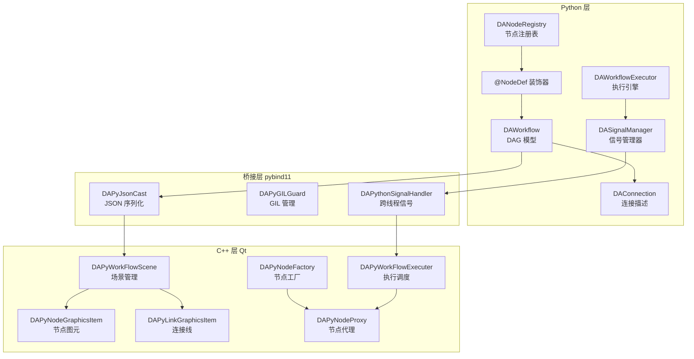

# DAPyWorkFlow 模块概述

DAPyWorkFlow 是 Data Workbench 的新一代工作流引擎模块，采用 Python-first 设计理念，通过 Python 定义节点逻辑，C++ 负责可视化渲染和执行调度，实现高效的工作流编排和数据处理。

## 主要功能特性

**特性**

- ✅ **Python-first 节点定义**：使用 `@NodeDef` 装饰器在 Python 中声明节点类型，无需编写 C++ 代码
- ✅ **DAG 工作流模型**：基于有向无环图（DAG）描述工作流，自动拓扑排序和依赖解析
- ✅ **双层架构**：Python 层负责节点逻辑，C++ 层负责可视化，通过 pybind11 无缝桥接
- ✅ **信号驱动执行**：基于 `DASignalManager` 的事件驱动数据传播机制
- ✅ **节点自动发现**：支持目录扫描和 entry_points 双模式自动发现插件节点
- ✅ **可视化编辑**：完整的拖拽式节点编辑，支持连接、断开、undo/redo 操作
- ✅ **插件扩展**：通过 `data_workbench.plugin` entry point 注册第三方节点

## 核心概念

### 双层架构

DAPyWorkFlow 采用 Python/C++ 双层架构设计：

| 层级 | 职责 | 主要组件 |
|------|------|----------|
| **Python 层** | 节点定义、DAG 模型、执行逻辑 | `DAWorkflow`, `NodeDef`, `DANodeRegistry`, `DAWorkflowExecutor` |
| **C++ 层** | 可视化渲染、交互编辑、执行调度 | `DAPyWorkFlowScene`, `DAPyNodeProxy`, `DAPyNodeFactory` |
| **桥接层** | 数据序列化、GIL 管理、状态同步 | `pybind11`, `DAPyJsonCast`, `DAPythonSignalHandler` |

### DAG 工作流

工作流以有向无环图（DAG）形式组织：

- **节点（Node）**：工作流的基本执行单元，通过 `@NodeDef` 装饰器定义
- **连接（Connection）**：节点间的数据流向，由 `DAConnection` 描述
- **拓扑排序**：执行前自动验证无环性，按依赖顺序执行节点

### Python 节点

节点在 Python 层定义，通过嵌套类模式声明输入/输出端口：

```python
@NodeDef(name="数据过滤", category="数据处理")
class DataFilter:
    column = Parameter(str, default="value", description="筛选列名")

    class Inputs:
        data = Input("DataFrame", required=True)

    class Outputs:
        filtered = Output("DataFrame")

    def execute(self, inputs, params):
        df = inputs["data"]
        return {"filtered": df[df[params["column"]] > 0]}
```

### Connection

`DAConnection` 描述节点间的数据连接关系：

- `source_node_id`：源节点 ID
- `source_output_channel`：源节点输出端口名
- `target_node_id`：目标节点 ID
- `target_input_channel`：目标节点输入端口名

### SignalManager

`DASignalManager` 是事件驱动的数据传播引擎：

- 节点执行完成后，输出数据通过信号传播到下游
- 下游节点收集所有上游数据后触发执行
- 支持全局节点（执行但不传播）和孤立节点（独立执行）

### NodeRegistry

`DANodeRegistry` 是节点类型的注册中心：

- 维护所有已注册节点的描述符（`DANodeDescriptor`）
- 支持目录扫描发现 `.py` 文件中的节点类
- 支持通过 `entry_points(group='data_workbench.plugin')` 发现插件节点

## 双层架构图



上图展示了 DAPyWorkFlow 的双层架构：

- **Python 层**：`@NodeDef` 定义节点类型，`DAWorkflow` 管理 DAG 模型，`DANodeRegistry` 负责节点发现，`DAWorkflowExecutor` 和 `DASignalManager` 处理执行逻辑
- **桥接层**：`pybind11` 实现 Python/C++ 数据转换，`DAPyJsonCast` 处理 JSON 序列化，`DAPyGILGuard` 管理 GIL，`DAPythonSignalHandler` 处理跨线程通信
- **C++ 层**：`DAPyWorkFlowScene` 管理可视化场景，`DAPyNodeGraphicsItem` 和 `DAPyLinkGraphicsItem` 提供交互编辑，`DAPyNodeProxy` 代理 Python 节点，`DAPyNodeFactory` 创建节点实例，`DAPyWorkFlowExecuter` 调度执行

## 与旧模块的区别

DAPyWorkFlow 是原 `DAWorkFlow` 模块的完全重构版本，主要区别如下：

| 特性 | 旧 DAWorkFlow | 新 DAPyWorkFlow |
|------|---------------|-----------------|
| **节点定义** | C++ 继承 `DAAbstractNode` | Python `@NodeDef` 装饰器 |
| **架构** | 纯 C++ 实现 | Python-first + C++ 渲染 |
| **扩展方式** | C++ 插件 DLL | Python 脚本 + entry_points |
| **节点发现** | 扫描 DLL | 目录扫描 + entry_points |
| **执行引擎** | C++ 工作流引擎 | Python `DAWorkflowExecutor` |
| **可视化** | `DAWorkFlowGraphicsScene` | `DAPyWorkFlowScene` |
| **数据传递** | `DANodeLinkPoint` 连接点 | `DAConnection` + `DASignalManager` |

!!! note "迁移说明"
    旧模块的 `DAAbstractNode`、`DAWorkFlowGraphicsScene`、`DANodeLinkPoint` 等类已不再使用。新模块采用完全独立的类体系，不继承旧模块的任何基类。

## 模块组成

### Python 层类（DAWorkFlowPy）

| 类名 | 职责 | 所在文件 |
|------|------|----------|
| `NodeDef` | 节点定义装饰器，收集 Input/Output/Parameter 声明 | `node_def.py` |
| `Input` | 输入端口声明类 | `types.py` |
| `Output` | 输出端口声明类 | `types.py` |
| `Parameter` | 参数声明类 | `types.py` |
| `DANodeDescriptor` | 节点描述符，存储节点元数据 | `node_descriptor.py` |
| `DANodeRegistry` | 节点注册表，管理节点发现和查询 | `node_registry.py` |
| `DAWorkflow` | DAG 工作流模型，管理节点和连接 | `workflow.py` |
| `DAConnection` | 连接关系描述 | `connection.py` |
| `DASignalManager` | 信号管理器，事件驱动数据传播 | `signal_manager.py` |
| `DAWorkflowState` | 工作流状态枚举 | `signal_manager.py` |
| `DAWorkflowExecutor` | 工作流执行引擎 | `executor.py` |
| `DAExecutorState` | 执行器状态枚举 | `executor.py` |

### C++ 层类（DAPyWorkFlow）

| 类名 | 职责 | 所在文件 |
|------|------|----------|
| `DAPyWorkFlowScene` | Python 工作流场景管理，继承 `DAGraphicsScene` | `DAPyWorkFlowScene.h/cpp` |
| `DAPyNodeGraphicsItem` | Python 节点可视化图元 | `DAPyNodeGraphicsItem.h/cpp` |
| `DAPyLinkGraphicsItem` | Python 节点连接线图元 | `DAPyLinkGraphicsItem.h/cpp` |
| `DAPyNodeProxy` | Python 节点的 C++ 代理，非 QObject | `DAPyNodeProxy.h/cpp` |
| `DAPyNodeFactory` | Python 节点工厂，独立 QObject | `DAPyNodeFactory.h/cpp` |
| `DAPyNodeMetaData` | Python 节点元数据结构体 | `DAPyNodeFactory.h` |
| `DAPyWorkFlowExecuter` | 工作流执行调度器 | `DAPyWorkFlowExecuter.h/cpp` |
| `DAPyModuleWorkflow` | Python 模块封装 | `DAPyModuleWorkflow.h/cpp` |
| `DAPyGILGuard` | Python GIL 管理 | `DAPyGILGuard.h` |
| `DAPyWorkFlowSceneSerializer` | 场景序列化 | `DAPyWorkFlowSceneSerializer.h/cpp` |
| `DAPythonSignalHandler` | Python 信号处理器 | `DAPythonSignalHandler.h/cpp` |
| `DAAbstractNodeSettingWidget` | 节点设置抽象基类，持有 DAPyNodeProxy* | `DAGui/DAAbstractNodeSettingWidget.h` |
| `DANodeParamSettingPanel` | 通用参数设置面板，SceneB 3-hop信号链 | `DAGui/NodeSetting/DANodeParamSettingPanel.h` |
| `DANodeParamSettingPanelFactory` | 参数面板单例工厂 | `DAGui/NodeSetting/DANodeParamSettingPanelFactory.h` |
| `DANodeParamSettingPanelWidget` | QStackedWidget 调度器 | `DAGui/NodeSetting/DANodeParamSettingPanelWidget.h` |
| `DAParamTypeRegistry` | 11种参数类型编辑器注册系统 | `DAGui/NodeSetting/DAParamTypeRegistry.h` |

## 快速上手

### 定义一个简单的节点

以下示例展示如何使用 `@NodeDef` 装饰器定义一个数据过滤节点：

```python
from DAWorkFlowPy import NodeDef, Input, Output, Parameter
import pandas as pd

@NodeDef(name="数据过滤", category="数据处理", icon="filter")
class DataFilter:
    """按条件筛选 DataFrame 数据的节点"""

    # 参数声明
    column = Parameter(str, default="value", description="要筛选的列名")
    threshold = Parameter(float, default=0.0, description="阈值")

    # 输入端口声明（嵌套类模式）
    class Inputs:
        data = Input("DataFrame", required=True, description="输入数据")

    # 输出端口声明（嵌套类模式）
    class Outputs:
        filtered = Output("DataFrame", description="筛选后的数据")
        count = Output("int", description="符合条件的行数")

    def execute(self, inputs, params):
        """执行节点逻辑

        :param inputs: 字典，包含所有输入端口的数据
        :param params: 字典，包含所有参数值
        :return: 字典，包含所有输出端口的数据
        """
        df = inputs["data"]
        column = params["column"]
        threshold = params["threshold"]

        # 筛选数据
        filtered_df = df[df[column] > threshold]

        return {
            "filtered": filtered_df,
            "count": len(filtered_df)
        }
```

!!! tip "嵌套类模式"
    使用 `class Inputs` 和 `class Outputs` 嵌套类声明端口是推荐的标准做法。这种模式下，端口通过类属性声明，代码结构清晰，便于 IDE 自动补全。

### 注册和使用节点

```python
from DAWorkFlowPy import DANodeRegistry, DAWorkflow, DAConnection

# 创建注册表并发现节点
registry = DANodeRegistry()
registry.discover(scan_paths=["/path/to/plugins"], use_entry_points=True)

# 获取节点描述符
descriptor = registry.get_descriptor("my_module.DataFilter")

# 创建工作流
workflow = DAWorkflow(name="数据处理流程")

# 创建节点实例
node1 = DataFilter()
node1._input_data["column"] = "temperature"
node1._input_data["threshold"] = 25.0
workflow.add_node(node1)

# 添加连接
conn = DAConnection(
    source_node_id=node1.node_id,
    source_output_channel="filtered",
    target_node_id=node2.node_id,
    target_input_channel="data"
)
workflow.add_connection(conn)

# 验证 DAG 有效性
if workflow.is_valid_dag():
    print("工作流有效，可以执行")
```

## 相关文档索引

| 文档 | 内容 | 路径 |
|------|------|------|
| [Python 节点开发指南](workflow-python-node-dev.md) | 详细讲解 `@NodeDef` 装饰器、端口声明、参数配置、节点执行逻辑编写 | `workflow-python-node-dev.md` |
| [工作流生命周期](workflow-lifecycle.md) | 工作流创建、编辑、序列化、加载的完整生命周期管理 | `workflow-lifecycle.md` |
| [C++ 集成指南](workflow-cpp-integration.md) | C++ 层如何调用 Python 节点、pybind11 桥接细节、GIL 管理 | `workflow-cpp-integration.md` |
| [场景操作指南](workflow-scene-operation.md) | `DAPyWorkFlowScene` 的使用方法，节点图元的创建、编辑、交互 | `workflow-scene-operation.md` |

## 参考资料

- Python 模块源码：`src/PyScripts/DAWorkbench/DAWorkFlowPy/`
- C++ 模块源码：`src/DAPyWorkFlow/`
- pybind11 桥接：`src/DAPyBindQt/`
- 节点示例：`plugins/` 目录下的 Python 插件
