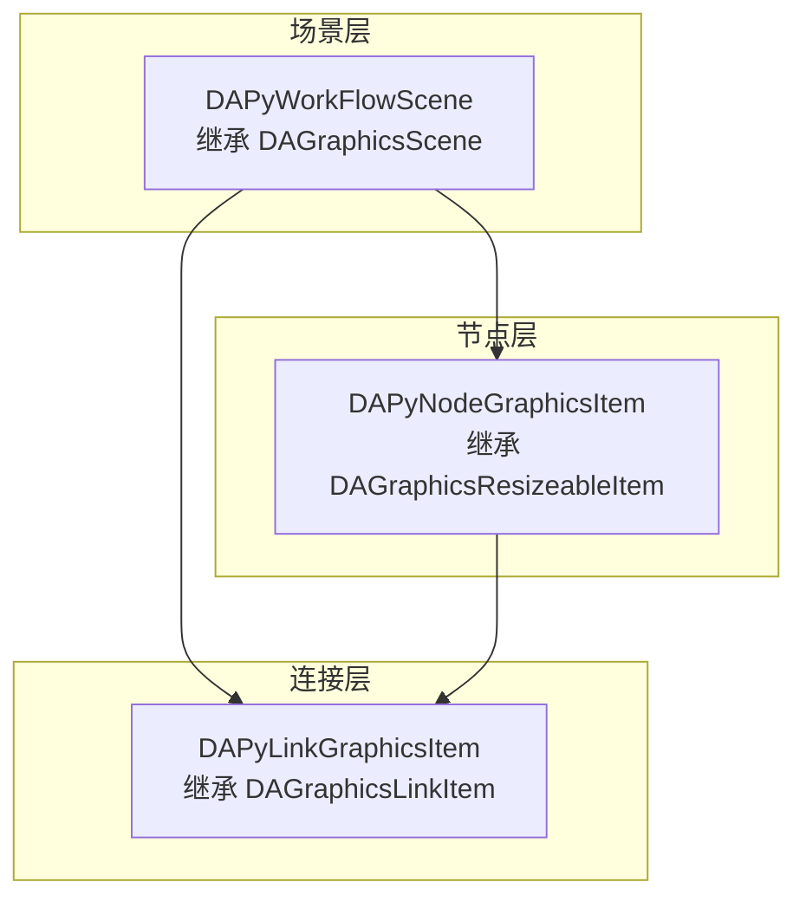
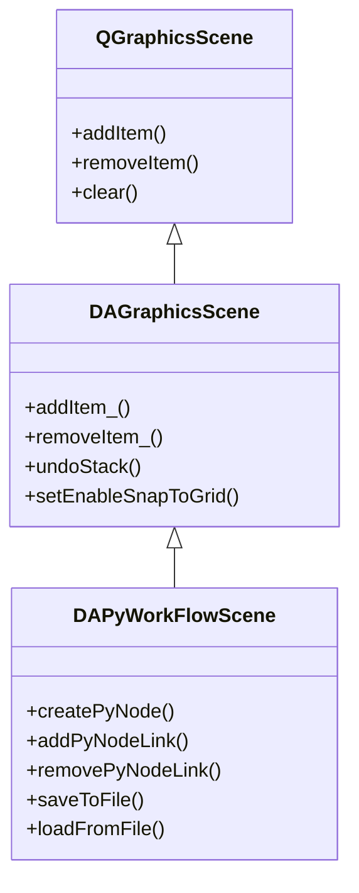
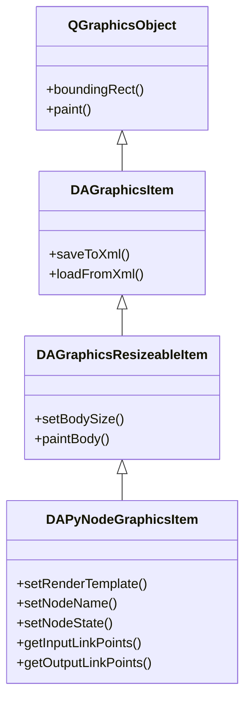
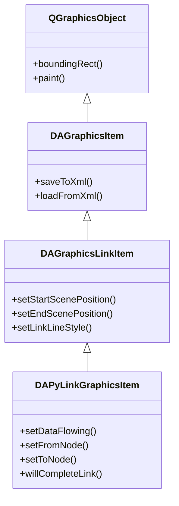

# 工作流场景操作指南

本文档详细介绍 DAPyWorkFlow 的场景可视化系统，帮助插件开发者理解如何使用 Qt Graphics View 场景来渲染和交互 Python 工作流节点。

## 导航

本系列文档包含以下章节：

- [DAPyWorkFlow 模块概述](./workflow-overview.md)
- [插件与节点发现机制](./workflow-plugin-discovery.md)
- [Python 节点开发指南](./workflow-python-node-dev.md)
- [工作流生命周期](./workflow-lifecycle.md)
- [C++ 集成指南](./workflow-cpp-integration.md)
- [场景操作指南](./workflow-scene-operation.md) ← 当前页

## 概述

DAPyWorkFlowScene 是 Python 工作流可视化的核心场景管理类，继承自 DAGraphicsScene，负责在 Qt Graphics View 框架中渲染 Python 工作流节点及其连接关系。与旧版 DAWorkFlowGraphicsScene 不同，新场景专为 Python-first 架构设计，通过 DAPyNodeProxy 代理对象与 Python 层的节点实例进行双向通信。

场景系统采用分层设计：

- **场景层（DAPyWorkFlowScene）**：管理节点和连接线的生命周期，处理用户交互
- **节点层（DAPyNodeGraphicsItem）**：渲染单个 Python 节点，支持多种可视化模板
- **连接层（DAPyLinkGraphicsItem）**：绘制节点间的数据流向，支持流动画效果



## 场景管理

### DAPyWorkFlowScene 核心功能

DAPyWorkFlowScene 继承自 DAGraphicsScene，提供完整的 Python 工作流场景管理能力。场景负责协调节点图元和连接线图元的创建、删除、选中状态管理，以及序列化操作。

#### 继承关系



#### 核心方法

| 方法 | 参数 | 返回值 | 说明 |
|------|------|--------|------|
| `createPyNode` | `QJsonObject descriptor, QPointF pos` | `DAPyNodeGraphicsItem*` | 在指定位置创建 Python 节点图元 |
| `addPyNodeLink` | `fromItem, fromOutput, toItem, toInput` | `DAPyLinkGraphicsItem*` | 添加节点间的连接线 |
| `removePyNodeLink` | `DAPyLinkGraphicsItem* linkItem` | `bool` | 移除指定的连接线 |
| `removePyNodeItem` | `DAPyNodeGraphicsItem* item` | `bool` | 移除节点图元 |
| `findNodeItemById` | `QString nodeId` | `DAPyNodeGraphicsItem*` | 根据节点 ID 查找图元 |
| `getPyNodeItems` | 无 | `QList<DAPyNodeGraphicsItem*>` | 获取所有节点图元 |
| `getPyNodeLinkItems` | 无 | `QList<DAPyLinkGraphicsItem*>` | 获取所有连接线 |
| `clearPyScene` | 无 | `void` | 清空场景中的所有 Python 工作流元素 |

#### 关键信号

场景通过 Qt 信号机制通知外部状态变更：

| 信号 | 参数 | 触发时机 |
|------|------|----------|
| `pyNodeItemCreated` | `DAPyNodeGraphicsItem* item` | Python 节点图元被创建时 |
| `pyNodeItemsRemoved` | `QList<DAPyNodeGraphicsItem*> items` | Python 节点图元被移除时 |
| `pyNodeLinkCreated` | `DAPyLinkGraphicsItem* link` | 连接线被创建时 |
| `pyNodeLinksRemoved` | `QList<DAPyLinkGraphicsItem*> links` | 连接线被移除时 |
| `pyNodeStateChanged` | `DAPyNodeGraphicsItem* item, DAPyNodeState state` | 节点状态变更时 |
| `selectPyNodeItemChanged` | `DAPyNodeGraphicsItem* item` | 节点选中状态变更时 |
| `selectPyNodeLinkChanged` | `DAPyLinkGraphicsItem* link` | 连接线选中状态变更时 |

#### 场景访问接口链

插件开发者可通过以下方式获取场景实例：

```cpp
// 从主窗口获取工作流场景
DAWorkFlowWidget* workflowWidget = daApp->getWorkFlowWidget();
DAPyWorkFlowScene* scene = workflowWidget->getWorkFlowScene();

// 场景提供完整的节点和连接线管理接口
QList<DAPyNodeGraphicsItem*> nodes = scene->getPyNodeItems();
QList<DAPyLinkGraphicsItem*> links = scene->getPyNodeLinkItems();
```

## 节点可视化

### DAPyNodeGraphicsItem 渲染系统

DAPyNodeGraphicsItem 继承自 DAGraphicsResizeableItem，提供 Python 工作流节点的可视化渲染。支持三种渲染模板模式，可根据节点类型和用途选择最合适的展示方式。

#### 继承关系



#### 渲染模板

DAPyNodeGraphicsItem 支持三种渲染模板：

| 模板类型 | 枚举值 | 说明 | 适用场景 |
|----------|--------|------|----------|
| **矩形模板** | `RectTemplate` | 绘制圆角矩形和节点名称 | 通用数据处理节点 |
| **SVG 模板** | `SvgTemplate` | 从指定路径加载 SVG 图标 | 具有特定图标的节点 |
| **Widget 模板** | `WidgetTemplate` | 嵌入 Qt Widget | 需要复杂交互的节点 |

设置渲染模板的方法：

```cpp
// 使用枚举值设置
item->setRenderTemplate(DA::DAPyNodeGraphicsItem::RectTemplate);

// 使用字符串名称设置
item->setRenderTemplate("rect");   // 矩形模板
item->setRenderTemplate("svg");    // SVG 模板
item->setRenderTemplate("widget"); // Widget 模板
```

#### 自定义绘制

节点通过重写 `paintBody()` 方法实现自定义绘制：

```cpp
void paintBody(QPainter* painter,
               const QStyleOptionGraphicsItem* option,
               QWidget* widget,
               const QRectF& bodyRect) override;
```

绘制流程根据当前设置的模板类型自动选择：

- `paintRectTemplate()`：绘制圆角矩形背景、节点图标和名称
- `paintSvgTemplate()`：渲染 SVG 图标
- `paintWidgetTemplate()`：更新嵌入 Widget 的几何位置

#### 节点状态与颜色映射

节点状态通过 DAPyNodePalette 映射为视觉颜色：

| 状态 | DAPyNodeState | 默认颜色 | 视觉含义 |
|------|---------------|----------|----------|
| 空闲 | `Idle` | 灰色 | 节点等待执行 |
| 等待 | `Waiting` | 黄色 | 节点等待上游数据 |
| 运行中 | `Running` | 蓝色 | 节点正在执行 |
| 成功 | `Success` | 绿色 | 节点执行成功 |
| 错误 | `Error` | 红色 | 节点执行出错 |
| 跳过 | `Skipped` | 橙色 | 节点被跳过执行 |

状态颜色可通过 DAPyNodePalette 自定义：

```cpp
// 获取全局调色板
DA::DAPyNodePalette& palette = DA::DAPyNodePalette::getGlobalPalette();

// 自定义状态颜色
palette.setRunningColor(QColor(0, 120, 215));
palette.setSuccessColor(QColor(0, 150, 0));
palette.setErrorColor(QColor(200, 0, 0));
```

#### 连接点管理

节点自动根据描述符生成输入/输出连接点：

```cpp
// 获取输入连接点
QList<DA::DAPyLinkPoint> inputs = item->getInputLinkPoints();

// 获取输出连接点
QList<DA::DAPyLinkPoint> outputs = item->getOutputLinkPoints();

// 更新连接点位置（节点尺寸变化后调用）
item->updateLinkPoints();
```

#### 交互信号

节点提供双击信号用于打开配置对话框：

```cpp
// 连接节点双击信号
connect(item, &DA::DAPyNodeGraphicsItem::nodeDoubleClicked,
        this, [](DA::DAPyNodeProxy* proxy) {
    // 弹出节点配置对话框
    openNodeConfigDialog(proxy);
});
```

## 连接线可视化

### DAPyLinkGraphicsItem 连接系统

DAPyLinkGraphicsItem 继承自 DAGraphicsLinkItem，负责绘制 Python 节点间的数据流向。支持数据流动画效果和连接验证功能。

#### 继承关系



#### 数据流动画

连接线支持数据流动画效果，直观展示数据传递过程：

```cpp
// 启用数据流动画
linkItem->setDataFlowing(true);

// 禁用数据流动画
linkItem->setDataFlowing(false);

// 查询流动状态
bool isFlowing = linkItem->isDataFlowing();
```

动画效果通过定时器驱动，在 `paint()` 中绘制流动高亮。

#### 连接验证

`willCompleteLink()` 方法在连接完成前进行数据类型兼容性验证：

```cpp
// 重写验证方法检查数据类型
virtual bool willCompleteLink() override {
    // 检查源输出类型和目标输入类型是否兼容
    QString outputType = getFromOutputType();
    QString inputType = getToInputType();
    return checkDataTypeCompatibility(outputType, inputType);
}
```

#### 节点关联

连接线记录所连接的源节点和目标节点：

```cpp
// 设置源节点和输出端口名
linkItem->setFromNode(fromItem, "output_name");

// 设置目标节点和输入端口名
linkItem->setToNode(toItem, "input_name");

// 获取关联节点
DA::DAPyNodeGraphicsItem* from = linkItem->getFromNode();
DA::DAPyNodeGraphicsItem* to = linkItem->getToNode();

// 获取端口名
QString outputName = linkItem->getFromOutputName();
QString inputName = linkItem->getToInputName();
```

## 连接点数据结构

### DAPyLinkPoint

DAPyLinkPoint 是描述节点连接点的数据结构，包含位置、名称、方向和输入输出属性。

```cpp
class DAPyLinkPoint {
public:
    QPointF position;           // 连接点相对图形项的位置
    QString name;               // 连接点名称
    Way way;                    // Input 或 Output
    AspectDirection direction;  // 引线伸出方向
};
```

#### 方向枚举

连接点引线方向决定连接线从节点的哪个边缘伸出：

| 方向 | 说明 |
|------|------|
| `AspectDirection::North` | 从顶部伸出 |
| `AspectDirection::South` | 从底部伸出 |
| `AspectDirection::East` | 从右侧伸出 |
| `AspectDirection::West` | 从左侧伸出 |

#### 使用方法

```cpp
// 创建连接点
DA::DAPyLinkPoint point(QPointF(50, 0), "data_output", 
                        DA::DAPyLinkPoint::Output, 
                        DA::AspectDirection::East);

// 检查连接点有效性
if (point.isValid()) {
    // 连接点有效
}

// 检查输入输出属性
if (point.isInput()) {
    // 这是输入连接点
}
if (point.isOutput()) {
    // 这是输出连接点
}
```

## 场景序列化

### DAPyWorkFlowSceneSerializer

DAPyWorkFlowSceneSerializer 负责 Python 工作流场景的 XML 序列化和反序列化，保存节点位置、连接关系、参数状态等信息。

#### 核心方法

| 方法 | 参数 | 返回值 | 说明 |
|------|------|--------|------|
| `saveSceneToFile` | `scene, filePath, ver` | `bool` | 保存场景到 XML 文件 |
| `loadSceneFromFile` | `filePath, scene, ver` | `bool` | 从 XML 文件加载场景 |
| `saveSceneToXml` | `scene, doc, ver` | `bool` | 保存场景到 QDomDocument |
| `loadSceneFromXml` | `element, scene, ver` | `bool` | 从 QDomElement 加载场景 |
| `getLastErrorString` | 无 | `QString` | 获取最后的错误信息 |

#### 序列化内容

场景序列化保存以下信息：

- **节点信息**：节点 ID、类型、位置坐标、尺寸、渲染模板
- **连接信息**：源节点 ID、目标节点 ID、输出端口名、输入端口名
- **参数状态**：节点的参数值配置
- **视图状态**：场景的缩放比例和滚动位置

#### 使用示例

```cpp
// 创建序列化器
DA::DAPyWorkFlowSceneSerializer serializer;

// 保存场景到文件
bool success = serializer.saveSceneToFile(
    scene, 
    "workflow.xml", 
    QVersionNumber(1, 0, 0)
);

if (!success) {
    QString error = serializer.getLastErrorString();
    qWarning() << "保存失败:" << error;
}

// 从文件加载场景
success = serializer.loadSceneFromFile(
    "workflow.xml", 
    scene, 
    QVersionNumber(1, 0, 0)
);
```

场景类也提供便捷的保存/加载方法：

```cpp
// 直接通过场景保存
scene->saveToFile("workflow.xml", QVersionNumber(1, 0, 0));

// 直接通过场景加载
scene->loadFromFile("workflow.xml", QVersionNumber(1, 0, 0));
```

## 插件开发中的场景操作

### 获取场景实例

插件开发者可通过以下方式获取工作流场景：

```cpp
// 方式一：通过 DAAppInterface 获取
DA::DAAppInterface* iface = DA::DAAppInterface::getInstance();
DA::DAPyWorkFlowScene* scene = iface->getWorkFlowScene();

// 方式二：通过工作流部件获取
DA::DAWorkFlowWidget* widget = iface->getWorkFlowWidget();
DA::DAPyWorkFlowScene* scene = widget->getWorkFlowScene();
```

### 创建节点

在场景中创建 Python 节点：

```cpp
// 准备节点描述符
QJsonObject descriptor;
descriptor["node_id"] = "node_001";
descriptor["node_type"] = "DataFilter";
descriptor["category"] = "数据处理";

// 在场景指定位置创建节点
QPointF pos(100, 100);
DA::DAPyNodeGraphicsItem* item = scene->createPyNode(descriptor, pos);

// 设置节点显示属性
item->setNodeName("数据过滤节点");
item->setRenderTemplate(DA::DAPyNodeGraphicsItem::RectTemplate);
```

### 建立连接

在节点间建立数据流连接：

```cpp
// 获取要连接的两个节点
DA::DAPyNodeGraphicsItem* sourceNode = scene->findNodeItemById("node_001");
DA::DAPyNodeGraphicsItem* targetNode = scene->findNodeItemById("node_002");

// 添加连接线
DA::DAPyLinkGraphicsItem* link = scene->addPyNodeLink(
    sourceNode, "filtered",    // 源节点和输出端口
    targetNode, "data"         // 目标节点和输入端口
);

// 启用数据流动画（可选）
link->setDataFlowing(true);
```

### 响应场景信号

插件可连接场景信号以响应各种事件：

```cpp
// 节点创建事件
connect(scene, &DA::DAPyWorkFlowScene::pyNodeItemCreated,
        this, [](DA::DAPyNodeGraphicsItem* item) {
    qDebug() << "节点已创建:" << item->getNodeName();
});

// 节点状态变更事件
connect(scene, &DA::DAPyWorkFlowScene::pyNodeStateChanged,
        this, [](DA::DAPyNodeGraphicsItem* item, DA::DAPyNodeState state) {
    qDebug() << "节点状态变更:" << item->getNodeName() 
             << "->" << static_cast<int>(state);
});

// 连接线创建事件
connect(scene, &DA::DAPyWorkFlowScene::pyNodeLinkCreated,
        this, [](DA::DAPyLinkGraphicsItem* link) {
    qDebug() << "连接线已创建";
});
```

### 自定义节点渲染

插件可通过回调机制自定义节点绘制：

```cpp
// 设置 Python 绘制回调（从 Python 层）
item->setPaintCallback(pyCallback);

// 检查是否有绘制回调
if (item->hasPaintCallback()) {
    // 节点将使用自定义回调绘制
}

// 清除绘制回调
item->clearPaintCallback();
```

## 注意事项

!!! warning "PIMPL 模式"
    DAPyWorkFlowScene 及相关类使用 PIMPL 模式实现，相关宏定义见 DAGlobals.h：
    - `DA_DECLARE_PRIVATE` - 声明私有数据指针
    - `DA_D` - 获取私有数据指针
    - `DA_DC` - 获取私有数据 const 指针

!!! warning "GIL 管理"
    与 Python 层交互时需注意 GIL（全局解释器锁）管理。使用 DAPyGILGuard 确保线程安全：
    ```cpp
    {
        DA::DAPyGILGuard gil;  // 获取 GIL
        // 执行 Python 调用
    }  // 自动释放 GIL
    ```

!!! tip "状态同步"
    Python 节点状态变更通过 DAPythonSignalHandler 异步通知 C++ 层。C++ 层通过 `pyNodeStateChanged` 信号接收状态更新，避免直接轮询。

!!! note "渲染模板选择"
    选择渲染模板时需考虑节点用途：
    - 通用数据处理节点推荐使用 `RectTemplate`
    - 具有特定视觉标识的节点可使用 `SvgTemplate`
    - 需要复杂 UI 交互的节点使用 `WidgetTemplate`

!!! info "undo/redo 支持"
    场景的添加/删除操作自动支持 undo/redo。使用带下划线后缀的方法（如 `createPyNode_`）可在 QUndoStack 中记录操作。

## 参考资料

- [DAPyWorkFlow 模块概述](./workflow-overview.md) - 工作流模块整体架构
- [Python 节点开发指南](./workflow-python-node-dev.md) - 节点定义和开发
- [工作流生命周期](./workflow-lifecycle.md) - 工作流执行流程
- [C++ 集成指南](./workflow-cpp-integration.md) - Python/C++ 桥接细节
- [可缩放图元模块](./scalable-graphic-module.md) - DAGraphicsView 基础功能

### 源码位置

| 组件 | 头文件 | 实现文件 |
|------|--------|----------|
| DAPyWorkFlowScene | `src/DAPyWorkFlow/DAPyWorkFlowScene.h` | `src/DAPyWorkFlow/DAPyWorkFlowScene.cpp` |
| DAPyNodeGraphicsItem | `src/DAPyWorkFlow/DAPyNodeGraphicsItem.h` | `src/DAPyWorkFlow/DAPyNodeGraphicsItem.cpp` |
| DAPyLinkGraphicsItem | `src/DAPyWorkFlow/DAPyLinkGraphicsItem.h` | `src/DAPyWorkFlow/DAPyLinkGraphicsItem.cpp` |
| DAPyLinkPoint | `src/DAPyWorkFlow/DAPyLinkPoint.h` | `src/DAPyWorkFlow/DAPyLinkPoint.cpp` |
| DAPyNodePalette | `src/DAPyWorkFlow/DAPyNodePalette.h` | `src/DAPyWorkFlow/DAPyNodePalette.cpp` |
| DAPyWorkFlowSceneSerializer | `src/DAPyWorkFlow/DAPyWorkFlowSceneSerializer.h` | `src/DAPyWorkFlow/DAPyWorkFlowSceneSerializer.cpp` |
