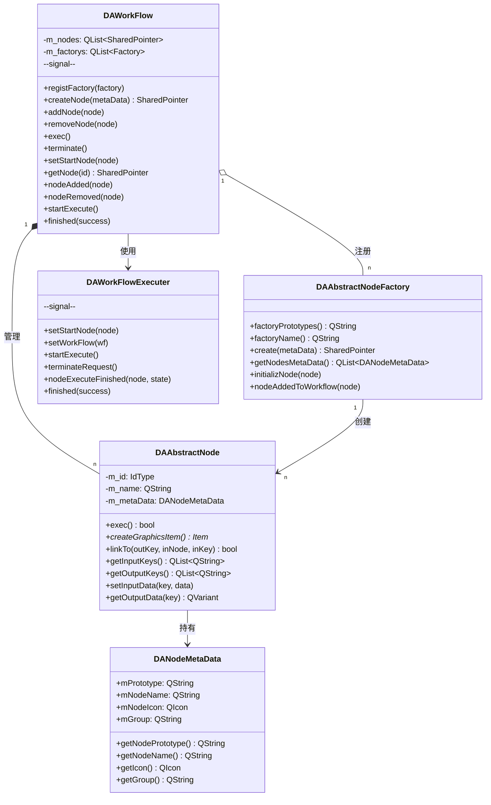
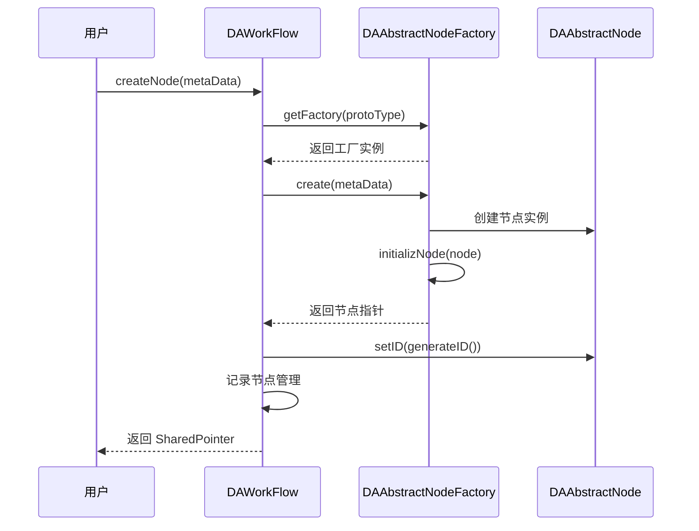
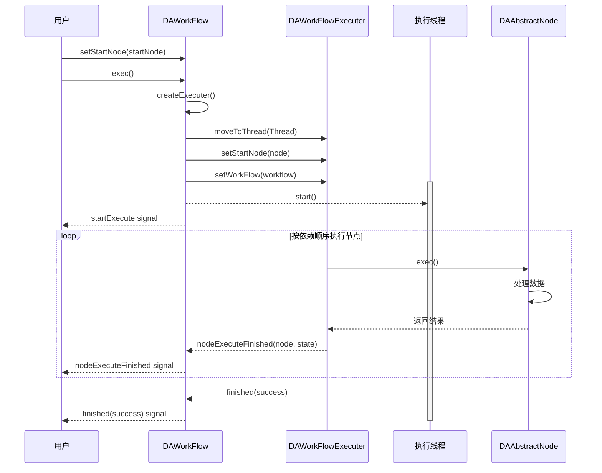

# 工作流模块

DAWorkFlow 模块是 DAWorkBench 的核心引擎，提供基于有向图的数据处理流程管理能力，支持通过节点连接构建复杂的数据处理管道。

## 主要功能特性

**特性**

- ✅ **有向图管理**：管理节点和连接线，构建数据处理流程
- ✅ **命名连接点**：节点输入输出点带有名称属性，支持复杂数据传递
- ✅ **插件扩展**：通过节点工厂和元数据系统支持自定义节点类型
- ✅ **redo/undo 操作**：场景操作支持撤销重做
- ✅ **多线程执行**：工作流在独立线程执行，不阻塞主界面
- ✅ **信号通知**：节点添加、删除、执行完成等事件通过信号通知
- ✅ **属性系统**：节点支持动态属性配置和持久化

## 核心概念

### 工作流（DAWorkFlow）

工作流是有向图的逻辑容器，负责节点的生命周期管理、工厂注册和执行调度。工作流本身不包含渲染信息，可通过 `DANodeGraphicsScene` 进行可视化展示。

| 职责 | 说明 |
|------|------|
| 工厂管理 | 注册和管理节点工厂，提供节点创建能力 |
| 节点管理 | 创建、添加、删除节点，维护节点 ID 唯一性 |
| 执行调度 | 设置起始节点，启动和终止工作流执行 |
| 信号通知 | 发射节点添加、移除、执行完成等信号 |

### 节点（DAAbstractNode）

节点是工作流的核心处理单元，可理解为带有命名参数的函数。

| 组成部分 | 说明 |
|----------|------|
| 元数据（DANodeMetaData） | 节点的唯一标识和显示信息 |
| 输入连接点（inputKeys） | 数据输入接口，支持 0~n 个命名输入 |
| 输出连接点（outputKeys） | 数据输出接口，支持 0~n 个命名输出 |
| 属性（properties） | 节点的配置参数，支持持久化 |
| 唯一 ID | 节点在工作流中的唯一标识（uint64_t） |

!!! tip "节点设计理念"
    节点可以理解为函数：输入连接点是函数参数，输出连接点是返回值。多个输出支持分支逻辑（类似 if-else）。

### 连接点（DANodeLinkPoint）

连接点描述节点之间的数据传输接口。

| 属性 | 类型 | 说明 |
|------|------|------|
| `name` | QString | 连接点名称，用于数据匹配和连接识别 |
| `way` | Way | 输入（Input）或输出（Output） |
| `position` | QPointF | 在图元中的相对位置（用于渲染） |
| `direction` | AspectDirection | 连线伸出方向（东、南、西、北） |

### 元数据（DANodeMetaData）

元数据描述节点的静态信息，由节点工厂管理，用于节点创建和显示。

| 属性 | 类型 | 说明 |
|------|------|------|
| `NodePrototype` | QString | 节点原型，区分不同节点类型的唯一标识 |
| `NodeName` | QString | 节点显示名称 |
| `Icon` | QIcon | 节点图标 |
| `Group` | QString | 节点所属分组 |
| `NodeTooltip` | QString | 节点说明信息 |

### 节点工厂（DAAbstractNodeFactory）

节点工厂负责创建特定类型的节点，每个插件通常提供一个工厂实现。工厂管理一组相关节点的元数据和创建逻辑。

## 类架构

### 核心类关系图



## 使用方法

### 创建工作流和注册工厂

创建工作流需要先注册节点工厂，工厂通常由插件提供。

```cpp
// 创建工作流实例
DA::DAWorkFlow* workflow = new DA::DAWorkFlow(this);

// 注册节点工厂（工厂通常由插件提供）
workflow->registFactory(std::make_shared<MyDataProcessFactory>());
workflow->registFactory(std::make_shared<MyDataSourceFactory>());

// 效果：工作流注册了数据处理和数据源两类节点的工厂
```

### 通过元数据创建节点

通过工厂获取节点元数据，然后创建节点实例。

```cpp
// 获取节点元数据，元数据名称格式为 "分组/节点原型"
DA::DANodeMetaData metaData = workflow->getNodeMetaData("DataProcess/FilterNode");

// 通过元数据创建节点，工作流保留节点的内存管理权
DA::DAAbstractNode::SharedPointer node = workflow->createNode(metaData);

// 设置节点属性
node->setNodeName("数据过滤节点");
node->setProperty("threshold", 0.5);
node->setProperty("filterType", "lowpass");

// 将节点添加到工作流
workflow->addNode(node);

// 效果：工作流中创建了一个名为"数据过滤节点"的处理节点
```

### 建立节点连接

通过连接点名称建立节点之间的数据流。

```cpp
// 获取两个节点
DA::DAAbstractNode::SharedPointer sourceNode = workflow->getNode(sourceId);
DA::DAAbstractNode::SharedPointer processNode = workflow->getNode(processId);

// 建立连接：sourceNode 的 "output_data" 连接到 processNode 的 "input_data"
bool success = sourceNode->linkTo("output_data", processNode, "input_data");

if (success) {
    qDebug() << "节点连接成功";
}

// 效果：两个节点建立了数据传递通道
```

### 执行工作流

工作流执行在独立线程中，通过信号通知执行状态。

```cpp
// 设置起始节点，工作流从此节点开始执行
workflow->setStartNode(startNode);

// 注册执行前的回调（在线程中执行，不要操作界面）
workflow->registStartWorkflowCallback([](DA::DAWorkFlowExecuter* executer) {
    // 准备执行环境
    return true;  // 返回 false 可取消执行
});

// 连接执行完成信号
connect(workflow, &DA::DAWorkFlow::finished, this, [](bool success) {
    if (success) {
        qDebug() << "工作流执行成功";
    }
});

// 连接单个节点执行完成信号
connect(workflow, &DA::DAWorkFlow::nodeExecuteFinished, this,
        [](DA::DAAbstractNode::SharedPointer node, bool state) {
            qDebug() << "节点" << node->getNodeName() << "执行" << (state ? "成功" : "失败");
        });

// 执行工作流（非阻塞，在独立线程中执行）
workflow->exec();

// 效果：工作流在独立线程中执行，完成后触发 finished 信号
```

## 执行流程

### 节点创建流程



### 工作流执行时序图



## API 参考

### DAWorkFlow 核心方法

| 方法 | 参数 | 返回值 | 说明 |
|------|------|--------|------|
| `registFactory` | std::shared_ptr&lt;Factory&gt; | void | 注册节点工厂 |
| `createNode` | DANodeMetaData | SharedPointer | 创建节点实例 |
| `addNode` | SharedPointer | void | 添加节点到工作流 |
| `removeNode` | SharedPointer | void | 从工作流移除节点 |
| `exec` | 无 | void | 执行工作流（非阻塞） |
| `terminate` | 无 | void | 终止工作流执行 |
| `setStartNode` | SharedPointer | void | 设置起始执行节点 |
| `getNode` | IdType | SharedPointer | 通过 ID 获取节点 |

### DAWorkFlow 核心信号

| 信号 | 参数 | 触发时机 |
|------|------|----------|
| `nodeAdded` | SharedPointer | 添加节点时 |
| `nodeRemoved` | SharedPointer | 移除节点后 |
| `nodeStartRemove` | SharedPointer | 开始移除节点时 |
| `nodeNameChanged` | node, oldName, newName | 节点名称变更时 |
| `startExecute` | 无 | 开始执行时 |
| `nodeExecuteFinished` | node, success | 单个节点执行完成 |
| `finished` | bool | 工作流执行完成 |
| `workflowReady` | 无 | 工作流加载完成 |

### DAAbstractNode 核心方法

| 方法 | 参数 | 返回值 | 说明 |
|------|------|--------|------|
| `exec` | 无 | bool | 执行节点逻辑（纯虚函数） |
| `createGraphicsItem` | 无 | Item* | 创建可视化图元（纯虚函数） |
| `linkTo` | outKey, inNode, inKey | bool | 建立节点连接 |
| `detachLink` | key | bool | 断开指定连接点的所有连接 |
| `getInputKeys` | 无 | QList&lt;QString&gt; | 获取所有输入连接点名称 |
| `getOutputKeys` | 无 | QList&lt;QString&gt; | 获取所有输出连接点名称 |
| `setInputData` | key, QVariant | void | 设置输入数据 |
| `getOutputData` | key | QVariant | 获取输出数据 |

### DAAbstractNodeFactory 核心方法

| 方法 | 参数 | 返回值 | 说明 |
|------|------|--------|------|
| `factoryPrototypes` | 无 | QString | 工厂唯一标识（不可翻译） |
| `factoryName` | 无 | QString | 工厂显示名称（可翻译） |
| `create` | DANodeMetaData | SharedPointer | 创建节点实例（纯虚函数） |
| `getNodesMetaData` | 无 | QList&lt;DANodeMetaData&gt; | 获取所有节点元数据 |
| `initializNode` | SharedPointer | void | 初始化节点 |
| `nodeAddedToWorkflow` | SharedPointer | void | 节点添加到工作流时的回调 |

## 注意事项

!!! warning "线程安全"
    工作流执行在独立线程中，注册的回调函数不要进行界面操作，否则会导致程序崩溃。如需更新界面，请使用信号槽机制。

!!! warning "节点内存管理"
    工作流保留节点的内存管理权，不要手动删除节点，使用 `removeNode` 函数移除。节点使用 `std::shared_ptr` 管理。

!!! tip "自定义节点开发"
    开发自定义节点需要：
    1. 继承 `DAAbstractNode` 实现 `exec()` 和 `createGraphicsItem()`
    2. 继承 `DAAbstractNodeFactory` 实现 `create()` 和元数据管理
    3. 继承 `DAAbstractNodeGraphicsItem` 实现可视化渲染

!!! note "Qt 版本兼容性"
    `qHash` 函数在 Qt5 和 Qt6 中返回类型不同：
    - **Qt5**: 返回 `uint`
    - **Qt6**: 返回 `std::size_t`
    源码已使用宏处理此差异，自定义代码需注意。

!!! info "PIMPL 模式"
    核心类使用 PIMPL 模式实现，相关宏定义见 `DAGlobals.h`：
    - `DA_DECLARE_PRIVATE` - 在类中声明私有数据指针
    - `DA_DECLARE_PUBLIC` - 在 PrivateData 中声明公有类指针
    - `DA_D` - 获取私有数据指针
    - `DA_DC` - 获取私有数据 const 指针

## 参考资料

- [插件开发指南](plugin-project-create.md)
- [插件与接口](plugins-interfaces.md)
- [插件模块 DAPluginSupport](plugin-module.md)
- 源码目录：`src/DAWorkFlow`