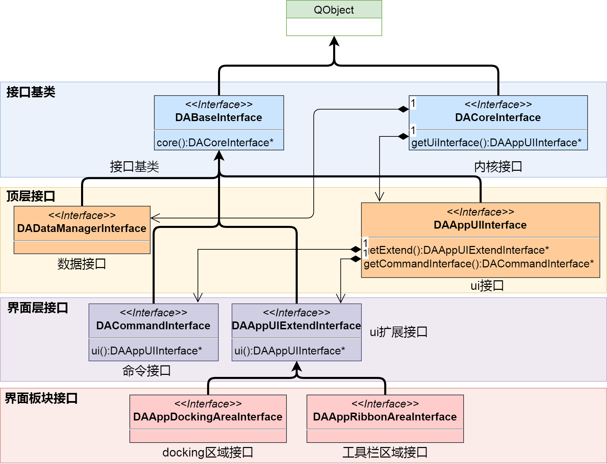
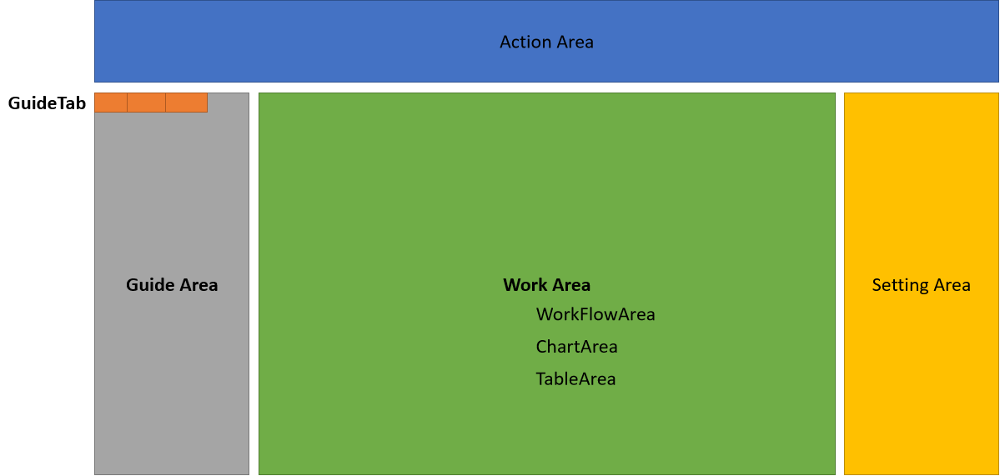

# 接口模块DAInterface

接口模块位于`DAInterface`,接口的UML图如下：

`DACoreInterface`是接口类的基础，从此接口可以获取其他的关键接口，例如`DAAppUIInterface`主要负责UI相关的接口，`DAProjectInterface`主要负责工程管理的接口，`DADataManagerInterface`主要负责数据管理相关的接口

界面的操作主要由`DAAppUIInterface`管理，`DAAppUIInterface`下可以获取界面相关的其他接口，如负责ribbon界面的接口`DAAppRibbonAreaInterface`，以及负责dock窗口的接口`DAAppDockingAreaInterface`

## 接口的创建顺序

接口创建过程有相互顺序，避免在一个接口调用一个还未创建的接口

1. `DACoreInterface` 首先创建，然后调用`DACoreInterface::initialized`进行初始化
2. 接着调用`initializePythonEnv`，初始化Python环境
3. 实例化`DADataManagerInterface`
4. 实例化`DAProjectInterface`
5. 主界面构造
6. 调用`DACoreInterface::createUi` 开始构造界面
7. 实例化`DAAppUIInterface`
8. 调用`DAAppUIInterface::createUi`
9. 实例化`DACommandInterface`
10. 实例化`DAAppActionsInterface`
11. 实例化`DAAppDockingAreaInterface`
12. 实例化`DAAppRibbonAreaInterface`

整个app的区域划分如下图所示：

`DAAppRibbonAreaInterface`负责Action Area的控制

`DAAppDockingAreaInterface`