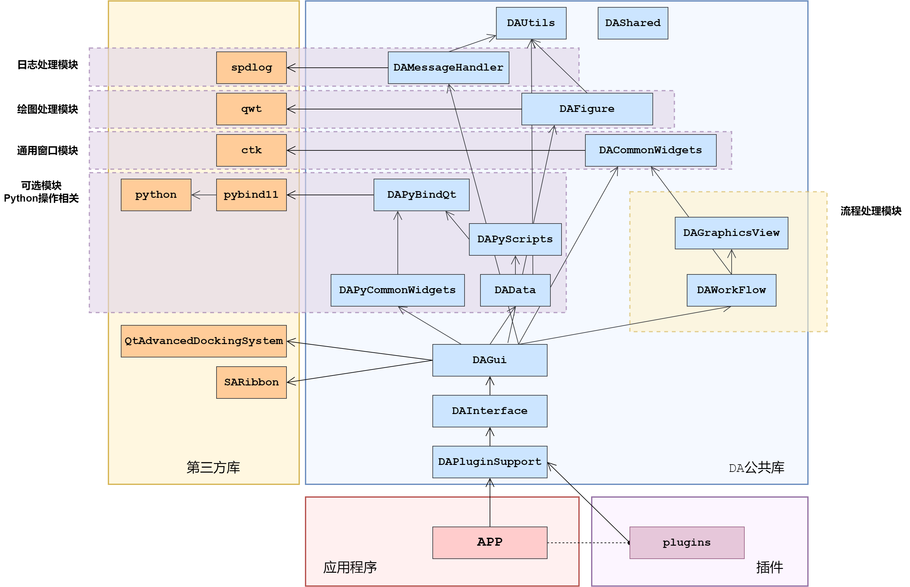
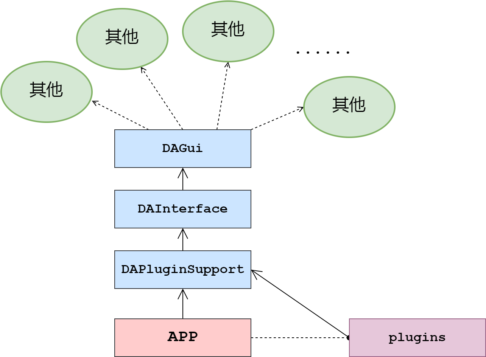

# 插件与接口

`data-workbench`通过插件实现功能，通过接口实现数据的交互

通过插件和接口两个模块可以实现整个核心逻辑的调用，`data-workbench`的各个模块间依赖关系如下图所示：

总体可以分为4大部分：

- 第三方库
- DA公共库
- 应用程序
- 插件

`data-workbench`的功能都通过插件提供，不同插件可提供不同功能，而程序只提供一个基本框架，因此，要开发具体功能，需要首先面对两个模块，一个是插件(`DAPluginSupport`)一个是接口(`DAIterface`)

通过接口可调用到整个程序的所有其他模块，这样业务逻辑都应该通过插件实现，保证了业务逻辑和界面的分离，同时也加强了扩展性