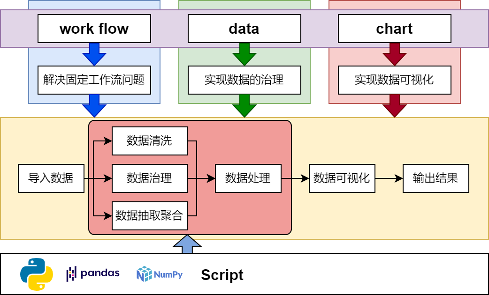
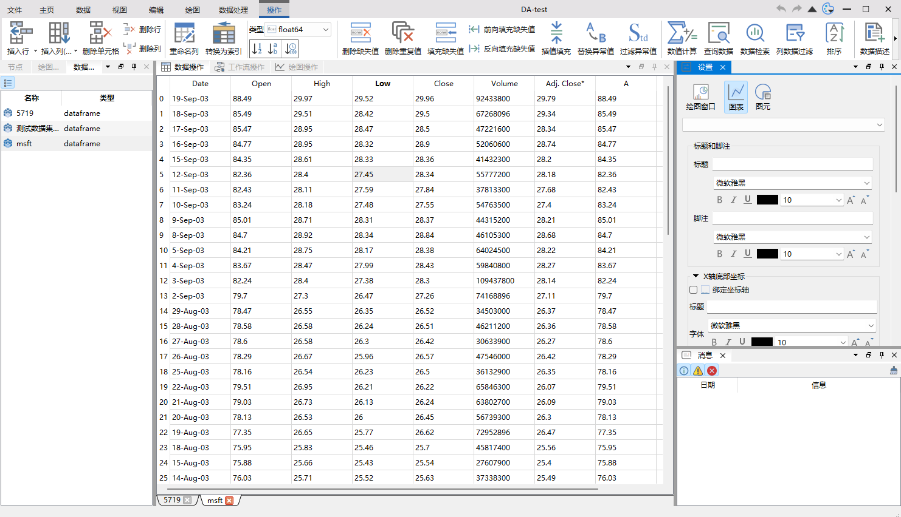
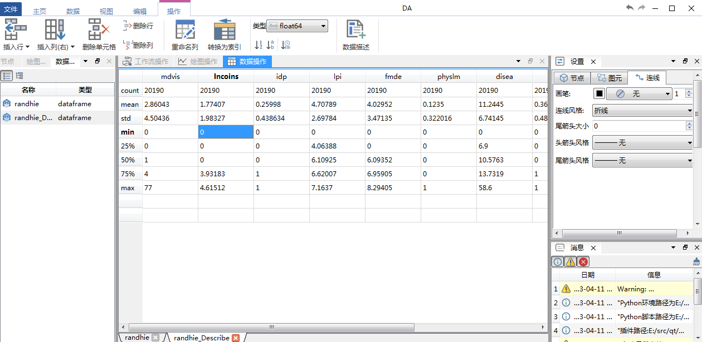

# 数据工作台

<div align="center">
<p>


</p>
</div>

本程序使用CI进行自动构建

<div align="center">
<p>

</p>
</div>


## 简介

数据工作流设计器，这个软件的设计目标是实现工作流驱动数据的ETL，集成`pandas`的数据处理能力，实现高效的交互式数据可视化以及能固定输出论文级别的图片，软件主要分三大块：`work flow`、`data`、`chart`，三大板块的关系如下图所示：



软件的设计初衷：

在数据处理过程往往有很多重复性的工作，尤其针对科研实验数据，有可能要面对n组数据，每组数据的清洗抽取方式基本是一样的，因此我希望一个数据处理软件应该是带有工作流功能的，当然python是很容易实现上述功能，但要求有一定的开发基础且要熟悉一些库才能得心应手

python的`pandas`、`numpy`、`scipy`是数据处理的三大利器，通过python进行数据处理过程，如此多的数据清洗方法，除非你把整个文档浏览一遍，否则你很难想起他们，因此一个交互式的数据清洗工具是很有必要的，把功能通过GUI明确的展现给用户，这样数据处理过程不需要长时间的翻阅文档

最后也是我用matlab和python这类数据处理工具最头疼的一点，就是数据可视化，虽然matlab和python能做出很漂亮的图，但细微的调节非常令人抓狂，例如要调整一个文本的位置，交互式的设计你只需要拖动一下鼠标，但在脚本语言里你要指定它的坐标，如果图片非常大，渲染时间比较久，那么移动一个文本到你想要的地方是一件令人非常抓狂的事情，而且matlab或者matplotlib的数据可视化函数有多有细，每次操作都要查阅半天文档，这是另人非常苦恼的事情。

目前没找到一个合适的工具来实现基于工作流的数据分析，比较接近我的需求的是`Orange3`，但`Orange3`更偏向深度学习方面，想进行单一的绘图有比较困难，`Origin`这些又是非常传统的数据分析软件，没有工作流相关模块

本软件的设计就是为了解决上面遇到的这三个问题，因此软件会分为三大板块：工作流解决固定流程问题，数据处理板块会把pandas的功能进行集成，chart板块能实现交互式的数据可视化，且能生成论文级别的图片

随着软件的开发，工作流板块逐渐形成体系，使用了有向图作为工作流的数据描述，发现不仅仅用于接近上述数据分析的问题，针对一维仿真也能非常方便的构建出模型，为此此软件也相当于提供了一个一维仿真集成框架，可以实现类似Amesim的一维仿真

## 编译

具体构建过程请见[构建说明](./build/构建说明.md)

## 第三方库

!!! note "注意"
    编译前请确保已经拉取了第三方库，本项目使用的是`git submodule`方式管理大部分第三方库，因此需要执行：
    ```shell
    git submodule update --init --recursive
    ```

编译完第三方库后，需要进行安装(`install`)，所有依赖将安装到bin目录下

需要编译的第三方库如下：

- SARibbon
- Qt-Advanced-Docking-System
- ctk(只依赖部分，这里作者对ctk进行了精简，形成一个liteCtk)
- qwt
- QtPropertyBrowser
- spdlog
- pybind11
- ordered-map

## 界面截图


主体界面演示



