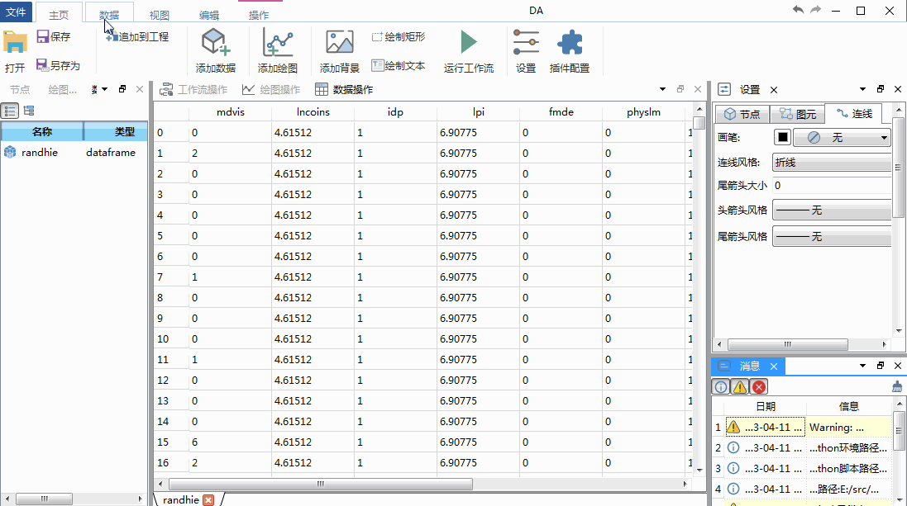
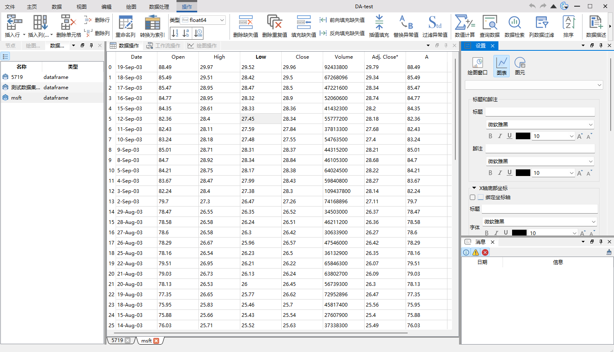
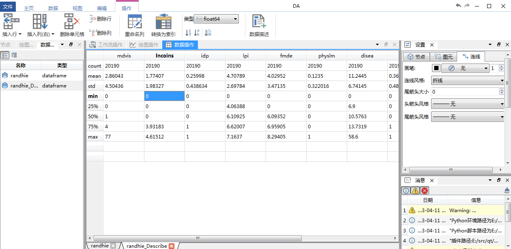

# 数据工作台

---

## 简介

**DAWorkBench** 是一个基于工作流的数据分析平台，致力于为科研人员和数据分析工程师提供高效、直观、可扩展的数据处理解决方案。

!!! success "核心价值"
    - **工作流驱动** - 自动化重复性数据处理
    - **GUI 封装 pandas** - 无需编程即可使用数据处理功能
    - **交互式可视化** - 拖拽调整，生成论文级别图片

---

## 快速导航

| 文档 | 说明 |
|------|------|
| [:material-book: 项目概览](./overview.md) | 了解项目愿景和核心特性 |
| [:material-play: 快速上手](./quick-start.md) | 5 分钟完成环境搭建和构建 |
| [:material-folder: 项目结构](./project-structure.md) | 目录组织和模块职责 |
| [:material-tools: 构建说明](./build/build-instructions.md) | 详细构建指南 |

---

## 界面截图

