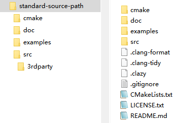
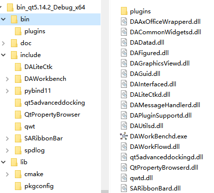
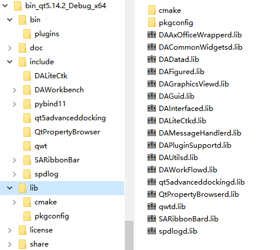
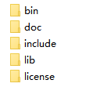

# 基于cmake的大型工程组织和构建

一个大型工程，并不会单单只包括应用自身，还有此程序抽象出来的库，这些库除了自身模块化意外，还有可能是提供给第三方用户进行插件化的开发使用的，同时工程还包含了很多第三方库

一个大型工程通常由如内容组成:

- 第三方库（例如 `OCCT`，`VTK`，`Qt`）
- 自定义库
- Gui 程序
- 静态资源（例如脚本、图片、配置文件）

针对这些大型的工程，如果用一些简单的构建工具，是很难做到一键编译一键安装的，例如 `qmake`，缺少强大的安装和依赖管理功能，所以QT6已经弃用了`qmke`，而转用了`cmake`，目前来说，在C++领域，最适合进行构建管理的还是`cmake`，虽然`cmake` 有非常非常多的缺点，但它的功能暂时是最全面的

针对大型系统目前还是推荐用`cmake`进行构建，通过`cmake`，你可以做到如下这些事情：

- 组织庞大的工程关系
- 自动化编译第三方库
- 按照依赖关系自动构建出整个工程的各组件
- 自动化安装
- 形成一个第三方方便引入的插件开发环境

这里所谓第三方方便引入的开发环境，是能让第三方可以一键引入你的库，以及你依赖的第三方库

但是`cmake`的缺点也是复杂，文档生涩，语法奇葩，说到底`cmake`就是一种高级别的宏

下面根据我的经验，介绍一下如何通过`cmake`组织和构建一个大型的工程，适合大型工业软件的构建，构建出来的软件能给第三方用户方便的进行二次开发，同时，结合 `git` 的 `submodule` 管理第三方库，让整个工程变得更为简洁明了

## 工程的目录结构

工程的顶层文件夹应该包含如下几个文件夹：

- src 文件夹，这个文件夹用来放置你所有的源代码
- doc 文件夹，这个文件夹用来放置你所有的文档
- 3rdparty 文件夹，这个文件夹用来放置你所有的第三方库，这个文件夹可以放在 src 文件夹里面，也可以放在外层目录
- 针对整个工程的 `CMakeLists.txt` 文档
- cmake 文件夹，这个文件夹放置了一些封装好的 cmake 文件，用来方便你的 cmake 的集成

上面的这些文件夹和文件是一个工程比较通用的组织结构

一般而言，在工程的顶层目录下，还会有`.clang-format`用于规范编码，`.clang-tidy`和`.clazy`用于代码检查这些按需提供，但作为一个开源的项目，还是建议提供的

因此一个相对标准的源码目录如下图所示



## 第三方库的管理

3rdparty 文件夹用来放置所有的第三方库的源代码，通常来讲，第三方库源代码不应该下载下来，放进 3rdparty 文件夹，而是通过 git 的 `submodule` 添加进去，通过 `submodule` 方式添加进去的源代码，可以随时更新到 github 上的最新版本，也可以指定这个第三方库是某个固定分支或者是某个 tag

例如我这里需要使用ribbon界面，添加了SARibbon作为第三方库

```shell
git submodule add https://github.com/czyt1988/SARibbon.git ./src/3rdparty/SARibbon
```

> 注意，对于使用`submodule`管理第三方库的方式，首次拉取项目之后，需要执行：
> 
> ```shell
> git submodule update --init --recursive
> ```
> 
> 把所有库拉取下来
>
> 也可以clone的时候使用--recursive参数
> 
> ```shell
> git clone --recursive
> ```

大部分的第三方库都提供了 `cmake`，如果不提供的话，我会 fork 一个，写一个带有 `cmake` 的版本，例如 [qwt库](https://github.com/czyt1988/QWT)，[QtPropertyBroswer库](https://github.com/czyt1988/QtPropertyBrowser)，3rdparty 文件夹下会写一个 `cmake` 文件，用来集中编译所有的第三方库，一般我会在 `cmake` 中就指定安装目录，确保第三方库的安装目录和我的程序的安装目录是一致的，这样的好处是，如果你的程序需要给其他人进行二次开发的话，能保证你程序编译出来的库和第三方库是在一个安装环境下，这样可以解决第三方库和你自身程序库的依赖问题，不需要用户在编译你的程序之前先进行大量的第三方库的编译，只需要一次统一的编译即可把所有的第三方库安装到固定目录下,最后install后，形成一个完整的开发环境


连同第三方库一起发布的开发环境bin目录



连同第三方库一起发布的开发环境lib目录


作为第三方开发者，这个完整开发环境里面包含了所有的库，第三方开发者只需知道安装目录，就可以加载所有的依赖

下面就介绍一下，如何通过cmake实现这种大型工程的组织

## 大型工程的cmake写法

这里不会教你如何写cmake，而是着重讲讲大型工程的cmake要注意事项，工程顶层会有个`CMakeLists.txt`文件，这个文件定义了整个工程的信息、可选项、总体的安装步骤等，实现整个工程的构建，顶层的`CMakeLists.txt`通过`add_subdirectory`添加子目录，一般会添加src目录，以我自己的一个[仿真集成平台data-workbench举例](https://github.com/czyt1988/data-workbench)，介绍如何通过cmake组织一个大型的工程

> 上述的仿真集成平台不提供业务逻辑，所有业务逻辑都是通过插件实现，插件的开发就需要依赖此集成平台和所有第三方库

首先，如前文所述，这个工程的目录结构大致如下：

```
data-workbench
  |-doc
  |-cmake
  | |-此项目用到的cmake文件
  |-src
  | |-3rdparty
  | |-DAUtils (utils模块，封装了通用功能)
```

这里的工程使用同一前缀

在进行大型工程组织之前，`cmake` 的 `install` 命令是绝对要掌握的，而且要熟知通用的安装目录结构标准，不能过度自由的发挥，`install` 命令可以做下面这些事情：

1. 复制文件或者文件夹到某个固定的目录下
2. 导出能被其它工程 `cmake` 正确导入的 `cmake` 文件，一般是4个cmake文件：`{库名}Config.cmake`、`{库名}ConfigVersion.cmake`、`{库名}Targets.cmake`、`{库名}Targets-debug.cmake`
3. 能给当前这个构件树下其他的模块提供依赖支持

另外现代 `cmake` 有一个很重要的功能，可以区分构建环境和安装环境进行不同的依赖引用和头文件寻址（这就是为什么要用`target_xx`开头的命令），这样就可以区分当前的构建环境亦或是未来第三方用户，进行二次开发时候的安装环境，这两个环境的头文件寻址路径以及依赖的寻址路径是不一样的

`cmake`的`install`用法是比较固定的，按照一个例子或者模板非常简单的就能实现自己的安装和部署，针对大型系统一个多组件的安装是必须的，类似于QT的包引入，能进行模块的划分，不需要整个QT所有库都一起引进工程里面，针对自己的大型系统也应该实现类似的引入，因此，下面将着重介绍如何进行模块化的`install`

### 规范的安装路径

使用规范的安装路径，能让你工程的库以及第三方库安装在同一个目录下，这样你的工程就很容易被第三方使用者集成起来进行二次开发，因此，安装路径尽量使用规范化的安装路径，而不是过于自由的进行定制，一般规范化的安装路径如下：

- bin
- lib
- lib/cmake
- include

常见的cmake安装路径下的文件夹如图所示



cmake中提供了GNUInstallDirs来获取这些规范的路径命名，你可以通过`include(GNUInstallDirs)`导入，就可以使用：

- `CMAKE_INSTALL_BINDIR`
- `CMAKE_INSTALL_LIBDIR`
- `CMAKE_INSTALL_INCLUDEDIR`
- `CMAKE_INSTALL_DOCDIR`

这些变量了提供了标准的命名

bin目录放置编译完的二进制文件在WINDOWS系统上就是dll文件

lib文件夹放置编译后的lib文件，在WINDOWS系统下，MSVC编译器编译出来就是.lib后缀的文件

一般情况下，lib文件夹下还有一个`cmake`子文件夹，这个文件夹放置`cmake`的导出文件，通常来讲，这个文件夹下的导出文件放在它自身工程名的一个文件夹里，形成如：`lib/cmake/{LibName}`的文件夹结构

include文件夹主要放置头文件，通常来讲头文件也是需要放在他自身工程名的一个文件夹里，形成如：`include/{LibName}`的文件夹结构

基本上大部分的第三方库都是按照这个目录结构进行安装，这样当你的工程包含了大量的第三方库，以及你自身的库的情况下，最终所有的dll都会安装在`bin`录下，所有的库文件都会安装在`lib`目录下，所有的头文件都会在`include`文件夹下面对应的自身库名的文件夹下面，所有`cmake`需要用的文件都在`lib/cmake`文件夹下对应的自身库名的文件夹下面

以这种标准化的形式构建，第三方开发者可以很方便的使用你的工程

这里举一个例子，假如你的库名叫`SARibbonBar`，那么它安装后在windows系统下应该生成如下结构

```
bin
  |-SARibbonBar.dll
include
  |-SARibbonBar
     |-SARibbonBar.h
     |-...所有头文件都在此文件夹下
lib
  |-SARibbonBar.lib
  |-cmake
    |-SARibbonBar
       |-SARibbonBarConfig.cmake
       |-SARibbonBarConfigVersion.cmake
       |-SARibbonBarTargets.cmake
       |-SARibbonBarTargets-debug.cmake
```

### install命令

cmake的install是一组命令，有多个功能

#### 复制文件`install(FILES)`&`install(DIRECTORY)`

最简单的就是拷贝，包括`install(FILES)`,`install(DIRECTORY)`这两个都是拷贝用的，一个拷贝文件，一个拷贝目录

例如，[SARibbon库](https://github.com/czyt1988/SARibbon)的Cmake文件中，头文件都在`${SARIBBON_HEADER_FILES}`这个变量下面,把它拷贝到安装目录下的`include/${SARIBBON_LIB_NAME}`路径下，就如下这样写，安装路径按照上面说的标准化走

```cmake
install(FILES
    ${SARIBBON_HEADER_FILES}
    DESTINATION include/${SARIBBON_LIB_NAME}
    COMPONENT headers
)
```

#### 生成cmake目标文件`install(TARGETS)`&`install(EXPORT)`

`install(TARGETS)`&`install(EXPORT)`这两个命令是要配合一起用，用来生成cmake目标文件，cmake目标文件描述了整个工程所有的依赖内容，最终生成`{LibName}Targets.cmake`和`{LibName}Targets-debug.cmake`文件

这两个函数写法也比较固定,这里假如你自己的库名字叫${LIB_NAME}，那么`install(TARGETS)`&`install(EXPORT)`的写法基本如下：

```cmake
install(TARGETS ${LIB_NAME}
    EXPORT ${LIB_NAME}Targets
    RUNTIME DESTINATION bin
    LIBRARY DESTINATION lib
    ARCHIVE DESTINATION lib
    INCLUDES DESTINATION include/${LIB_NAME}
)

install(EXPORT ${LIB_NAME}Targets
    FILE ${LIB_NAME}Targets.cmake
    DESTINATION lib/cmake/${LIB_NAME}
)
```

上面的写法其实不标准，主要是目标地址中的include和lib这两个属于标准文件夹命名，在cmake中可以引入`GNUInstallDirs`，获取常量位置，标准写法应该这样：

```cmake
include(GNUInstallDirs)
install(TARGETS ${LIB_NAME}
    EXPORT ${LIB_NAME}Targets
    RUNTIME DESTINATION bin
    LIBRARY DESTINATION lib
    ARCHIVE DESTINATION lib
    INCLUDES DESTINATION ${CMAKE_INSTALL_INCLUDEDIR}/${LIB_NAME}
)

install(EXPORT ${LIB_NAME}Targets
    FILE ${LIB_NAME}Targets.cmake
    DESTINATION ${CMAKE_INSTALL_LIBDIR}/cmake/${LIB_NAME}
)
```

这两个结合，把你的目标依赖内容，写到了`{LibName}Targets.cmake`文件中，并复制到安装目录下的`lib/cmake/${LIB_NAME}`下,`install(TARGETS)`用来把你的工程信息导出到`${LIB_NAME}Targets`这个变量中，`install(EXPORT)`把`${LIB_NAME}Targets`这个内容，生成到`${LIB_NAME}Targets.cmake`文件中，同时也会生成一个`{LibName}Targets-debug.cmake`文件

这个文件就是第三方引入你的工程的关键，这里会把target_打头的函数相关信息写入这个文件中，例如`target_compile_definitions`和`target_include_directories`这些函数定义的信息，也会写入`${LIB_NAME}Targets.cmake`文件中，一些预定义的宏和头文件路径在加载`${LIB_NAME}Targets.cmake`后就自动加载进来了，因此，那些宏和头文件路径要暴露给第三方的，都应该使用target_xx的函数，同时也要区分构建环境还是安装环境，如果你的CMakeLists.txt作为一个子目录，那么这时属于构建环境，尤其针对include_directories，构建环境和安装环境肯定不一样的，因此要区别对待，否则作为子工程嵌入时会出错，如下区分构建环境和安装环境的路径引用

```cmake
target_include_directories(${SARIBBON_LIB_NAME} PUBLIC
    $<INSTALL_INTERFACE:include/${SARIBBON_LIB_NAME}>
    $<BUILD_INTERFACE:${CMAKE_CURRENT_SOURCE_DIR}>
)
```

#### 生成config文件`configure_package_config_file`

cmake的find_package函数不是加载`${LIB_NAME}Targets.cmake`，而是加载`{LibName}Config.cmake`文件，`{LibName}Config.cmake`文件的生成，需要用到`configure_package_config_file`函数，一般还会配合`write_basic_package_version_file`,这两个函数在`CMakePackageConfigHelpers`里面，需要先引入

```cmake
include(CMakePackageConfigHelpers)
```

你会留意到好多开源项目都会有个`{LibName}Config.cmake.in`文件在src目录下，这个文件就是用来生成`{LibName}Config.cmake`文件的，`{LibName}Config.cmake`的作用就是加载上面生成的`${LIB_NAME}Targets.cmake`文件，同时能加入一些自己的扩展内容，因此，`{LibName}Config.cmake.in`的通用写法是：

```cmake
# This module defines
# @PROJECT_NAME@_FOUND, if false, do not try to link to @PROJECT_NAME@
# @PROJECT_NAME@_INCLUDE_DIR, where to find the headers
# @PROJECT_NAME@_LIBRARIES, where to find the libs
@PACKAGE_INIT@

set (PackageName @YOUR_LIB_NAME@)
set (@YOUR_LIB_NAME@_VERSION @YOUR_LIB_VERSION@)

include ( ${CMAKE_CURRENT_LIST_DIR}/${PackageName}Targets.cmake )

set_and_check ( ${PackageName}_INCLUDE_DIR ${PACKAGE_PREFIX_DIR}/@YOUR_LIB_INCLUDE_INSTALL_DIR@ )

set ( ${PackageName}_LIBRARIES)
list ( APPEND ${PackageName}_LIBRARIES ${PackageName})

check_required_components(${PackageName})
```

其中@xx@是调用这个cmake.in文件的CMakeLists文件的变量，一般会传入三个变量

- `@YOUR_LIB_NAME@` 你的库名字,也可以用`PROJECT_NAME`替代，看习惯
- `@YOUR_LIB_VERSION@` 你的库的版本号
- `@YOUR_LIB_INCLUDE_INSTALL_DIR@` 你的库安装后的include文件位置，这个用来检查文件的完整性

`${PACKAGE_PREFIX_DIR}`这个变量是在`@PACKAGE_INIT@`里面展开的

`@PACKAGE_INIT@`这个变量会展开为下面这段

```cmake
####### Expanded from @PACKAGE_INIT@ by configure_package_config_file() #######
####### Any changes to this file will be overwritten by the next CMake run ####
####### The input file was DAWorkbenchConfig.cmake.in                            ########

get_filename_component(PACKAGE_PREFIX_DIR "${CMAKE_CURRENT_LIST_DIR}/../../../" ABSOLUTE)

macro(set_and_check _var _file)
  set(${_var} "${_file}")
  if(NOT EXISTS "${_file}")
    message(FATAL_ERROR "File or directory ${_file} referenced by variable ${_var} does not exist !")
  endif()
endmacro()

####################################################################################
```

`@PACKAGE_INIT@`相当于提供了一个宏函数和一个变量，宏函数为`set_and_check`，用于检测文件是否存在，变量为`PACKAGE_PREFIX_DIR`，用于指定工程的绝对安装路径，用过这个变量可以直接指到安装路径的顶层目录

### 单一模块的install写法

如果你作为一个库开发者，这个库只有一个模块，那么写法相对固定，根据上面的介绍，单一模块的install写法基本就是如下步骤：

1. 确定库名和版本号

```cmake
set(YOUR_LIB_NAME YOURLibName)
set(YOUR_VERSION_MAJOR 1)
set(YOUR_VERSION_MINOR 0)
set(YOUR_VERSION_PATCH 0)
set(YOUR_VERSION "${YOUR_VERSION_MAJOR}.${YOUR_VERSION_MINOR}.${YOUR_VERSION_PATCH}")
```

2. target_xx相关函数，定义宏、头文件路径等内容

- 注意要区分安装模式还是构建模式，通过`$<INSTALL_INTERFACE:`指定安装模式，通过`$<BUILD_INTERFACE:`指定构建模式

3. 文件复制

复制头文件

```cmake
install(FILES
    ${YOUR_HEADER_FILES}
    DESTINATION include/${YOUR_LIB_NAME}
    COMPONENT headers
)
```
其中${YOUR_HEADER_FILES}为你头文件的列表

通过install可以复制任意内容

4.把依赖信息导出同时生成XXTargets.cmake文件

```cmake
install(TARGETS ${YOUR_LIB_NAME}
    EXPORT ${YOUR_LIB_NAME}Targets
    RUNTIME DESTINATION bin
    LIBRARY DESTINATION lib
    ARCHIVE DESTINATION lib
    INCLUDES DESTINATION include/${YOUR_LIB_NAME}
)
install(EXPORT ${YOUR_LIB_NAME}Targets
    FILE ${YOUR_LIB_NAME}Targets.cmake
    DESTINATION lib/cmake/${YOUR_LIB_NAME}
)
```

上面这两个是导出cmake文件的关键，它会生成两个文件，一个叫`${LIB_NAME}Targets.cmake`，一个叫`${LIB_NAME}Config.cmake`，是通过find_package函数加载的关键，因此，这个文件需要放在lib/cmake/${LIB_NAME}目录下，这个目录是cmake的安装目录

5. 生成config文件

```cmake
include(CMakePackageConfigHelpers)
set(YOUR_LIB_INCLUDE_INSTALL_DIR include/${YOUR_LIB_NAME})
write_basic_package_version_file(
    ${CMAKE_CURRENT_BINARY_DIR}/${YOUR_LIB_NAME}ConfigVersion.cmake
    VERSION ${YOUR_VERSION}
    COMPATIBILITY SameMajorVersion
)
configure_package_config_file(
    "${CMAKE_CURRENT_SOURCE_DIR}/${YOUR_LIB_NAME}Config.cmake.in"
    "${CMAKE_CURRENT_BINARY_DIR}/${YOUR_LIB_NAME}Config.cmake"
    INSTALL_DESTINATION lib/cmake/${YOUR_LIB_NAME}
    PATH_VARS YOUR_LIB_INCLUDE_INSTALL_DIR
)
```

上面的${YOUR_LIB_NAME}Config.cmake.in是你为了生成Config.cmake文件使用的内嵌文件，具体位置视情况而定

YOUR_LIB_INCLUDE_INSTALL_DIR变量指定了安装位置，用于进行导入检查

6. 复制cmake文件到lib/cmake

```cmake
install(FILES
    "${CMAKE_CURRENT_BINARY_DIR}/${YOUR_LIB_NAME}Config.cmake"
    "${CMAKE_CURRENT_BINARY_DIR}/${YOUR_LIB_NAME}ConfigVersion.cmake"
    DESTINATION lib/cmake/${YOUR_LIB_NAME}
)
```

上面6步完成了一个库的安装，能把库需要的东西都放到安装目录下，通过提供的cmake文件，能找到对应的内容

使用这个库仅仅需要以下步骤：

```cmake
set(${YOUR_LIB_NAME}_DIR "your-lib-install-dir/lib/cmake")
find_package(${YOUR_LIB_NAME})
```

### 多模块的install写法

上面介绍了单一模块的写法，多模块有一点区别

Qt就是一个多模块的例子，Qt模块的引入是这样写的：

```cmake
find_package(QT NAMES Qt6 Qt5 COMPONENTS 
    Core
    Gui
    Widgets
)
```

可以按需获取对应的模块

多模块的`install`必须先有单模块的`install`，其实多模块的`install`就是遍历了所有单模块所生成的config文件，多模块的`install` 也是需要一个类似单模块的config文件，只是这个config文件和单模块不太一样，它会遍历所有子模块的Target，把这些子模块需要的头文件引用路径以及依赖的库加载进来，这样只需要调用findPackage函数就可以把这个子模块所有需要的内容加载进来

多模块的核心就是每个子模块需要导出到同一个导出集，就是`install(TARGETS `命令的`EXPORT`对象是一个导出集

对于多模块，你的工程目录可能是这样的

```
root
├src
│├─module-1
││ └─CMakeLists.txt
│├─module-2
││ └─CMakeLists.txt
│...
│├─module-n
││  └─CMakeLists.txt
│└─CMakeLists.txt
│CMakeLists.txt
└PackageConfig.cmake.in
```
顶层cmake文件最好定义一个统一的导出集，例如：

set(MyProject_TARGET_NAME "MyProjectTargets") # 这是所有模块统一的导出集，所有的子模块在`install(TARGETS xx EXPORT `时都应该`EXPORT`到这个总的导出集

例如我一个项目总体名称为QIm，这个项目里有几个模块，分别为Core、Widgets

我希望使用这个库的时候这样导入

```cmake
find_package(QIm REQUIRED)
target_link_libraries(myapp 
    QIm::Core 
    QIm::Widgets
)
```

那么，就需要把所有子模块的Target都导出到`QImTargets`这个总的导出集，这样，当find_package(QIm)的时候，就会自动加载所有子模块的Target，并把所有子模块的引用路径加载进来

一般在顶层项目就订好总导出集的名称，例如：MyProjectTargets

```cmake
set(QIM_TARGET_NAME "QImTargets") # 这是所有模块统一的导出集
```

子模块的install写法和之前单一模块略有不同（更简单点）

首先`write_basic_package_version_file`、`configure_package_config_file`这两个不在需要，由顶层统一处理

其次子模块要导出到统一导出集，以上面讲的QIm模块为例，子模块Core的install如下

```cmake
set(QIMCORE_PROJECT_NAME "Core")
add_library(${QIMCORE_PROJECT_NAME} SHARED)
# 创建别名是为了本地项目能通过QIm::Core访问，例如同级项目的example能通过QIm::Core访问Core模块,这样就和真实用户调用一样
add_library(${QIM_PROJECT_NAME}::Core ALIAS ${QIMCORE_PROJECT_NAME})
...
# 添加Core到导出集
install(TARGETS ${QIMCORE_PROJECT_NAME} # Core
    EXPORT ${QIM_TARGET_NAME}           # 统一导出集QImTargets
    ARCHIVE DESTINATION ${CMAKE_INSTALL_LIBDIR}
    LIBRARY DESTINATION ${CMAKE_INSTALL_LIBDIR}
    RUNTIME DESTINATION ${CMAKE_INSTALL_BINDIR}
    INCLUDES DESTINATION ${CMAKE_INSTALL_INCLUDEDIR}/${QIM_PROJECT_NAME}/core
)
```

这里子模块名称为`QImCore`,在`CMake 3.15+` 允许导出时重命名(`RENAME`参数) target。如果 CMake 版本较低，必须将 target 名称直接改为 Core

Widgets模块同理：

```cmake
set(QIMWIDGETS_PROJECT_NAME "Widgets")
add_library(${QIMWIDGETS_PROJECT_NAME} ${LIB_TYPE})
# 创建别名是为了本地项目能通过QIm::Widgets访问，例如同级项目的example能通过QIm::Widgets访问Widgets模块,这样就和真实用户调用一样
add_library(${QIM_PROJECT_NAME}::Widgets ALIAS ${QIMWIDGETS_PROJECT_NAME})
...
# 添加Widgets到导出集
install(TARGETS ${QIMWIDGETS_PROJECT_NAME}   # Widgets
    EXPORT ${QIM_TARGET_NAME}                # 统一导出集QImTargets
    ARCHIVE DESTINATION ${CMAKE_INSTALL_LIBDIR}
    LIBRARY DESTINATION ${CMAKE_INSTALL_LIBDIR}
    RUNTIME DESTINATION ${CMAKE_INSTALL_BINDIR}
    INCLUDES DESTINATION ${CMAKE_INSTALL_INCLUDEDIR}
)
```

顶层 `CMakeLists.txt`是关键，它负责整个项目的统一导出

```cmake
########################################################
# 总安装
########################################################
include(GNUInstallDirs)
# 生成统一的 QImConfig.cmake
include(CMakePackageConfigHelpers)
write_basic_package_version_file(
    "${CMAKE_CURRENT_BINARY_DIR}/${PROJECT_NAME}ConfigVersion.cmake"
    VERSION ${PROJECT_VERSION}
    COMPATIBILITY AnyNewerVersion
)
configure_package_config_file(
    "${CMAKE_CURRENT_SOURCE_DIR}/cmake/${PROJECT_NAME}Config.cmake.in"
    "${CMAKE_CURRENT_BINARY_DIR}/${PROJECT_NAME}Config.cmake"
    INSTALL_DESTINATION ${CMAKE_INSTALL_LIBDIR}/cmake/${PROJECT_NAME}
)
# 统一导出所有模块的 target
install(EXPORT ${QIM_TARGET_NAME}
    FILE ${QIM_TARGET_NAME}.cmake
    NAMESPACE ${QIM_PROJECT_NAME}::
    DESTINATION ${CMAKE_INSTALL_LIBDIR}/cmake/${QIM_PROJECT_NAME}
)
install(FILES
    "${CMAKE_CURRENT_BINARY_DIR}/${PROJECT_NAME}ConfigVersion.cmake"
    "${CMAKE_CURRENT_BINARY_DIR}/${PROJECT_NAME}Config.cmake"
    DESTINATION ${CMAKE_INSTALL_LIBDIR}/cmake/${PROJECT_NAME}
)
```

这里${PROJECT_NAME}=QIm,导出时需要QImConfig.cmake.in文件，习惯性把这个文件放在工程的cmake目录下，这里${CMAKE_CURRENT_SOURCE_DIR}/cmake/${PROJECT_NAME}Config.cmake.in对应的目录就是`./cmake/QImConfig.cmake.in`目录

QImConfig.cmake.in文件内容如下：

```cmake
@PACKAGE_INIT@

# 包含所有导出的 targets（Core + Widgets）
include("${CMAKE_CURRENT_LIST_DIR}/QImTargets.cmake")

# 设置包级变量
set_and_check(QIM_INCLUDE_DIR "${PACKAGE_PREFIX_DIR}/@CMAKE_INSTALL_INCLUDEDIR@")
set_and_check(QIM_LIBRARY_DIR "${PACKAGE_PREFIX_DIR}/@CMAKE_INSTALL_LIBDIR@")

check_required_components(QIm)
```

最终子模块的Config.cmake和包的Config.cmake都在lib/cmake/${PROJECT_NAME}

具体cmake的写法，可以看QIm项目,这是一个基于OpenGL的高性能的Qt绘图库：

[https://gitee.com/czyt1988/qim](https://gitee.com/czyt1988/qim)
[https://github.com/czyt1988/QIm](https://github.com/czyt1988/QIm)

## 工程的组织

至此，单模块和多模块的安装都已介绍完成，大型工程的组织和安装就是这两者的组合

工程各个模块安装到固定目录下，连同第三方库指定同一个安装路径，最终形成一个完整的开发环境

这里以实际例子举例，例子源码位于：

[github:https://github.com/czyt1988/data-workbench](https://github.com/czyt1988/data-workbench)

[gitee镜像:https://gitee.com/czyt1988/data-workbench](https://gitee.com/czyt1988/data-workbench)

源码目录结构(这里为了便于显示，文件夹用[]扩起)：

```
[root]
├[src]
│ ├─[3rdparty]
│ │ ├─[spdlog]
│ │ ...
│ │ ├─[SARibbon]
│ │ └─CMakeLists.txt(用于构建和安装第三方库)
│ ├─[DAUtils]
│ │ └─CMakeLists.txt
│ ├─[DAGui]
│ │ └─CMakeLists.txt
│ ...
│ ├─[APP]
│ │  └─CMakeLists.txt
│ ├─CMakeLists.txt
│ └─DALibConfig.cmake.in(用于给各个子模块生成Config.cmake文件)
├─CMakeLists.txt
└─DAWorkbenchConfig.cmake.in(用于生成总包的Config.cmake文件)
```

1. 指定统一的安装目录

这一步可以使得第三方库和工程安装的位置一致，对于linux有比较规范的安装路径，但windows不一样，默认是在`C:\Program Files\xxx`这样的位置，没有统一放lib的地方，因此，windows下，个人习惯指定工程的自身目录下建立一个安装目录，以bin_{Debug/Release}_{x32/x64}的方式命名，如果有`Qt`，还会加上`Qt`的版本以作区分，如下所示：

```cmake
# 获取qt版本
find_package(QT NAMES Qt6 Qt5 COMPONENTS Core REQUIRED)
# 平台判断
if("${CMAKE_SIZEOF_VOID_P}" STREQUAL "4")
    set(my_platform_name "x86")
else()
    set(my_platform_name "x64")
endif()
# 生成安装目录名称
set(my_install_dir_name bin_qt${QT_VERSION}_${CMAKE_BUILD_TYPE}_${my_platform_name})
# 设置固定的安装目录路径，具体位置具体设置，这里设置为当前cmake文件所在目录
set(CMAKE_INSTALL_PREFIX "${CMAKE_CURRENT_LIST_DIR}/${my_install_dir_name}")
```

2. 第三方库

如前文所述，第三方库都在`src/3rdparty`下面，首先需要的是对第三方库的编译，`3rdparty`有个`CMakeLists.txt`文件夹用于编译安装所有第三方库，个人习惯不把`3rdparty`下的`CMakeLists.txt`纳入顶层工程的`subdirectory`中，因为不保证所有第三方库的cmake写的都正常，第三方库的`CMakeLists.txt`指定了`CMAKE_INSTALL_PREFIX`和顶层工程一致，确保安装路径一致

3. 组织顶层工程

顶层工程`CMakeLists`主要负责做以下事情：

- 定义`option`
- 定义工程名称
- 做全局的编译设置，如c++版本要求，编译环境的POSTFIX设置
- 通过`add_subdirectory`完成整个工程的组织
- 工程模块化的安装（见多模块的install写法）
- 工程的完整安装

## 第三方用户引入的方式

对于第三方插件开发者来说，首先需要clone你的工程，并进行编译，先编译第三方库，并进行安装（install），再编译工程，并进行安装（install）,这时候，第三方开发者就可以有一个完整的开发环境了


