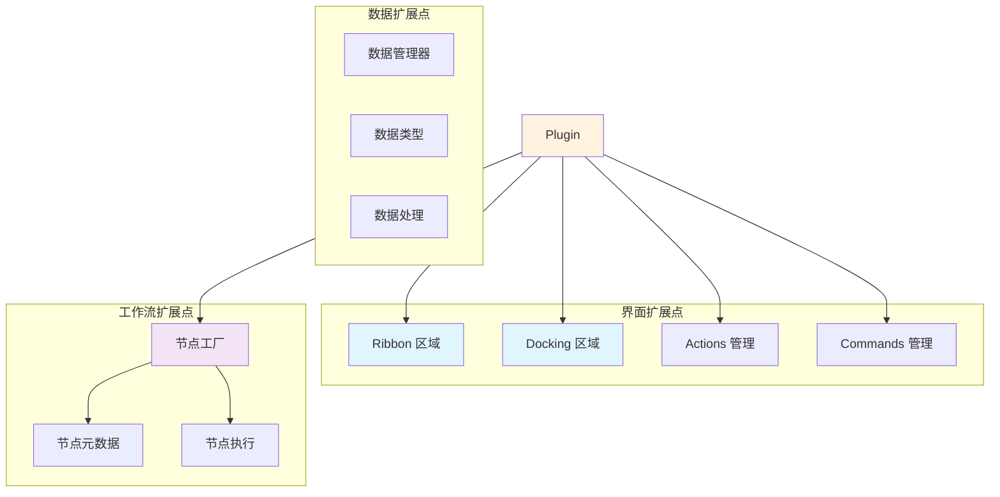

# 功能定制与扩展能力

本指南说明如何通过插件扩展 DAWorkBench 的界面和功能，包括添加菜单项、工具栏按钮、Dock 窗口等。

---

## 扩展点概览



---

## Ribbon 界面扩展

### 获取 Ribbon 接口

```cpp
bool MyPlugin::initialize()
{
    DA::DACoreInterface* core = this->core();
    DA::DAAppUIInterface* ui = core->getUiInterface();
    DA::DARibbonAreaInterface* ribbon = ui->getRibbonArea();
    
    return true;
}
```

### 添加 Ribbon Category

```cpp
void MyPlugin::setupRibbon()
{
    DA::DARibbonAreaInterface* ribbon = getRibbonInterface();
    
    // 创建新的 Category（选项卡）
    SARibbonCategory* category = ribbon->addCategory(tr("My Tools"));
    category->setObjectName("myplugin.main.category");
    
    // 创建 Panel（面板）
    SARibbonPanel* panel1 = category->addPanel(tr("Data Processing"));
    panel1->setObjectName("myplugin.panel.processing");
    
    // 创建 Panel 2
    SARibbonPanel* panel2 = category->addPanel(tr("Visualization"));
    panel2->setObjectName("myplugin.panel.visualization");
}
```

### 添加 Action 按钮

```cpp
void MyPlugin::setupActions()
{
    DA::DARibbonAreaInterface* ribbon = getRibbonInterface();
    DA::DAActionsInterface* actions = getActionsInterface();
    
    // 获取或创建 Panel
    SARibbonCategory* category = ribbon->category("myplugin.main.category");
    SARibbonPanel* panel = category->panel("myplugin.panel.processing");
    
    // 创建 Action
    QAction* actionProcess = new QAction(QIcon(":/icon/process.png"), tr("Process Data"));
    actionProcess->setObjectName("myplugin.action.process");
    actionProcess->setToolTip(tr("Process selected data with custom algorithm"));
    
    // 连接信号
    connect(actionProcess, &QAction::triggered, this, &MyPlugin::onProcessData);
    
    // 注册到 Actions 管理器
    actions->registerAction(actionProcess, "myplugin");
    
    // 添加到 Ribbon Panel
    panel->addLargeAction(actionProcess);
}
```

### 隐藏默认界面元素

```cpp
void MyPlugin::hideDefaultUI()
{
    DA::DADockingAreaInterface* dock = getDockingInterface();
    DA::DARibbonAreaInterface* ribbon = getRibbonInterface();
    
    // 隐藏不需要的 Dock 窗口
    dock->hideDockWidget(dock->getWorkFlowOperateWidget());
    dock->hideDockWidget(dock->getWorkflowNodeListWidget());
    
    // 隐藏不需要的 Ribbon Panel
    ribbon->hidePanel("da-pannel-main.workflow");
}
```

---

## Dock 窗口扩展

### 创建自定义 Dock 窗口

```cpp
// MyDockWidget.h
class MyDockWidget : public QWidget
{
    Q_OBJECT
public:
    explicit MyDockWidget(QWidget* parent = nullptr);
    
    void retranslate();  // 多语言支持
    
private:
    QTableView* m_dataView;
    QPushButton* m_refreshBtn;
};

// MyDockWidget.cpp
MyDockWidget::MyDockWidget(QWidget* parent)
    : QWidget(parent)
{
    QVBoxLayout* layout = new QVBoxLayout(this);
    
    m_dataView = new QTableView(this);
    m_refreshBtn = new QPushButton(tr("Refresh"), this);
    
    layout->addWidget(m_dataView);
    layout->addWidget(m_refreshBtn);
    
    connect(m_refreshBtn, &QPushButton::clicked, this, &MyDockWidget::onRefresh);
}
```

### 注册 Dock 窗口

```cpp
bool MyPlugin::initialize()
{
    DA::DADockingAreaInterface* dock = getDockingInterface();
    
    // 创建 Dock 窗口
    m_dockWidget = new MyDockWidget();
    
    // 注册到 Docking 系统
    dock->addDockWidget(m_dockWidget, 
                        tr("My Data View"), 
                        Qt::RightDockWidgetArea,
                        "myplugin.dock.dataview");
    
    // 设置初始状态
    dock->setDockWidgetFeatures(m_dockWidget, 
                                QDockWidget::DockWidgetClosable | 
                                QDockWidget::DockWidgetMovable);
    
    return true;
}
```

### Dock 窗口布局管理

```cpp
void MyPlugin::setupDockLayout()
{
    DA::DADockingAreaInterface* dock = getDockingInterface();
    
    // 嵌套布局
    dock->addDockWidget(m_dataDock, Qt::LeftDockWidgetArea);
    dock->addDockWidget(m_resultDock, Qt::LeftDockWidgetArea);
    
    // 堆叠布局
    dock->stackDockWidgets(m_dataDock, m_resultDock);
    
    // Tab 化布局
    dock->tabifyDockWidgets(m_dataDock, m_resultDock);
}
```

---

## 菜单扩展

### 添加上下文菜单

```cpp
void MyPlugin::setupContextMenu()
{
    DA::DAActionsInterface* actions = getActionsInterface();
    
    // 创建菜单 Action
    QAction* actionExport = new QAction(tr("Export to MyFormat"));
    actionExport->setObjectName("myplugin.action.export");
    connect(actionExport, &QAction::triggered, this, &MyPlugin::onExportData);
    
    // 注册到数据上下文菜单
    actions->addContextMenuAction("data.table", actionExport);
    
    // 注册到图表上下文菜单
    actions->addContextMenuAction("chart.figure", actionExport);
}
```

### 自定义菜单触发逻辑

```cpp
void MyPlugin::onExportData()
{
    // 获取当前选中的数据
    DA::DACoreInterface* core = this->core();
    DA::DADataManagerInterface* dataMgr = core->getDataManagerInterface();
    
    DA::DADataObject* selectedData = dataMgr->getSelectedData();
    if (!selectedData) {
        QMessageBox::warning(nullptr, tr("Warning"), tr("No data selected"));
        return;
    }
    
    // 执行导出
    exportToMyFormat(selectedData);
}
```

---

## 快捷键扩展

### 注册快捷键

```cpp
bool MyPlugin::initialize()
{
    DA::DAActionsInterface* actions = getActionsInterface();
    
    // 创建 Action 并设置快捷键
    QAction* actionQuickProcess = new QAction(tr("Quick Process"));
    actionQuickProcess->setShortcut(QKeySequence(Qt::CTRL + Qt::Key_P));
    connect(actionQuickProcess, &QAction::triggered, this, &MyPlugin::onQuickProcess);
    
    // 注册快捷键
    actions->registerAction(actionQuickProcess, "myplugin.shortcuts");
    
    return true;
}
```

---

## 自定义节点类型

### 注册节点元数据

```cpp
void MyNodeFactory::registerNodePrototypes()
{
    // 创建节点元数据
    DA::DANodeMetaData meta;
    
    meta.setPrototype("My.Factory.CustomProcess");
    meta.setName(tr("Custom Processor"));
    meta.setGroup(tr("My Tools"));
    meta.setIcon(QIcon(":/icon/node-process.png"));
    meta.setDescription(tr("Process data with custom algorithm"));
    
    // 定义输入输出连接点
    meta.addInputKey("data_in", tr("Input Data"));
    meta.addInputKey("config", tr("Configuration"));
    meta.addOutputKey("data_out", tr("Output Data"));
    meta.addOutputKey("report", tr("Report"));
    
    // 设置节点属性
    meta.setAttribute("category", "processing");
    meta.setAttribute("complexity", "medium");
    
    m_nodePrototypes[meta.prototype()] = meta;
}
```

### 创建自定义节点图元

```cpp
DA::DAAbstractNodeGraphicsItem* MyWorker::createGraphicsItem()
{
    // 使用自定义图元类
    MyCustomNodeItem* item = new MyCustomNodeItem(this);
    
    // 设置外观
    item->setBodySize(150, 80);
    item->setHeaderColor(QColor(100, 150, 200));
    item->setBodyColor(QColor(240, 240, 240));
    
    return item;
}

// 自定义图元类
class MyCustomNodeItem : public DA::DAStandardNodeGraphicsItem
{
public:
    MyCustomNodeItem(DA::DAAbstractNode* node);
    
    void paint(QPainter* painter, 
               const QStyleOptionGraphicsItem* option,
               QWidget* widget) override;
               
protected:
    void changeLinkPointPos(QList<DA::DANodeLinkPoint>& lps, 
                            const QRectF& bodyRect) const override;
};
```

---

## 数据类型扩展

### 注册自定义数据类型

```cpp
bool MyPlugin::initialize()
{
    DA::DADataManagerInterface* dataMgr = core->getDataManagerInterface();
    
    // 注册自定义数据类型
    dataMgr->registerDataType("MyCustomData", 
                              tr("My Custom Data"),
                              QIcon(":/icon/data-type.png"));
    
    return true;
}
```

### 创建自定义数据对象

```cpp
class MyCustomDataObject : public DA::DADataObject
{
    Q_OBJECT
public:
    MyCustomDataObject(const QString& name);
    
    // 数据访问接口
    QVariant getData() const;
    void setData(const QVariant& data);
    
    // 序列化支持
    QVariant serialize() const override;
    void deserialize(const QVariant& data) override;
    
private:
    QVariant m_data;
};
```

---

## 事件监听与响应

### 监听项目事件

```cpp
bool MyPlugin::initialize()
{
    DA::DAProjectInterface* project = core->getProjectInterface();
    
    // 监听项目打开
    connect(project, &DA::DAProjectInterface::projectOpened,
            this, &MyPlugin::onProjectOpened);
    
    // 监听项目保存
    connect(project, &DA::DAProjectInterface::projectSaved,
            this, &MyPlugin::onProjectSaved);
    
    // 监听项目关闭
    connect(project, &DA::DAProjectInterface::projectClosed,
            this, &MyPlugin::onProjectClosed);
    
    return true;
}

void MyPlugin::onProjectOpened(const QString& path)
{
    // 加载项目相关配置
    loadProjectConfig(path);
    
    // 初始化项目数据
    initializeProjectData();
}
```

### 监听数据事件

```cpp
bool MyPlugin::initialize()
{
    DA::DADataManagerInterface* dataMgr = core->getDataManagerInterface();
    
    // 监听数据添加
    connect(dataMgr, &DA::DADataManagerInterface::dataAdded,
            this, &MyPlugin::onDataAdded);
    
    // 监听数据删除
    connect(dataMgr, &DA::DADataManagerInterface::dataRemoved,
            this, &MyPlugin::onDataRemoved);
    
    // 监听数据变更
    connect(dataMgr, &DA::DADataManagerInterface::dataChanged,
            this, &MyPlugin::onDataChanged);
    
    return true;
}
```

### 监听工作流事件

```cpp
bool MyPlugin::initialize()
{
    DA::DAWorkFlowInterface* wfInterface = core->getWorkFlowInterface();
    
    // 监听工作流执行
    connect(wfInterface, &DA::DAWorkFlowInterface::workflowStarted,
            this, &MyPlugin::onWorkflowStarted);
    
    connect(wfInterface, &DA::DAWorkFlowInterface::workflowFinished,
            this, &MyPlugin::onWorkflowFinished);
    
    return true;
}
```

---

## 配置项扩展

### 添加插件配置面板

```cpp
class MyConfigWidget : public QWidget
{
    Q_OBJECT
public:
    explicit MyConfigWidget(QWidget* parent = nullptr);
    
    void loadSettings();
    void saveSettings();
    
signals:
    void settingsChanged();
    
private:
    QCheckBox* m_autoSaveCheck;
    QSpinBox* m_cacheSizeSpin;
    QComboBox* m_algorithmCombo;
};

// 注册到设置系统
bool MyPlugin::initialize()
{
    DA::DAAppUIInterface* ui = core->getUiInterface();
    
    // 创建配置面板
    m_configWidget = new MyConfigWidget();
    
    // 注册到设置对话框
    ui->addSettingsPage(tr("My Plugin"), m_configWidget);
    
    return true;
}
```

---

## 完整扩展示例

### 创建一个完整的插件界面

```cpp
bool MyPlugin::initialize()
{
    // 1. 获取接口
    DA::DACoreInterface* core = this->core();
    DA::DAAppUIInterface* ui = core->getUiInterface();
    DA::DARibbonAreaInterface* ribbon = ui->getRibbonArea();
    DA::DADockingAreaInterface* dock = ui->getDockingArea();
    
    // 2. 创建 Ribbon Category
    SARibbonCategory* category = ribbon->addCategory(tr("My Tools"));
    SARibbonPanel* panel = category->addPanel(tr("Main"));
    
    // 3. 添加 Actions
    QAction* actionProcess = createAction(tr("Process"), ":/icon/process.png");
    QAction* actionConfig = createAction(tr("Config"), ":/icon/config.png");
    
    panel->addLargeAction(actionProcess);
    panel->addSmallAction(actionConfig);
    
    // 4. 创建 Dock 窗口
    m_dockWidget = new MyDockWidget();
    dock->addDockWidget(m_dockWidget, tr("My View"), Qt::RightDockWidgetArea);
    
    // 5. 监听事件
    connectToEvents(core);
    
    // 6. 创建节点工厂
    m_nodeFactory = new MyNodeFactory(core);
    m_nodeFactory->initialize();
    
    return true;
}
```

---

## 下一步

- [:material-book: 最佳实践](./best-practices.md) - 开发最佳实践
- [:material-help-circle: 常见问题](./faq.md) - 常见问题解答
- [:material-file-document: 贡献指南](./contribution-guide.md) - 参与贡献