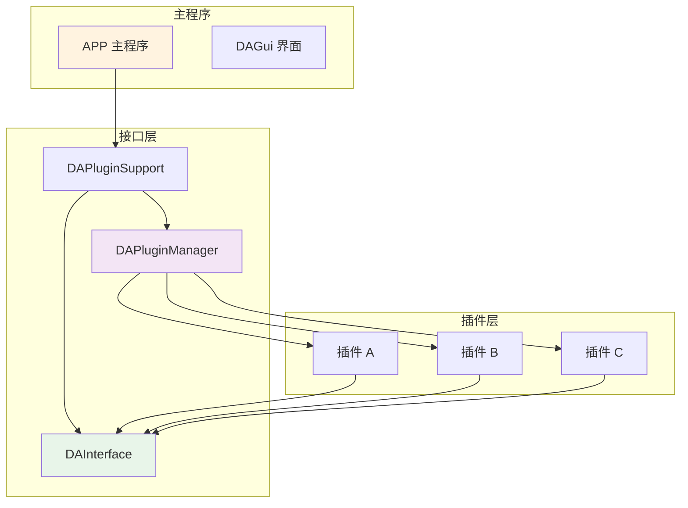
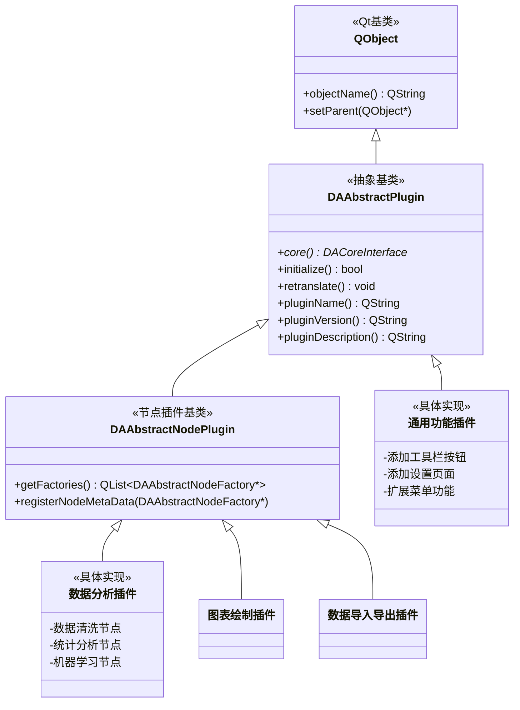
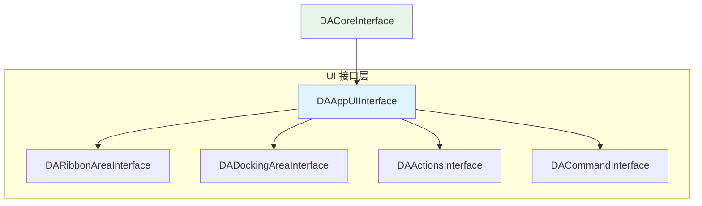
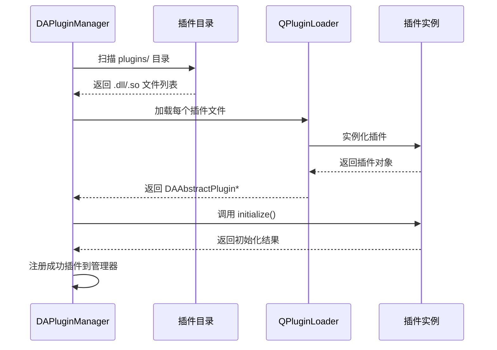

# 插件系统深度解析

DAWorkBench 采用**插件化架构**作为核心设计理念，这一设计将业务逻辑与框架基础分离，实现高度模块化和可扩展性。在这种架构下，所有数据处理、可视化、算法等具体功能均通过插件实现，而主程序仅提供基础框架、UI界面和接口管理。

## 主要功能特性

**特性**

- ✅ **核心优势**：功能独立性、系统稳定性、生态扩展性、维护便捷性
- ✅ **架构设计思想**：松耦合、可扩展、热插拔、标准化四大设计原则
- ✅ **模块依赖关系**：主程序层、接口层、插件层的清晰分层架构
- ✅ **插件目录规范**：标准插件结构详解、命名规则与约定
- ✅ **插件基类定义**：DAAbstractPlugin、DAAbstractNodePlugin、DAAbstractNodeFactory
- ✅ **类继承关系**：插件类型分类和选择指南
- ✅ **接口契约**：DACoreInterface 核心接口、UI 接口层次
- ✅ **插件注册机制**：Qt 插件声明、自动发现流程、DAPluginManager 单例
- ✅ **插件加载顺序**：接口创建顺序、初始化时机

这种设计的核心优势在于：
1. **功能独立性**：每个插件可以独立开发、测试和部署
2. **系统稳定性**：插件故障不会导致主程序崩溃
3. **生态扩展性**：开发者可以基于公开接口开发新插件，形成丰富生态
4. **维护便捷性**：插件可以单独更新，无需重新编译整个系统

---

## 架构设计思想

### 可扩展性设计原则

DAWorkBench 的插件系统在设计时遵循了四个核心原则，确保系统的长期可维护性和扩展性：

| 设计原则 | 详细说明 | 实现方式 | 优势 |
|----------|----------|----------|------|
| **松耦合** | 插件与主程序通过接口通信，避免直接依赖具体类。接口作为契约，定义交互规范，插件只需实现接口而不关心内部实现细节。 | `DAInterface` 模块定义了一组抽象接口，插件通过 `DACoreInterface` 访问主程序功能。 | 插件开发不依赖主程序内部代码，实现真正的模块解耦；主程序升级时，只要接口保持不变，插件无需修改。 |
| **可扩展** | 新功能通过插件添加，无需修改主程序源代码。插件可以扩展工作流节点、UI界面、数据处理算法等各方面功能。 | 利用 Qt 的插件机制（`QPluginLoader` + 接口声明），支持动态加载 `.dll`（Windows）或 `.so`（Linux）文件。 | 功能扩展无需重新编译主程序；第三方开发者可以轻松贡献新功能；功能模块化，便于管理。 |
| **热插拔** | 插件可以在程序运行时动态加载和卸载，支持插件的独立编译、安装和更新。 | 独立的 CMake 构建系统，插件编译后直接放置在指定目录即可被检测加载；`DAPluginManager` 负责插件的生命周期管理。 | 无需重启程序即可安装新插件；插件更新只需替换文件；支持按需加载，减少启动时间。 |
| **标准化** | 提供统一的插件基类、接口规范和生命周期管理，确保所有插件遵循相同标准。 | `DAAbstractPlugin` 基类定义了插件的基本结构和生命周期方法；配套的 CMake 宏简化构建配置。 | 降低插件开发门槛；统一的管理界面；便于自动化测试和集成。 |

这些原则共同构成了 DAWorkBench 插件系统的基石，确保系统既稳定可靠，又具备强大的扩展能力。

### 模块依赖关系

DAWorkBench 插件系统的模块采用清晰的分层架构，各层职责明确，依赖关系如下图所示：



**各层详细说明：**

#### 1. 主程序层
- **APP**：主应用程序入口，负责初始化Qt环境、加载配置、启动主窗口等基础工作。
- **DAGui**：用户界面模块，包含Ribbon工具栏、Dock窗口、图表视图等UI组件。

#### 2. 接口层
- **DAInterface**：接口定义模块，包含 `DACoreInterface`、`DAAppUIInterface`、`DADataManagerInterface` 等抽象接口。这些接口定义了插件与主程序交互的契约，是实现松耦合的关键。
- **DAPluginSupport**：插件支持模块，提供插件基类 `DAAbstractPlugin` 和节点相关基类。
- **DAPluginManager**：插件管理器单例，负责扫描插件目录、加载插件、管理插件生命周期。

#### 3. 插件层
- 具体的功能实现，如数据分析插件、图表绘制插件、数据导入导出插件等。每个插件独立实现特定功能，通过接口层与主程序交互。

**依赖流向说明：**
- **自上而下**：主程序通过 `DAPluginManager` 加载和管理插件，通过 `DAPluginSupport` 与插件交互。
- **自下而上**：插件通过 `DAInterface` 访问主程序功能，但不能直接访问主程序的具体实现类。

这种分层设计确保了系统的可维护性和扩展性，新插件只需关注接口实现，无需了解主程序内部细节。

---

## 插件目录规范

良好的目录结构是插件可维护性的基础。DAWorkBench 制定了标准的插件目录规范，确保所有插件具有一致的组织方式，便于开发、测试和部署。

### 标准插件结构详解

每个插件项目应遵循以下目录结构，这种结构经过多个插件项目的实践验证，兼顾了灵活性和规范性：

```text
[插件名称]/
├── CMakeLists.txt              # 必须 - 插件的CMake构建配置文件，定义编译选项和依赖
├── [插件名称]Plugin.h          # 必须 - 插件主类的头文件，声明插件接口和核心类
├── [插件名称]Plugin.cpp        # 必须 - 插件主类的实现文件，包含初始化和资源管理
├── [插件名称]Global.h          # 推荐 - 插件全局定义，如版本号、配置常量、枚举类型
├── [插件名称]NodeFactory.h     # 工作流插件必需 - 节点工厂的头文件，负责节点创建和管理
├── [插件名称]NodeFactory.cpp   # 工作流插件必需 - 节点工厂的实现文件
├── [插件名称]Worker.h/cpp      # 推荐 - 工作节点的实现类，封装具体的业务逻辑
├── [插件名称]UI.h/cpp          # 可选 - 插件自定义界面的实现，如Dock窗口、对话框等
├── [插件名称]Resource.qrc      # 推荐 - Qt资源文件，管理图标、翻译文件、UI模板等
├── Dialogs/                    # 可选 - 对话框控件目录，存放插件相关的对话框类
│   └── *.h/cpp/ui              # 对话框的头文件、实现文件和UI设计文件
├── icon/                       # 推荐 - 图标资源目录，存放插件相关的图标文件
│   └── *.png/svg               # PNG或SVG格式的图标，建议提供多种尺寸
├── PyScripts/                  # 可选 - Python脚本目录，存放插件相关的Python代码
│   └── *.py                    # Python脚本文件，用于复杂的数据处理或算法实现
└── data-workbench/             # 必须 - 主项目子模块引用，确保插件与主程序版本兼容
```

**各文件/目录详细说明：**

1. **CMakeLists.txt**：插件构建的核心配置文件，需要引用主项目的 `daworkbench_plugin_utils.cmake` 辅助宏，简化构建过程。
2. **插件主类文件**：每个插件必须有一个继承自 `DAAbstractPlugin` 或 `DAAbstractNodePlugin` 的主类，负责插件初始化、资源管理和生命周期控制。
3. **节点工厂**：对于工作流插件，必须实现节点工厂来创建和管理工作流节点。节点工厂是插件功能的载体。
4. **工作节点**：具体的数据处理单元，每个节点对应工作流中的一个处理步骤。复杂的插件可能包含多个工作节点类。
5. **UI组件**：如果插件需要提供用户界面（如配置面板、数据查看器等），应在此目录组织相关代码。
6. **资源文件**：图标、翻译文件等资源统一通过Qt资源系统管理，确保跨平台兼容性。
7. **Python脚本**：对于涉及复杂算法或数据处理的任务，可以使用Python脚本实现，通过pybind11与C++代码交互。

### 命名规则与约定

一致的命名规范有助于提高代码可读性和维护性。DAWorkBench 插件开发采用以下命名约定：

| 类型 | 命名规范 | 示例 | 说明 |
|------|----------|------|------|
| **插件目录** | 描述性名称，PascalCase | `DataAnalysis` | 使用有意义的英文名称，避免使用通用词汇如"plugin"、"tools"等 |
| **插件主类** | `[Name]Plugin` | `DataAnalysisPlugin` | 类名与目录名一致，方便识别对应关系 |
| **节点工厂** | `[Name]NodeFactory` | `DataAnalysisNodeFactory` | 明确表示这是节点工厂类，便于理解职责 |
| **工作节点** | `[Name]Worker` | `DataframeCleanerWorker` | 使用"Worker"后缀，表示这是具体的工作单元 |
| **插件IID** | `Plugin.[Name]` | `Plugin.DataAnalysis` | IID（Interface Identifier）必须唯一，用于插件识别 |
| **节点原型** | `[Plugin].[Factory].[Node]` | `DataAnalysis.IO.CSVReader` | 节点原型的命名采用三级结构，确保全局唯一 |

**命名注意事项：**
- 避免使用缩写，除非是广泛接受的缩写（如CSV、XML）
- 类名使用PascalCase，变量和函数使用camelCase
- 资源文件名使用小写字母和下划线分隔
- 确保所有命名在插件内部保持一致性

**为什么需要这些规范？**
1. **可维护性**：统一的结构让新开发者能快速理解插件组织方式
2. **自动化工具支持**：标准结构便于脚本自动化处理（如自动生成文档、打包发布等）
3. **团队协作**：团队成员遵循相同规范，减少沟通成本
4. **生态系统兼容**：所有插件遵循相同规范，便于构建插件市场和管理系统

---

## 插件基类定义

插件基类是 DAWorkBench 插件系统的核心抽象层，定义了所有插件必须遵循的接口契约。通过统一的基类设计，系统能够以一致的方式管理各种类型的插件。

### DAAbstractPlugin - 插件抽象基类

`DAAbstractPlugin` 是所有插件的基类，继承自 `QObject` 以支持 Qt 的信号槽机制和元对象系统。这个基类定义了插件与主程序交互的基本框架。

```cpp
class DAAbstractPlugin : public QObject
{
    Q_OBJECT
public:
    // 获取核心接口 - 插件与主程序通信的唯一入口
    DACoreInterface* core() const;
    
    // 插件初始化 - 必须实现
    virtual bool initialize() = 0;
    
    // 语言变更回调 - 多语言支持
    virtual void retranslate();
    
    // 插件元信息
    virtual QString pluginName() const = 0;
    virtual QString pluginVersion() const = 0;
    virtual QString pluginDescription() const = 0;
};
```

**关键方法详解：**

1. **`core()`**：插件通过此方法获取 `DACoreInterface` 实例，这是插件访问主程序所有功能的唯一入口。插件不应直接访问主程序的其他类，而应通过此接口进行交互，确保松耦合设计。

2. **`initialize()`**：插件的初始化入口。主程序加载插件后立即调用此方法。插件应在此方法中完成：
   - 资源初始化（加载图标、翻译文件等）
   - 注册节点工厂（对于工作流插件）
   - 设置用户界面（添加菜单、工具栏等）
   - 连接信号槽，注册事件监听器
   
   如果初始化失败，应返回 `false`，插件将不会被加载。

3. **`retranslate()`**：当应用程序语言发生变更时调用。插件应在此方法中重新加载翻译文件，并更新所有用户界面元素的文本。这为插件提供了完整的国际化支持。

4. **插件元信息方法**：`pluginName()`、`pluginVersion()`、`pluginDescription()` 返回插件的基本信息，这些信息将显示在插件管理界面中，帮助用户了解插件功能和版本。

### DAAbstractNodePlugin - 工作流节点插件基类

对于需要提供工作流节点的插件，应继承 `DAAbstractNodePlugin`。这个基类扩展了 `DAAbstractPlugin`，增加了工作流节点的管理功能。

```cpp
class DAAbstractNodePlugin : public DAAbstractPlugin
{
    Q_OBJECT
public:
    // 获取节点工厂列表
    virtual QList<DAAbstractNodeFactory*> getFactories() const = 0;
    
    // 节点元数据注册
    virtual void registerNodeMetaData(DAAbstractNodeFactory* factory) = 0;
};
```

**扩展功能说明：**

1. **`getFactories()`**：返回插件提供的所有节点工厂列表。一个插件可以包含多个节点工厂，每个工厂负责创建一类相关的节点。例如，一个数据分析插件可能包含数据导入工厂、数据清洗工厂、统计分析工厂等。

2. **`registerNodeMetaData()`**：注册节点元数据。节点元数据描述了节点的基本信息（名称、图标、描述等）和连接点定义。主程序使用这些元数据在工作流编辑器中显示可用节点列表。

### DAAbstractNodeFactory - 节点工厂基类

虽然 `DAAbstractNodeFactory` 不是插件基类，但它是工作流插件体系的核心组成部分：

```cpp
class DAAbstractNodeFactory : public QObject
{
    Q_OBJECT
public:
    // 创建节点实例
    virtual DAAbstractNode* create(const DANodeMetaData& meta) = 0;
    
    // 获取节点元数据列表
    virtual QList<DANodeMetaData> getNodeMetaDataList() const = 0;
    
    // 工厂信息
    virtual QString getFactoryName() const = 0;
    virtual QString getFactoryDescription() const = 0;
    
    // 生命周期钩子
    virtual void nodeAddedToWorkflow(DAAbstractNode* node);
    virtual void nodeStartRemove(DAAbstractNode* node);
};
```

### 类继承关系与插件类型

DAWorkBench 支持多种类型的插件，形成清晰的继承层次：



**插件类型选择指南：**

1. **通用功能插件**：继承 `DAAbstractPlugin`，适用于不需要工作流节点的功能扩展，如：
   - 添加新的工具栏按钮
   - 扩展菜单功能
   - 提供新的设置页面
   - 添加数据查看器或编辑器

2. **工作流节点插件**：继承 `DAAbstractNodePlugin`，适用于需要集成到工作流中的功能，如：
   - 数据处理和转换节点
   - 数据分析和统计算法节点
   - 图表生成和可视化节点
   - 数据导入导出节点

选择正确的基类可以简化开发过程，并确保插件与系统的其他部分正确集成。

---

## 接口契约

### 核心接口 DACoreInterface

插件通过 `DACoreInterface` 访问主程序所有功能：

```cpp
class DACoreInterface
{
public:
    // 获取 UI 接口
    virtual DAAppUIInterface* getUiInterface() = 0;
    
    // 获取项目管理接口
    virtual DAProjectInterface* getProjectInterface() = 0;
    
    // 获取数据管理接口
    virtual DADataManagerInterface* getDataManagerInterface() = 0;
    
    // 获取工作流接口
    virtual DAWorkFlowInterface* getWorkFlowInterface() = 0;
};
```

### UI 接口层次



### 接口获取示例

```cpp
bool MyPlugin::initialize()
{
    // 获取核心接口
    DACoreInterface* core = this->core();
    
    // 获取 UI 接口
    DAAppUIInterface* ui = core->getUiInterface();
    
    // 获取 Ribbon 区域
    DARibbonAreaInterface* ribbon = ui->getRibbonArea();
    
    // 获取 Dock 区域
    DADockingAreaInterface* dock = ui->getDockingArea();
    
    // 获取数据管理接口
    DADataManagerInterface* dataMgr = core->getDataManagerInterface();
    
    return true;
}
```

---

## 插件注册机制

### Qt 插件声明

使用 Qt 插件机制进行注册：

```cpp
// 在插件头文件中声明接口
Q_DECLARE_INTERFACE(DA::DAAbstractNodePlugin, "Plugin.DAAbstractNodePlugin")

// 在插件类中声明
class DataAnalysisPlugin : public DA::DAAbstractNodePlugin
{
    Q_OBJECT
    Q_PLUGIN_METADATA(IID "Plugin.DataAnalysis")
    Q_INTERFACES(DA::DAAbstractNodePlugin)
public:
    // ...
};
```

### 自动发现流程



### DAPluginManager 单例

```cpp
class DAPluginManager : public QObject
{
    Q_OBJECT
public:
    static DAPluginManager* instance();
    
    // 加载所有插件
    void loadPlugins(const QString& pluginPath);
    
    // 获取已加载插件列表
    QList<DAAbstractPlugin*> getPlugins() const;
    
    // 获取特定类型插件
    QList<DAAbstractNodePlugin*> getNodePlugins() const;
    
signals:
    void pluginLoaded(DAAbstractPlugin* plugin);
    void pluginInitializeFailed(DAAbstractPlugin* plugin, const QString& error);
};
```

---

## 插件加载顺序

### 接口创建顺序

!!! important "关键顺序"
    插件加载前，接口必须按以下顺序创建完成：

1. `DACoreInterface` 首先创建，调用 `initialized()`
2. 初始化 Python 环境 `initializePythonEnv()`
3. 实例化 `DADataManagerInterface`
4. 实例化 `DAProjectInterface`
5. 主界面构造
6. 调用 `DACoreInterface::createUi()` 构造界面
7. 实例化 `DAAppUIInterface`
8. 实例化各子接口（Ribbon、Dock、Actions、Command）
9. **加载插件** - 此时所有接口已就绪

### 插件初始化时机

```cpp
// DAPluginManager 加载插件流程
void DAPluginManager::loadPlugin(const QString& pluginPath)
{
    QPluginLoader loader(pluginPath);
    QObject* pluginObj = loader.instance();
    
    DAAbstractPlugin* plugin = qobject_cast<DAAbstractPlugin*>(pluginObj);
    if (!plugin) {
        loader.unload();
        return;
    }
    
    // 设置核心接口 - 此时接口已完全就绪
    plugin->setCore(coreInterface);
    
    // 调用初始化
    if (!plugin->initialize()) {
        emit pluginInitializeFailed(plugin, "Initialize failed");
        loader.unload();
        return;
    }
    
    // 注册成功
    m_plugins.append(plugin);
    emit pluginLoaded(plugin);
}
```

---

## 插件类型分类

### 工作流节点插件

继承 `DAAbstractNodePlugin`，提供工作流节点：

- 必须实现 `getFactories()` 返回节点工厂
- 节点工厂负责创建具体工作节点
- 支持节点元数据注册

### 通用功能插件

继承 `DAAbstractPlugin`，提供界面扩展或数据处理功能：

- 可添加 Ribbon 菜单项
- 可添加 Dock 窗口
- 可添加 Action 响应

### 插件类型对比

| 特性 | 工作流节点插件 | 通用功能插件 |
|------|----------------|--------------|
| 基类 | `DAAbstractNodePlugin` | `DAAbstractPlugin` |
| 核心功能 | 提供工作流节点 | 界面/功能扩展 |
| 必须实现 | `getFactories()` | `initialize()` |
| 示例 | DataAnalysis | 自定义 Ribbon 插件 |

---

## 下一步

- [:material-code-block: 插件开发指南](./plugin-development.md) - 开始开发自己的插件
- [:material-sync: 插件生命周期](./plugin-lifecycle.md) - 生命周期管理详解
- [:material-folder: 创建插件项目](./dev-guide/plugin-project-create.md) - 项目创建步骤