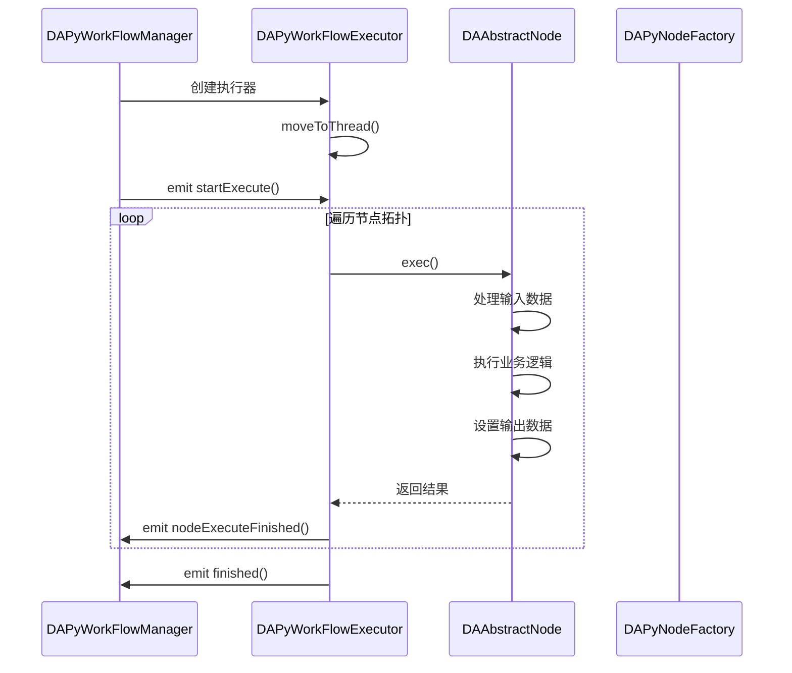
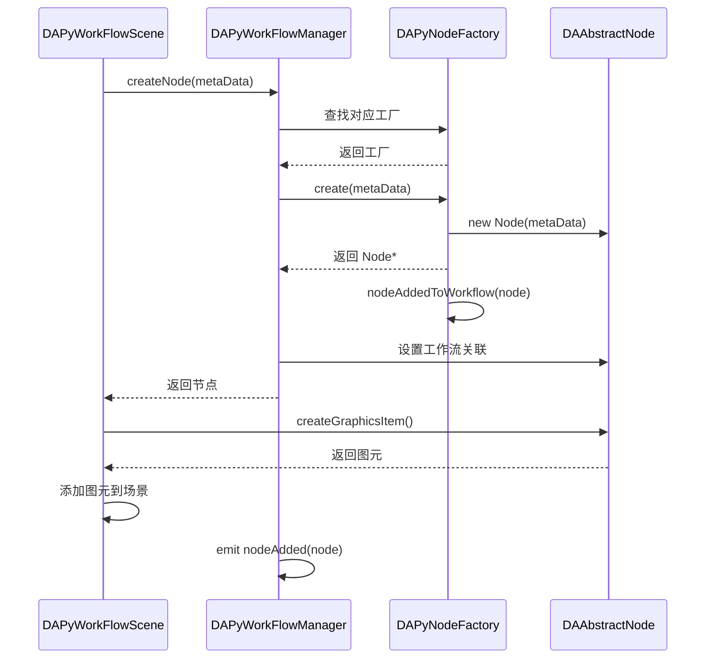

# 插件生命周期管理

本文档详细说明插件从加载到卸载的完整生命周期，以及各阶段的钩子函数和最佳实践。

## 主要功能特性

**特性**

- ✅ **生命周期阶段**：加载阶段、运行阶段、卸载阶段的完整流程
- ✅ **加载阶段详解**：扫描插件目录、加载动态库、实例化对象、设置接口、调用初始化
- ✅ **运行阶段详解**：事件监听、状态维护、节点执行、语言变更响应
- ✅ **卸载阶段详解**：正常卸载、finalize() 钩子、资源释放清单
- ✅ **生命周期钩子**：插件层、节点工厂层、节点层的各类钩子函数
- ✅ **工作流节点生命周期**：节点创建流程、连接流程、执行流程
- ✅ **最佳实践**：资源管理、异步操作、错误处理、状态持久化

---

## 生命周期阶段概览

下面的 mermaid 图表展示了插件从加载到卸载的三个主要阶段：

图表展示了插件生命周期的三个阶段及其内部流程，绿色标注初始化完成，蓝色标注运行状态，红色标注卸载状态：

```mermaid
graph TB
    subgraph "加载阶段"
        A1[扫描插件目录]     # 查找 dll/so 文件
        A2[加载动态库]       # 使用 QPluginLoader
        A3[实例化插件对象]   # 创建插件实例
        A4[设置核心接口]     # 传递 DACoreInterface
        A5[调用 initialize]  # 执行初始化逻辑
    end
    
    subgraph "运行阶段"
        B1[响应用户操作]     # 处理界面交互
        B2[处理数据]         # 执行数据处理
        B3[更新状态]         # 维护插件状态
        B4[事件监听]         # 响应主程序事件
    end
    
    subgraph "卸载阶段"
        C1[通知即将卸载]     # 触发 finalize()
        C2[清理资源]         # 释放各类资源
        C3[断开连接]         # 断开信号连接
        C4[释放内存]         # 释放插件对象
    end
    
    A1 --> A2 --> A3 --> A4 --> A5
    A5 --> B1
    B1 --> B2 --> B3 --> B4
    B4 --> C1 --> C2 --> C3 --> C4
    
    style A5 fill:#c8e6c9    # 绿色：初始化完成
    style B4 fill:#e1f5fe    # 蓝色：运行状态
    style C4 fill:#ffcdd2    # 红色：卸载完成
```

插件生命周期分为加载、运行、卸载三个阶段，每个阶段有特定的流程和钩子函数。

---

## 加载阶段

### 1. 扫描插件目录

DAPluginManager 扫描 `bin/plugins/` 目录下的所有动态库文件。

```cpp
// DAPluginManager::loadAllPlugins 是核心入口，传入 DACoreInterface*
void DAPluginManager::loadAllPlugins(DACoreInterface* c)
{
    emit beginLoadPlugin(getPluginDirPath());  // 通知启动画面
    QDir dir(getPluginDirPath());
    QStringList filters;
    #ifdef Q_OS_WIN
        filters << "*.dll";
    #else
        filters << "*.so";
    #endif

    QStringList pluginFiles = dir.entryList(filters, QDir::Files);
    for (const QString& file : pluginFiles) {
        loadPlugin(dir.absoluteFilePath(file), c);
    }
}
```

### 2. 加载动态库

使用 Qt 的 QPluginLoader 加载插件动态库：

```cpp
QPluginLoader loader(pluginPath);
if (!loader.load()) {
    daCritical << "Failed to load plugin:" << loader.errorString();
    return;
}
```

### 3. 实例化插件对象

```cpp
QObject* pluginObj = loader.instance();
DAAbstractPlugin* plugin = qobject_cast<DAAbstractPlugin*>(pluginObj);

if (!plugin) {
    daCritical << "Plugin does not implement DAAbstractPlugin interface";
    loader.unload();
    return;
}
```

### 4. 设置核心接口

!!! important "关键步骤"
    在调用 `initialize()` 之前，必须设置核心接口，否则插件无法访问主程序功能。

```cpp
// DAAbstractPlugin 内部实现
void DAAbstractPlugin::setCore(DACoreInterface* core)
{
    m_core = core;
}
```

### 5. 调用 initialize()

```cpp
// 插件初始化入口
bool MyPlugin::initialize()
{
    // 此时所有接口已就绪，可以安全访问
    
    // 1. 验证核心接口
    if (!core()) {
        return false;
    }
    
    // 2. 初始化资源
    m_nodeFactory = new MyNodeFactory(core());
    
    // 3. 注册节点
    if (!m_nodeFactory->initialize()) {
        return false;
    }
    
    // 4. 设置界面
    setupUI();
    
    return true;
}
```

### 初始化失败处理

如果 `initialize()` 返回 `false`，插件将被卸载。`DAPluginManager` 的真实信号是 `beginLoadPlugin`（开始加载时发射）和 `pluginUnloaded`（卸载完成时发射），不存在 `pluginLoaded` / `pluginInitializeFailed` 信号：

```cpp
if (!plugin->initialize()) {
    daWarning << "Plugin" << plugin->getName() << "initialization failed";  // cn:用 getName()
    loader.unload();  // 卸载动态库
    emit pluginUnloaded(pluginPath);  // cn:真实信号是 pluginUnloaded
}
```

---

## 运行阶段

### 事件监听

插件可以监听主程序事件：

```cpp
bool MyPlugin::initialize()
{
    DA::DACoreInterface* core = this->core();
    DA::DAUIInterface* ui = core->getUiInterface();
    
    // 监听项目加载完成事件（DAProjectInterface 真实信号是 projectLoaded，不是 projectOpened）
    DA::DAProjectInterface* project = core->getProjectInterface();
    connect(project, &DA::DAProjectInterface::projectLoaded,
            this, &MyPlugin::onProjectLoaded);

    // 其它可用信号：projectBeginLoad / projectBeginSave / projectSaved / dirtyStateChanged / projectIsCleaned
    
    // 监听数据变化事件
    DA::DADataManagerInterface* dataMgr = core->getDataManagerInterface();
    connect(dataMgr, &DA::DADataManagerInterface::dataAdded,
            this, &MyPlugin::onDataAdded);
    
    return true;
}

void MyPlugin::onProjectLoaded(const QString& projectPath)
{
    // 项目加载完成时的处理逻辑
    loadProjectConfig(projectPath);
}
```

### 状态维护

插件应维护自身状态，避免全局变量：

```cpp
class MyPlugin : public DA::DAAbstractNodePlugin
{
private:
    // 插件状态
    bool m_isInitialized;
    QString m_currentProjectPath;
    QMap<QString, QVariant> m_configCache;
    
    // 节点工厂
    MyNodeFactory* m_nodeFactory;
    
    // UI 组件
    MyDockWidget* m_dockWidget;
};
```

### 工作流节点执行

节点执行时的生命周期：



### 语言变更响应

当系统语言变更时，调用 `retranslate()`：

```cpp
void MyPlugin::retranslate()
{
    // 重新加载翻译文件
    if (m_translator) {
        qApp->removeTranslator(m_translator);
    }
    
    m_translator = new QTranslator(this);
    QString locale = QLocale::system().name();
    m_translator->load(QString(":/translations/myplugin_%1.qm").arg(locale));
    qApp->installTranslator(m_translator);
    
    // 更新 UI 文本
    if (m_dockWidget) {
        m_dockWidget->retranslate();
    }
}
```

---

## 卸载阶段

### 正常卸载

程序关闭时，插件会被正常卸载：

```cpp
// DAPluginManager 清理流程
void DAPluginManager::cleanup()
{
    for (DAAbstractPlugin* plugin : m_plugins) {
        // 调用 finalize() 释放资源（旧 aboutToUnload 概念的替代，默认返回 true）
        plugin->finalize();

        // 断开所有信号连接
        disconnect(plugin, nullptr, nullptr, nullptr);

        // 释放插件对象
        plugin->deleteLater();
    }

    m_plugins.clear();
}
```

### finalize() 钩子

`DAAbstractPlugin::finalize()` 是卸载回调（非纯虚，默认返回 `true`，返回 `false` 说明卸载失败）。插件应重载此钩子进行清理：

```cpp
class MyPlugin : public DA::DAAbstractNodePlugin
{
public:
    bool finalize() override
    {
        // 1. 保存未保存的数据
        savePendingData();

        // 2. 清理临时文件
        cleanupTempFiles();

        // 3. 关闭外部连接
        closeExternalConnections();

        // 4. 释放 UI 控件
        if (m_dockWidget) {
            // Dock 控件由主程序管理，无需手动删除
            m_dockWidget = nullptr;
        }

        // 5. 销毁节点工厂（谁创建谁删除）
        if (m_nodeFactory) {
            destroyNodeFactory(m_nodeFactory);
            m_nodeFactory = nullptr;
        }

        return true;  // 返回 false 表示卸载失败
    }
};
```

### 资源释放清单

| 资源类型 | 释放方式 | 注意事项 |
|----------|----------|----------|
| **Qt 控件** | `deleteLater()` 或由父控件管理 | Dock 控件由主程序管理 |
| **内存缓冲** | 直接释放或智能指针 | 使用 `QSharedPointer` 更安全 |
| **文件句柄** | 关闭文件 | 先确保数据已保存 |
| **网络连接** | 断开连接 | 处理未完成的请求 |
| **线程** | 停止并等待结束 | 使用 `quit()` + `wait()` |
| **定时器** | 停止定时器 | `QTimer::stop()` |

---

## 生命周期钩子函数

### 插件层钩子

| 钩子函数 | 调用时机 | 用途 |
|----------|----------|------|
| `initialize()` | 加载后立即调用 | 初始化资源、注册节点 |
| `retranslate()` | 语言变更时调用 | 更新多语言文本 |
| `finalize()` | 卸载前调用 | 清理资源、保存数据（默认返回 true） |

### 节点工厂层钩子（旧 C++ 架构，仅参考）

!!! warning "遗留架构 —— 当前推荐 Python-first `@NodeDef`"
    下面 `nodeAddedToWorkflow()` / `nodeStartRemove()` 等**钩子属于已废弃的 C++ `DAAbstractNodeFactory` 架构**，当前 `DAPyNodeFactory`（`src/DAPyWorkFlow/DAPyNodeFactory.h`）不再暴露这些虚函数。当前工作流节点统一用 Python `@NodeDef` 装饰器声明，节点加入/移除工作流的生命周期由 C++ 渲染代理层（`DAPyNodeGraphicsItem`）和 Python 基类 `DAWorkflowNode` 管理，参考 `plugins/DASystemNodes/AGENTS.md`。本节仅作历史背景保留。

| 钩子函数 | 调用时机 | 用途 |
|----------|----------|------|
| `nodeAddedToWorkflow()` | 节点加入工作流前 | 初始化节点编号、拓扑检查（旧 C++） |
| `nodeStartRemove()` | 节点移除前 | 检查依赖关系、清理节点数据（旧 C++） |

```cpp
// 旧 C++ 节点工厂钩子（已废弃，当前 DAPyNodeFactory 不再有这些虚函数）
class MyNodeFactory : public DA::DAPyNodeFactory  // 此继承关系在当前代码库无法编译
{
public:
    // 节点即将加入工作流
    void nodeAddedToWorkflow(DA::DAAbstractNode* node) override
    {
        // 为节点分配唯一编号
        node->setCustomData("node_id", generateNodeId());

        // 检查工作流拓扑约束
        validateTopologyConstraints(node);
    }

    // 节点即将移除
    void nodeStartRemove(DA::DAAbstractNode* node) override
    {
        // 检查是否有其他节点依赖此节点
        if (hasDependentNodes(node)) {
            daWarning << "Node has dependents, removal may break workflow";
        }
    }
};
```

### 节点层钩子（旧 C++ 架构，仅参考）

!!! warning "遗留架构 —— 当前推荐 Python-first `@NodeDef`"
    下面 `prepareLinkOutput()` / `prepareLinkInput()` / `finishLink()` 等**钩子属于已废弃的 C++ `DAAbstractNode` 架构**。当前工作流节点用 Python `@NodeDef` 声明，连接点（Input/Output）由 `Input` / `Output` 描述符静态声明，运行时由 C++ 渲染代理层处理连接生命周期，无需重写这些虚函数。参考 `plugins/DASystemNodes/AGENTS.md`。本节仅作历史背景保留。

| 钩子函数 | 调用时机 | 用途 |
|----------|----------|------|
| `prepareLinkOutput()` | 输出连接点连接前 | 动态生成连接点（旧 C++） |
| `prepareLinkInput()` | 输入连接点连接前 | 验证连接兼容性（旧 C++） |
| `prepareLinkOutputSucceed()` | 输出连接成功后 | 更新状态（旧 C++） |
| `prepareLinkOutputFailed()` | 输出连接失败后 | 错误处理（旧 C++） |
| `finishLink()` | 连接完成时 | 执行连接后逻辑（旧 C++） |

---

## 工作流节点生命周期详解

### 节点创建流程



### 节点连接流程

详见 [工作流生命周期](../dev-guide/workflow/workflow-lifecycle.md) 文档。

### 节点执行流程

```cpp
bool MyWorker::exec()
{
    // 1. 验证输入
    QVariant input = getInputData("input_data");
    if (!input.isValid()) {
        daCritical << "No input data provided";
        return false;
    }

    // 2. 执行处理
    try {
        processData(input);
    } catch (const std::exception& e) {
        daCritical << "Processing error:" << e.what();
        return false;
    }
    
    // 3. 设置输出
    setOutputData("output_data", m_result);
    
    // 4. 标记完成
    setStatus(DA::DAAbstractNode::StatusFinished);
    
    return true;
}
```

---

## 最佳实践

### 1. 资源管理

!!! tip "推荐使用智能指针"
    使用 `QSharedPointer` 或 `std::shared_ptr` 管理动态分配的资源。

```cpp
class MyPlugin : public DA::DAAbstractNodePlugin
{
private:
    QSharedPointer<MyDataCache> m_cache;
};

// 初始化时创建
m_cache = QSharedPointer<MyDataCache>::create();

// 自动释放，无需手动 delete
```

### 2. 异步操作

长时间操作应在独立线程执行：

```cpp
bool MyWorker::exec()
{
    // 不要在 exec() 中直接执行耗时操作
    // 使用线程池
    QFuture<QVariant> future = QtConcurrent::run([this]() {
        return this->processDataHeavy();
    });
    
    // 等待完成（注意：这会阻塞工作流线程）
    future.waitForFinished();
    
    return !future.isCanceled();
}
```

### 3. 错误处理

统一使用日志系统记录错误：

```cpp
bool MyWorker::exec()
{
    daInfo << "Starting node" << getID() << "execution";

    if (errorCondition) {
        daCritical << "Node" << getID() << "error:" << errorMessage;
        setStatus(StatusError);
        emit execFailed(this, errorMessage);
        return false;
    }

    daDebug << "Node" << getID() << "completed successfully";
    return true;
}
```

### 4. 状态持久化

在 `finalize()` 中保存重要状态：

```cpp
void MyPlugin::finalize()  // cn:旧 aboutToUnload 的替代
{
    // 保存插件配置
    QSettings settings;
    settings.beginGroup("MyPlugin");
    settings.setValue("last_project", m_currentProjectPath);
    settings.setValue("cache_size", m_cache->size());
    settings.endGroup();
    settings.sync();
}
```

---

## 下一步

- [:material-database: 数据持久化](./plugin-persistence.md) - 详细数据存储方案
- [:material-puzzle: 功能扩展](./plugin-extension.md) - 界面和功能扩展
- [:material-book: 最佳实践](../reference/best-practices.md) - 更多开发建议

> 详见 [日志系统文档](../dev-guide/general/logging.md)。
