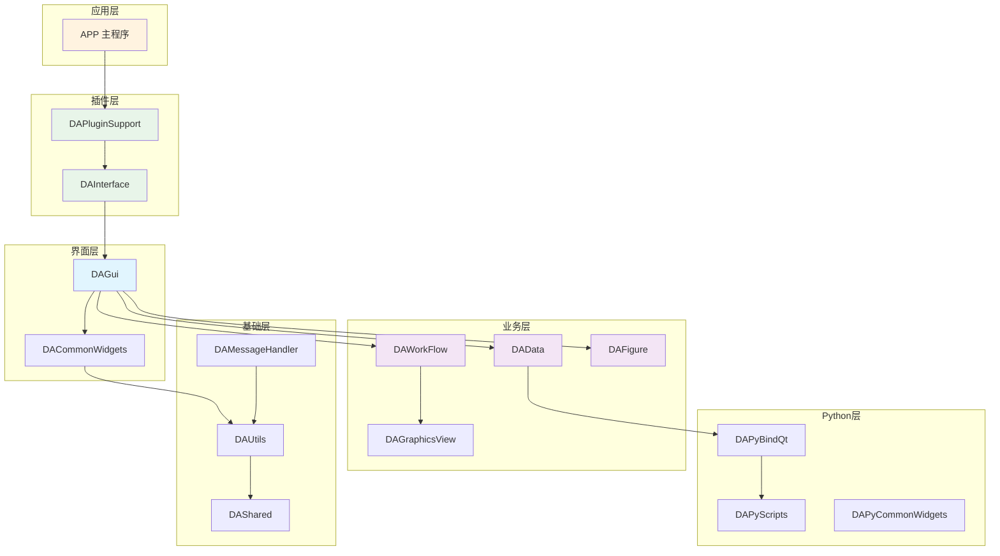
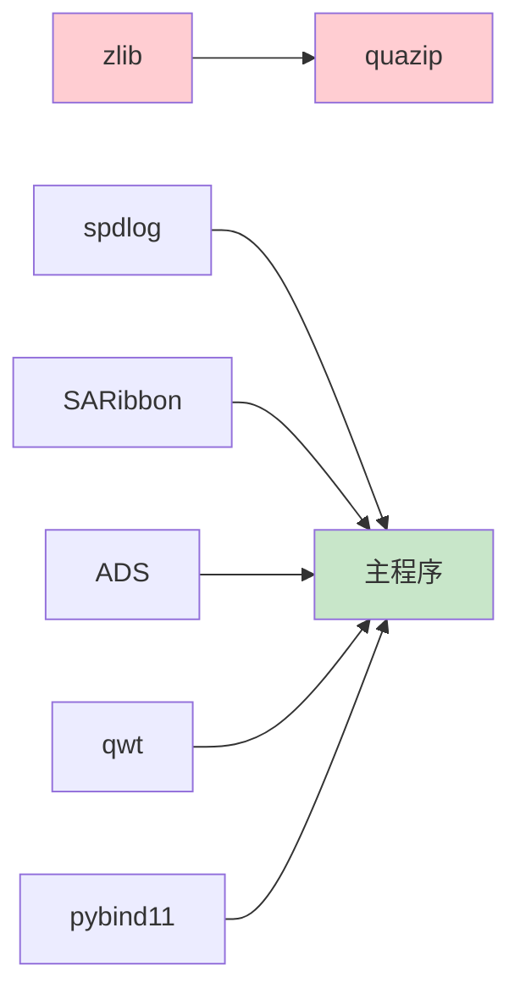

# 项目结构详解

本文档详细说明 DAWorkBench 的目录结构、模块职责和关键文件，帮助开发者快速理解项目组织方式。

---

## 目录结构总览

```text
data-workbench/
├── src/                      # 源代码目录
│   ├── APP/                  # 主应用程序
│   ├── DAInterface/          # 接口模块（插件和主程序通信桥梁）
│   ├── DAPluginSupport/      # 插件支持模块
│   ├── DAGui/                # GUI 界面模块
│   ├── DAWorkFlow/           # 工作流核心模块
│   ├── DAData/               # 数据管理模块
│   ├── DAFigure/             # 图表模块
│   ├── DAGraphicsView/       # 图形视图模块
│   ├── DACommonWidgets/      # 通用控件模块
│   ├── DAUtils/              # 核心工具模块
│   ├── DAMessageHandler/     # 日志处理模块
│   ├── DAPyBindQt/           # Python-Qt 绑定模块
│   ├── DAPyScripts/          # Python 脚本包装模块
│   ├── DAPyCommonWidgets/    # Python 相关控件模块
│   ├── DAShared/             # 共享头文件模块
│   ├── DAAxOfficeWrapper/    # Office 自动化模块（Windows）
│   ├── 3rdparty/             # 第三方库源码
│   ├── PyScripts/            # Python 脚本资源
│   ├── i18n/                 # 国际化翻译文件
│   ├── tst/                  # 测试代码目录
│   ├── DAConfigs.h           # 编译后生成的配置头文件
│   ├── DAConfigs.h.in        # 配置文件生成模板
│   ├── DAGlobals.h           # 全局定义和宏
│   └── template-python-config.json  # Python 环境配置模板
├── plugins/                  # 插件目录
│   ├── DataAnalysis/         # 数据分析插件（示例）
│   ├── plugin-template/      # 插件模板生成工具
│   └── CMakeLists.txt        # 插件构建配置
├── docs/                     # 文档目录
│   ├── zh/                   # 中文文档
│   ├── assets/               # 文档资源文件
│   └── stylesheets/          # 文档样式文件
├── cmake/                    # CMake 辅助脚本
├── scripts/                  # 构建辅助脚本
├── stubs/                    # Python stubs 文件
├── mkdocs.yml                # 文档配置文件
├── CMakeLists.txt            # 主 CMake 配置文件
├── readme.md                 # 项目说明文件
├── requirements.txt          # Python 运行依赖
└── requirements-docs.txt     # 文档生成依赖
```

---

## 模块职责划分

### 核心模块架构



### 模块详细说明

| 模块名 | 职责说明 | 依赖关系 |
|--------|----------|----------|
| **DAShared** | 共享头文件，基础模板类和定义 | Qt::Core |
| **DAUtils** | 核心工具函数、基础类、配置管理 | DAShared, Qt 组件 |
| **DAMessageHandler** | 基于 spdlog 的日志系统 | DAUtils, spdlog |
| **DAPyBindQt** | Python 与 Qt 的绑定层 | DAUtils, pybind11 |
| **DAPyScripts** | Python 脚本封装 | DAPyBindQt |
| **DAPyCommonWidgets** | Python 相关 Qt 控件 | DAPyBindQt |
| **DAData** | 数据对象管理、DataFrame 操作 | DAUtils, DAPyBindQt |
| **DACommonWidgets** | 通用 Qt 控件库 | DAUtils, SARibbonBar |
| **DAGraphicsView** | 可缩放图形视图、redo/undo | DAUtils |
| **DAWorkFlow** | 工作流核心逻辑、有向图管理 | DAUtils, DAGraphicsView |
| **DAFigure** | 科学图表绘制（基于 qwt） | DAUtils, qwt |
| **DAGui** | 界面整合、Ribbon、Dock 管理 | 所有业务模块 |
| **DAInterface** | 插件接口定义 | DAGui |
| **DAPluginSupport** | 插件加载、管理 | DAInterface |
| **DAAxOfficeWrapper** | Office 自动化（仅 Windows） | DAUtils |
| **APP** | 主程序入口 | DAPluginSupport |

---

## 关键文件说明

### 根目录关键文件

| 文件 | 说明 |
|------|------|
| `CMakeLists.txt` | 主构建配置，定义版本、依赖、编译选项 |
| `DAWorkbenchConfig.cmake.in` | CMake 导出配置模板 |
| `readme.md` | 项目说明和快速上手指南 |
| `mkdocs.yml` | MkDocs 文档配置 |
| `requirements.txt` | Python 运行依赖（pandas, numpy, scipy 等） |
| `requirements-docs.txt` | 文档生成依赖 |

### src 目录关键文件

| 文件路径 | 说明 |
|----------|------|
| `src/DAConfigs.h.in` | 配置文件生成模板 |
| `src/DAConfigs.h` | 编译后生成的配置头文件 |
| `src/DAGlobals.h` | 全局定义和宏 |
| `src/template-python-config.json` | Python 环境配置模板 |

### cmake 目录关键脚本

| 文件 | 说明 |
|------|------|
| `daworkbench_utils.cmake` | 构建辅助工具函数 |
| `daworkbench_3rdparty.cmake` | 第三方库配置 |
| `daworkbench_plugin_utils.cmake` | 插件构建辅助宏 |

---

## 模块设计原则

### 1. 分层架构

项目采用清晰的分层架构：

```
应用层 → 插件层 → 界面层 → 业务层 → 基础层
```

- **向下依赖**：上层模块依赖下层模块，下层模块不依赖上层
- **接口隔离**：通过 `DAInterface` 实现插件和主程序的解耦

### 2. 插件化设计

- 所有业务功能通过插件提供
- 主程序仅提供基础框架
- 插件通过 `DACoreInterface` 访问主程序功能

### 3. 命名约定

| 类型 | 前缀 | 示例 |
|------|------|------|
| 模块 | DA | DAWorkFlow |
| 类 | DA | DAAbstractNode |
| 接口 | DA...Interface | DACoreInterface |
| 宏 | DA_ | DA_PLUGIN_NAME |
| 枚举 | DA...Enum | DANodeLinkPoint::Way |

### 4. Qt 信号槽机制

模块间通信主要使用 Qt 的信号槽机制：

```cpp
// 工作流执行完成信号
void DAWorkFlow::finished(bool success);

// 节点执行完成信号
void DAWorkFlow::nodeExecuteFinished(DAAbstractNode::SharedPointer n, bool state);
```

---

## 插件目录结构

### 插件标准结构

```text
MyPlugin/
├── CMakeLists.txt           # 插件构建配置
├── src/
│   ├── MyPlugin.h           # 插件主类头文件
│   ├── MyPlugin.cpp         # 插件主类实现
│   ├── MyNodeFactory.h      # 节点工厂（工作流插件）
│   ├── MyNodeFactory.cpp    # 节点工厂实现
│   ├── MyWorker.h           # 工作节点实现类
│   ├── MyWorker.cpp         # 工作节点实现
│   ├── Dialogs/             # 对话框控件
│   ├── icon/                # 图标资源
│   └── PyScripts/           # Python 脚本（可选）
├── data-workbench/          # 主项目子模块引用
└── template.json            # 插件模板配置
```

### 插件模板生成

使用 `plugins/plugin-template/make-plugin.py` 自动生成插件项目结构。

配置文件 `template.json`：

```json
{
    "plugin-base-name": "My",
    "plugin-display-name": "My Plugin",
    "plugin-description": "This is My Plugin",
    "plugin-iid": "Plugin.MyPlugin",
    "factory-prototypes": "My.Factory",
    "factory-name": "My Factory",
    "factory-description": "My Plugin Node Factory"
}
```

---

## 第三方库目录

### src/3rdparty 结构

```text
src/3rdparty/
├── zlib/                    # zlib 库（quazip 依赖）
├── quazip/                  # Qt zip 文件处理
├── spdlog/                  # 高性能日志库
├── SARibbon/                # Ribbon 界面框架
├── ADS/                     # Qt-Advanced-Docking-System
├── pybind11/                # Python/C++ 绑定
├── QtPropertyBrowser/       # Qt 属性浏览器
├── ordered-map/             # 有序 map 实现
├── qwt/                     # 科学图表库
├── ctk/                     # 医疗影像工具包（精简版）
└── CMakeLists.txt           # 第三方库构建配置
```

### 第三方库构建顺序



!!! warning "注意"
    quazip 依赖 zlib，必须先构建并安装 zlib，并将 zlib.dll 复制到 bin 目录。

---

## 输出目录结构

构建完成后，二进制文件统一输出到：

```text
bin_{BuildType}_qt{QtVersion}_{Compiler}_{Platform}/
├── bin/
│   ├── DAWorkbench.exe      # 主程序
│   ├── plugins/             # 插件目录
│   └── *.dll                # 动态库
├── lib/
│   ├── cmake/               # CMake 配置文件
│   └── *.lib/*.a            # 静态库
├── share/
│   └── cmake/               # CMake 模块
└── python/                  # Python 环境（可选）
```

示例：使用 Qt 5.14.2、MSVC、Debug 模式、64 位编译：
```
bin_Debug_qt5.14.2_MSVC_x64/
```

---

## 下一步

- [:material-tools: 开发环境搭建](./build/build-instructions.md) - 详细构建指南
- [:material-puzzle: 插件系统概述](./plugin-system.md) - 了解插件架构
- [:material-book-open: 开发规范](./dev-guide/coding-standard.md) - 编码规范