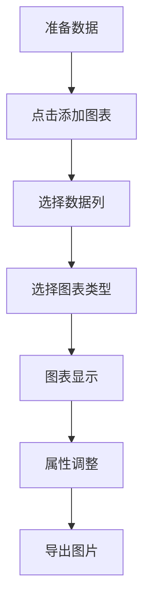

# 图表使用指南

本指南介绍如何使用 DAWorkBench 的图表功能，创建交互式数据可视化并生成论文级别的图片。

## 主要功能特性

- ✅ **多种图表类型**：曲线图、散点图、柱状图、热力图等
- ✅ **交互式编辑**：拖拽调整图表元素，所见即所得
- ✅ **属性面板**：可视化配置坐标轴、曲线、网格、图例
- ✅ **数据探针**：交互式查看图表数据点
- ✅ **论文级导出**：导出为矢量图（PDF、SVG）或高分辨率位图
- ✅ **多图布局**：一个画布管理多个子图

---

## 图表概念

### 图表层次结构

DAWorkBench 的图表系统采用层次化设计：

```
DAFigureWidget（画布容器）
├── DAChartWidget（图表 1）
│   ├── QwtPlotCurve（曲线）
│   ├── QwtPlotGrid（网格）
│   └── QwtPlotLegend（图例）
├── DAChartWidget（图表 2）
│   └── ...
└── ...
```

- **画布（Figure）**：顶层容器，管理多个子图，使用归一化坐标布局
- **图表（Chart）**：单个坐标系，包含坐标轴、数据曲线等
- **图元（PlotItem）**：图表中的元素，如曲线、网格、图例

### 支持的图表类型

| 图表类型 | 类 | 适用场景 |
|---------|-----|---------|
| 曲线图 | `QwtPlotCurve` | 连续数据趋势 |
| 散点图 | `QwtPlotCurve` | 数据分布 |
| 柱状图 | `QwtPlotBarChart` | 离散数据对比 |
| 热力图 | `QwtPlotSpectrogram` | 二维矩阵数据 |

---

## 创建图表

### 基本步骤

1. **准备数据**：确保数据已导入到数据管理面板
2. **点击创建图表**：在 Ribbon 工具栏中点击"添加图表"
3. **选择数据**：在弹出的对话框中选择数据列
4. **选择图表类型**：选择曲线图、散点图等
5. **确认创建**：图表出现在图表编辑区



### 多图布局

一个画布可以包含多个子图：

1. **添加子图**：在画布上点击"添加绘图"
2. **布局调整**：拖拽子图边框调整大小和位置
3. **归一化坐标**：子图位置使用 0-1 归一化坐标

### 绘图窗口停靠布局（多 figure 自由分屏）

除了单个画布内的子图布局外，`DAChartOperateWidget`（图表操作区）本身基于 Qt-Advanced-Docking-System 的**嵌套停靠管理器**管理多个 figure：每个绘图（`DAFigureWidget`）包装为独立的停靠窗口，可在图表操作区内自由分屏、并栏、拖拽，实现多绘图自由布局。

- **独立停靠**：每个 figure 是一个独立可停靠窗口，新绘图默认以标签形式加入当前停靠区
- **自由布局**：支持分屏、并栏、拖拽（保留 movable，禁用浮动，figure 不会脱离图表操作区浮成独立窗口）
- **严格隔离**：figure 停靠窗口被严格隔离在 `DAChartOperateWidget` 内部，不会逃逸到 app 顶层停靠区
- **持久化**：绘图布局随工程文件保存 / 恢复（旧工程向后兼容，回退默认标签顺序）

!!! info "与单画布子图布局的区别"
    「多图布局」指**单个画布内**的多个子图（归一化坐标）；「绘图窗口停靠布局」指**图表操作区内**多个 figure 之间的分屏 / 并栏。两者可叠加使用。

    停靠布局的实现细节（嵌套 `ads::CDockManager`、焦点控制器跨管理器陷阱、序列化）见 [绘图窗口停靠布局（ADS 嵌套停靠区）](../dev-guide/graphics/chart-dock-nesting.md)。

---

## 编辑图表属性

### 属性面板

双击图表中的元素（如曲线、坐标轴、网格），右侧属性面板会显示对应的设置项：

| 元素 | 可配置属性 |
|------|-----------|
| **曲线** | 线型、颜色、宽度、数据点符号、可见性 |
| **坐标轴** | 标题、范围、刻度、标签格式、字体 |
| **网格** | 主/次网格线、线型、颜色、可见性 |
| **图例** | 位置、字体、背景、可见性 |
| **图表整体** | 标题、背景色、边距 |

!!! tip "即时预览"
    属性面板的修改即时生效，图表会立即重绘。所有修改支持撤销（Ctrl+Z）。

### 坐标轴设置

1. **双击坐标轴**：打开坐标轴属性面板
2. **设置范围**：手动指定 X/Y 轴的最小最大值
3. **设置刻度**：配置主刻度和次刻度数量
4. **设置标签**：编辑坐标轴标题和单位
5. **字体设置**：修改标签字体、大小、颜色

### 曲线样式

1. **双击曲线**：打开曲线属性面板
2. **线型**：实线、虚线、点划线
3. **颜色**：点击颜色框选择颜色
4. **线宽**：调整线条粗细
5. **数据点符号**：无、圆形、方形、三角形等

---

## 交互操作

### 缩放和平移

- **鼠标滚轮**：缩放图表
- **右键拖动**：平移视图
- **双击空白处**：重置缩放
- **框选缩放**：左键框选区域放大

### 数据探针

数据探针是查看图表数据点的交互工具，分为水平探针和垂直探针两种：

1. **启用探针**：在 Ribbon 中点击"水平探针"或"垂直探针"按钮（两个独立按钮）
2. **移动鼠标**：在图表上移动，探针会吸附到最近的数据点
3. **查看数据**：探针显示当前数据点的坐标值
4. **创建标记**：点击可创建持久化数据标记

详见 [数据探针](./plot/data-probe.md)。

### 坐标轴联动

多个图表可以绑定坐标轴范围，实现同步缩放：

1. **选中多个图表**：Ctrl+点击多个图表
2. **绑定轴范围**：右键 → "绑定坐标轴"
3. **同步操作**：缩放任一图表，绑定的图表同步变化

---

## 导出图表

### 导出图片

1. **选中图表**：点击要导出的图表
2. **点击导出**：Ribbon → "导出图片"
3. **选择格式**：

| 格式 | 扩展名 | 说明 |
|------|--------|------|
| PNG | `.png` | 位图，适合演示 |
| PDF | `.pdf` | 矢量图，适合论文 |
| SVG | `.svg` | 矢量图，可编辑 |

4. **设置分辨率**：位图格式可设置 DPI（推荐 300+）
5. **确认导出**：图片保存到指定路径

!!! tip "论文导出建议"
    生成论文图片推荐使用 PDF 或 SVG 矢量格式，缩放不失真。设置足够大的字体（12pt+）确保可读性。

---

## 常见问题

### Q：曲线不显示？

**A：** 检查以下几点：
1. 数据列是否正确选择（X 轴和 Y 轴列）
2. 曲线可见性是否开启（属性面板中）
3. 坐标轴范围是否包含数据范围

### Q：如何添加图例？

**A：** 双击图表空白处打开图表属性，启用图例。图例文本取自曲线名称，可在曲线属性中修改。

### Q：如何设置对数坐标？

**A：** 双击坐标轴打开属性面板，在"刻度类型"中选择"对数"。注意对数坐标下数据必须为正数。

### Q：导出的图片字体太小？

**A：** 在导出前，通过属性面板增大所有字体（坐标轴标签、标题、图例）。或导出为矢量图（PDF/SVG）后在其他软件中调整。

---

## 相关文档

- [使用指南概述](./index.md) — 软件功能总览
- [数据管理使用](./data-management.md) — 数据导入和查看
- [数据探针](./plot/data-probe.md) — 交互式数据查看
- [绘图模块概述](../dev-guide/graphics/figure-abstract.md) — 图表系统架构
- [图表设置面板](../dev-guide/ui/creating-setting-panel.md) — 属性面板开发
