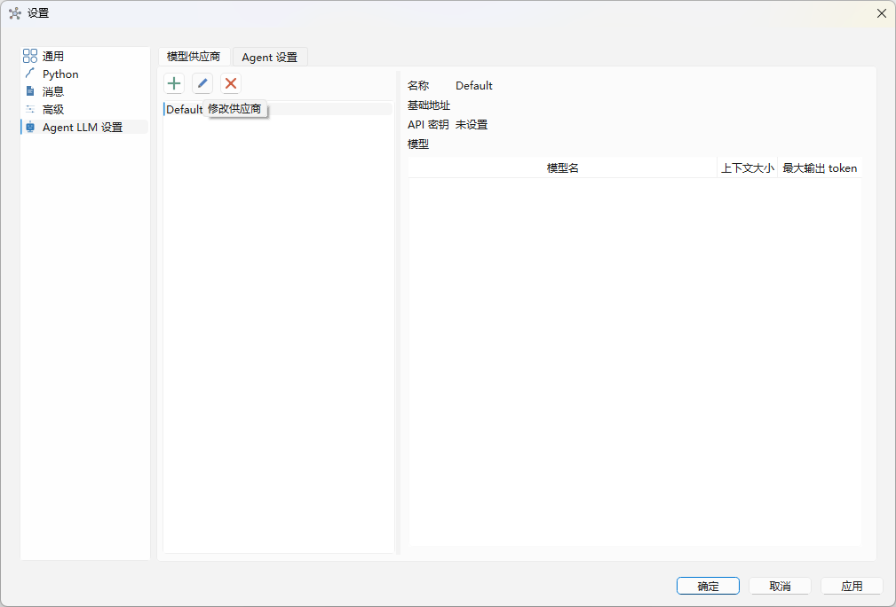
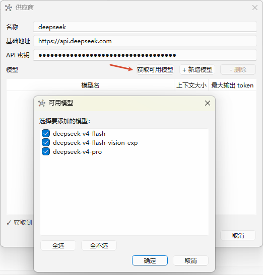

# 配置文件说明

DAWorkBench 支持多种配置文件格式，用于存储程序设置、项目信息、工作流数据和插件配置。正确理解和使用配置文件是开发和运维的基础。

## 主要功能特性

**特性**

- ✅ **多格式支持**：支持 XML、INI、JSON 三种配置文件格式
- ✅ **分层配置**：程序配置、工程文件、工作流数据、插件配置四个层次
- ✅ **跨平台路径**：自动适应 Windows、Linux、macOS 的配置目录规范
- ✅ **优先级机制**：项目级配置 > 命令行参数 > 全局配置 > 默认配置
- ✅ **热更新支持**：部分配置支持运行时变更，无需重启

## 配置文件类型

| 配置类型 | 文件格式 | 存储位置 | 说明 |
|----------|----------|----------|------|
| **程序配置** | XML/INI | 用户配置目录 | 全局程序设置（`dawork-config.xml` 及若干 `.ini`） |
| **工程文件** | ZIP（内含 XML） | 工程目录（`.dapro`） | 单文件打包系统信息、工作流逻辑/视图、数据、图表、Agent 会话等 |
| **工作流数据** | XML（在 `.dapro` 内） | `workflow-data.xml` + `workflow.xml` | 节点拓扑/参数 与 节点位置/图元属性 |
| **插件配置** | JSON/INI | 插件目录 | 插件特定设置 |

## 程序全局配置

### 配置文件位置

程序全局配置统一存放在用户应用数据目录下的 `config/` 子目录（由 `DA::DADir::getConfigPath()` 返回，不存在则自动创建）：

```text
Windows: C:\Users\[用户名]\AppData\Local\<AppName>\config\
Linux:   ~/.local/share/<AppName>/config/        （或 ~/.config/<AppName>/config/）
macOS:   ~/Library/Application Support/<AppName>/config/
```

该目录下的核心配置文件为 `dawork-config.xml`，由 `DAAppConfig`（继承 `DAProperties` + `DAXMLFileInterface`）管理。`DAAppConfig::getAbsoluteConfigFilePath()` 返回其绝对路径，启动时 `loadConfig()` 读取，退出时 `saveConfig()` 写回。

!!! note "全局 QSettings 重定向"
    `main` 启动时调用 `QSettings::setDefaultFormat(QSettings::IniFormat)` 并通过 `QSettings::setPath(...)` 将 `UserScope` 重定向到上述 `config/` 目录。这只作为安全网，用于覆盖第三方库（如 DAWidgets 的最近文件管理器副本）内部默认/两参数构造的 `QSettings`。程序自身的配置不走此路径，而是显式读写 `dawork-config.xml` 或下文所述的 `agent-config.json` / `recent-files.ini`。

### 配置内容示例

全局配置使用 **XML** 格式，每个配置项为一个 `<prop key="...">` 元素，值放在 `<value>` 子节点中。根节点为 `<configs name="da-app" ver="...">`。

下面的 XML 示例展示了 `dawork-config.xml` 的典型内容（仅列出部分真实键，键名以 `DA_CONFIG_KEY_*` 宏定义于 `src/APP/SettingPages/DAAppConfig.h`）：

```xml
<?xml version="1.0"?>
<configs name="da-app" ver="0.1.1">
  <prop key="language"><value>zh_CN</value></prop>                 <!-- DA_CONFIG_KEY_LANGUAGE 界面语言，空=跟随系统 -->
  <prop key="show-splash"><value>true</value></prop>              <!-- DA_CONFIG_KEY_SHOW_SPLASH 启动画面 -->
  <prop key="app-font-family"><value></value></prop>              <!-- DA_CONFIG_KEY_APP_FONT_FAMILY 应用字体族，空=系统默认 -->
  <prop key="app-font-size"><value>0</value></prop>               <!-- DA_CONFIG_KEY_APP_FONT_POINT_SIZE 字号，<=0=系统默认 -->
  <prop key="python-extra-paths"><value></value></prop>           <!-- DA_CONFIG_KEY_PYTHON_EXTRA_PATHS Python 额外 sys.path -->
  <prop key="log-level"><value>2</value></prop>                    <!-- DA_CONFIG_KEY_LOG_LEVEL 日志级别 -->
  <prop key="log-queue-level"><value>3</value></prop>              <!-- DA_CONFIG_KEY_LOG_QUEUE_LEVEL UI 日志队列级别 -->
  <prop key="log-output-stdout"><value>true</value></prop>        <!-- DA_CONFIG_KEY_LOG_OUTPUT_STDOUT 是否输出到 stdout -->
  <prop key="log-rotation-mode"><value>0</value></prop>           <!-- DA_CONFIG_KEY_LOG_ROTATION_MODE 0=rotating 1=daily 2=console -->
  <prop key="log-max-size"><value>10485760</value></prop>         <!-- DA_CONFIG_KEY_LOG_MAX_SIZE 单文件最大字节 -->
  <prop key="log-max-files"><value>5</value></prop>              <!-- DA_CONFIG_KEY_LOG_MAX_FILES 保留历史日志份数 -->
</configs>
```

### 配置项一览

下表列出 `DAAppConfig` 管理的部分真实键（完整定义见 `src/APP/SettingPages/DAAppConfig.h`）：

| 键宏 | 键名 | 说明 |
|------|------|------|
| `DA_CONFIG_KEY_LANGUAGE` | `language` | 界面语言代码（如 `zh_CN`/`en_US`），空表示跟随系统 |
| `DA_CONFIG_KEY_SHOW_SPLASH` | `show-splash` | 是否显示启动画面（可被 `--no-splash` 命令行参数跳过） |
| `DA_CONFIG_KEY_APP_FONT_FAMILY` | `app-font-family` | 应用字体族名，空表示系统默认 |
| `DA_CONFIG_KEY_APP_FONT_POINT_SIZE` | `app-font-size` | 字号，`<=0` 表示系统默认 |
| `DA_CONFIG_KEY_PYTHON_EXTRA_PATHS` | `python-extra-paths` | Python 额外模块搜索路径（`sys.path`） |
| `DA_CONFIG_KEY_LOG_LEVEL` | `log-level` | 日志级别（对应 `DALogLevel` 枚举） |
| `DA_CONFIG_KEY_LOG_QUEUE_LEVEL` | `log-queue-level` | UI 日志队列级别 |
| `DA_CONFIG_KEY_LOG_OUTPUT_STDOUT` | `log-output-stdout` | 是否输出日志到 stdout |
| `DA_CONFIG_KEY_LOG_ROTATION_MODE` | `log-rotation-mode` | 日志轮转模式：0=rotating，1=daily，2=console |
| `DA_CONFIG_KEY_LOG_MAX_SIZE` | `log-max-size` | 单个日志文件最大字节数 |
| `DA_CONFIG_KEY_LOG_MAX_FILES` | `log-max-files` | 保留的历史日志文件数 |

!!! warning "不存在虚构配置项"
    历史文档中曾出现 `[Performance] max_threads/cache_size`、`[Logging] max_log_size`、`[Python] python_path/python_env` 等 INI 段，这些**并非**真实配置项，请勿据此编写插件或部署脚本。日志、字体、语言、启动画面、Python 路径等均通过上表 `DA_CONFIG_KEY_*` 键管理。

程序启动时（`main.cpp` 中构造 `DAAppConfig` 并调用 `loadConfig()`）自动加载此配置；其中日志、Python、字体、翻译、启动画面等在**早期初始化阶段**即读取，其变更需重启程序生效。其余项由设置对话框写入、下次启动读取。

## Agent 配置（AI 分析子系统）

DAAgent 模块的配置独立于 `dawork-config.xml`，单独存放在配置目录下的 `agent-config.json` 中（路径为 `DA::DADir::getConfigPath() + "/agent-config.json"`，即上文 `config/` 子目录内，与 `agent-permissions.json` 同目录）。原因是 DAAgent 库无法链接 APP 的 `DAAppConfig`，配置由独立的领域模型类 `DAAgentConfig`（`src/DAAgent/DAAgentConfig.h/.cpp`）读写：`load()`/`save()` 是唯一接触存储格式的代码，程序启动时加载一次，运行期所有配置读写均经此内存模型。

### agent-config.json

文件为**分组嵌套的稀疏 JSON**——只保存显式设置过的键，未设置的项由代码在读取时兜底默认值。四个分组：

| 分组 | 键（节选） | 说明 |
|------|-----------|------|
| `llm` | `providers` / `active_provider` / `active_model` / `max_retries` / `request_timeout_sec` | LLM 多供应商配置；`providers` 为原生 JSON 数组，其 `api_key` 为 **DPAPI 加密**的 base64 字符串 |
| `execution` | `ready_timeout_sec` / `stop_timeout_sec` / `compaction_threshold` / `max_sessions` / `recursion_limit` / `auto_prestart` 等 | Agent 子进程运行参数 |
| `subagent` | `timeout_sec` / `recursion_limit` / `max_concurrency` / `batch_limit` | 子 Agent 运行参数 |
| `permission` | `mode` / `tool_approval_timeout_sec` / `judge_model` / `judge_timeout_sec` / `manual_block_inapp_tools` | 权限模式与判官配置（路径规则/危险模式在 `agent-permissions.json`） |

```json
{
    "version": 1,
    "llm": {
        "providers": [ { "name": "deepseek", "base_url": "...", "api_key": "<DPAPI 加密 base64，不可直接编辑>", "models": [ { "id": "deepseek-chat", "context_window": 262144, "max_output_tokens": 131072 } ] } ],
        "active_provider": "deepseek",
        "active_model": "deepseek-chat"
    },
    "execution": { "ready_timeout_sec": 60, "auto_prestart": true }
}
```

!!! info "providers 是唯一事实来源"
    连接所需的 `base_url` / `api_key` / `model` / `context_window` / `max_output_tokens` 均**不落盘**——它们由程序启动时从激活供应商（`active_provider` + `active_model`）派生重算，`llm` 分组只持久化上表所列键。修改供应商信息请一律通过设置页或 `DAAgentInterface`，不要手改 json。历史版本写出的 `llm` 下同名 flat 键（v1 快照）在加载时仅作兼容数据源，随后被重算覆盖。

!!! info "旧版 agent-config.ini 自动迁移"
    从旧版本升级时，程序首次启动会自动把 `agent-config.ini` 的全部配置迁移到 `agent-config.json`，迁移成功后原文件改名为 `agent-config.ini.bak`（保留备份）。若需回滚到旧版程序，需手动把 `.bak` 文件改回 `agent-config.ini`。JSON 配置损坏时程序会尝试从 `.bak` 恢复或重置为默认值。

### 多供应商 LLM 配置入口

多供应商/多模型配置通过 `DAAgentInterface` 读写，**不要直接编辑 `agent-config.json` 的 `providers`/`api_key`**：

| 接口方法 | 用途 |
|----------|------|
| `getProviders()` / `setProviders()` | 读取/保存全部供应商配置（设置页 CRUD；`api_key` 在接口层明文传递，持久化时加密） |
| `getActiveProvider()` / `getActiveModel()` | 获取当前激活供应商与模型 |
| `setActiveModel(provider, model)` | 热切换激活模型（运行中不重启子进程、不丢会话状态） |
| `getAvailableModels()` | 获取可选模型列表（Dock 下拉用，不含 `api_key`） |

### Agent 设置页

设置对话框中的 Agent 页面由 `src/APP/SettingPages/DAAgentSettingsWidget` 提供，是配置 LLM 供应商、模型与 Agent 运行参数的唯一 UI 入口。该页面经 `setAgentInterface()` 注入 `DAAgentInterface`，`loadConfig()` 调 `getLLMConfig()`、`saveConfig()` 调 `setLLMConfig()`/`setProviders()`——页面本身不接触 `QSettings` 与加解密逻辑。下面介绍如何在该页面完成 Agent 配置。

#### 打开设置页

在 Ribbon 上点击 **主页** → **配置** 面板 → **设置**，打开设置对话框，在左侧页面列表中选择 **Agent LLM 设置**。页面包含两个标签页：**模型供应商** 与 **Agent 设置**。



**模型供应商** 标签页左侧为供应商列表，上方三个按钮分别为新增（＋）、修改（铅笔）、删除（×）；右侧为只读详情面板，展示选中供应商的名称、基础地址、API 密钥是否已设置，以及模型列表（模型名 / 上下文大小 / 最大输出 token）。

#### 配置模型供应商

点击新增或修改按钮，打开 **供应商** 编辑对话框，按以下步骤配置：

1. 填写 **名称**（如 `deepseek`）与 **基础地址**（OpenAI 兼容协议地址，如 `https://api.deepseek.com`）；
2. 填写 **API 密钥**；
3. 点击 **获取可用模型**，程序按 OpenAI 兼容协议向基础地址请求模型列表，在弹出的 **可用模型** 对话框中勾选要添加的模型（支持全选 / 全不选）；也可点击 **+ 新增模型** 手动填写模型 id；
4. 点击 **确定** 回到设置页，最后点击设置对话框的 **确定** 或 **应用** 保存。



!!! note "API 密钥的存储"
    API 密钥在设置页中以明文填写，保存时由配置层在持久化边界经 DPAPI 加密后写入 `agent-config.json` 的 `providers` 字段；右侧详情面板仅显示「已设置(隐藏)」或「未设置」，不会回显密钥内容。请勿直接手改 json 中的 `providers` / `api_key` 字段。

#### Agent 设置标签页

**Agent 设置** 标签页配置 Agent 子进程的运行参数，无特殊需求保持默认值即可：

| 设置项（配置键） | 默认值 | 说明 |
|------------------|--------|------|
| 就绪超时（`ready_timeout_sec`） | 60 s | 等待 Agent 子进程就绪的超时（5–300 s） |
| 停止超时（`stop_timeout_sec`） | 5 s | 停止时等待子进程退出的超时（1–60 s） |
| 压缩阈值（`compaction_threshold`） | 0.85 | 上下文压缩触发比例（相对激活模型上下文窗口），0.85 表示占用达 85% 时触发压缩 |
| 保留最近消息数（`max_recent_messages`） | 10 | 压缩后仍保留为原文的最近消息条数（4–50） |
| 工具结果截断阈值（`tool_result_max_chars`） | 20000 | 工具输出截断阈值（字符数） |
| 工具结果预览长度（`tool_result_preview_chars`） | 2000 | 截断后工具输出的预览长度（字符数） |
| 最大会话数（`max_sessions`） | 20 | 保留的自由会话最大数量（5–200） |
| 会话保留天数（`session_retention_days`） | 30 天 | 早于此天数的自由会话在启动时删除（1–365 天） |
| 最大重试次数（`max_retries`） | 7 次 | 临时性 LLM 错误的自动重试次数，0 表示不重试 |
| 请求超时（`request_timeout_sec`） | 120 s | 单次 LLM 请求超时（10–600 s） |
| 无活动超时（`inactivity_timeout_sec`） | 240 s | 看门狗超时：此时间内无消息则停止子进程（60–600 s） |
| 最大进程重启次数（`max_subprocess_restarts`） | 3 次 | 子进程崩溃后自动重启的最大次数，0 表示不重启 |
| 推理迭代上限（`recursion_limit`） | 不限制（-1） | 图最大推理步数（单回合内计数，每轮工具调用消耗 3 步）；-1 表示不限制，循环防护仍由重复调用检测兜底；建议有限值 150（20–1000） |
| 启动时自动预热（`auto_prestart`） | 开启 | 程序启动时预启动 Agent 子进程，关闭可节省内存 |

#### 切换激活模型

配置保存后，在 AI 分析 Dock 顶部的模型下拉框（按供应商分组）可热切换激活模型，无需重启程序、不丢失会话状态。若下拉框显示「无模型」，说明尚未配置可用供应商或模型，请回到本页完成上述配置。

### recent-files.ini 与注册表迁移

配置目录下还存在 `recent-files.ini`，存储最近打开文件列表（`RecentFiles` 键），由 `DARecentFilesManager` 维护。

!!! info "一次性注册表→INI 迁移"
    `main.cpp` 中的 `migrateSettingsFromRegistry()`（main.cpp:55-92）在程序首次以 INI 模式启动时，若 `agent-config.ini` / `recent-files.ini` 不存在，则从旧注册表路径（`HKCU\Software\DA\DAWorkBench`，`QSettings::NativeFormat` 显式读取，绕过全局 `setDefaultFormat`）迁移上述 5 个 agent 键与最近文件列表。旧注册表值保留不删，作为备份。此后配置形成 注册表→ini→json 链式迁移（ini 再由 `DAAgentConfig::load()` 自动转为 `agent-config.json`），最终全部以 JSON/XML 文件形式存放在 `config/` 目录。

### UI 状态配置

程序退出时会保存 UI 状态（Ribbon 布局、Dock 窗口位置等）到配置文件。

| 配置项 | 说明 |
|--------|------|
| UI 状态文件路径 | 通过 `AppMainWindow::getUIStateSettingFilePath()` 获取 |
| 保存时机 | 程序退出时（可配置 `setSaveUIStateOnClose`） |
| 恢复方式 | `restoreUIState()` 从默认路径恢复 |
| 重置方式 | `removeStateSettingFile()` 删除状态文件 |

## 工程文件（.dapro）

DAWorkBench 的工程文件后缀为 `.dapro`，本质上是一个 **ZIP 压缩包**，内部以 XML 形式打包完整的工程状态（系统信息、工作流逻辑/视图、数据管理器、数据文件、图表、表格样式、Agent 会话、插件自定义数据）。工程读写由 `DAAppProject`（`src/APP/DAAppProject.cpp`）经 `DAZipArchive` 协调一系列 `DAZipArchiveTask_*` 任务完成。

### 工程包内部结构

```text
project.dapro (ZIP)
├── system.xml               # 系统信息（根节点 type="system-info"，版本/创建时间等）
├── workflow-data.xml         # 工作流逻辑数据（节点拓扑、参数、连接，CDATA 承载 DAPyWorkFlowSerializer）
├── workflow.xml              # 工作流视图数据（节点位置、图元属性、连线，DAPyWorkFlowSceneSerializer）
├── data-manager.xml          # 数据管理器状态
├── datas/                    # 数据文件目录
├── charts.xml                # 图表元信息
├── chart-data/               # 图表项数据目录
├── table-styles.xml          # 表格样式数据
├── agent_sessions/           # Agent 会话持久化目录（<session-id>.jsonl）
└── plugins/                  # 插件自定义数据（[plugin-name]/ 子目录）
```

!!! warning "工作流双轨加载顺序"
    Python 逻辑数据 `workflow-data.xml` 必须**先于** C++ 视图数据 `workflow.xml` 加载——先恢复节点实例与参数，再创建视图图元，此顺序不可违反。旧版本工程可能不含 `workflow-data.xml`，加载流程对此做了向后兼容处理。

!!! info "工程文件版本"
    工程根节点携带 `version` 属性（如 `1.0`/`1.1`），加载时 `DAAppProject` 读取该版本并据此做兼容迁移；未识别版本回退到 `1.1.0`。该工程文件格式版本与程序版本（`0.1.1`）是两套独立版本号。

工程文件的完整内部结构、保存/加载调用顺序、剪贴板 `<da-clip>` schema 详见 [工程文件格式](../dev-guide/architecture/project-file-structure.md)；序列化架构机制详见 [序列化架构](../dev-guide/architecture/project-serialization-architecture.md)。

### 工作流数据序列化双轨制

工程包内的工作流数据分为两个独立轨道，通过节点 `name` 匹配关联：

| 序列化类型 | 类 | 内容 | 文件 |
|-----------|-----|------|------|
| **逻辑数据** | `DAPyWorkFlowSerializer` | 节点拓扑、参数值、连接关系 | `workflow-data.xml` |
| **视图数据** | `DAPyWorkFlowSceneSerializer` | 节点位置、图元属性、连线布局 | `workflow.xml` |

`workflow-data.xml` 的根节点为 `<root type="workflow-data">`，其 `<workflows>` 子节点内以 CDATA 形式承载序列化出的节点拓扑、参数值与连接关系。

## 插件配置文件

### JSON 格式配置

```json
{
    "version": 2,
    "plugin_info": {
        "name": "MyPlugin",
        "version": "0.0.1"
    },
    
    "general": {
        "enabled": true,
        "auto_save": true,
        "log_level": "info"
    },
    
    "processing": {
        "default_algorithm": "standard",
        "threshold": 0.5,
        "max_iterations": 1000,
        "filters": [
            "low_pass",
            "noise_reduction"
        ]
    },
    
    "ui": {
        "dock_position": "right",
        "dock_visible": true,
        "toolbar_visible": true
    },
    
    "cache": {
        "enabled": true,
        "max_size_mb": 50,
        "expire_hours": 24
    }
}
```

### INI 格式配置

INI 格式配置适合简单键值对存储，使用分组方式组织配置项。

下面的 INI 示例展示了插件配置的典型格式：

```ini
[General]
enabled=true                     # 插件启用状态
auto_save=true                   # 自动保存开关
log_level=info                   # 日志级别

[Processing]
default_algorithm=standard       # 默认算法选择
threshold=0.5                    # 处理阈值
max_iterations=1000              # 最大迭代次数

[UI]
dock_position=right              # Dock 窗口位置
dock_visible=true                # Dock 窗口可见性
toolbar_visible=true             # 工具栏可见性

[Cache]
enabled=true                     # 缓存启用状态
max_size_mb=50                   # 最大缓存大小（MB）
expire_hours=24                  # 缓存过期时间（小时）
```

INI 格式配置便于手动编辑，适合简单的插件配置场景。

## 配置文件读写 API

### QSettings 使用示例

QSettings 是 Qt 提供的跨平台配置管理类，自动处理不同操作系统的配置存储位置。

下面的代码展示了 QSettings 的读写操作：

```cpp
// 读取全局配置 - 使用默认构造函数自动定位配置文件
QSettings settings;
settings.beginGroup("MyPlugin");  // 进入插件配置分组
bool enabled = settings.value("enabled", true).toBool();     // 读取配置，带默认值
QString algorithm = settings.value("algorithm", "default").toString();
settings.endGroup();             // 退出分组

// 写入全局配置 - 修改后调用 sync() 确保保存
QSettings settings;
settings.beginGroup("MyPlugin");
settings.setValue("enabled", true);       // 设置配置值
settings.setValue("algorithm", "advanced");
settings.endGroup();
settings.sync();                  // 立即写入文件
```

QSettings 支持分组管理，便于组织层级化的配置结构。

### JSON 配置读写示例

JSON 格式适合复杂嵌套结构的配置，支持数组和对象类型。

下面的代码展示了 JSON 配置的读写操作：

```cpp
// 读取 JSON 配置 - 使用 QJsonDocument 解析文件内容
QFile file(configPath);
if (file.open(QIODevice::ReadOnly)) {
    QJsonDocument doc = QJsonDocument::fromJson(file.readAll());  // 解析 JSON
    QJsonObject config = doc.object();  // 获取根对象
    
    bool enabled = config["enabled"].toBool(true);     // 读取配置项
    QString algorithm = config["algorithm"].toString("default");
    
    file.close();
}

// 写入 JSON 配置 - 构建 JSON 对象并序列化
QJsonObject config;
config["enabled"] = true;          // 设置配置项
config["algorithm"] = "advanced";
config["version"] = 2;             // 添加版本号

QJsonDocument doc(config);         // 创建 JSON 文档
QFile file(configPath);
if (file.open(QIODevice::WriteOnly)) {
    file.write(doc.toJson(QJsonDocument::Indented));  // 写入格式化 JSON
    file.close();
}
```

JSON 配置支持嵌套结构和数组类型，适合复杂的插件配置场景。

## 配置文件查找路径

### 主程序配置路径

DAWorkBench 统一通过 `DA::DADir::getConfigPath()` 获取跨平台的配置目录（不存在则自动创建），内部已处理 Windows/Linux/macOS 的差异，不应直接使用 `QStandardPaths` 拼接路径。

下面的代码展示了获取配置目录的方法：

```cpp
// 获取配置目录 - DA::DADir 自动适应不同操作系统，目录不存在时自动创建
QString configPath = DA::DADir::getConfigPath();
// Windows: C:/Users/[user]/AppData/Local/DAWorkbench/config/
// Linux:   ~/.local/share/DAWorkbench/config/  （或 ~/.config/DAWorkbench/config/）
// macOS:   ~/Library/Application Support/DAWorkbench/config/
```

### 插件配置路径

插件配置分为全局级和项目级两个层次，优先加载项目级配置。

下面的代码展示了获取插件配置路径的方法：

```cpp
// 全局插件配置 - 存储在用户目录，跨项目共享
QString globalConfigPath = configPath + "/plugins/MyPlugin/config.json";

// 项目级插件配置 - 存储在项目目录，项目特定
QString projectConfigPath = projectPath + "/plugins/MyPlugin/config.json";
```

## 配置优先级

配置加载优先级（从高到低）：

1. **项目级配置** - 项目目录中的配置
2. **命令行参数** - 启动时指定的参数
3. **全局用户配置** - 用户目录中的配置
4. **默认配置** - 程序内置默认值

## 配置热更新

部分配置支持热更新，无需重启程序。DAWorkBench 自身未提供统一的 `ConfigManager` 单例；下例展示的是**插件自行管理配置变更**的通用 Qt 信号槽模式——插件在设置页保存时自行发信号、自行刷新状态：

```cpp
// 插件设置页保存后发信号通知其他组件刷新
connect(mySettingWidget, &MySettingWidget::configChanged,
        this, &MyPlugin::onConfigChanged);

void MyPlugin::onConfigChanged(const QString& key, const QVariant& value)
{
    if (key == "MyPlugin.algorithm") {
        m_algorithm = value.toString();
        updateProcessingEngine();
    }
}
```

!!! note "程序级配置不热更新"
    `DAAppConfig` 的日志、Python 路径、字体、翻译、启动画面等键在**早期初始化阶段**读取，其变更需重启程序生效；其余项由设置对话框写入、下次启动读取。Agent 的多供应商/模型配置是例外——可通过 `DAAgentInterface::setActiveModel()` 在运行中热切换（不重启子进程、不丢会话状态）。

## 下一步

- [:material-book: 最佳实践](../reference/best-practices.md) - 配置管理最佳实践
- [:material-database: 数据持久化](../plugin/plugin-persistence.md) - 数据存储方案
- [:material-help-circle: FAQ](../reference/faq.md) - 常见问题解答