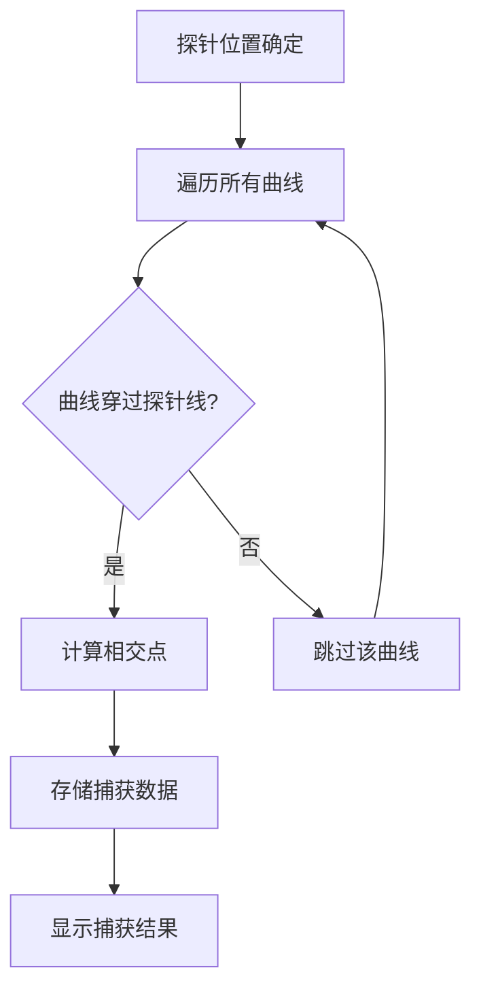

# 数据探针

数据探针是 DAWorkBench 提供的数据标注和捕获工具，允许用户在绘图区域添加探针标记，记录特定位置的数据并在表格界面显示。探针功能特别适用于需要精确记录和比较特定数据点的场景。

## 主要功能特性

**特性**

- ✅ **垂直探针**：标记特定 X 值位置，捕获所有曲线在该位置的 Y 值
- ✅ **水平探针**：标记特定 Y 值位置，捕获所有曲线在该位置的 X 值
- ✅ **数据插值**：支持线性插值获取精确的数据点位置
- ✅ **探针命名**：自动命名或自定义命名，便于管理和引用
- ✅ **样式定制**：可调整探针颜色、线型和标签位置

## 探针类型

### 垂直探针

垂直探针是一条横跨整个绘图区域 Y 轴范围的垂直线，用于标记特定的 X 值位置。

**特点：**

- 显示为垂直虚线
- 在线的顶部或底部显示探针名称标签
- 捕获 X 轴坐标值
- 自动检测所有穿过该垂直线的数据曲线

**适用场景：**

- 标记特定时间点的数据值
- 比较不同曲线在同一 X 值处的 Y 值差异
- 标注实验中的关键时间节点

### 水平探针

水平探针是一条横跨整个绘图区域 X 轴范围的水平线，用于标记特定的 Y 值位置。

**特点：**

- 显示为水平虚线
- 在线的左侧或右侧显示探针名称标签
- 捕获 Y 轴坐标值
- 自动检测所有穿过该水平线的数据曲线

**适用场景：**

- 标记阈值线或参考线
- 比较不同曲线在同一 Y 值处的 X 值差异
- 标注特定的数值水平或临界值

## 探针命名规则

### 默认命名

探针默认使用大写字母命名，从字母"A"开始递增：

| 序号 | 名称 |
|------|------|
| 第 1 个 | A |
| 第 2 个 | B |
| 第 3 个 | C |
| ... | ... |
| 第 26 个 | Z |
| 第 27 个及以后 | AA, AB, AC, ... |

### 自定义命名

用户可以为探针指定自定义名称，命名规则如下：

- 支持中英文字符
- 支持数字
- 不建议使用特殊符号
- 名称长度建议不超过 20 个字符

## 探针管理

### 创建探针

通过图表交互工具创建探针：

1. 在图表编辑区选择探针工具
2. 点击绘图区域添加探针
3. 探针自动命名，也可在属性面板修改名称

!!! tip "创建位置"
    点击位置决定探针的初始值：垂直探针捕获点击位置的 X 坐标，水平探针捕获点击位置的 Y 坐标。

### 删除探针

删除探针的操作步骤：

1. 在图表编辑区选中目标探针
2. 按键盘 Delete 键删除
3. 或在属性面板中点击删除按钮

### 修改探针

**移动探针位置：**

在属性面板中精确输入坐标值：

| 探针类型 | 修改参数 |
|----------|----------|
| 垂直探针 | X 值 |
| 水平探针 | Y 值 |

**修改探针样式：**

可在属性面板中调整以下样式属性：

| 属性 | 说明 |
|------|------|
| 线条颜色 | 探针线的颜色 |
| 线条宽度 | 探针线的粗细 |
| 线条样式 | 实线、虚线、点线等 |
| 标签位置 | 垂直探针为顶部/底部，水平探针为左侧/右侧 |
| 标签可见性 | 是否显示探针名称标签 |

## 数据捕获功能

### 数据捕获方式

探针可捕获与曲线相交点的数据，支持两种模式：

| 模式 | 说明 |
|------|------|
| 直接取值 | 使用最近的数据点值 |
| 线性插值 | 通过插值计算精确的相交点值 |

### 捕获数据结构

每个捕获的数据点包含以下信息：

| 字段 | 类型 | 说明 |
|------|------|------|
| `item` | QwtPlotItem* | 对应的曲线对象 |
| `point` | QPointF | 捕获点的坐标 |
| `index` | size_t | 在曲线数据中的索引 |

### 曲线追踪

探针自动追踪所有可见曲线：

## 探针数据表格

探针数据表格显示所有探针的信息，便于查看和管理：

| 列名 | 说明 |
|------|------|
| 名称 | 探针名称 |
| 类型 | 垂直/水平 |
| X 值 | X 轴坐标值 |
| Y 值 | Y 轴坐标值 |
| 创建时间 | 探针创建时间 |

### 表格功能

**数据管理：**

- **排序**：点击列标题进行升序或降序排序
- **筛选**：支持按探针类型、名称筛选显示
- **导出**：支持导出为 CSV、Excel 格式
- **刷新**：实时更新探针数据值

## API 参考

### 核心方法

| 方法 | 参数 | 返回值 | 说明 |
|------|------|--------|------|
| `captureData(interpolate)` | bool | int | 捕获当前位置的数据，返回捕获点数量 |
| `capturedData()` | 无 | QList<CapturedData> | 获取已捕获的数据点列表 |
| `clearCapturedData()` | 无 | void | 清除已捕获的数据 |
| `setProbeValue(val)` | double | void | 设置探针值 |
| `probeValue()` | 无 | double | 获取探针值 |
| `setProbeName(name)` | QwtText | void | 设置探针名称 |
| `probeName()` | 无 | QwtText | 获取探针名称 |

### 核心属性

| 属性 | 类型 | 说明 |
|------|------|------|
| `probeType` | ProbeType | 探针类型（垂直/水平） |
| `probeColor` | QColor | 探针颜色 |
| `labelPosition` | LabelPosition | 标签位置 |
| `labelVisible` | bool | 标签是否可见 |

### 探针类型枚举

| 枚举值 | 值 | 说明 |
|--------|-----|------|
| `VerticalProbe` | 0 | 垂直探针，捕获指定 X 位置的 Y 值 |
| `HorizontalProbe` | 1 | 水平探针，捕获指定 Y 位置的 X 值 |

### 标签位置枚举

| 枚举值 | 说明 |
|--------|------|
| `LabelAtTop` | 垂直探针：顶部；水平探针：左侧 |
| `LabelAtBottom` | 垂直探针：底部；水平探针：右侧 |

## 注意事项

!!! warning "性能考虑"
    大量探针可能影响绘图性能，建议单个图表探针数量不超过 50 个。

!!! info "坐标轴绑定"
    探针绑定到创建时的坐标轴。当坐标轴范围变化时，探针位置会自动调整以保持其坐标值不变。

!!! warning "数据更新"
    数据更新后，探针位置保持不变。如需获取新数据的捕获值，需手动执行数据捕获操作。

!!! note "保存与加载"
    探针信息随项目文件保存，下次打开项目时会自动恢复所有探针。

!!! tip "数据精度"
    使用线性插值可以获得更精确的数据点位置，特别是对于稀疏数据点的情况。

## 参考资料

- [使用指南概述](../index.md)
- [绘图模块概述](../../dev-guide/figure-abstract.md)
- 源码位置：`src/DAFigure/DADataProbeMarker.h`