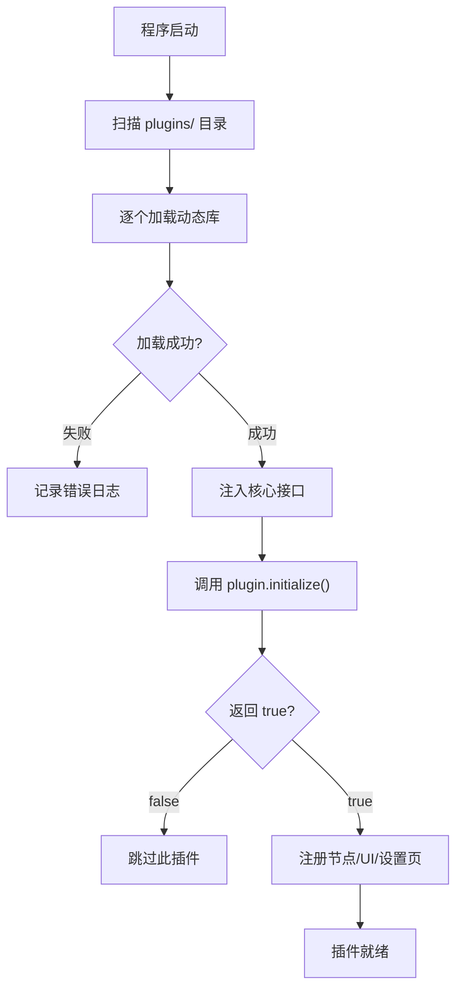

# 插件使用指南

本指南介绍如何安装、配置和使用 DAWorkBench 的插件，扩展软件功能。

## 主要功能特性

- ✅ **插件市场**：支持 C++ 动态库插件和 Python 节点包
- ✅ **一键安装**：将插件放入插件目录即可自动加载
- ✅ **插件管理**：通过插件管理对话框查看和管理已安装插件
- ✅ **节点扩展**：Python 节点包通过 entry_points 自动注册工作流节点
- ✅ **设置页面**：插件可提供自定义设置页面集成到设置对话框

---

## 插件概念

### 插件类型

DAWorkBench 支持两种插件类型：

| 类型 | 格式 | 适用场景 | 扩展能力 |
|------|------|---------|---------|
| **C++ 插件** | `.dll` / `.so` | 深度集成、高性能需求 | UI 面板、节点、设置页、存档任务 |
| **Python 节点包** | Python 包 | 轻量级工作流节点扩展 | 工作流节点 |

### 插件能做什么

- **注册工作流节点**：提供新的数据处理节点
- **添加 UI 面板**：在 Dock 区域添加自定义窗口
- **扩展 Ribbon**：添加自定义工具栏按钮
- **提供设置页**：在设置对话框中添加配置页
- **自定义存档**：在工程文件中保存插件数据

---

## 安装插件

### C++ 插件安装

1. **获取插件文件**：获取编译好的 `.dll`（Windows）或 `.so`（Linux）文件
2. **复制到插件目录**：将文件复制到 `bin/plugins/` 目录
3. **启动程序**：DAWorkBench 会自动扫描并加载插件

```
DAWorkBench/
└── bin/
    └── plugins/
        ├── DataAnalysis.dll      # 数据分析插件
        ├── CrewAIAdapter.dll     # CrewAI 适配器
        └── MyPlugin.dll          # 自定义插件
```

### Python 节点包安装

Python 节点包通过 pip 安装，自动注册到 DAWorkBench：

```bash
# 安装 Python 节点包
pip install da-mynodes

# 或从源码安装
cd my-node-package
pip install -e .
```

!!! tip "entry_points 注册"
    Python 节点包通过 `data_workbench.plugin` entry point 自动注册。安装后重启 DAWorkBench 即可在节点列表中看到新节点。

---

## 管理插件

### 插件管理对话框

通过菜单"工具 → 插件管理"打开插件管理对话框：

- **已加载插件列表**：显示所有已成功加载的插件
- **插件信息**：名称、版本、描述、作者
- **启用/禁用**：勾选控制插件是否加载
- **重新加载**：重新加载插件（部分插件支持热重载）

### 插件加载流程



---

## 使用插件提供的节点

### 查看可用节点

安装插件后，工作流编辑区的节点列表会显示插件提供的节点：

1. **打开节点列表**：工作流编辑区左侧 Dock 面板
2. **按分类查找**：插件节点按 `category` 分类显示
3. **搜索节点**：输入节点名称关键词搜索

### 使用插件节点

插件节点与内置节点使用方式完全一致：

1. **拖拽到画布**：从节点列表拖拽到工作流
2. **配置参数**：选中节点在属性面板配置
3. **连接数据流**：连接输入输出端口
4. **执行工作流**：与其他节点一起执行

---

## 插件设置

### 访问插件设置

部分插件提供自定义设置页面：

1. 菜单"工具 → 设置"
2. 在设置对话框左侧找到插件名称对应的设置页
3. 配置插件参数
4. 点击"应用"或"确定"保存

### 插件配置文件

插件配置通常存储在以下位置：

| 位置 | 说明 |
|------|------|
| 工程文件内 `plugins/` 目录 | 随工程保存的插件数据 |
| 用户配置目录 | 全局插件配置 |

---

## 常见问题

### Q：插件加载失败？

**A：** 排查步骤：
1. **查看日志**：启动时查看日志窗口，查找插件加载错误信息
2. **检查依赖**：C++ 插件可能依赖特定版本的 DAWorkBench 库
3. **检查路径**：确认插件文件在 `bin/plugins/` 目录下
4. **版本兼容**：确认插件版本与 DAWorkBench 版本兼容

### Q：Python 节点不显示？

**A：** 检查以下几点：
1. **Python 环境**：确认节点包安装在 DAWorkBench 使用的 Python 环境中
2. **entry_points 配置**：确认包的 `setup.py` / `pyproject.toml` 正确配置了 `data_workbench.plugin` 入口点
3. **查看日志**：启动日志会显示节点发现过程

### Q：如何开发自己的插件？

**A：** 参见开发文档：
- [插件开发指南](../plugin-development.md) — 插件开发总览
- [插件项目创建](../dev-guide/plugin-project-create.md) — 创建 C++ 插件项目
- [Python 节点开发](../dev-guide/workflow-python-node-dev.md) — 开发 Python 节点

### Q：插件可以在不同版本间通用吗？

**A：**
- **C++ 插件**：依赖 DAWorkBench 的 ABI，主版本号变化时可能需要重新编译
- **Python 节点包**：只要 Python API 兼容，通常可以跨版本使用

---

## 相关文档

- [使用指南概述](./index.md) — 软件功能总览
- [工作流使用指南](./workflow-usage.md) — 工作流编排
- [插件系统概述](../plugin-system.md) — 插件系统架构
- [插件开发指南](../plugin-development.md) — 开发自己的插件
- [Python 节点开发](../dev-guide/workflow-python-node-dev.md) — Python 节点开发规范
