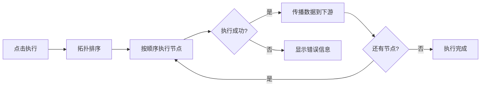

# 工作流使用指南

本指南介绍如何使用 DAWorkBench 的工作流功能，通过可视化有向图编排数据处理流程。

## 主要功能特性

- ✅ **可视化编排**：拖拽式节点编辑，直观展示数据流向
- ✅ **DAG 工作流**：有向无环图模型，自动拓扑排序
- ✅ **节点参数配置**：选中节点即可在属性面板配置参数
- ✅ **一键执行**：按依赖顺序自动执行所有节点
- ✅ **撤销/重做**：所有编辑操作支持撤销重做

---

## 工作流概念

### 什么是工作流

工作流是一张**有向无环图（DAG）**，由节点和连接组成：

- **节点（Node）**：数据处理的基本单元，如"读取 CSV"、"数据过滤"、"绘制曲线"
- **连接（Connection）**：节点间的数据流向，从上游节点的输出端口连接到下游节点的输入端口
- **拓扑排序**：执行前自动验证无环性，按依赖顺序执行节点

### 节点类型

DAWorkBench 内置多种节点类型，按功能分类：

| 分类 | 节点示例 | 说明 |
|------|---------|------|
| **数据处理** | Data Filter、Filter By Column、Threshold Filter、Search、Sort | DataFrame 过滤、查询、排序 |
| **数据变换** | Eval Expression、Fill NA、Interpolate、Replace Values、Transform Skewed | 数值计算、缺失值处理 |
| **统计聚合** | Pivot Table、Remove Outliers IQR/Z-Score | 数据汇总和异常值检测 |
| **数据查询** | Query | SQL 风格的 DataFrame 查询 |
| **图表绘制** | Data Plot | 将数据绑定为曲线/散点图等 |

!!! note "节点名称不翻译"
    节点的 `@NodeDef(name=...)` 名称参与序列化，保持英文不翻译，确保已存工程的节点匹配。详见 [Python 节点开发规范](../dev-guide/workflow-python-node-dev.md)。

---

## 基本操作

### 创建节点

1. **打开节点列表**：在工作流编辑区左侧的 Dock 面板中找到节点列表
2. **拖拽节点**：从节点列表中拖拽所需节点到工作流画布
3. **放置节点**：松开鼠标，节点出现在画布上

!!! tip "节点搜索"
    节点列表支持按名称搜索，输入关键词快速定位节点。

### 连接节点

1. **识别端口**：每个节点左侧是输入端口（蓝色），右侧是输出端口（绿色）
2. **开始连接**：鼠标悬停在输出端口上，按住左键拖动
3. **完成连接**：拖动到目标节点的输入端口，松开鼠标

```
[Data Source] --output--> [Data Filter] --filtered--> [Data Plot]
```

!!! warning "数据类型匹配"
    端口有数据类型标识（如 `DataFrame`、`Series`）。连接类型不匹配的端口会被拒绝或标记警告。

### 配置节点参数

1. **选中节点**：单击画布上的节点
2. **查看属性面板**：右侧属性面板显示该节点的可配置参数
3. **修改参数**：在属性面板中修改参数值
4. **应用更改**：参数修改即时生效

不同节点的参数各异，常见参数包括：文件路径、列名、筛选条件、图表标题等。

### 执行工作流

1. **点击执行按钮**：在 Ribbon 工具栏中点击"执行工作流"按钮
2. **观察执行状态**：节点会显示执行状态（等待/执行中/完成/错误）
3. **查看结果**：执行完成后，输出数据出现在数据面板或图表面板中



---

## 高级操作

### 移动和对齐节点

- **移动单个节点**：拖拽节点到新位置
- **多选节点**：按住 Ctrl 点击多个节点，或框选
- **批量移动**：选中多个节点后拖动

### 删除节点和连接

- **删除节点**：选中节点后按 Delete 键
- **删除连接**：点击连接线选中后按 Delete 键
- **撤销删除**：Ctrl+Z 撤销操作

### 工作流验证

执行前，系统会自动验证工作流：

- **环路检测**：检测并阻止有环图执行
- **端口连通性**：检查必需输入端口是否已连接
- **类型兼容性**：验证连接端口的数据类型兼容性

---

## 常见问题

### Q：节点执行报错"输入数据为空"？

**A：** 检查上游节点是否已正确连接并执行成功。工作流按拓扑顺序执行，如果上游节点失败，下游节点会收到空数据。

### Q：如何查看节点的中间数据？

**A：** 选中已执行的节点，在数据面板中可以看到该节点输出的数据（DataFrame 表格视图）。工作流节点的输出数据会自动添加到数据管理面板中。

### Q：工作流可以循环执行吗？

**A：** DAG 模型不支持循环依赖。如需迭代处理，可以通过"延迟"节点或外部脚本控制多次执行。

### Q：如何保存工作流？

**A：** 工作流随工程文件（`.dapro`）一起保存。通过菜单"文件 → 保存工程"即可保存完整工作流。

---

## 相关文档

- [使用指南概述](./index.md) — 软件功能总览
- [数据管理使用](./data-management.md) — 数据导入和查看
- [图表使用指南](./chart-usage.md) — 图表创建和编辑
- [工作流开发指南](../dev-guide/workflow-overview.md) — 工作流技术架构
- [Python 节点开发](../dev-guide/workflow-python-node-dev.md) — 自定义节点开发
