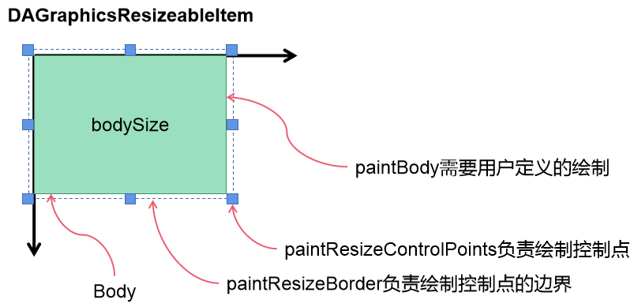

可缩放图元编辑模块基于Qt的 `Graphics View` 框架，QT4.2开始引入了 `Graphics View` 框架用来取代QT3中的 `Canvas` 模块， `Graphics View` 框架实现了模型－视图结构的图形管理，能对大量图元进行管理，支持碰撞检测，坐标变换和图元组等多种方便的功能。

Qt的 `Graphics View` 框架虽然提供了基本的图元渲染和坐标变换功能，但可缩放和拖曳连线需要进行二次封装，da-work-flow利用 `DAGraphicsView` 和 `DAWorkFlow` 模块实现工作流的编辑， `DAGraphicsView` 模块主要是实现缩放图元功能（类似商业软件Microsoft Visio的功能）

# 可缩放图元模块`DAGraphicsView`

`DAGraphicsView`模块对 `QGraphicsItem` 进行了封装，提供了较多针对用户常用的操作的方法，如：

- 实现了8个控制点可以供用户进行缩放
- 集成了鼠标事件响应用户对图元的缩放操作

可缩放图元模块的核心类为 `DAResibleGraphicsItem` ，它提供了一个通用的 `paintBody` 接口(而不是 `QGraphicsItem` 的 `paint` 接口)，用户只需要重写此方法，即可实现图元的绘制

此方法和 `QGraphicsItem` 提供的 `paint` 接口不同在于，它限制了绘制的范围为渲染的实体，其他的内容例如控制点等的绘制已经进行了封装，`DAResibleGraphicsItem`的一些核心定义如下：

