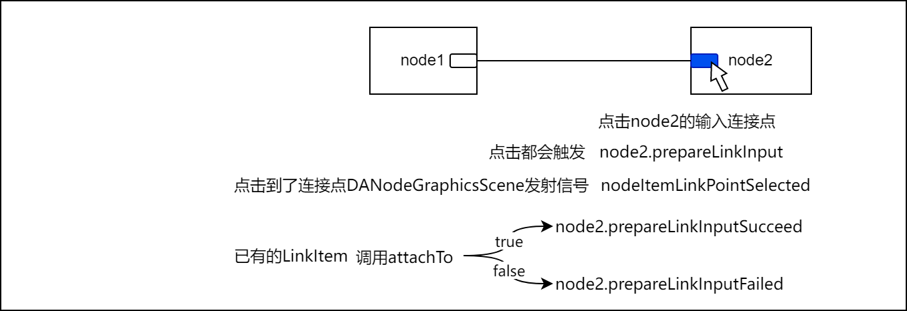

# 工作流生命周期

## 节点创建过程生命周期

节点从创建到销毁涉及到的回调如下表所示：

表 节点添加过程生命周期

|顺序|类|函数/信号|说明|
|:-|:-|:-|:-|
|1|DAAbstractNodeFactory|nodeAddedToWorkflow|节点即将加入workflow的回调|
|2|DAWorkFlow|nodeAdded|添加节点完成触发的信号|

表 节点移除过程生命周期

|顺序|类|函数/信号|说明|
|:-|:-|:-|:-|
|1|DAAbstractNodeFactory|nodeStartRemove|节点即将移出workflow的回|调
|2|DAWorkFlow|nodeRemoved|移除节点完成触发的信号|

节点在添加和删除前都会触发工厂的回调，针对一些全局属性可以通过工厂的回调进行操作，例如对节点进行编号或者拓扑检查等等

## 节点连线过程生命周期

节点连线过程的生命周期涉及的回调较多，这些回调的目的是辅助判断节点的连接交互过程使能，以及针对一些特殊的节点实现动态连接，节点开始连接到连接成功涉及到的回调有如下函数

表 节点开始连接过程的调用过程

|顺序|类|函数|说明|
|:-|:-|:-|:-|
|1|DAAbstractNodeGraphicsItem|tryLinkOnItemPos|节点点击会触发此回调，此回调可以针对没有固定节点的元件进行动态连接点生成的操作|
|2|DAAbstractNodeGraphicsItem|getLinkPointByPos|获取是否点击到连接点，只有点击到连接点，才会进入连接模式|
|3|DANodeGraphicsScene|nodeItemLinkPointSelected|**EMIT** 发射连接点被选中信号|
|4|DAAbstractNodeGraphicsItem|createLinkItem|创建连接线|
|5|DAAbstractNodeLinkGraphicsItem|attachFrom|建立开始连接方法，只有此方法返回true，才会进入连接模式|
|6|DAGraphicsScene|beginLink|开始连接，连接线交由场景管理|

用户在点击节点的输出连接点时，首先会调用`DAAbstractNodeGraphicsItem::tryLinkOnItemPos`回调函数，这个函数的作用是用于给元件判断是否要动态生成连接点，有些特殊的节点没有固定的连接点，需要根据情景动态生成的时候，可以重写此函数，在用户点击的位置进行连接点的生成

`DAAbstractNodeGraphicsItem::tryLinkOnItemPos`函数之后将会调用`DAAbstractNodeGraphicsItem::getLinkPointByPos`来看看是否点击到了连接点，如果是则准备进入连接状态，如果不是就跳过，因此，针对那些需要动态生成连接点的特殊元件，`DAAbstractNodeGraphicsItem::tryLinkOnItemPos`函数可以在点击的位置生成一个连接点，以便`DAAbstractNodeGraphicsItem::getLinkPointByPos`能获取到一个具体连接点从而进入连接状态

如果`DAAbstractNodeGraphicsItem::getLinkPointByPos`返回一个有效的连接点，则进入连接状态，`DANodeGraphicsScene`会发射`nodeItemLinkPointSelected`信号：

```cpp
void nodeItemLinkPointSelected(DA::DAAbstractNodeGraphicsItem* item,const DA::DANodeLinkPoint& lp,QGraphicsSceneMouseEvent* event);
```

此信号发射完成后，会调用`DAAbstractNodeGraphicsItem::createLinkItem`函数，来生成一个连接线的图元，如果此函数返回值为`nullptr`，则不会创建连接线，但上面的信号会发射

生成连接线后，会调用连接线图元的 `DAAbstractLinkGraphicsItem::attachFrom`函数，这个函数将连接线与节点关联起来，如果节点不接受连接线，此函数会返回`false`，结束连接，返回`true`则说明可以开始连接

创建完连接线后，连接线会绑定图元所点击的连接点，同时，调用`DAGraphicsScene::beginLink`方法。`DAGraphicsScene::beginLink`是一个很关键的方法，`DAGraphicsScene`所有涉及连接的操作都需要用到此方法。这个方法会把连接线加入场景中，并交由场景管理，这时，在连接线未完成时，连接线的末端会随着鼠标移动而移动。调用`DAGraphicsScene::beginLink`后，`DAGraphicsScene::isStartLink`方法会返回true

上面是连接线从开始连接点连接的调用过程

连接过程从图元的输出连接点点击后开始，到点击到其它图元的输入连接点为结束，连接点结束连接过程的调用过程如下：

表 节点结束连接过程的调用过程

|顺序|类|函数|说明|
|:-|:-|:-|:-|
|1|DAGraphicsScene|isStartLink|判断当前是否在连接状态|
|2|DAGraphicsScene|getCurrentLinkItem|获取当前管理的连接线|
|3|DAAbstractNodeGraphicsItem|tryLinkOnItemPos|节点点击会触发此回调，此回调可以针对没有固定节点的元件进行动态连接点生成的操作|
|4|DAAbstractNodeGraphicsItem|getLinkPointByPos|获取是否点击到连接点，只有点击到连接点，才会进入连接模式|
|5|DANodeGraphicsScene|nodeItemLinkPointSelected|**EMIT** 发射连接点被选中信号|
|6|DAAbstractNodeLinkGraphicsItem|attachTo|调用连接线的 attachTo方法，只有此方法返回 true，才会进入后面的结束连接过程|
|  6.1| - DAAbstractNode|linkTo|节点的linkto方法|
|  6.2| - DAAbstractNode|finishLink|如果连接完成，会分别调用DAAbstractNode的finishLink回调方法|
|  6.3| - DAAbstractNodeLinkGraphicsItem|finishedNodeLink|node的finishLink回调结束后，调用连接线的finishedNodeLink回调，通知item，节点完成了连接|
|7|DANodeGraphicsScene|addNodeLink_|把连接线用命令管理起来，可以实现**redo/undo**|
|8|DAGraphicsScene|endLink|调用结束连接方法，通知场景，结束连接线的管理，这时连接线不会跟随鼠标移动，场景不在管理连接线的状态|
|9|DAAbstractNodeLinkGraphicsItem|willCompleteLink|调用连接线结束连接回调，这个回调可以实现一些连接线完成连接后的动作，例如改变颜色，改变渲染方式等等|
|10|DAGraphicsScene|linkCompleted|**EMIT** 发射连接完成信号|

首先通过`DAGraphicsScene::isStartLink`判断当前是否处于连接状态，如果是，则会调用`DAGraphicsScene::getCurrentLinkItem`获取场景当前正在管理的连接线图元，连接线图元是通过`DAGraphicsScene::beginLink`函数设置进去的

接着和开始连接一样，结束连接过程也会调用`DAAbstractNodeGraphicsItem::tryLinkOnItemPos`回调函数，`DAAbstractNodeGraphicsItem::tryLinkOnItemPos`函数之后将会调用`DAAbstractNodeGraphicsItem::getLinkPointByPos`

如果`DAAbstractNodeGraphicsItem::getLinkPointByPos`返回一个有效的连接点，则开始进入结束连接状态，和开始连接过程一样，`DANodeGraphicsScene`会发射`nodeItemLinkPointSelected`信号

接下来将会调用`DAAbstractNodeLinkGraphicsItem::attachTo`方法,这个方法是绝对是否连接完成的关键，此方法返回`true`，则表示连接成功，节点接受连接，否则失败，如果失败，则会结束连接状态判定，用户可以继续连接，场景依旧处于连接状态

`DAAbstractNodeLinkGraphicsItem::attachTo`方法返回`true`,说明这次连接完成

`DAAbstractNodeLinkGraphicsItem::attachTo`方法里涉及较多节点相关的操作：
- 首先会调用节点`DAAbstractNode::linkTo`方法
- 然后，调用节点的`DAAbstractNode::finishLink`回调
- 最后调用`DAAbstractNodeLinkGraphicsItem::finishedNodeLink`回调

`DAAbstractNodeLinkGraphicsItem::attachTo`之后会调用`DANodeGraphicsScene::addNodeLink_`函数，把连接线添加到回退栈中，可以实现连接线的redo/undo

之后调用`DAGraphicsScene::endLink`函数，此函数会告诉场景结束连接，并清除连接线的管理，这个函数里面会调用`DAAbstractNodeLinkGraphicsItem::willCompleteLink`回调，这个回调可以进行一些操作，这个回调可以实现一些连接线完成连接后的动作，例如改变颜色，改变渲染方式等等

> 注意：`finishedNodeLink`和`willCompleteLink`都是表示连接完成，但`finishedNodeLink`更早，它代表了节点完成了连接，是逻辑层面的完成，`willCompleteLink`是代表视图层面的完成连接，它发生的更晚，原则上，`finishedNodeLink`如果触发，那么`willCompleteLink`就应该返回`ture`，如果`finishedNodeLink`触发了，但`willCompleteLink`就应该返回`false`，将导致逻辑和视图的不一致，会引发一些问题

最后，场景将会发出`DAGraphicsScene::linkCompleted`信号，这时，一个完整的连接过程结束


节点在连接过程可以进行中断操作，中断会触发prepareLinkOutputFailed回调


节点1的输出完成连接到节点2的输入，首先会触发节点2的prepareLinkInput回调，再根据结果触发触发prepareLinkInputSucceed或prepareLinkInputFailed回调



通过节点连接线的回调，可以实现不固定的输入或输出点