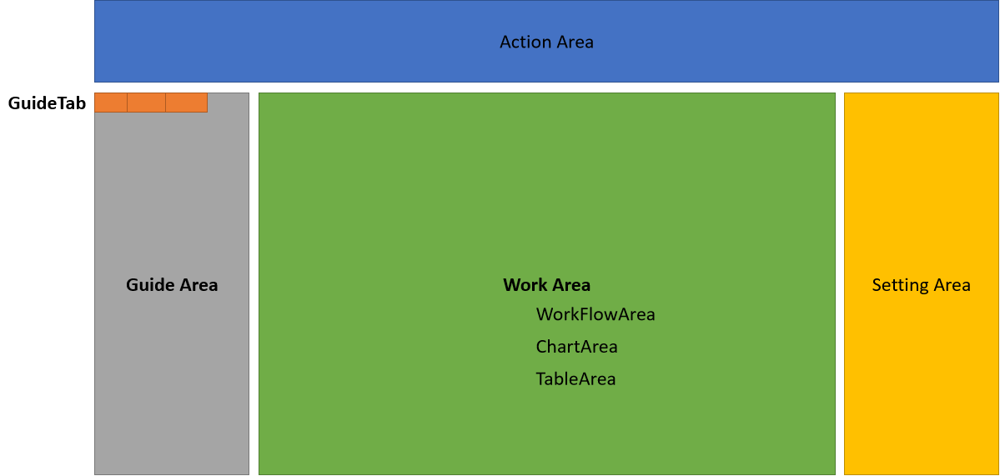

`da-work-flow`通过插件实现功能，通过接口实现数据的交互

通过插件和接口两个模块可以实现整个核心逻辑的调用，`da-work-flow`的各个模块间依赖关系如下图所示：


总体可以分为4大部分：

- 第三方库
- DA公共库
- 应用程序
- 插件

`da-work-flow`的功能都通过插件提供，不同插件可提供不同功能，而程序只提供一个基本框架，因此，要开发具体功能，需要首先面对两个模块，一个是插件(`DAPluginSupport`)一个是接口(`DAIterface`)


通过接口可调用到整个程序的所有其他模块，这样业务逻辑都应该通过插件实现，保证了业务逻辑和界面的分离，同时也加强了扩展性

# 插件模块`DAPluginSupport`

插件的支持模块为DAPluginSupport

`DAAbstractPlugin`是插件的基类，其中有个非常关键的函数`core`:

```cpp
DACoreInterface* core() const;
```

这个函数是插件和框架的沟通基础，此函数获取了基础接口`DACoreInterface`，`da-work-flow`的所有接口基于此接口都可以获取，由此，插件实现和界面以及核心逻辑的交互

`da-work-flow`的插件使用Qt的插件系统实现，`DAAbstractPlugin`通过`Q_DECLARE_INTERFACE`声明为插件，而插件的管理提供了单例`DAPluginManager`实现所有插件的管理，插件在加载过程之前，会把接口的实例传入，因此，插件在加载时即可调用接口提供的所有功能进行操作

插件最关键有如下两个虚函数：

```cpp
/**
    * @brief 发生语言变更事件的时候调用此函数
    * 默认没有实现，如果插件有涉及翻译，需要重载此函数
    */
virtual void retranslate();

/**
    * @brief 初始化
    * @return 如果初始化返回false，将不会把插件放入管理中，默认返回true
    */
virtual bool initialize();
```

其中`initialize`函数用于插件的初始化，如果初始化过程返回false，系统将跳过这个插件

`retranslate`是在语言发生变化时调用，对于多语言的处理，可以在继承此函数

插件在加载是会传入接口，在插件中操作程序都通过接口完成，通过`DAAbstractPlugin::core`函数可获取顶层接口:

```cpp
DACoreInterface* core() const;
```

基于插件实现业务逻辑，所有业务的实现从插件基类的派生类中实现，例如节点插件基类为`DAAbstractNodePlugin`也继承自`DAAbstractPlugin`，其类继承关系如下图所示，要开展节点相关的业务，需要继承`DAAbstractNodePlugin`进行实例化开发


## 通用插件

`da-work-flow`针对程序需求，提供了一些通用插件

### 工作流节点插件`DAAbstractNodePlugin`

`DAAbstractNodePlugin`负责生成工作流的节点，可以通过编写此插件提供不同功能的节点，具体详见[工作流.md](./%E5%B7%A5%E4%BD%9C%E6%B5%81.md)

# 接口模块`DAInterface`

接口模块位于`DAInterface`,接口的UML图如下：


`DACoreInterface`是接口类的基础，从此接口可以获取其他的关键接口，例如`DAAppUIInterface`主要负责UI相关的接口，`DAProjectInterface`主要负责工程管理的接口，`DADataManagerInterface`主要负责数据管理相关的接口

界面的操作主要由`DAAppUIInterface`管理，`DAAppUIInterface`下可以获取界面相关的其他接口，如负责ribbon界面的接口`DAAppRibbonAreaInterface`，以及负责dock窗口的接口`DAAppDockingAreaInterface`

## 接口的创建顺序

接口创建过程有相互顺序，避免在一个接口调用一个还未创建的接口

1. `DACoreInterface` 首先创建，然后调用`DACoreInterface::initialized`进行初始化
2. 接着调用`initializePythonEnv`，初始化Python环境
3. 实例化`DADataManagerInterface`
4. 实例化`DAProjectInterface`
5. 主界面构造
6. 调用`DACoreInterface::createUi` 开始构造界面
7. 实例化`DAAppUIInterface`
8. 调用`DAAppUIInterface::createUi`
9. 实例化`DACommandInterface`
10. 实例化`DAAppActionsInterface`
11. 实例化`DAAppDockingAreaInterface`
12. 实例化`DAAppRibbonAreaInterface`

整个app的区域划分如下图所示：



`DAAppRibbonAreaInterface`负责Action Area的控制

`DAAppDockingAreaInterface`
