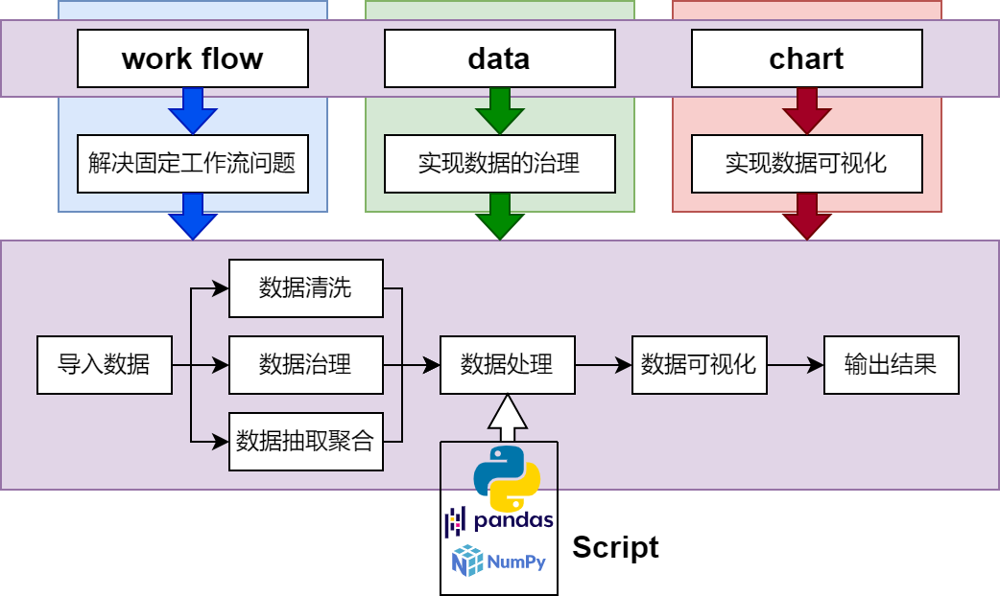
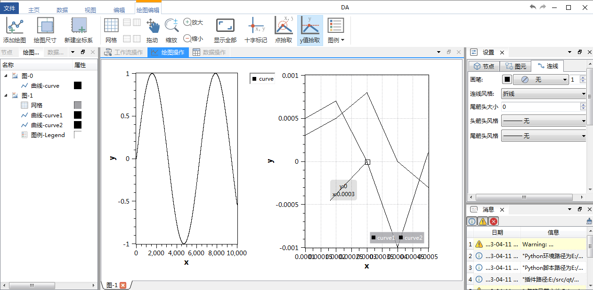
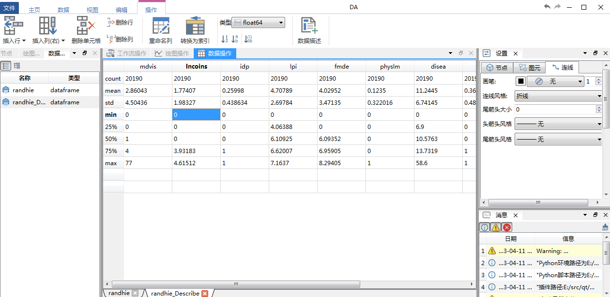

此程序还在开发中，只有基本的一些功能实现

# 简介

数据工作流设计器，这个软件的设计目标是实现工作流驱动数据的ETL，集成panda的数据处理能力，实现高效的交互式数据可视化以及能固定输出论文级别的图片，软件主要分三大块：work flow、data、chart，三大板块的关系如下图所示：



软件的设计初衷：

在数据处理过程往往有很多重复性的工作，尤其针对科研实验数据，有可能要面对n组数据，每组数据的清洗抽取方式基本是一样的，因此我希望一个数据处理软件应该是带有工作流功能的，当然python是很容易实现上述功能，但要求有一定的开发基础且要熟悉一些库才能得心应手

python的pandas、numpy、scipy是数据处理的三大利器，通过python进行数据处理过程，如此多的数据清洗方法，除非你把整个文档浏览一遍，否则你很难想起他们，因此一个交互式的数据清洗工具是很有必要的，把功能通过GUI明确的展现给用户，这样数据处理过程不需要长时间的翻阅文档

最后也是我用matlab和python这类数据处理工具最头疼的一点，就是数据可视化，虽然matlab和python能做出很漂亮的图，但细微的调节非常令人抓狂，例如要调整一个文本的位置，交互式的设计你只需要拖动一下鼠标，但在脚本语言里你要指定它的坐标，如果图片非常大，渲染时间比较久，那么移动一个文本到你想要的地方是一件令人非常抓狂的事情，而且matlab或者matplotlib的数据可视化函数有多有细，每次操作都要查阅半天文档，这是另人非常苦恼的事情。

目前没找到一个合适的工具来实现基于工作流的数据分析，比较接近我的需求的是Orange3，但Orange3更偏向深度学习方面，想进行单一的绘图有比较困难，Origin这些又是非常传统的数据分析软件，没有工作流相关模块

本软件的设计就是为了解决上面遇到的这三个问题，因此软件会分为三大板块：工作流解决固定流程问题，数据处理板块会把pandas的功能进行集成，chart板块能实现交互式的数据可视化，且能生成论文级别的图片

随着软件的开发，工作流板块逐渐形成体系，使用了有向图作为工作流的数据描述，发现不仅仅用于接近上述数据分析的问题，针对一维仿真也能非常方便的构建出模型，为此此软件也相当于提供了一个一维仿真集成框架，可以实现类似Amesim的一维仿真

# 编译

## 第三方库

编译前请确保已经拉取了第三方库，由于使用的是`git submodule`方式管理大部分第三方库，因此需要执行：

```shell
git submodule update --init --recursive
```

把所有第三方库拉取，具体可见：[submodule.md](./submodule.md)

编译完第三方库后，需要进行安装(install)，所有依赖将安装到bin目录下

需要编译的第三方库如下：

- SARibbon
- Qt-Advanced-Docking-System
- ctk(只依赖部分，这里作者对ctk进行了精简，形成一个liteCtk)
- qwt
- QtPropertyBrowser
- spdlog
- pybind11

## 构建简述

整个构建过程需要加载3次cmake文件
- 首先是`src/3rdparty/CMakeLists.txt`完成第三方库编译,同时要进行install，否则第二步无法找到第三方库
- 然后是`CMakeLists.txt`完成`DataWorkbench`编译，同时要进行install，否则第三步无法找到`DAWorkbench`
- 最后是`plugins/CMakeLists.txt`完成`DataWorkbench`的所有业务功能的插件编译。

**详细构建教程见**：[doc/how-to-build.md文档](./doc/how-to-build.md)

## bin目录

DA项目编译好的二进制文件统一生成到bin{Debug/Release}_qt{$$QT_VERSION}_{MSVC/GNU}_{x64/x86}目录下，如：使用qt5.14.2, msvc版本debug模式64位编译，将生成`bin_Debug_qt5.14.2_MSVC_x64`文件夹

用户可以自定义安装路径，需要手动调整CMakeLists.txt


## python环境配置

> 用户可以自定义安装路径，需要手动调整`CMakeLists.txt`的`DA_ENABLE_PYTHON`选项

如果开启将自动查找系统的python环境并进行依赖，python环境有如下要求：

- 至少是python3.7

python环境需要安装的库：

```
pip install numpy
pip install pandas
pip install scipy
pip install Loguru
pip install openpyxl
```

> openpyxl是pandas导入excel文件的依赖，如果没有安装，则无法导入excel文件

在需要python时将引入`pybind11`库

dataworkbench查找python的逻辑是：

1. 先查看程序运行目录下是否存在`python-config.json`，如果有，讲读取python-config.json里的`config/interpreter`下的值，以此作为python解析器的路径,python-config.json的模板如下：

```json
{
  "config": {
      "interpreter": "path to python interpreter"
    }
}
```

2. 如果没有`python-config.json`文件，将使用`where python`来查找系统的python环境

## 编译程序

在确保完成了`./src/3rdparty/CMakeLists.txt`的编译，以及完成Python路径的配置（如果需要依赖python），直接用Qt Creator （或vs）打开`./CMakeLists.txt`进行编译，编译完成后安装，默认的安装路径会自动把文件安装到工程目录的`bin_xx`目录下

如果第三方库的安装路径不是使用默认路径，需要指定各个第三方库的安装位置

> 详细构建教程见：[doc/how-to-build.md文档](./doc/how-to-build.md)

本项目开发规范：[开发规范文档:coding-standard.md](./coding-standard.md)

# 程序框架及说明

[1.插件与接口](./doc/zh/插件与接口.md)

[2.可缩放图元模块](./doc/zh/可缩放图元.md)

[3.工作流模块](./doc/zh/工作流.md)

# 程序截图


主体界面演示




