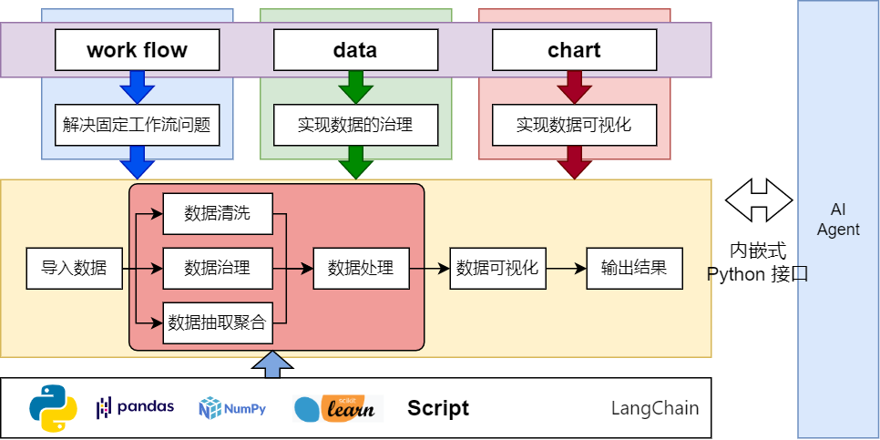

<div align="center">
<p>


</p>
</div>

本项目通过 CI 进行构建

<div align="center">
<p>

</p>
</div>

项目文档见：[https://czyt1988.github.io/data-workbench](https://czyt1988.github.io/data-workbench)

# 简介

AI Agent 驱动的下一代数据分析工作平台，基于有向图工作流引擎，实现「智能体编排 + 数据处理 + 可视化」三位一体的全流程数据能力。软件以 AI Agent 为核心，原有工作流模块作为智能体有向图调用链的可视化载体，支持可视化编排 Agent 工作流，内嵌 Python 环境可无缝对接 crewAI、LangChain、LangGraph 等主流 AI 框架，实现低代码/无代码的智能数据分析流程搭建。

软件主要分四大核心模块：`Agent 编排 `、`work flow 引擎 `、`data 数据处理 `、`chart 可视化`，模块间能力互通，支持 Python 双向操作。



## 设计愿景与初衷

### 原有设计目标（已实现）
在数据处理过程往往有很多重复性的工作，尤其针对科研实验数据，有可能要面对 n 组数据，每组数据的清洗抽取方式基本是一样的，因此我希望一个数据处理软件应该是带有工作流功能的，当然 python 是很容易实现上述功能，但要求有一定的开发基础且要熟悉一些库才能得心应手

python 的 `pandas`、`numpy`、`scipy` 是数据处理的三大利器，通过 python 进行数据处理过程，如此多的数据清洗方法，除非你把整个文档浏览一遍，否则你很难想起他们，因此一个交互式的数据清洗工具是很有必要的，把功能通过 GUI 明确的展现给用户，这样数据处理过程不需要长时间的翻阅文档

最后也是我用 matlab 和 python 这类数据处理工具最头疼的一点，就是数据可视化，虽然 matlab 和 python 能做出很漂亮的图，但细微的调节非常令人抓狂，例如要调整一个文本的位置，交互式的设计你只需要拖动一下鼠标，但在脚本语言里你要指定它的坐标，如果图片非常大，渲染时间比较久，那么移动一个文本到你想要的地方是一件令人非常麻烦的事情，而且每次操作 matlab 或者 matplotlib 的数据可视化函数都要查阅半天文档，这是另人非常苦恼的事情。

目前没找到一个合适的工具来实现基于工作流的数据分析，比较接近我的需求的是 `Orange3`，但 `Orange3` 更偏向深度学习方面，想进行单一的绘图有比较困难，`Origin` 这些又是非常传统的数据分析软件，没有工作流相关模块

本软件的设计就是为了解决上面遇到的这三个问题，因此软件会分为三大板块：工作流解决固定流程问题，数据处理板块会把 pandas 的功能进行集成，能像操作 excel 一样操作 Dataframe，chart 板块能实现交互式的数据可视化，且能生成论文级别的图片

随着软件的开发，工作流板块逐渐形成体系，使用了有向图作为工作流的数据描述，发现不仅仅用于接近上述数据分析的问题，针对一维仿真也能非常方便的构建出模型，为此此软件也相当于提供了一个一维仿真集成框架，可以实现类似 Amesim 的一维仿真

### 新增 AI Agent 愿景
随着 AI 技术的发展，我们将核心目标升级为打造 AI Agent 驱动的数据分析平台：
- 利用已有成熟的有向图工作流引擎作为 Agent 调用链的可视化载体，支持拖拽式编排智能体工作流
- 基于内嵌 Python 环境，无缝对接 crewAI、LangChain、LangGraph 等主流 AI Agent 框架，无需额外配置环境
- 开放软件全部能力给 Python 调用，Agent 可直接操作界面、处理数据、生成可视化图表，实现全流程自动化
- 支持实时查看 Agent 工作状态、调用链路、输出结果，调试和优化智能体工作流

## 软件可以做什么

### 原有能力（已实现）
- 可以定制化为数据分析系统，尤其适合实验室数据快速分析，可以一键导入，结合 python 脚本自动清洗，使用者无需掌握 python 即可操作 pandas 的核心函数
- 快速绘图，提升数据分析效率，快速发现数据问题，尤其针对十万以上数据分析，比 excel 快得到且绘图更方便
- 可以自定义扩展模块，集成自己的数据清洗和分析方法，并进行呈现
- 支持一维仿真建模，可实现类似 Amesim 的一维仿真能力

### 新增 AI Agent 能力（规划中）
- 🤖 **AI Agent 可视化编排**：通过拖拽方式搭建智能体工作流，直观展示 Agent 调用链和依赖关系
- 🔗 **主流 AI 框架兼容**：原生支持 crewAI、LangChain、LangGraph 等 AI 框架，无需额外环境配置
- 🐍 **Python 双向交互**：开放全部软件 API 给 Python 调用，Agent 可直接操作数据、生成图表、控制界面
- 📊 **Agent 运行状态监控**：实时查看 Agent 执行进度、输出日志、调用链路，支持断点调试
- 🔌 **Agent 插件市场**：支持自定义开发 Agent 插件，共享和复用智能体能力

## 第三方库

编译前请确保已经拉取了第三方库，由于使用的是 `git submodule` 方式管理大部分第三方库，因此需要执行：

```shell
git submodule update --init --recursive
```

把所有第三方库拉取，具体可见：[submodule.md](./submodule.md)

编译完第三方库后，需要进行安装 (`install`)，所有依赖将安装到 bin 目录下

需要编译的第三方库如下：

- SARibbon
- Qt-Advanced-Docking-System
- ctk(只依赖部分，这里作者对 ctk 进行了精简，形成一个 liteCtk)
- qwt
- QtPropertyBrowser
- spdlog
- pybind11
- ordered-map

### AI 相关依赖（新增）
Python 依赖安装：
```shell
pip install -r requirements.txt
```
包含：
- pandas, numpy, scipy（原有）
- crewai, langchain, langgraph, openai（新增 AI 依赖）

## 项目文档

项目文档见：[https://czyt1988.github.io/data-workbench](https://czyt1988.github.io/data-workbench)

## 程序截图


主体界面演示


