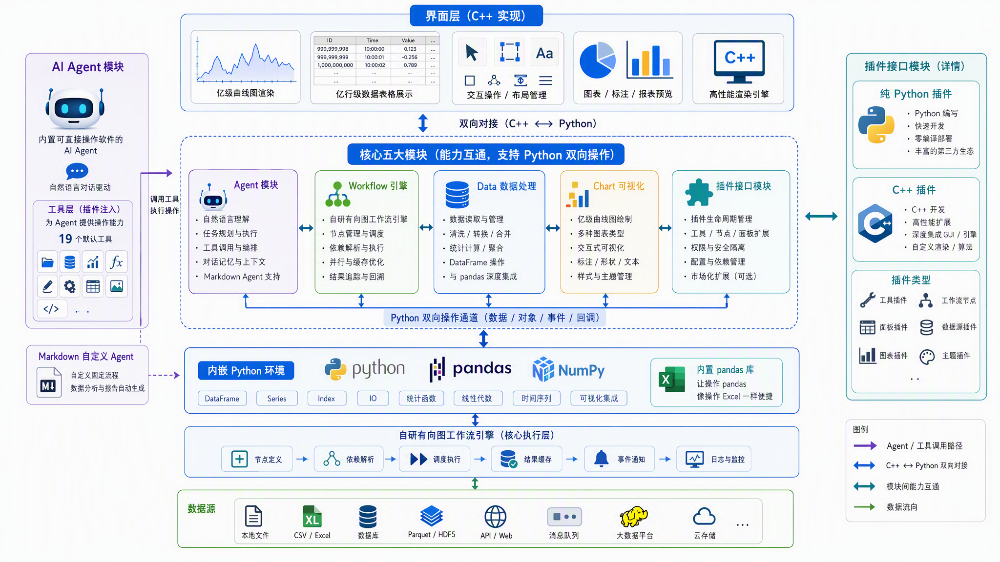
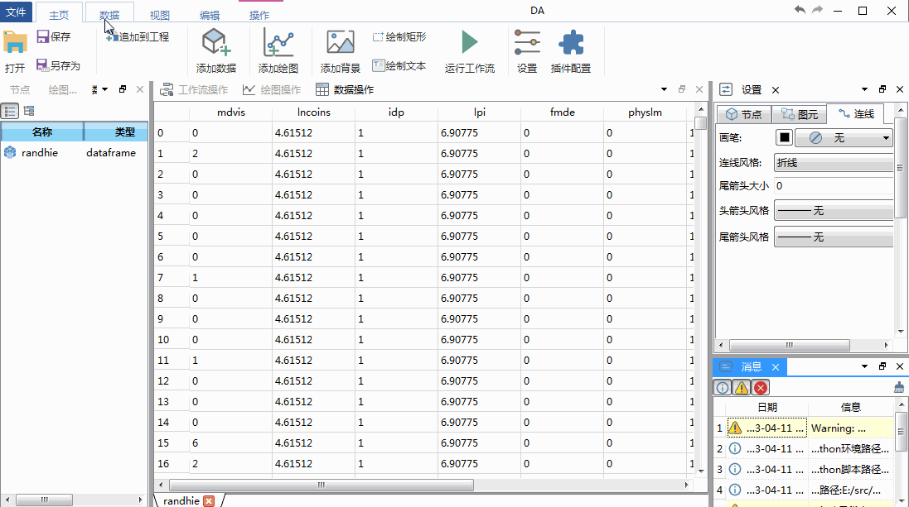
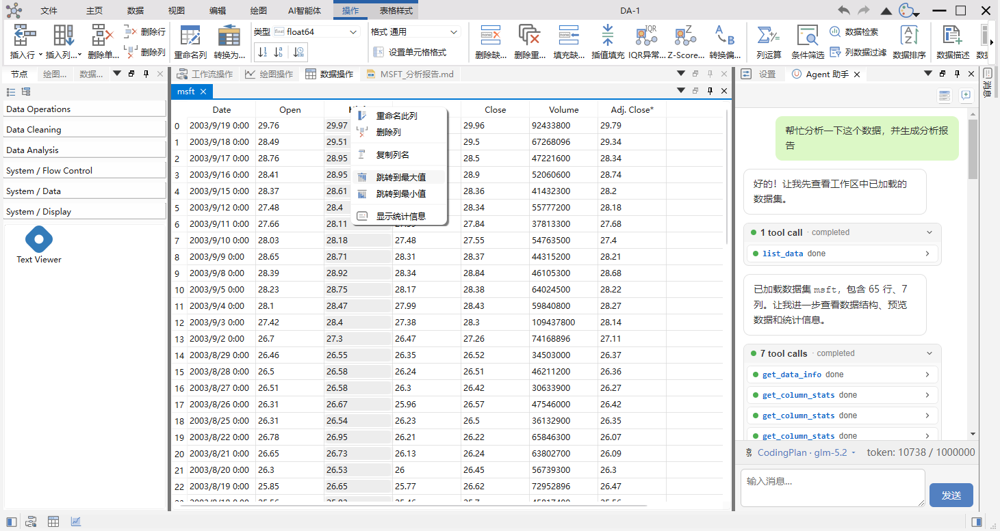
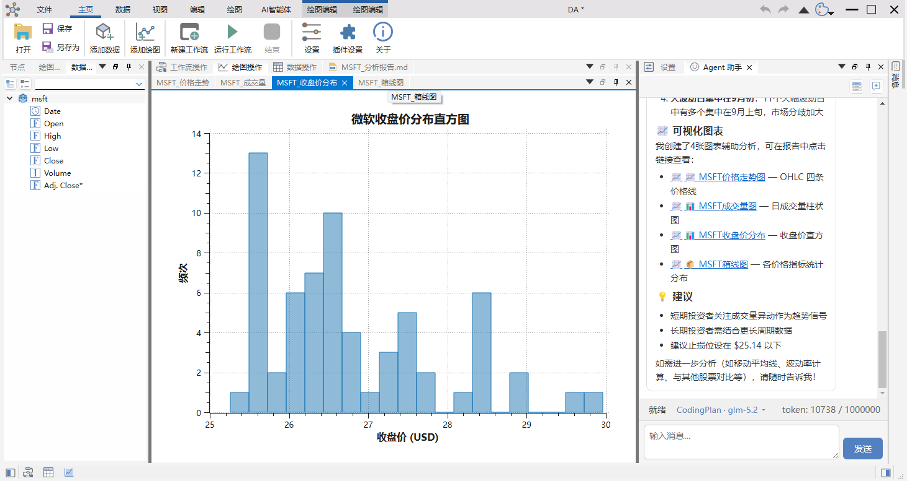
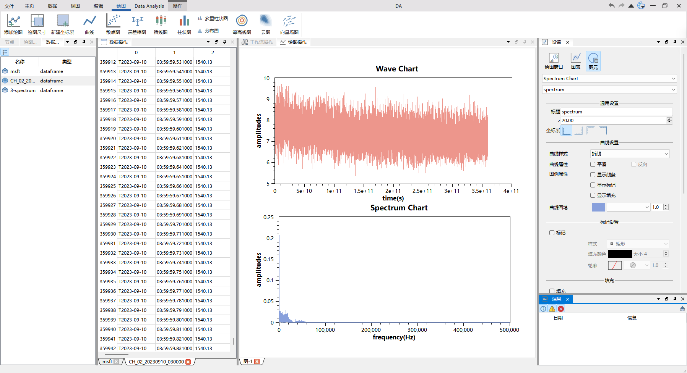

<div align="center">
<p>


</p>
</div>

本项目通过 CI 进行构建

<div align="center">
<p>

</p>
</div>

项目文档见：[https://czyt1988.github.io/data-workbench](https://czyt1988.github.io/data-workbench)

# 简介

AI Agent 驱动的数据分析工作平台，底层是有向图工作流引擎、内嵌 Python（pandas/numpy）和交互式图表，在此之上提供一个能直接操作软件的 AI Agent：agent 自己读数据、算统计、画图、加标注、生成分析报告，整个过程用自然语言对话驱动。

软件主要分四大核心模块：`Agent 模块`、`work flow 引擎`、`data 数据处理`、`chart 可视化`，模块间能力互通，支持 Python 双向操作。DAWorkbench 支持纯 Python 插件，也支持 C++ 插件，让插件开发更简单。内置 pandas 库，让操作 pandas 像操作 excel 一样。



## 设计愿景与初衷

### 原有设计目标

在数据处理过程往往有很多重复性的工作，尤其针对科研实验数据，有可能要面对 n 组数据，每组数据的清洗抽取方式基本是一样的，因此我希望一个数据处理软件应该是带有工作流功能的，当然 python 是很容易实现上述功能，但要求有一定的开发基础且要熟悉一些库才能得心应手

python 的 `pandas`、`numpy`、`scipy` 是数据处理的三大利器，通过 python 进行数据处理过程，如此多的数据清洗方法，除非你把整个文档浏览一遍，否则你很难想起他们，因此一个交互式的数据清洗工具是很有必要的，把功能通过 GUI 明确的展现给用户，这样数据处理过程不需要长时间的翻阅文档，不过AI的出现解决了这个问题，AI帮你探索数据，帮你写论文

最后也是我用 matlab 和 python 这类数据处理工具最头疼的一点，就是数据可视化，虽然 matlab 和 python的matplotlib 能做出很漂亮的图，但细微的调节非常令人抓狂，例如要调整一个文本的位置，交互式的设计你只需要拖动一下鼠标，但在脚本语言里你要指定它的坐标，如果图片非常大，渲染时间比较久，那么移动一个文本到你想要的地方是一件令人非常麻烦的事情，ai虽然绘图很简单方便，但agent通过matplotlib绘制的图片你要进行细微调整也是非常麻烦的一件事情，因此一个带有ai能力且可交互式数据可视化工具是必须的。

本软件的设计就是为了解决上面遇到的这三个问题，因此软件会分为四大板块：工作流解决固定流程问题，数据处理板块会把 pandas 的功能进行集成，能像操作 excel 一样操作 Dataframe，chart 板块能实现交互式的数据可视化，且能生成论文级别的绘图，集成agent能力，让ai操作软件，自动分析出图

## 软件可以做什么

- 可以定制化为数据分析系统，尤其适合实验室数据快速分析，可以一键导入，结合 python 脚本自动清洗，使用者无需掌握 python 即可操作 pandas 的核心函数
- 把重复的数据清洗流程固定成工作流，换一批数据一键重跑，不用每次重复手工操作
- 快速绘图，提升数据分析效率，快速发现数据问题，尤其针对十万以上数据分析，比 excel 快得到且绘图更方便
- 图表支持交互式细调，文本、标记用鼠标拖动即可，能导出矢量图，满足论文发表的要求
- 可以自定义扩展模块，集成自己的数据清洗和分析方法，并进行呈现
- 自定义 Agent，用提示词写好分析流程，让 AI 操作软件，自动分析出图，自动写报告论文

# AI Agent

agent 以对话面板的形式嵌在主界面里，它操作的是软件里的真实对象：查询的数据是工作区已加载的数据集，画出的图实时出现在绘图区，写好的报告在内置查看器里打开，agent 做完之后使用者还能接手继续手动调整。

软件启动时 agent 子进程默认预热，打开面板就能直接对话。回复流式输出，工具调用过程和 token 用量在对话里实时可见。

## agent 能做什么

默认插件注册了 19 个工具，覆盖数据分析的完整流程：

| 类别 | 工具 | 功能 |
|------|------|------|
| 数据查询 | list_data | 列出已加载的数据集及行列数 |
| | get_data_info | 查看字段类型和前几行数据 |
| | query_data | 用 pandas query 表达式筛选数据 |
| | get_column_stats | 列的描述性统计，均值、标准差、分位数等 |
| | export_data | 导出数据集为 CSV 或 Excel |
| 绘图 | create_chart | 创建折线、散点、柱状、直方、箱线图，一次画多条曲线，datetime 列自动切换时间轴 |
| | create_subplots | 创建子图网格 |
| | add_curve | 向已有图表追加曲线 |
| | set_chart_style | 设置标题、轴标签、图例、网格、背景 |
| | set_axis | 配置坐标轴刻度类型、范围、外观 |
| | update_curve_style | 修改曲线颜色、线型、标记 |
| | remove_chart_item | 移除曲线、标注、区域 |
| | add_annotation | 添加文本、箭头、点标记、区间高亮 |
| | save_chart_image | 图表导出为 PNG、PDF、SVG |
| | list_figures | 列出所有图表，修改前先定位 |
| 文件与报告 | read_file / write_file | 读写文本文件 |
| | save_report | 把 markdown 报告保存为 md、pdf、docx，md 直接在内置查看器打开 |
| 提问 | ask_user | 信息不够时 agent 主动向使用者提问，支持选项选择和自由输入 |

数据类工具在进程内真实调用 pandas，查询的就是工作区里的数据；绘图类工具直接操作真实的图表部件，agent 画完的图在绘图区里可以继续手动调整。agent 还会在回复里插入图表链接，点击后跳转到对应的图。

## 提示词库

一个 agent 就是一个 markdown 文件，放在可执行文件旁边的 `daAgent` 目录，文件名即标题。首次启动会生成内置的「数据分析助手」，里面约定了数据探索、绘图、出报告的完整流程。管理对话框里可以增删改 agent，编辑器带 markdown 语法高亮。插件也可以注入内置的领域 agent，同名文件如果已被使用者修改过则不会覆盖。

Ribbon 的 AI Agent 标签页把提示词库列成 gallery，选中一个点执行，agent 就按这份提示词开始分析，适合把常用分析流程固定下来一键复用。

## 模型管理

支持配置多个供应商，每个供应商有自己的 base_url、API key 和模型列表，可以从供应商的 /models 接口拉取可用模型，也可以手动添加。对话面板的下拉框切换供应商和模型，运行期热切换，不中断当前会话。API key 经 Windows DPAPI 加密后落盘。

## 会话与可靠性

- 对话按会话以 JSONL 落盘，支持多会话切换、重命名、删除，会话可随工程文件一起保存和恢复，token 用量按会话累计
- 上下文接近窗口上限时自动压缩，保留开头的任务描述和近期消息，中间部分生成摘要
- 网络波动、服务端报错自动指数退避重试，子进程崩溃自动重启并恢复会话、重发最后一条消息
- 看门狗和防死循环机制，避免 agent 卡死或反复调用同一个工具

# 工作流引擎

工作流引擎的逻辑层在 Python（DAWorkFlowPy），渲染层在 C++：节点、连接模型、有向无环图校验、拓扑排序执行都在 Python 侧完成，界面是基于 QGraphicsView 的节点编辑器，多输入多输出端口，操作方式类似 Unreal/Blender 的节点编辑器。

界面上从节点面板拖节点到画布连线即可搭建流程，全部操作可撤销重做，执行支持暂停、恢复、停止。

内置节点分两组：

- 系统节点（DASystemNodes 插件，7 个）：Start、End、If/Else 条件分支、常量、延时、输出到数据管理器、文本查看
- 数据分析节点（DataAnalysis 插件，21 个）：数据源、导出、绘图、筛选、阈值过滤、query 查询、查找、排序、表达式求值、透视表、统计描述、缺失值删除/填充、插值、去重、值替换、异常值剔除等

开发新节点不需要写 C++：用 Python 的 `@NodeDef` 装饰器注册，声明端口和参数，实现 execute 方法，放到插件目录即被自动发现，也支持 pip 安装后通过 entry_points 发现。

# 数据处理

数据模块的底层实体是 pandas DataFrame，C++ 把常用操作封装成表格和对话框，操作 DataFrame 像操作 Excel：单元格编辑、排序、筛选、query、去重、缺失值处理、异常值剔除、透视表、表达式求值，都带撤销重做。

导入支持 csv、txt（chardet 自动探测编码）、xls/xlsx、parquet、pickle，datetime 列自动识别转换。导出支持 csv、excel、parquet、pickle。

数据管理器统一管理多个数据集，支持按名称和正则查找。Windows 下还提供 Excel/Word 的 COM 互通。

# 图表可视化

图表基于扩展过的 qwt，增加了类似 matplotlib Figure 的 QwtFigure 容器，一个 figure 里可以放多个子图，按网格布局排布。

支持的图表类型：曲线、散点、柱状、多序列柱状、箱线、直方、间隔曲线、谱图、谱曲线、交易曲线、向量场、误差棒，核密度估计、ECDF、回归、热力图、等值线等统计图，以及 3D 柱状、折线、曲面。

交互式编辑是这块的重点：图元可以拖动、缩放，文本原地编辑，十字光标和数据探针读数，区域选择、标记、箭头都能在画布上直接加，所有操作可撤销重做。每个元素有对应的属性面板，坐标轴、网格、图例、曲线、标记都能逐项调整。

图表可以导出 PNG、PDF、SVG，也可以复制到剪贴板；图表以 XML 存进工程文件，重新打开布局原样恢复。

# 插件系统

插件分 C++ 和 Python 两种。

C++ 插件基于 DAAbstractPlugin 接口，以动态库形式加载，工程里带了模板脚手架，一条命令生成插件骨架。Python 插件更轻：写好节点包放到插件目录即被自动发现。

插件可以提供设置页、参与工程存取、注册 agent 工具、注入 agent 提示词。

随附插件：

- DASystemNodes：工作流系统节点
- DataAnalysis：数据分析节点与对话框
- DAAgentTools：agent 的内置工具

# 第三方库

编译前请确保已经拉取了第三方库，由于使用的是 `git submodule` 方式管理大部分第三方库，因此需要执行：

```shell
git submodule update --init --recursive
```

把所有第三方库拉取，具体可见：[submodule.md](./submodule.md)

编译完第三方库后，需要进行安装 (`install`)，所有依赖将安装到 bin 目录下

需要编译的第三方库如下：

- SARibbon
- Qt-Advanced-Docking-System
- ctk(只依赖部分，这里作者对 ctk 进行了精简，形成一个 liteCtk)
- qwt
- spdlog
- pybind11
- ordered-map
- quazip
- zlib
- DAWidgets

### Python 依赖

```shell
pip install -r requirements.txt
```

包含：

- 数据与绘图：pandas、numpy、scipy、matplotlib、seaborn、openpyxl、chardet、pyarrow
- Agent 运行时：langgraph、langchain-openai、tiktoken、pydantic

## 项目文档

项目文档见：[https://czyt1988.github.io/data-workbench](https://czyt1988.github.io/data-workbench)

### 📖 文档导航

| 文档 | 说明 | 路径 |
|------|------|------|
| 🏠 首页 | 项目概览、核心特性、快速上手 | [docs/zh/index.md](docs/zh/index.md) |
| 📦 构建指南 | 环境配置、构建步骤、构建选项、常见错误 | [docs/zh/build/](docs/zh/build/build-instructions.md) |
| 📝 文档构建 | 本地预览、构建部署文档站点 | [docs/doc-build.md](docs/doc-build.md) |
| 🚀 快速上手 | 5 分钟环境搭建和首次构建 | [docs/zh/quick-start.md](docs/zh/quick-start.md) |
| 🛠️ 开发指引 | 开发者入门完整指南 | [docs/zh/dev-guide/developer-guide.md](docs/zh/dev-guide/developer-guide.md) |
| 🏗️ 架构设计 | 5 层架构、设计决策、扩展点 | [docs/zh/dev-guide/architecture.md](docs/zh/dev-guide/architecture.md) |
| 📊 模块业务逻辑 | 各核心模块内部工作原理 | [docs/zh/dev-guide/module-breakdown.md](docs/zh/dev-guide/module-breakdown.md) |
| 🤖 Agent 开发 | Agent 子系统：LLM 接入、提示词库、工具调用、协议 | [docs/zh/dev-guide/agent/index.md](docs/zh/dev-guide/agent/index.md) |
| 🔌 插件开发 | 插件系统、节点开发、插件生命周期 | [docs/zh/plugin-development.md](docs/zh/plugin-development.md) |
| 📖 使用指南 | 命令行参数、绘图功能、配置说明 | [docs/zh/use-guide/](docs/zh/use-guide/index.md) |
| ❓ FAQ | 构建、插件、运行时常见问题 | [docs/zh/faq.md](docs/zh/faq.md) |

## 程序截图



主体界面演示





图表编辑与属性面板


